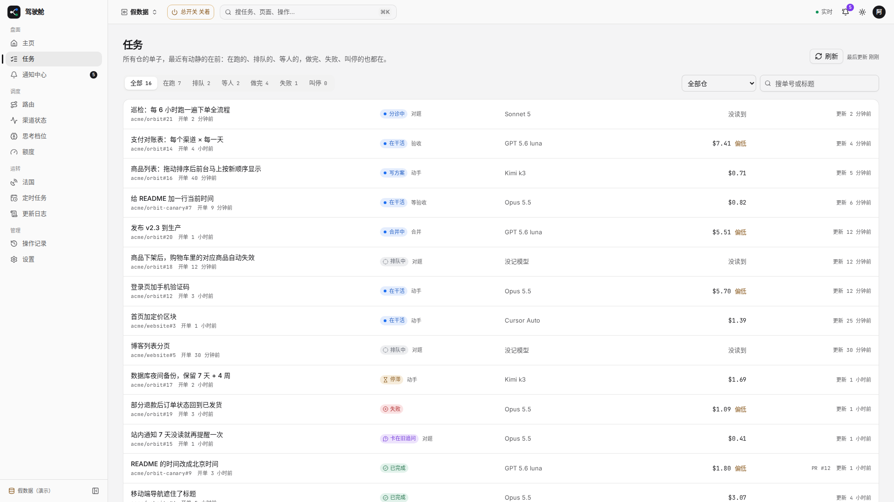
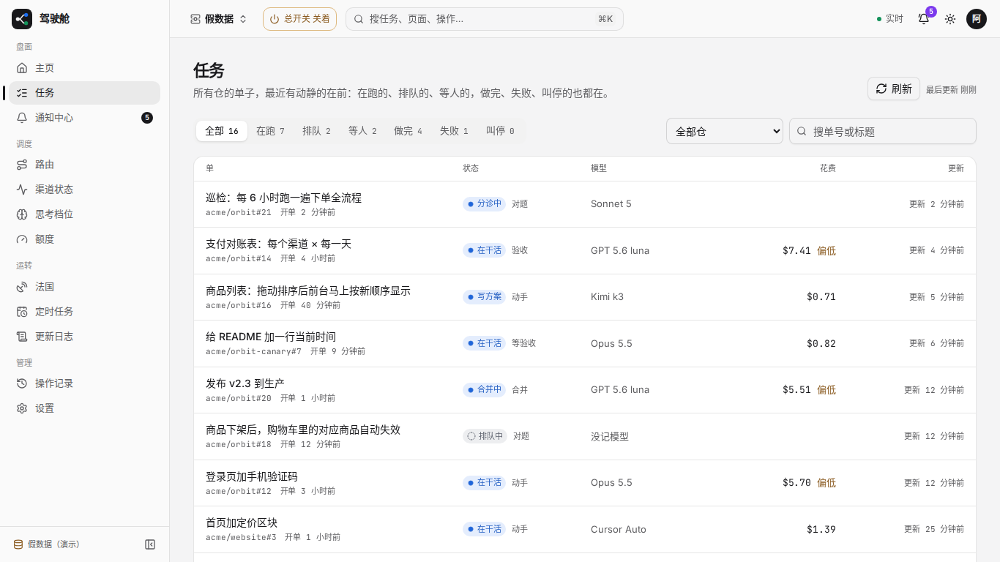
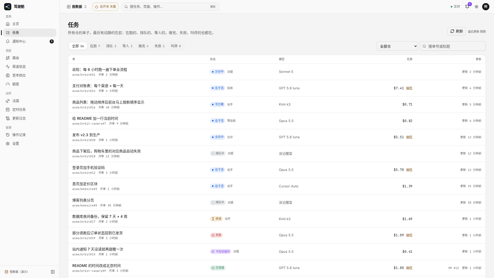
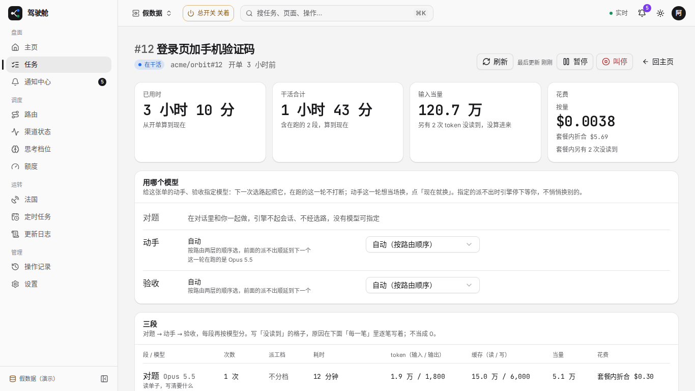
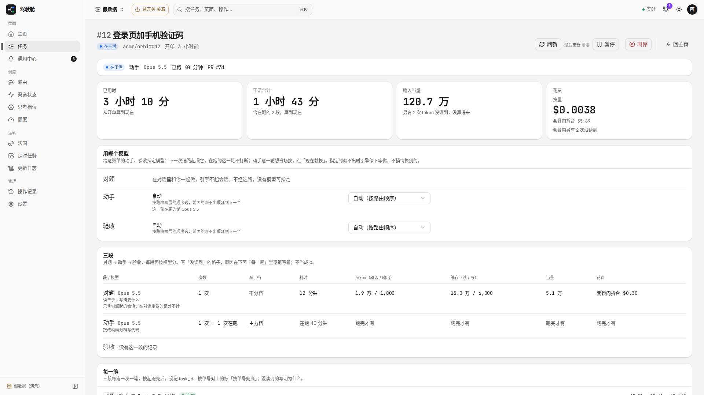

# #1751 任务列表与详情改前改后（1366 / 1920）

假数据 `/tasks`、`/tasks/t-12`：列表加表头、空花费留空；详情首屏先放当前状态；叫停与旁侧按钮加分隔。

## 列表改前 1366

## 列表改前 1920

## 列表改后 1366

## 列表改后 1920

## 详情改前 1366

## 详情改前 1920

## 详情改后 1366

## 详情改后 1920

## 可贴进 PR 正文

