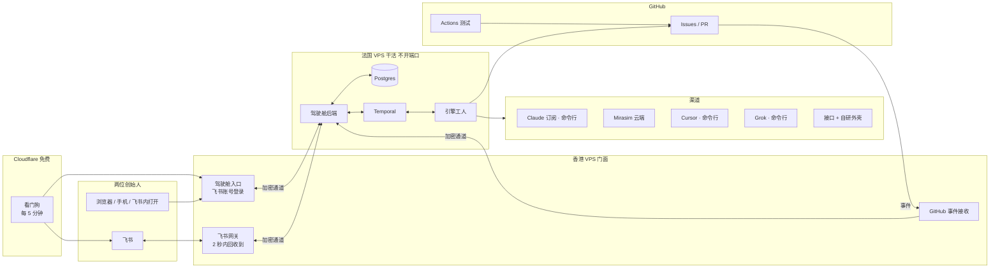
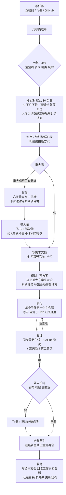

# fleet-dao 设计文档（讨论稿）

> 状态：**讨论已收尾（2026-09-25），进入实施分析**。已拍板的写在「三、已定」；剩下的小细节在实施计划里定。
> 起草：2026-09-25。参与：两位创始人 + Claude（Opus 5.5）。

## 一、一句话

创业团队的 AI 全流程：你们写任务，AI 从拆解、写码、测试、审查到合并全包；手上的多家 AI 订阅自由组合、互不闲置；驾驶舱里看得见、管得住。

## 二、为什么从零写

前身是 windsurf-dao（派工与规矩）和 ai-gateway-stack（渠道接线）两个仓。2026-09-24 的盘点结论：

| 现象 | 根因 |
|---|---|
| 没人盯就停 | 新任务要人亲手贴标签才开工；卡住的任务进收件箱，没有自动处理 |
| 订阅额度用不掉 | 派工从不走 Claude 订阅那条线；排序只会「用完就停」，没有「快清零的先用」 |
| 总断链 | 30 本账，一个月断 10 次：闸挂在没人跑的地方、写方漏分支而读方当没事、拿假样本验收 |
| 会话开太多 | 一单拆 4 个角色，审查不过就整轮重来，审查意见互相打转（windsurf-dao#1289、windsurf-dao#1338） |
| 并行撞车、落后主线 | 任务切得太碎、各开各的分支，做到最后才发现主线早就变了 |
| issue、PR 没人读 | 模板为流程和检查而写，又长又全，人不读，AI 也用不着那些套话；没有需求文档，历史无处可查 |
| 看不见进度 | 有的命令行会列任务清单，有的不会；做到哪一步只能猜 |
| 越修越重 | 代码 11.4 万行、测试 11.5 万行、99 项检查；近 30 天关掉的单约 90% 在修机制自己，开放单一半是机器给自己派的「这里该加检查」 |

所以不修补，从零写一个小而硬的核心。旧仓只当参考：好的做法搬过来，踩过的坑写成测试带过来。

## 三、已定（共识）

| # | 事项 | 结论 |
|---|---|---|
| 1 | 仓 | fleet-dao，公开；GitHub「互动限制」只限协作者。合并三样：windsurf-dao 的派工思路 + ai-gateway-stack 的渠道接线 + 驾驶舱。两个旧仓转只读存档，引用旧单写全称，如 `windsurf-dao#123` |
| 2 | 结构 | 一个仓两块：引擎 + 驾驶舱，共用一个数据库 |
| 3 | 任务 | 以 GitHub issue 为准；驾驶舱是它的驾驶舱 |
| 4 | 放行 | AI 直接开工；看不懂就在任务里追问；人随时叫停；只有对外发布、花钱、删数据停下等人。只认白名单作者（两位创始人、协作者、自家机器人） |
| 5 | 人 | 两位创始人一起用；用飞书账号登录驾驶舱，不需要 GitHub 账号；写 GitHub 的动作由机器人代发并记下提出人；每个操作留记录 |
| 6 | 访问 | 香港 VPS 当门面：驾驶舱入口 + 飞书网关都在香港；域名用 DigitalPlat 的免费域名（DNS 也用 DigitalPlat 的，国内外解析均已验证）；它一个账号只给一个域名（数量以[官方 FAQ](https://github.com/DigitalPlatDev/FreeDomain/blob/main/documents/domains/faq.md)为准），以后的项目都挂在它下面的子域名上；公开仓里写 `<驾驶舱域名>`，真值只在机器配置里（第十四节「演示版」）；法国 VPS 不对外开端口，只和香港之间走加密通道。（原定的 workers.dev 在国内被 DNS 污染，作废） |
| 7 | 通知 | 飞书机器人 + 驾驶舱提醒中心 |
| 8 | 模型 | 构建期全程 Opus 5.5（先用 Claude 订阅的额度）；判断阶段例外：Claude 判断后端接上之前先用 TypeSafe 的 Jev（第十一节）；第二意见例外：换厂商（第五节）；不用 Fable；流程写完后默认值换成按数据分工，创始人再调；验收时 Kimi 和 Cursor 各跑一条小任务测插头 |
| 9 | 派工模型 | 渠道 / 族 / 模型 / 执行方式 / 阶段类型 **自由组合**；全局禁令只有两条：GPT 不碰 UI，不用 Fable |
| 10 | 推荐 | 人排先后 + 额度和战绩自动微调 + 约 10% 试探；每次派工写一句原因 |
| 11 | 闲置 | 渠道空了按序找活：积压任务里它能干的 → 重要任务加一份并行尝试 → 给别的 PR 当第二意见 → 考新模型。**不许 AI 自己编活** |
| 12 | 接法 | 优先官方命令行（能改文件、跑测试的完整写码助手）；命令行够不到的模型，再接成接口，套上我们自己的写码外壳 |
| 13 | 底座 | Temporal（工作流、定时、信号、每一步耗时）+ Postgres（配置、用量、战绩、镜像、通知、操作记录）+ Jev（判断题服务） |
| 14 | 高可用 | 法国干活、香港门面，各自一条命令重建；外部看门狗（Cloudflare 定时 Worker）+ 每晚备份（去向见 plan.md 第二节「备份」） |
| 15 | 测试 | 正式测试跑在 GitHub 的机器上（公开仓免费不限时）；AI 自己跑的测试受资源上限约束；每 6 小时一条巡检任务 |
| 16 | 规则 | 一页原则（偏好 + 人闸 + 底线），其余写成代码和测试；创始人的全局规则与钩子同步精简。2026-09-25 创始人过目定稿：`AGENTS.md` 上半段是所有仓通用的一段，由同步脚本写进每台机器上各家 AI 的全局说明（只改受管的那一块），下半段只管本仓；别的仓的 `AGENTS.md` 由建仓或第一次进仓的 AI 起草，只写那个仓特有的；各仓都用得上的规矩提回这里改通用段，不横着抄。人闸就是第 4 条那三类，改通用段走 PR 审查，日报列出改了哪几行。skill 走同一个同步脚本分发：方法类（grill-me、grill-ai、chain-first、best-practice-first、judge-or-code、discuss、docs-lookup）改成通用版放本仓；旧仓的派工 skill、钩子、开会话自愈全部退役；GitHub 一律走 `gh`（创始人同日过目工具箱去留） |
| 17 | 机器 | 现在这台法国 VPS（6 核 12G，打算续费） |
| 18 | 颗粒度与合并 | 按第六节：需求开 issue，子任务在引擎和驾驶舱里；会改同一块的不同时跑；交审前同步主线；引擎自己排合并队列 |
| 19 | 看板首屏 | 按仓切换，每个仓的全局任务树是首屏 |
| 20 | AI 帅位权限 | 能自己改调度台（调路由先后、下架出问题的渠道），改完推通知、驾驶舱一键撤回；创始人手动钉住的顺序它不动 |
| 21 | 花钱的定义 | 已订阅套餐额度以内的使用都不算花钱（含 Jev、定时起的 AI 会话、并行加做的尝试）；会让账单多出一笔的才算——新订阅或升级、按量计费的接口、超出套餐的额外用量、买域名或机器。每条路由标「套餐内 / 按量」，按量的先由创始人定月度上限，上限内不再问 |
| 22 | 旧规则 | 旧仓的规则对 fleet-dao 不再算数，规则随项目一起从零重写（见第 16 条） |
| 23 | 需求文档 | 按第七节：issue 是入口与进度；仓内 `specs/` 每个需求一个文件夹（需求、方案、结果）；子任务各一个 PR；AI 开新需求先翻相关历史 |
| 24 | 进度 | 按第八节：统一的「汇报进度」工具（照 Codex 的步骤清单）；两级进度；沉默就催；驾驶舱实时、issue 原地更新 |
| 25 | 飞书 | 按 15.4：记任务、只推三类消息与关注、随时看盘面（置顶盘面卡 + 机器人菜单）、回复即追问；端到端自测 |
| 26 | AI 与流程的接口 | 按第八节：进度先被动读各家命令行的过程记录；AI 主动的部分做成 `fleet` 命令（不是 MCP），会话带只对本任务有效的通行证；MCP 等数据说明需要时再从同一份命令定义生成 |
| 27 | 仓库结构 | 全部放在 fleet-dao 一个仓，目录见第四节「仓库结构」 |
| 28 | 执行模式与容量 | 无头；每个子任务一个命令行写码助手进程；Temporal 指挥、AI 干活；起步 6 个并发会话，实测后往 8–10 调；见第四节「执行模式与容量」 |
| 29 | 两台机器分工 | 法国（6 核 12G）：引擎、AI 会话、Postgres、Temporal；香港（2 核 2G）：飞书网关、驾驶舱入口。实测调飞书接口香港 0.17 秒、法国 1.1 秒；Anthropic 对香港封区，AI 活只能在法国 |
| 30 | 额度必须全读 | 每个渠道、每个账号池的剩余额度都要读到，驾驶舱才能管、调度才能规划；读法按第十节的顺序选，估算的要标明 |
| 31 | 补充需求 | 旧单审计找出的 10 条，见第十七节 |
| 32 | Jev 接入 | 能接的地方按场景和性价比接（第十一节 9 个接入点）；每道题先只记不拦、攒够样本准了才拦；能拦不能放 |
| 33 | 密钥副本 | （2026-09-25）密钥与本机配置的加密副本放私有配套仓 `thoerwink8/fleet-dao-vault`：age 加密，一个文件一个 `.age`，仓里只有密文和公钥。解密钥匙在创始人电脑的 `~/.fleet-dao/vault-key.txt`，要抄一份进创始人的密码管理器（plan.md 第五节），只有拿着它的人解得开。在创始人电脑上跑那个仓里的 `bash refresh.sh` 刷新。数据库备份不在这里，见 plan.md 第二节「备份」 |
| 34 | GitHub 上的标签与里程碑 | （2026-09-25）标签七个，分类别、特性、要人看三组；里程碑 P0–P6，对应 plan.md 的七个阶段；issue 当天起照第七节建（起初只建标签和里程碑，同日改）。方案与理由见第七节 |
| 35 | 欠账不漏 | （2026-09-25，#67；2026-09-26 起只报告不挡 PR）「以后要做」的事必须是一张带「怎么算做完」和里程碑的 issue，否则不算计划：可以只做一部分，剩下的由系统记着，不靠人记得。怎么查见第七节「欠账不漏」 |

## 四、架构



- **引擎工人（法国）**：执行 Temporal 派下来的每一步：起会话、跑测试、开 PR、合并、记账。不存状态，以后加机器就是加工人。
- **Temporal（法国）**：每个任务一条工作流。记下每一步的开始、排队、耗时、重试；接收驾驶舱的信号（暂停、叫停、换模型、批准）；替代旧系统约 30 个 systemd 定时器（额度探测、模型扫描、巡检、备份、续期互动限制）。
- **Postgres（法国）**：驾驶舱要的一切都在这：路由配置（带版本）、用量与额度、战绩、进度、GitHub 镜像、通知、操作记录。有变化实时推到驾驶舱。
- **驾驶舱后端（法国）**：驾驶舱的所有读写都经过它——查数据、改调度台、叫停任务（给 Temporal 发信号）、开任务（经机器人写 GitHub）、实时推送、权限与操作记录。读数据只从 Postgres 读，不直接查 GitHub——快，也不撞 GitHub 的调用限额。
- **香港门面**：只当门卫和信使，不放业务逻辑——驾驶舱页面与飞书登录、飞书网关（收消息先回「收到」、卡片原地刷新、机器人菜单，盘面快照缓存在本地以便秒回）、收 GitHub 事件。和法国之间走加密通道。
- **为什么分两台**：实测调飞书接口香港 0.17 秒、法国 1.1 秒；Anthropic 对香港封区，Claude 等 AI 活只能在法国跑；`workers.dev` 在国内被 DNS 污染，不能当入口。
- **Cloudflare**：只剩外部看门狗（定时 Worker，两台机器都挂了也能报警）。备份去向见 plan.md 第二节「备份」。

### 仓库结构

```
fleet-dao/
  packages/engine     引擎：Temporal 工作流与每一步的实现
  packages/adapters   渠道插头：Claude Code、codex、cursor-agent、Grok 命令行、接口外壳
  packages/cli        fleet 命令（给 AI 会话用，人和测试也能用）
  packages/api        驾驶舱后端
  packages/web        驾驶舱前端：看板 + 后台管理
  packages/feishu     飞书机器人
  edge/               Cloudflare：驾驶舱入口、GitHub 事件接收、看门狗
  deploy/             一条命令装好整台机器
  specs/              需求文档（每个需求一个文件夹，见第七节）
  docs/               设计与决定
```

### 执行模式与容量

- **无头**：每个子任务在后台起一个命令行写码助手进程（Claude Code、codex、cursor-agent、Grok 命令行或自研外壳），不开窗口、没有界面会话；Mirasim 中转的路由也走它的程序接口。驾驶舱提供「直播」：实时滚动显示助手每一步在干什么。
- **Temporal 指挥，AI 干活**：派活、等待、重试都是确定性的工作流；AI 只在分诊、写方案、写码、审查和定时的 AI 帅位出场。每个助手在自己的工作副本里干活，需要时在会话内部再起子代理。
- **插手**：「换模型」「暂停」让当前进程停在干净的点（做完的已提交），再按新设置接着干；临时追加的要求排进下一轮——支持续会话的命令行按会话编号续上，不支持的带进度摘要开新会话。
- **会话断了接着干，不重来**：会话被额度、限流、进程被杀、引擎重启打断时，同一个账号池就按会话编号续上原会话，上下文都在；额度用满就挂起，到清零时间续同一个会话，不开新的。非换池不可时，引擎从库里拼一份接力任务书开新会话：原任务、步骤清单做到哪、最近的进度、工作副本里已提交的改动、还没处理的审查意见；已提交的不重做。法国只有一个会话用户，平时挂拼车组织；拼车用满时整个用户切到独享组织，手上的会话逐个 fork 续上（见第九节）：同一台设备上切号，会让上面所有在跑的会话一起断（2026-09-25 构建期实咬：本机一次切号，总指挥和十几个子代理全断；把记录接回新会话后，各自从断点接着干完）。
- **容量（6 核 12G）**：

| | 旧系统（实测） | 新系统（起步值，实测后调） |
|---|---|---|
| 同时在写码、验证 | 3 个任务（2026-09-22 负载 15 后封顶，windsurf-dao#1748） | 6 个会话（约 5 个子任务 + 1 个审查），压力低往 8–10 加 |
| 同时跑测试 | 全机 2 份 | 2–3 份（新测试秒级） |
| 一个任务占几个会话 | 2–4 个 × 返工轮 | 1 个主会话 + 需要时 1 个审查 |

- 旧系统那次负载 15，主要是机器在忙自己：5 个任务同时执行、一个工作副本里 13 个测试进程、一份 109 秒的全量检查、Mirasim 轮询 30 个工作副本、用量采集器每轮扫 1526 个文件。新系统这些都没有。
- **放行看三样**：内存与机器压力（不看整机 CPU 百分比）、账号池并发空位、额度够不够。真正的上限多半在订阅，不在机器。排队的任务在驾驶舱写明在等什么：等空位、等额度、等前一个子任务。
- 每个会话连同它跑的测试，内存先按 1.2–1.6G 估（windsurf-dao 2026-09-24 隔离决定的区间），实测后调。以后加机器就是加工人。

### 为什么用 Postgres

| | SQLite | MySQL | Postgres |
|---|---|---|---|
| 是什么 | 一个文件，嵌在程序里 | 数据库服务 | 数据库服务 |
| 多个程序同时写 | 容易「库被锁」（旧系统专门写了重试代码，windsurf-dao#1814） | 可以 | 可以 |
| 跨机器用 | 不行 | 可以 | 可以 |
| 数据一变就通知 | 没有 | 没有，要另加中间件 | 自带，驾驶舱实时刷新就靠它 |
| 存结构不固定的数据 | 弱 | 有 JSON 类型 | JSONB，能建索引，查得快 |
| Temporal 同库 | 只能单机开发模式 | 支持 | 官方支持 |
| 扩展 | 少 | 少 | 多：库内定时、向量搜索（以后按意思搜历史任务）等 |

引擎工人、驾驶舱后端、定时任务会同时写库，以后还要跨机器，所以 SQLite 不合适；MySQL 和 Postgres 都成熟免费，Postgres 多了实时通知、JSONB 和扩展这几样我们正好要用的。

## 五、一个任务怎么走完全程



- **需求拍板期**（创始人 2026-09-25 拍）：每张需求分诊后先进拍板期，默认 30 分钟（每个仓可调），这段时间 AI 不往下推。拍板期能在驾驶舱或飞书卡片上延长、暂停、跳过。有人在讨论（飞书讨论群里有新消息，或驾驶舱里有追问）就等讨论完；没人讨论，到点 AI 自己定方向往下做。到点时 AI 先找这张需求的飞书讨论群，有就把记录读一遍，和需求原话一起归纳成拍板方案（结论、还没定的问题、每条出自谁的原话），写进需求文档。归纳前先判「信息够不够下结论」（Jev 判断题：够不够、缺哪几条）：不够就在群里列出缺的问题，拍板期自动顺延；够了再分重大、小方案。判为重大，或群里的人意见有分歧，自动接进讨论环节（下面「讨论」，创始人 2026-09-26 拍）。
- **重大方案人拍，小方案 AI 拍**：重大 = 碰三条人闸（对外发布、花钱、删数据），或和本文档已拍的规则冲突，或要新加外部服务、改架构、改阶段划分；其余都算小方案，AI 拍了直接往下做，理由写进需求文档，日报里列出。重大不重大由分诊判，判不准的按重大算；VPS 上的引擎和本机总指挥用这同一条判据（创始人 2026-09-26 拍）。聊天记录本身不算拍板，引擎只认需求文档。
- **流程只为快，不当绊脚石**（创始人 2026-09-26 拍，照数据：机制少的头 8 小时合了 17 个真功能 PR；第二天加满关卡的 5 小时，30 个 PR 里 22 个在改流程本身，产品只有约 1700 行）。先上线，出了问题再改。量两个数看流程有没有变好：每天合进去的产品 PR 数、从开到合的中位时长。
  - **合并前只拦两样**：CI 绿（测试、类型、格式）；卫生检查（密钥、敏感值）。检查一律取主线上那份代码来跑，PR 改不了自己的检查（#74 合并闸）。
  - **CI 按改动跑**（`.github/workflows/ci.yml`，判法在 `packages/conventions/src/ci-plan.ts`）：`changes` 按 `git diff origin/main...HEAD` 算这次改了什么，只跑受影响的——格式和类型、被改的包加所有依赖它的包的测试（engine、db 各占一台，并行）、web 或它上游变了才打包演示版、装机相关变了才跑 `deploy/test/run.sh`；卫生检查和文档指针每个 PR 都跑，不裁剪；卫生检查是唯一拿到真的已知敏感值名单的 job，执行的是目标分支上那份卫生检查代码、PR 的代码只当数据扫（PR 改规则、白名单要合进去才用上）。根配置、锁文件、CI 工作流、shared、测试夹具、`deploy/`、认不出的路径一律全跑，main 推送全跑兜底。必过检查 `check` 是汇总 job：该跑的必须绿、不该跑的必须确实跳过，base 拿不到判红。测试读包外文件（`docs/ops.md`、`AGENTS.md`、别的包的源码）的清单也在 ci-plan.ts，`ci-plan.test.ts` 扫测试源码核对，漏记一条就红。
  - **先审后合只剩三种**：迁移里有删改语句（DROP、DELETE、UPDATE、ALTER COLUMN、RENAME 这类；只建表、加列不算）、部署和生产脚本、密钥与登录鉴权（含卫生检查和 CI 工作流本身）。第二意见一轮、和测试同时跑、只看改动，最多 2 轮；第 2 轮后剩下的不属于这三种的意见转合并后。按改动路径判档位，不靠 PR 自己报。
  - **其余都 CI 绿就合，第二意见挪到合并后**：不挡合并，审出问题当场开修复 PR（不开单排期）。
  - 主审连不上自动换下一家（gpt-6-luna → DeepSeek → 全新的 Claude 会话），换了人写进结论；全连不上时先审后合的那三种挡着并通知创始人，不自动放行。
- **第二意见换厂商**（同日拍）：同一家的模型审自家写的，会偏向自己（[Panickssery 等，NeurIPS 2024](https://arxiv.org/abs/2404.13076)）。写码是 Claude 时，第二意见默认用 Mirasim 云端额度的 gpt-6-luna；界面类用 Gemini（GPT 不碰界面）。这是调度台里第二意见阶段的默认顺序，不是硬闸。
- **讨论**（创始人 2026-09-25 定，2026-09-26 收窄，同日拍成需求工作流里的一个环节；和审查是两回事：审查看代码，讨论定方案。原来的盲设计题就是讨论的第 0 轮，是同一种东西，不另算一样。做成什么样见 #69）：
  - **什么时候讨论**（创始人 2026-09-26 拍）：只在重大方案时触发，判据就是上面「重大方案人拍」那一条（碰人闸、和已拍规则冲突、新加外部服务、改架构或改阶段划分），VPS 引擎和本机总指挥用同一条；小方案 AI 直接定，不讨论。触发点有两处：拍板期到点归纳时判为重大或群里有分歧；规划阶段写方案时碰上重大方案。人随时可以主动叫一次：飞书群里 @机器人「讨论一下」，或驾驶舱需求卡上的「发起讨论」按钮；总指挥会话用 `fleet discuss` 发起（第八节）。
  - **讨论是一条记录**：库里一张表；驾驶舱的「讨论」页（15.5）只是这个环节的视图。一条讨论记下：题面；第 0 轮各家独立答；之后每一轮挑错；每家的答案和耗时；谁没答上、为什么（超时、起不来、没输出）；各家一致的、还剩的分歧、总指挥推荐哪个，对方每条意见收没收、为什么；拍板结论和当时方案的版本。每条讨论挂在一张需求上，或一个 PR 上，或「规矩」这类没有需求的决定上（改 AGENTS.md、design 的）。
  - **状态**：讨论中 → 等你拍（重大的）→ 已拍板；人主动叫的小方案到拍板期按推荐做，走 讨论中 → 已定，理由写进需求文档、日报里列出。一家都没答上算「没讨论成」：停在讨论中、提醒总指挥，不拿总指挥自己的方案冒充讨论结论；有几家没答上照样往下走，结论里写明哪几家没答上，不当成「同意」。
  - **怎么问**：先把问题本身（不带自己的方案）并行发几家各自独立答，再把自己的方案连同它们的答案发一家挑错；每轮一问一答、不读仓、限 400 字，每家硬超时 30 秒。AI 自动挑错最多 2 轮；人回复或点按钮后再跑的最多 3 轮；到数就停下等人。材料里附上相关规则原文和证据（对方看不到仓）。交给人拍的只写三样：各家一致的、还剩的分歧、推荐哪个。
  - **和飞书群怎么接**（创始人 2026-09-26 拍）：结果做成一张卡片（一致的、分歧、推荐、每个选项一个按钮，推荐的放第一个），发进这张需求的讨论群；没有讨论群就发它所在仓的项目群，不为每张需求自动开群。同一条讨论只有一张卡，状态变了原地更新（15.4）。人可以点按钮拍板，也可以回复（群里回复要 @ 机器人，15.4）；只有带了新材料的回复才再跑一轮挑错（Jev 判断题判「是不是新材料」），不是新材料的回复只记下、不重跑。
  - **拍板怎么走**：创始人在飞书卡片或驾驶舱里点了哪个，引擎把结论写进这张需求的需求或方案文档，并写明拍的是方案的哪一版（方案文档当时的提交号：方案后来又改了，结论不自动算到新版上）；挂「规矩」的写进 AGENTS.md 或 design，由引擎开 PR。讨论变「已拍板」，需求卡上显示结论链接。聊天记录不算拍板，引擎只认仓里的文档。
  - **没人拍板**（创始人 2026-09-26 拍）：重大方案到拍板期还没人点，就停在「等你拍」，不自动执行；引擎照常做别的需求，不卡整条流程。小方案到点按推荐做。
  - **飞书不可用时**：卡片发不出去（飞书接口报错、超时、额度用完），这条讨论照样进驾驶舱提醒中心的「要人拍」（15.3）等人，驾驶舱上写明「飞书没发出去」和原因；飞书恢复后补发那一张卡。平时等你拍的讨论也同时在「要人拍」里，两边点哪边都算。
  - **渠道**（创始人 2026-09-26）：讨论提速暂时搁置，现在以 Cursor（cursor-agent 无头、只读）和 Mirasim 云端为主；OpenRouter 这类直连接口排在 P3，做成什么样算完见 #118。参与哪几家、每家走哪条渠道、超时和并发都是调度台「讨论」阶段的配置（第九节）。引擎接活之前，本机的实现是 `~/.local/share/second-opinion/ask.mjs`：四家经 cursor-agent 并行、30 秒上限，2026-09-26 实测 GLM 21 秒、Kimi 25 秒、GPT 27 秒，Grok 常超时。
  - **依据**：2026-08-14 第一次三臂盲设计，两个守住盲的臂独立得出同一个答案，证明「各自独立答」能给出收敛信号，但每臂起完整会话、读仓外中性目录，一轮要几十分钟；2026-09-25 创始人把总指挥的分析手贴给网页 GPT，20 秒拿回把框架推进一步的反驳，于是改成一问一答（同日实测 medium、限 400 字 12–20 秒一轮，#69 的讨论稿就这样出的）；2026-09-26 本机五家齐跑、工人又把进程数顶满，宿主崩过，所以同时最多几家要限（起步 3，第九节）。
- **发现问题当场修**（创始人 2026-09-26 拍，替掉 #87 的「合并后的问题开单攒着」）：
  1. 谁发现谁在同一轮里修：改、推 PR、挂自动合并，不开单、不派工人、不先请示。PR 本身就是记录，修不完的也先开 PR 挂上，不另开单等人做（开单等做就成了鸡生蛋）。只有人闸三类（对外发布、花钱、删数据）先问。
  2. 流程、规矩上的漏洞（该拦的没拦住、该有的没做到）同样当场修：修在动作必经的那一步（脚本、检查、钩子），配一条故意造出失败的测试证明堵上了；只在文档里加一句不算修。本机的脚本、钩子改完当场验证。
  3. 已上线的真问题先回退再修；主线坏了（必过检查红）立刻修，修不简单先回退，修复 PR 写清是哪次合并弄坏的。
  4. 修复正好在某个开着的 PR 的范围里才修进那个 PR，不相干的另开。
  5. 必过检查必须确定：同一份代码什么时候跑结果都一样。依赖外部状态（单子开没开、时间、别的仓）的检查放进定时任务，只留言，不挡 PR。反例：#83 把「推后的话挂的单号要开着」接进了 `pnpm check`，#67 一关，所有 PR 跟着红。
- **流程冻结**（同日拍）：不再为「可能出事」加关卡。只有真出了事（主线坏、数据、泄露、安全，或同一个坑踩第二次）才改流程；改的时候当场做、一个小 PR，PR 正文写明是哪次出的事。规矩只写在 AGENTS.md 和这一节，别处只放指针。
- **关卡的时间预算**（创始人 2026-09-25 定）：该砍的是人工串行，不是质量——检查尽量并行、自动、只管自己那一块。派活 1 分钟内，会话 2 分钟内起来，测试并行跑，普通改动的第二意见不挡合并，先审后合的三种审一次，合并和 issue 状态自动更新。要加关卡先答三问：挡什么风险、多出多少延迟、能不能自动化；答不上来就不加。
- **引擎接活之前，本机照这一节走**：开单、需求文档、方案、PR、验证、合并，步骤和叫法都一样，只是由本机会话来推；第二意见由本机垫片经 Mirasim 起会话，引擎的第二意见接上 Mirasim 就退役（#64）。切换点（创始人 2026-09-25 拍）：#53、#56、#58 三个旧 PR 清完、#74 的合并闸上线之后的下一个 PR 起，一律按新流程，不再有「这个 PR 按旧办法」的例外。
- **合并闸**（#74）：「能不能合」只看 PR 当前头上的提交状态 `merge-gate`，全绿就由 GitHub 自动合并，AI 不轮询、不手动合。判红只有：草稿、和主线冲突（这两样 GitHub 本来就合不了）、改到先审后合的三种路径而当前头上没有通过的 `second-opinion`（推了新提交，旧头上的不算）；按路径判，不看 PR 自己写的档位，路径清单在 `packages/conventions/high-risk-paths.json`（每条写了为什么）。读不到、认不出判不通过（写明「没查成」），GitHub 还没算完冲突判等待。PR 必填栏（类别标签、里程碑、对应计划、specs、档位）只在检查页上提醒，不挡合并。PR 事件、主线推送（逐个重算所有开着的 PR：冲突是主线一变才出现的）、第二意见状态写上来时各算一次；判法和清单都用主线上的那份（`packages/conventions/src/merge-gate.ts`、`.github/workflows/merge-gate.yml`）。有冲突的 PR 自动贴「有冲突」（只是显示）。
- 每一步都能在驾驶舱看到用的哪条路由、花了多少、耗时多久。
- 「我理解为」卡片不挡路：活照常开工，看到理解错了点「改一下」，任务停下重新规划。
- 卡住了按「下一步该干什么」处理（第十二节），不再默认停下等人。

## 六、任务颗粒度与合并（已定）

旧系统的毛病：一张 issue 一个工人、各开各的分支；颗粒太碎就并行撞车，分支活得久，做完才发现主线早变了。

做法：

1. **两级任务**：GitHub issue 只写「需求」这一级（创始人写的话）。拆出来的子任务不再各开一张 issue，只存在引擎里，驾驶舱的思维导图里看得到；issue 里自动维护一份子任务清单和 PR 链接，GitHub 上也看得出脉络。
2. **拆的时候就标出会动哪些地方**：规划时每个子任务写明要改的文件或模块，以及依赖哪个子任务先做完（写在方案里，见第七节）。
3. **不撞车的调度**：会动同一块地方的子任务不同时跑——排队，或交给同一个会话连着做；互不相干的才并行。
4. **永远从最新主线起步**：开工时从最新主线建工作树；交审前先同步最新主线，有冲突当场解决；主线一变，在途分支自动同步。分支活不过一天。
5. **自己的合并队列**：同一个仓一次只合一个；合之前在最新主线上再跑一遍测试，红了退回原会话修。（GitHub 自带的合并队列要组织账号才能用，所以引擎自己排。）
6. **颗粒度有目标**：一个 PR 是一个能单独验证、单独回滚的变化——够小，很快验得完；够完整，能单独合进去（创始人 2026-09-25）。大约一个会话一小时内做完；同一块地方的零碎小单合并成一个子任务一起做；不为了小把一件事拆成一串没法单独验证的碎 PR；太大的继续拆。

### 断链怎么被发现

旧系统断了没人知道，是因为没有东西盯着整条链。五层兜底：

1. **能断的地方少**：一件事只存一处，只认 GitHub、Postgres、Temporal 三处（外加仓里的需求文档）。
2. **按进展判死活**：每个任务都是一条工作流，一段时间没往前走就报「停滞」，不靠认错误长什么样（进度见第八节）。
3. **巡检任务**：每 6 小时真跑一条从开单到合并、关单、记账、驾驶舱显示的完整任务，任何一环断了它就完不成，立刻报警。
4. **每小时对账**：三处互相核对，例如每个白名单开的开放 issue 都有工作流、每个合并的 PR 都记了账、每个账号池的额度读数不超过 30 分钟。对不上就报警，能安全自动修的自动修。
5. **没跑成 ≠ 没问题**：每个定时任务记下上次成功的时间，看门狗检查它们是否新鲜；「查了 0 个问题」和「这次没查」分开显示。

## 七、需求文档与 issue、PR 的组织（已定）

旧模板是为流程和检查写的：人不读，AI 也用不着那些套话。业界现在的做法（GitHub Spec Kit、AWS Kiro）是每个需求在仓里建一个文件夹，放需求、方案、任务几份短文档，AI 每次干活都读进去。

```
需求（一张 issue：原话 + 一段 AI 理解 + 自动进度 + 链接）
 ├─ specs/12-登录验证码/需求.md   要什么、怎么算做完（一页以内）
 ├─ specs/12-登录验证码/方案.md   怎么做、拆成哪几块、各改哪里、先后依赖
 ├─ 子任务 A ── PR #31
 ├─ 子任务 B ── PR #32
 └─ specs/12-登录验证码/结果.md   做了什么、怎么验证的、留下什么后续
```

- **分工**：issue 管「在做什么、做到哪了、谁说了什么」；仓里的文档管「要什么、怎么做、做成了什么样」。issue 不抄文档内容，只放链接。
- **创始人只说一句话**：需求文档由 AI 按原话写，同时推一张「我理解为……」卡片。
- **长度上限**：需求文档一页以内；PR 正文 15 行以内；issue 顶部 5 行是给人看的摘要。
- **方案里写明会改哪些地方**：这正是第六节「不撞车的调度」要用的输入。
- **查历史**：开新需求前，AI 先翻以前改过同一块地方的需求与结果（先按改动位置和关键词找，以后加按意思搜），再动手。
- **构建期也照这套走**（创始人 2026-09-25 拍；此前构建期的活是用对话里的任务书直接派的，仓里没留需求文档）：创始人提的需求和「以后再做」先开 issue、写 `需求.md` 进仓，任务书只给路径；AI 自己发现自己修的不开单，直接开 PR（第五节「发现问题当场修」）。方案、结果由干活的写进同一个目录，跟 PR 一起合。审查返工这类不另开。PR 正文写明对应 plan 哪一条、specs 在哪（杂活写「不适用」），缺了只提醒、不判红（创始人 2026-09-26）；CI 仍查 design、plan、ops、README、specs 里的文件和章节指针都指得到（章节后面引的话照抄原文，写大意的查不出真断）。
- **欠账不漏**（创始人 2026-09-25，#67；第三节第 35 条；2026-09-26 起只报告、不挡任何 PR）：可以只做一部分，剩下的必须是一张开着的 issue。都在 `packages/conventions`：
  - 欠账检查查两样，都只看文件（从 `pnpm check` 挪进 `.github/workflows/debt.yml` 的报告，随 #74 的合并闸一起落地）：AGENTS.md、README、docs（旧系统审计的 `docs/reference/` 除外）和 specs 里写推后的话（「以后再做」「先不建」「再定」「留到下一轮」这类，词表在 `packages/conventions/src/debt.ts`，宁漏不误），同一句里要带单号，specs 目录下的文档本单号也算；`specs/*/需求.md` 的「怎么算做完」不许空。只看文件、不读 GitHub（第五节「发现问题当场修」第 5 条）。
  - 看 GitHub 现状的两样由 `.github/workflows/debt.yml` 在主线上每天查、每次合并后查，查出来留言到对应的单上，不挡任何 PR：推后的话挂的单号是不是开着的 issue（挂在关了的单上的，留言到那张单上）；开着的 issue 在主线上有没有 `specs/<号>-<短名>/需求.md`（开单一天内不算欠，欠的留言到那张单上）。GitHub 读不到判「没查成」，这个定时任务红。
  - `pnpm issue:new` 开单时，正文里没有写了字的「怎么算做完」就不开；带 `--specs` 时完整正文进需求.md，issue 上只留原话、AI 理解和需求文档的路径。

issue 正文的样子：

```
原话：给登录页加手机验证码（提出人：某某）
AI 理解：……（三行以内）
进度：■■■□□ 3/5 · 正在：写验证码过期的测试（自动更新）
子任务：A ✅ #31 · B 🔄 #32 · C ⏳
文档：需求 · 方案 · 结果
```

issue 模板只有一个「需求」（`.github/ISSUE_TEMPLATE/requirement.yml`），默认贴 `需求`；空白 issue 也能开。上面的 AI 理解、进度、子任务、文档链接由引擎写进正文，模板里不放。

PR 正文的栏目以 `.github/pull_request_template.md` 为准，15 行以内：人开的 PR 由 GitHub 套这份模板；引擎开的 PR 由 `packages/github` 的 `renderPrBody` 按同样的栏目生成，两边对不上测试会红。「文档」一栏写改了 README、design、ops、plan 的哪份，或「不适用」；哪份什么时候该改，见 README「文档各管什么」。「对应计划」写 plan.md 的阶段加那一条的原话开头（如 `P1「工作流」`，跨两条用顿号隔开），里程碑的阶段要在里面；「specs」写需求目录（`specs/<号>-<短名>/`）或「不适用」；「档位」写 design 第五节的两档之一加理由（如 `CI 绿就合——只改测试`），只作说明，合并闸按路径判。引擎开的 PR：「档位」按方案里标的风险写（高风险写先审后合，其余写 CI 绿就合），「specs」是这条需求的需求目录，「对应计划」照需求文档里「对应计划：」那一行抄——写需求文档的会话交回来时就按 pr-fields 同一套判法核它对得上 plan.md，对不上退回去改；开 PR 时从主线现读，读不到不开、挂起等人。

### 标签与里程碑（2026-09-25 定）

GitHub 上只用标签和里程碑两样容器。issue 照第七节建（创始人 2026-09-25 改：当初「先不建」是怕法国自动派活，现在由第九节的仓级开关和「在哪能做」管住）。每个标签的颜色和一句说明以 GitHub 上为准，这里只写有哪些、谁贴、为什么。

| 组 | 标签 | 意思 | 谁贴 |
|---|---|---|---|
| 类别 | `需求` `缺陷` `杂项` | 要新东西 / 现有的不对 / 文档、整理这类不改行为的 | AI 分诊时贴，人可以改；只是分类，不影响派工和合并 |
| 特性 | `界面` | 涉及界面，派工时 GPT 不接（第九节的禁令） | 引擎按分诊结果贴（第十一节），只是显示 |
| 特性 | `人闸` | 碰对外发布、花钱或删数据，合并前等创始人点头（第五节） | 同上 |
| 特性 | `本机` | 只能在本机做，VPS 上的路由接不了，等本机总指挥认领（第九节） | 同上 |
| 要人看 | `等你拍` `卡住了` | 有事等你们拍板 / 卡住了要人看 | 引擎自动贴、自动撕；只是显示，不是开工门槛 |
| 要人看 | `有冲突` | 和主线有冲突，合不进去，要同步主线解掉 | GitHub Action（`.github/workflows/conflicts.yml`）主线一变自动贴、解掉了自动撕；只是显示，能不能合看合并闸（第五节） |

`界面`、`人闸`、`本机`、`等你拍`、`卡住了` 都只显示引擎的判定：禁令和人闸都在引擎里（GPT 禁令写死在代码里，人闸记在工作流状态里），引擎不读 GitHub 上的标签。在 GitHub 上手贴、手撕不改变派工和合并，比如手贴 `人闸` 并不会让合并等人。要改判（这是不是界面活、要不要加人闸），去驾驶舱或飞书。标签当闸是旧系统的老坑：贴了以为生效，其实没人读。

不要的，参考 windsurf-dao（它有 81 个标签）：

- **进门标签**（`triage/accepted`、`已消歧` 这类只有人能贴的）：没人贴就停，正是第二节「没人盯就停」的根因；现在 AI 直接开工（第三节第 4 条）。
- **`model/`、`reviewer/`**：派给谁、谁来审在驾驶舱调度台定（第九节），再贴一份标签就成了两处各说各的。
- **`priority/`**：先后只存一处（第十七节第 4 条、15.6，创始人 2026-09-26）：驾驶舱上线前是 plan.md「现在的目标」一节，由总指挥手改；上线后以驾驶舱首页「走向」栏里的拖动为准，引擎在顺序变了时开 PR 把它同步回仓。再贴一份标签就成了两处各说各的。
- **`area/`**：会动哪块地方写在方案里，精确到文件和模块（第六节第 2 条），不再另贴一层粗的。
- **`kind/` 和意思相同的中文标签并存**（`kind/bug` 和 `缺陷`）：一件事两个名字，只留中文一套。
- **GitHub 自带的英文默认标签**（`bug`、`enhancement` 等）：和三个类别重复；核对过没有 issue 或 PR 在用，删了。

**标签和里程碑不靠人记得贴**（创始人 2026-09-25：新开的 PR 漏贴过）：引擎上线后，每张新 issue 由分诊（Jev）贴类别、判界面、人闸、本机，并挂里程碑；每小时对账把 GitHub 上别处开的、没贴的 issue 和 PR 捞出来补判；引擎开的 PR 照抄对应 issue 的标签和里程碑。引擎上线前，合并闸（第五节）查 PR 有没有一个类别标签、一个里程碑，正文写明对应 plan 哪一条和 specs 在哪，缺了只提醒、由 `.github/workflows/pr-labels.yml` 按对应 issue 自动补贴（创始人 2026-09-26：不判红，随 #74 落地）；issue 一律用开单脚本开、不直接 `gh issue create`（直接开的漏过类别标签和需求文档，#89、#91），缺类别或里程碑就拒绝，见到缺类别、里程碑或需求文档的单当场补（都在 `packages/conventions`：合并闸的提醒和 `pnpm issue:new`）。

里程碑一个阶段一个（P0–P6），名字同 plan.md 的阶段标题。每张 issue、每个 PR 挂一个；阶段做到哪看里程碑，plan.md 只放验收标准。里程碑的描述只有一句「验收标准见 docs/plan.md 的 PX 一节」：一件事只存一处（第六节「断链怎么被发现」第 1 条），GitHub 已有的不在仓里再抄，仓里有的也不往 GitHub 抄。欠账表就是 issue 加里程碑，不在仓里另抄一份。

整体走向三样各存一处（创始人 2026-09-26），驾驶舱首页「走向」栏（15.6）把三样拼在一起看：先后＝驾驶舱（上线后；上线前是 plan.md「现在的目标」一节），阶段进度＝里程碑，验收标准＝plan.md。

**阶段收口**（#67）：关一个里程碑之前跑 `pnpm milestone:close-check P1`，列出里面还开着的 issue 和 PR。每张要么做完关掉，要么挪到后面的里程碑并在单上写明原因；还有开着的，命令退出码非 0，里程碑不关。读不到 GitHub 算没查成，也不关。

## 八、进度看得见（已定）

进度一份两用：给人看（放心），给机器看（按进展判死活，第六节）。

- **先被动**：各家命令行在无头模式下都会输出结构化的过程记录。转接层直接从里面读步骤清单（Claude Code、Codex 自带的）和动作（改了哪些文件、跑了哪些测试）。不用 AI 配合，进度和「活还在不在干」就有了。（各家记录的具体格式开发时逐个实测。）
- **再主动，做成 `fleet` 命令**：只有 AI 自己知道的事才让它主动说。照 Codex 的做法维护一张步骤清单，每步「未开始 / 进行中 / 完成」，同一时间只有一步在进行，用白话写（「正在写验证码过期的测试」）。
  - 为什么是命令不是 MCP：所有写码助手都会跑命令，一条命令各家通用（包括我们自己的写码外壳），不用给每家配插件；人和测试能直接敲同一条命令；命令只在用时才进 AI 的视野，不像 MCP 的工具说明每轮都占上下文。
  - 命令初稿：`fleet task`（看自己的需求、方案、要改哪里、怎么算做完）、`fleet plan`（列步骤、改状态）、`fleet say`（一句话进度）、`fleet ask`（问创始人）、`fleet history`（翻历史需求）、`fleet discuss`（发起一条讨论、看它的结论，挂在自己的需求上；总指挥会话还能挂「规矩」，第五节「讨论」）、`fleet done` / `fleet blocked`（交活或报卡住；引擎会核实，不是说了就算）。
  - 安全：开工时引擎给会话一张只对本任务有效的通行证；命令只能动自己的任务，不能合并、不能改调度台。每条命令写进 Postgres 并通知工作流。
  - 如果数据显示某家模型老忘了用命令，再给它包一层 MCP，从同一份命令定义自动生成，不另写一套。
- **两级进度**：需求 → 子任务（来自方案）→ 步骤（来自会话）。按过去同类活的耗时估「预计还要多久」。
- **沉默就催**：一段时间没更新进度，先提醒这个会话；再没动静，标「停滞」交帅位诊断。
- **在哪看**：
  - 驾驶舱：实时，卡片上有进度条和当前这一步。
  - GitHub issue：进度那段原地更新，不刷评论。
  - 飞书：见 15.4。
  - 文档：完成时写进结果.md。

## 九、自由组合的派工模型

| 概念 | 是什么 | 例子 |
|---|---|---|
| 渠道 | 一个付费入口 | Claude 订阅、Mirasim 云端、Cursor、Grok |
| 账号池 | 渠道下的一份额度，有自己的时间窗 | 某个 Claude 账号的 5 小时窗和周窗 |
| 族 | 模型厂商家族 | Claude、GPT、Grok、Kimi、DeepSeek |
| 模型 | 具体型号 | Opus 5.5、GPT 5.6 luna、Grok 4.7、Kimi k3、Cursor Auto |
| 执行方式 | 用什么把模型跑起来 | Claude Code、codex、cursor-agent、Grok 命令行、接口 + 自研外壳 |
| 路由 | 渠道 + 账号池 + 模型 + 执行方式 = 一条能跑的线 | 「Claude 订阅 A 号 · Opus 5.5 · Claude Code」 |
| 阶段类型 | 流程里的一种活 | 分诊、规划、讨论、写码、UI、测试、审查、调研、判断 |
| 禁令 | 全局不许的组合 | GPT × UI；Fable × 一切 |

- 每个阶段类型挂一串有序的路由，驾驶舱里拖动排序、开关、增删；任意组合都行，禁令除外；单个任务可以指定路由。
- 选路：
  1. 过滤：路由在线、额度够收尾、并发有空位、Claude 订阅池是会话用户此刻挂着的组织、执行方式能胜任（比如写码要能改文件；只能在本机做的活，VPS 上的路由都不胜任）、不犯禁令。
  2. 按顺序取第一条。
  3. 微调：快清零还没用完的往前提；战绩明显差的往后放；样本少时不动。额度没读成（或读数过期）的账号池不挡，但排在读到了的后面，派工原因里写明「额度未知」；读失败本身按第十节报警。
  4. 约 10% 的任务试探派给非首选路由，攒战绩。
  5. 写一句「为什么派给它」，驾驶舱可见。
- **在哪能做与仓级开关**（创始人 2026-09-25 拍，不靠标签当闸）：
  - 分诊给每张需求判「VPS 能做 / 只能本机」（要动创始人的电脑、要他在浏览器里登录的，算只能本机）。只能本机的没有路由接得了，驾驶舱显示「等本机」，由本机总指挥认领；判不准的按只能本机算。GitHub 上的「本机」标签只显示这个判定，改判去驾驶舱或飞书。
  - 每个仓有「自动派活」开关。关着的仓，引擎只收单、分诊、显示，不派。开关打开那一刻已经存在的 issue 不自动派，要在驾驶舱点「交给 fleet」；之后新开的照常走拍板期再派。fleet-dao 自己这个仓在 P1 验收前关着。
- 并发：每个账号池一条队列，同时跑几个由队列控制，驾驶舱里改。
- **一个会话用户，同一时刻只挂一个组织**（创始人 2026-09-26 拍）：reclaude 一个账户最多挂 4 台设备（一个家目录算一台），本机和另一台机器已占掉两台，法国 VPS 只能占 1 台。所以法国只留一个会话用户跑引擎的全部会话：沿用原先拼车那个用户 `fleet-agent-carpool` 的家目录和登录（名字是历史沿用，不改名免得重新登录；原先独享号那个 `fleet-agent-dedicated` 已删，2026-09-26）。它平时挂拼车组织。两个 Claude 池（拼车、独享，`pools.org_kind`）不同时跑：会话用户挂着哪个组织，只有那个池能派，另一个在选路第 1 步挡掉，写明「会话用户现在挂的是拼车组织」。原先「独享号主池、拼车号备池只接短活、两池同时跑」那套随两个会话用户一起作废，平时挂着的拼车池接全部的活（代码里的备池规则端口已不再填，删掉或改成切号归 #59）。某个池被拒 = 所有任务一起避开到清零（失败分流 QT1 已实现）。
- **拼车用完，切独享接着干**（创始人的办法，2026-09-25 VPS 实测两个方向都通；2026-09-26 定成一个用户整个切）：拼车额度用满（被拒）时，引擎让会话用户切到独享组织（`reclaude org use`，组织编号运行时从 `reclaude org list` 认）。这一刻这个家目录下的会话全断——都是无头会话，没人在上面干活——引擎把手上每个会话 fork 续上（`--resume <编号> --fork-session`，等于交互界面里的 `/branch`）：同一个家目录、同一棵工作树，上下文全在。切号后直接回原会话会被拒「此 session 已绑定另外的ai账号」，fork 出来的新编号绑到新组织的账号，所以能续。拼车窗口几点恢复，按账号级 API Key 读（第十节 `reclaude-carpool`），到点切回拼车；切回也是全断、也照样 fork 续上。引擎续会话时按账号池判：同一个池 `--resume`，换了池 `--fork-session`。接力任务书只在 fork 也续不上时才用。切号本身还没做（#59）：在那之前会话用户一直挂拼车，拼车用满就等清零。
- **本机（总指挥那台）固定独享号，不整台切号**（创始人 2026-09-25 拍）：本机一切号，总指挥和手上的子代理当场全断，而按利用率切的话一个 5 小时周期至少切两次。拼车额度放到法国的会话用户上用：引擎上线前，总指挥把审查这类短而独立的活手工派过去（同时不超过 2 个）；引擎上线后由引擎自动派，先用拼车、用满切独享（上面两条）。本机原先按利用率自动切号的计划任务（旧网关仓带来的）已停用。
- **「讨论」阶段的配置**（创始人 2026-09-26，第五节「讨论」；每个仓可覆盖，单条讨论可临时改）：
  - 参与哪几家、按什么顺序；每家走哪条渠道：Cursor 命令行（cursor-agent 无头、只读、空目录）、Mirasim 云端，以后加直连接口（#118）。禁令照样生效（界面类的题 GPT 不参加，Fable 不参加）。
  - 每家硬超时 30 秒；同时最多几家，起步 3（本机 2026-09-26 实测五家齐跑、工人又把进程数顶满，宿主崩过）。
  - 连不上（起不来、立刻报错、额度用完）自动换排在后面的下一家，换了谁写进这条讨论；超时的记「没答上」，不再补问（补问会让一轮时间翻倍）。
  - 第 0 轮几家独立答、谁来挑错、最多几轮（起步：AI 自动挑错 2 轮，人回复带新材料后再跑的 3 轮，第五节「讨论」）、每家的字数上限（起步 400）和思考强度（起步中等），这几项的由来见 `specs/69-定期巡审/需求.md`。
  - 驾驶舱里看得到每条渠道最近 50 次讨论的成功率和中位耗时（调度台「讨论」阶段和「讨论」页上都有），战绩差的照上面选路第 3 步往后放。
- **上下文越长越贵**：构建期实测，每次调用平均要重读 31–44 万 token 的上下文，额度的 63%–83% 花在重读上。所以路由默认用 20 万上下文的型号（不开 1M），一个子任务一个会话、做完就收，不让会话越跑越长；整段记录接到别的池（fork 续）只在上下文小的时候用。

## 十、额度与账单

**每个渠道、每个账号池的剩余额度都要读到**——驾驶舱才能管，调度才能规划用什么模型。读法按顺序选：① 官方接口；② 读不到就找它自家网页显示用量的那个接口（MiraQuota 读 Mirasim 就是这样）；③ 再不行按我们自己的用量估，撞到限额就记下上限。驾驶舱上每个数都标明「实读」还是「估算」。订阅到期日也记进来。

两本账，都在 Postgres，一个写入口：

1. **还剩多少**：每个账号池、每个时间窗（5 小时 / 周 / 按月美元 / 点数）用了多少、几点清零、订阅哪天到期。定时读（Temporal 定时任务），读失败要报警，不许只写进某个文件就算了（旧系统的额度探针就这样静默失败过）。调度直接看它；驾驶舱「额度表」看它。
2. **花了多少、值不值**：每个会话记模型、路由、token、耗时、所属任务。订阅月费（在驾驶舱设置里填，不进 git）按月摊到任务，算出每完成一个任务的成本、每个订阅浪费了多少额度。驾驶舱「账单」看它。

账号池的实际划分（额度读取 PR #6 在真机上查实）：
- **Claude 订阅**：一个组织一个账号池（`pools.org_kind` 标拼车还是独享）。reclaude 的组织是按设备（家目录）定的，不能按会话选；一个账户最多挂 4 台设备，法国只占 1 台（创始人 2026-09-26），所以两个池共用法国唯一的会话用户，同一时刻只有它挂着的那个池能派。拼车用满时按第九节整个用户切到独享、手上的会话 fork 续上，按拼车窗口恢复的时刻切回（#59）。
- **Mirasim 中转**：一份账号额度就是一个池，另有「只扣某一族模型」的窗口。经它走的 Opus、GPT、Kimi、DeepSeek 都扣这个池；codex 也只走这条路，不单独建池，不用任何按量计费的第三方网关。
- **Cursor**：一个池，Auto 和 API 两个桶是只扣对应模型组的窗口。
- **拼车号的真实上限 /usage 看不见**（2026-09-25 实测）：reclaude 的系统拼车组织对每个成员另有 5 小时上限。/usage 显示本窗只用了 16%，同一时刻真实请求已被拒「拼车 5 小时额度已用完，约 20 分钟后重置」。所以 Claude 池的额度以真实流量为准：会话流里的 rate_limit_event 和被拒原文都记成一条读数（被拒 = 用满，清零时刻取原文），/usage 只作参考。
- **拼车成员上限改读 reclaude 开放接口**（2026-09-25 起）：reclaude 网页「设置 → API Key」生成一把账号级的 Key，`GET /api/v1/carpool/quota` 直接给出这个上限的已用美元、上限、清零时刻，`GET /api/v1/orgs` 给各组织的到期日。拼车池的读法就用它（`reclaude-carpool`）：不起 Claude Code、不看这台机器挂哪个组织，本机、法国都读得到。独享号的用量这套接口不给，仍跑 /usage；/usage 只读得到这个家目录此刻挂的组织，会话用户挂拼车时独享池照实记「没读成」（读取器不为读数切号）。Key 放法国 `/etc/fleet-dao/reclaude-api.key`（进保险箱）、创始人电脑 `~/.fleet-dao/reclaude-api.key`。
- **一个 5 小时窗能干多少活**（同日按会话记录实数，当量按输入 1、缓存写 1.25、缓存读 0.1、输出 5 折算）：拼车号约 3400 万输入当量（14 个会话约 20 分钟用满）；独享号至少 2.8 亿（约 12 个会话撑了 3 小时 20 分），差 8 倍。

## 十一、Jev 判断题服务

- 选择题 + 把握度；把握低 = 没判出来，走默认；连不上 = 没判，不当成「否」。
- **能拦不能放**：它可以让一件事停下、退回或换路，不能批准合并、不能动账号、不能删东西。
- 创始人要求「能接的地方都按场景和性价比接上」。接入点：

| 接在哪 | 它判什么 | 为什么值 |
|---|---|---|
| 分诊 | 哪类活、是不是 UI（GPT 禁令靠这个）、有没有说不清的地方、该问哪一句、会不会碰花钱或删数据 | 每条需求只判一次，结果直接喂调度 |
| 查重 | 新需求和在途的是不是同一件事、会不会改到同一块地方 | 避免重复干、并行撞车 |
| 需求文档质检 | 「怎么算做完」能不能验证、缺哪条 | 开工前拦住含糊需求，最省返工 |
| 交活核实 | 改动和测试结果是否真做到了需求文档的「做完标准」 | 专治假完成 |
| 审查意见分级 | 哪些必须改、哪些是小毛病（小毛病攒起来定期批量修） | 减少返工轮数 |
| 错误分流 | 规则认不出的报错：重试、换路由、换模型还是挂起 | 只触发能撤回的动作 |
| 停滞预判 | 会话没动静时读最近的过程记录：在等、在绕圈还是死了 | 决定先提醒还是重开 |
| 飞书消息理解 | 开新任务、问进度、回答追问还是下命令 | 机器人不再听不懂；拿不准就弹二选一卡片 |
| 日报挑重点 | 今天这些事里哪几件最该人看 | 日报短而准 |
| 浏览器操作 | 页面上这一步做哪个动作、点哪个元素（元素带编号喂进去，一次请求同时问动作和落点） | 网页操作从「一步一轮大模型」变成「一次调用跑完一段」；它只从页面上真实存在的元素里挑，不许自己造选择器 |

- **浏览器操作怎么接**（创始人 2026-09-25 拍板，issue #37）：
  - 调用方（AI 会话）定目标、给要填的值；Jev 只挑「下一步做哪个动作、点表里第几个」，一次请求同时问动作和落点。要打的字由调用方给，不另接写字的模型；缺值就停下交回。只读的看页面、核对结果不调模型。
  - 和「能拦不能放」的关系：它挑的是调用方已经定好的目标的下一步；按了收不回的（付款、删除、停用、发布、退订等）照样停下交回调用方，碰人闸的由调用方问创始人。
  - 本机先装现成的 jev-ultrafast-mcp 当垫片，照上游直接用；正式版做成浏览器端口、接 `packages/jev`（花费闸和记账表），驱动本机专用 Chrome（独立 profile），排在 P3。
  - 花费先不设上限，跑一周看账单和实际用量再定月度上限（#37）。
- **按用途分钥匙**（创始人 2026-09-25 提）：Jev 的调用按用途分类（上表每个接入点一类，另加浏览器操作、考题）。每类可以绑自己的 TypeSafe 密钥，一把密钥对应一个账号、各有各的额度和花费上限；一把的额度用完只停它那一类（这一类按「没判」走默认），别的照常。没绑的走默认密钥。绑定在调度台的 Jev 阶段里配；记账表按类、按密钥分开统计（只记密钥的编号，不记值）。
- **不接**：能用代码算清的（数字、阈值、代码差异、测试结果）；批准合并、动账号、删东西；选哪条路由（旧系统里这道题占了 64% 的调用、价值最低）。
- **怎么管住它**：每道题配真实样本和标准答案，先「只记不拦」，攒满 50 条且准确率过线才真拦；巡检任务里放固定考题，准确率掉下去自动退回只记不拦；模型版本钉死，不用「latest」；拿不准时当它不存在、走默认。
- 它本身也是一个阶段类型：用哪个模型、每天最多调多少次，驾驶舱里能配、能看每道题的准确率。套餐内调用不算花钱。判断阶段在 Claude 判断后端接上之前先用 TypeSafe 的 Jev，其余阶段构建期全用 Opus 5.5（2026-09-25 定，#47；先跑一周看账单）。

## 十二、卡住与自愈

- 采用 windsurf-dao 2026-09-24 的盲设计结论（windsurf-dao 仓 `docs/decisions/2026-09-24-agent-isolation-and-error-routing.md`）：
  - 错误按「下一步该做什么」分类，类别数 = 动作数；
  - 先认结构化信号（状态码、退出码），再认已知文本，最后交 Jev；
  - 兜底阶梯：有界重试 → 换路由 → 换模型 → 挂起并报警；
  - 某条路由对一个任务报繁忙，所有任务一起避开它，过一会儿试探恢复。
- **AI 帅位**：定时起一个 Opus 5.5 会话，每次只干一件事：诊断卡住的任务、写日报、调整调度台。停下等人只剩人闸一种情况。
- **帅位的权限**：能自己调路由先后、下架连续出错的渠道；每次改动写明理由、推飞书、驾驶舱一键撤回；创始人手动钉住的顺序它不动。

## 十三、高可用与高响应

- **高响应**：GitHub 事件经 Cloudflare 几秒内到引擎（旧系统 10 分钟轮询一次）；驾驶舱实时推送，不用刷新；驾驶舱上的操作是发给工作流的信号，立即生效。
- **高可用**：服务挂了自动重启（干净退出也重启）；Temporal 保证任务断电重启后接着跑；外部看门狗（Cloudflare 定时 Worker）每 5 分钟查一次两台机器，任何一台挂了都推飞书；每晚备份（去向见 plan.md 第二节「备份」）；两台各自一条命令重建，最坏半小时恢复。
- **资源**：每个 AI 会话一个资源上限（沿用 windsurf-dao 2026-09-24 决定的 cgroup 做法）；准入看内存和压力，不看整机 CPU。

## 十四、安全

- 公开仓 + 互动限制「只限协作者」（每次最长 6 个月，引擎自动续）；引擎只认白名单作者的任务和评论，防止陌生人往任务里藏指令。
- 密钥、账号、组织编号、代理地址放机器本地配置，不进 git；加密副本在私有仓 fleet-dao-vault（第三节第 33 条）。仓根 `.gitignore` 另挡密钥文件名，多一层保险。
- 驾驶舱：飞书账号登录，只放行两位创始人（以后加人在驾驶舱里加）；入口在香港，法国 VPS 不开端口。带完整提交号的版本标记只给法国经隧道读（拿提交号去 GitHub 一搜就找得到仓），整站不让搜索引擎收录。
- 演示版（创始人 2026-09-25 拍：这个产品是创始人的作品，演示版让人一看就懂；演示链接已发给很多人看）：没登录打开就是登录页，两个入口——飞书登录、进演示；演示版在同一个域名的 `/demo/`，不用登录。根地址：法国后端跑起来之前挂一个只写「驾驶舱」的占位页（旧演示版的标题带仓名，换域名时撤下）；后端跑起来就换成登录页和正式驾驶舱（创始人 2026-09-25 拍），换之前先把页面上看得见的仓名换成「驾驶舱」。
  - 和正式驾驶舱同一套代码、长得一模一样，只换数据：前端、后端都是同一份——演示版把真后端（接口、校验、视图）直接放在浏览器里跑，数据放在后端现成的内存库里（开发和测试一直在用，和真库过同一套契约测试），从一份演示种子数据起步：几个大众熟悉的假项目（如外卖小程序、网店后台、个人博客），外加一个会自己往前走的假引擎。页面上的操作都真能点、真改假数据，刷新或点「重来」回到最初；多出来的只有一个小小的「演示」标记和「重来」按钮。会离开页面或要真身份的操作（飞书登录、发到飞书、打开 GitHub）点了只提示一句「演示版里不会真的发生」。
  - 新功能不用单独维护演示版：加功能本来就要给内存库补上（契约测试逼着补），演示版自动跟上、能点能改；想让新页面在演示版里看着满一点，才往种子里加几行，不加也不会坏。另有一条测试在演示模式下把每个页面打开一遍，报错就红。不做「照类型自动生成假数据」：生成出来像乱码，前后也对不上。
  - 游客能看什么由正式版控制：创始人在驾驶舱里发演示链接，每条链接带一份可见范围（哪些模块能看、细节看到哪一级、有效期），随时作废；不带链接打开的按一份默认范围，默认从严。可见范围由后端发布成香港上的静态文件，演示版只读它，法国停了照样能看。怎么做的见 `specs/29-演示版/方案.md`，怎么发、怎么看见 ops 第九节「演示版」。
  - 不让人顺藤摸瓜找到 GitHub 上的项目（创始人同日拍：仓保持公开）：登录页是公开的，正式版的页面代码也就是公开的，所以两边一样对待——页面、标签页标题、打包产物、域名、飞书授权页上的应用名，都不出现仓名、GitHub 账号名和地址；左上角两边都写「驾驶舱」，说法两边一样；真仓名、执行方式的名字登录后从数据里来。打包不带源码对照文件、去掉包名和注释；打包时两份产物都扫，出现仓名、GitHub 账号名或地址、真域名就失败。域名换一个和仓名不沾边的；公开仓里不写驾驶舱域名（写占位，真值在服务器配置里），卫生检查的名单里新旧域名都有。
- 飞书网关调后端：经隧道走驾驶舱同一套接口，带网关通行证并注明代表哪位创始人（飞书 open_id）；后端按 open_id 认人，不是创始人就拒绝；操作记录写明经飞书。通行证只管约定里那几条（`FeishuRoutes` 九条，加查任务、叫停、回答追问三条），表里没有的一律拒——通行证放在香港那台机器上，漏了也只够做这几件事。
- AI 会话：独立工作树 + 资源上限；只在本地提交，推分支、开 PR 由引擎在会话外用「干活的」机器人做——会话里拿不到任何 GitHub 凭据（Claude 会话的网络流量经 reclaude 的代理，凭据不能过它）；依赖在起会话前由引擎装好；强推主线、密钥进仓由硬闸拦下。会话跑在专用用户下（法国只有一个，第九节；不用旧系统的会话用户）：没有 sudo、不能提权、家目录干净，读不到引擎的配置与凭据；Temporal 和数据库只放行引擎用户，会话只能经 fleet 命令和引擎打交道。
  - 引擎不以自己的身份在会话的工作树里跑 git：由会话用户把新提交打成包（git bundle），引擎导入自己的仓库，再核实交付、推送。
  - 目录（法国）：跑着的系统是 `/srv/fleet-dao-releases/<提交号>`，`current` 指在用的那版（归 root、只读）；引擎自己的裸仓在 `/var/lib/fleet-dao/github/mirrors/`（PR #11）；AI 会话的工作树在 `/var/lib/fleet-work/<仓>/<需求号>-<子任务>/`，归会话用户（700）；引擎建的、还不归它的由 fleet-agent-scope 改属主。只有一个会话用户，续会话（含切号后的 fork）都在同一个家目录里，会话记录不用拷。子任务收尾即删，每小时对账清残留（旧系统攒到 162 棵，拖慢整机）。
  - 经 Mirasim 起的会话，工具是在 Mirasim 服务的进程里执行的。所以要给会话用户单独起一份 Mirasim 服务（登录一次），不借旧系统那份；配好之前，Mirasim 路由保持关闭。
  - codex 不直接起：直接起用的是按量计费的 key，只经 Mirasim 中转走。
- **两个 GitHub 机器人**：「干活的」只能推分支、开 PR；「引擎」才能合并、改 issue、续互动限制、推 CI 配置改动。主线用 GitHub 规则集锁住，只有「引擎」能动（公开仓免费）。旧系统两个机器人权限一模一样，写码的也能合并，这次分开。
- **收 GitHub 事件**：校验签名；漏收的靠对账与定时轮询补回；防重复写的记录放 Postgres，不放本机文件；机器人提交挂到机器人账号名下。

## 十五、驾驶舱（讨论中）

两块：**看板**（极客、易懂、强大）+ **后台管理**（常规）。两块都要做到尽善尽美。

视觉由 Claude 放开设计：协调、优美、有设计感；支持多套主题色（参考 Mirasim 的内置主题，做得更好）。

### 15.1 看板

创始人的想法：画布可以拖动滚动；任务卡片像思维导图一样看出脉络；点卡片跳到各个后台页面；在看板上直接做快捷操作，比如换模型。

补充提议（待讨论）：

- **按仓切换（已定）**：顶部切仓，每个仓的全局任务树就是首屏；另有一个「全部仓」总览。首屏另有「走向」一栏（15.6）。
- **三级缩放**：远看这个仓的需求分布 → 中看任务树（需求 → 子任务 → PR）→ 近看一个任务的每一步（分诊、规划、执行、审查、合并），每步显示用的路由、耗时、状态。
- **实时**：在跑的卡片有动效；颜色表示状态；卡片上有进度条、当前这一步和一条迷你时间线；角落一个「此刻」面板：哪个渠道正在干哪个任务。
- **操作**：单击看侧边详情，双击进后台对应页；右键或悬停出快捷操作（换模型、暂停、重试、叫停、加一份尝试、批准）；⌘K 命令面板；全键盘可操作。
- **聚焦与过滤**：选中一个任务，其余变暗；只看卡住的 / 只看我提的。
- **回放**：时间滑块，回放一段时间内看板怎么变化（数据来自 Temporal 历史）。
- **易懂**：每张卡一句白话状态，比如「Opus 5.5 正在写登录页，已 12 分钟」。
- **技术倾向**：React Flow（MIT 协议）做画布，ELK 自动排版。

### 15.2 后台管理

页面初稿：总览、任务、讨论（15.5）、调度台（路由矩阵）、渠道与账号、模型目录、额度、账单、战绩、定时任务、Jev 判断记录、通知中心、成员与权限、操作记录、设置。

### 15.3 提醒

驾驶舱提醒中心 + 飞书，分三级：要人拍 / 卡住报警 / 日报。点提醒直达对应页面。等你拍的讨论也在「要人拍」里，点开直达那条讨论（15.5）。

### 15.4 飞书（已定，细节开发时实测）

创始人反馈：旧飞书机器人使用体验很差，整个流程重新设计，并且要端到端自己测。四个毛病与对策：

| 毛病 | 对策 |
|---|---|
| 太吵 | 只推三类（要人拍、卡住报警、每日日报）；进度不主动推，问了才给、关注才推；设免打扰时段 |
| 慢或没反应 | 收到消息 2 秒内先回「收到」，重活放后台；按钮一点卡片当场更新；端到端测试量响应时间，超时报警 |
| 群和卡片太乱 | 一个总控群 + 按需开的项目群（一个仓一个）和需求讨论群（一张需求一个，需求关了就归档）+ 各自私聊；群都靠点按钮开：总控群开项目群、项目群开讨论群（见下「三种群各管什么」）；每张卡片一个主按钮、版式统一、点开直达驾驶舱对应页 |
| 听不懂、反复追问 | 带上仓和最近任务作背景来理解；只出一张「我理解为……」确认卡，可当场改；最多追问一次，其余追问放进任务里 |

飞书的硬限制（审计实查，设计已按此调整）：机器人菜单只在私聊里出现；群里回复卡片不 @ 机器人就收不到；卡片发出 14 天后不能再更新（置顶盘面卡每 13 天自动重发并重新置顶）；新旧两个程序不能共用同一个飞书应用，否则消息会被随机分走，所以 fleet-dao 新建一个飞书应用。群里能点的入口只有三种（2026-09-25 查[群菜单](https://open.feishu.cn/document/server-docs/group/chat-menu_tree/overview)与会话标签页文档）：卡片按钮（点了回调机器人，开群、拍板都靠它）；群菜单（每群最多 3 个一级、各 5 个二级，只能跳链接，电脑端可在侧边栏打开）；会话标签页（群顶部最多 20 个，接口能加链接和文档）。

旧机器人的实际使用：148 张待拍板卡片对应 84 件事，同一件事最多发过 20 张，按钮一共只被点过 5 次——新设计里同一件事只有一张卡，状态变了原地更新，不再重发。

飞书只做五件事，其余都在驾驶舱（第 5 件是创始人 2026-09-25 加的：驾驶舱管看和拍板，飞书群管两个人加 AI 把需求想清楚）：

1. **随手记任务**：私聊机器人或在群里 @ 它说一句话 → 2 秒内回「收到」→ 10 秒内回一张确认卡：「我理解为：……；放在哪个仓；[确认] [改一下]」。点确认就开成任务；开 issue、拉起工作流那一步没做成（还没接上、GitHub 暂时不通）时记成「待开单」，后端定时补开，不丢。在哪个群说就记进哪个范围（见下「三种群各管什么」）：项目群里记的直接进这个仓，讨论群里说的是这张需求的补充。
2. **只推三类消息 + 关注**：要人拍的事、卡住报警、每日日报，每条一张卡片、带一键操作（批准 / 拒绝 / 叫停 / 打开驾驶舱对应页）。在任何需求卡片上点「关注」，这个需求到关键节点（方案好了、PR 开了、合并了、卡住了）才私聊推给关注的人；其余只进日报。
3. **随时看盘面**：
   - **置顶盘面卡**：总控群里置顶一张卡片，引擎原地刷新，不发新消息：在干几个、卡住几个、等你们点头几个、今天合并几个、哪些额度快清零；按钮：刷新 / 看卡住的 / 看等我点头的 / 开项目群 / 打开驾驶舱。项目群置顶的是这个仓的盘面卡。
   - **机器人菜单（仅私聊）**：私聊机器人时，输入框上方固定几个按钮：「盘面」「我的待办」「新任务」「查进度」，随时一点就出卡片。群里用置顶盘面卡上的按钮。
   - **查进度**：发「进度 12」回一张进度卡。
4. **回复即追问**：私聊里直接回复任何一张卡片就是追问（「12 为什么卡住？」「今天 Cursor 用了多少？」）；群里回复时要 @ 机器人。机器人带着这张卡的上下文、用引擎库里的数据回答。AI 在任务里追问你们时，也同步成一张问题卡，回复即回答。
5. **需求讨论群**：按需开，靠点按钮：在项目群的需求卡片上点「开讨论群」（驾驶舱的需求卡片上也有这个按钮），机器人建群、拉两位创始人进来，标题写成「【仓名 #编号】一句话标题」，群公告放需求原话和驾驶舱链接。群里 @ 机器人才回，回答只用这张需求的内容（需求原话、本群记录、相关代码），不串别的群；群里用哪个模型是调度台里单独一个阶段「飞书对话」，平时聊天用便宜的，归纳拍板方案用强的。说「@机器人 整理」随时出一份排好版的方案。拍板期到点时引擎自动读这个群（见第五节）；讨论环节的结果卡也发在这里，没开讨论群的需求发项目群，不为了讨论自动开群（第五节「讨论」，创始人 2026-09-26 拍）。需求关了就归档：发一条总结、群名加「已结」、机器人退群；不解散，聊天记录留着。群记录存进库里，演示版永远看不到。
   - **群是唯一的收集点**（创始人与伙伴 2026-09-25 提）：多数时候文字讨论就够，偶尔开会。不管是文字、飞书会议的妙记、以后接的豆包纪要，只要落进群里就算数；机器人只读群里随到随存的内容，不为每种会议工具单独接（妙记链接能取到文字记录就顺带取，取不到就用群里贴出的纪要）。归纳时只出一份方案（出处写明哪条消息、哪次会），群里只回一张「要点已并进方案」的短卡片，不贴第二份纪要。
   - **三种群各管什么**（创始人 2026-09-25 拍板，#45）：同一个机器人，在哪个群 @ 它就默认管哪个范围。

     | | 总控群 | 项目群（一个仓一个） | 需求讨论群（一张需求一个） |
     |---|---|---|---|
     | 默认管 | 所有仓 | 这个仓 | 这一张需求 |
     | 记事 | AI 判断放哪个仓，卡上能改 | 直接进这个仓 | 当成这张需求的补充，改进需求文档 |
     | 问 | 「现在最该我管的是什么」「谁卡住了」 | 「登录那块谁在改」「#12 为什么红」 | 「做到哪了」「卡在哪」 |
     | 下命令 | 暂停全部、调先后 | 暂停这个仓、发版（碰人闸照样问） | 延长或跳过拍板期、叫停 |
     | 说「整理」 | 今天的要点 | 这个仓本周的进展 | 拍板方案 |
     | 说「讨论一下」（创始人 2026-09-26 拍） | 回一张卡，选是哪张需求 | 对话题里那张需求发起讨论（不在话题里就卡上选） | 对这张需求发起讨论 |
     | 讨论的结果卡 | 不另发：盘面卡「等你们点头」的数里算它，点开列出 | 这个仓里没有讨论群的需求，结果卡发这里 | 这张需求的结果卡发这里 |
     | 它主动说 | 只三类（要人拍、卡住、日报） | 这个仓的节点：PR 开了、合了、上线、卡住 | 这张需求的节点，外加干活的 AI 的追问 |
     | 不 @ 它的消息 | 不读 | 不读 | 全存（见上「群是唯一的收集点」） |

     - **群都按需开，靠点按钮，不靠打字**：总控群的置顶盘面卡上点「开项目群」、选仓 → 建项目群、绑这个仓；项目群的需求卡片上点「开讨论群」→ 建讨论群、绑这张需求。有人打字说要开群，只回一张带按钮的卡，点了才开。
     - **只 @ 它不说事**（hi、帮助）：弹出这个群的菜单卡——这个群管什么、三句可以照着说的话、几个按钮（盘面、记任务、我的待办）。群里没有机器人菜单，这张卡就是入口。
     - **一件事一个话题**：它开的任务、答的追问都回在话题里；在同一个话题里再 @ 它，就是给这件事追加；进度在原卡上更新，做完在话题里给 PR 链接。群的主界面保持干净。
     - **群菜单和会话标签页只放链接**：驾驶舱里这个群对应的页面、需求文档。
     - 业界同类做法：[Cursor](https://cursor.com/docs/integrations/slack)、[Claude Code in Slack](https://code.claude.com/docs/en/slack)、[Linear](https://linear.app/docs/slack)——群决定范围、一个话题一件事、进度和结果回到原话题。
   - **飞书免费版的上限**（2024-12 起）：每个租户每月 1 万次开放接口调用、妙记转文字每人每月 300 分钟、聊天记录只能看 18 个月。所以群消息靠事件随到随存、不回头翻历史；盘面卡只在有变化时刷新；每场会的文字只取一次；驾驶舱额度页加「飞书接口用量」，到八成报警。升级商业版能去掉这些上限，那是花钱，要创始人拍。妙记的读取权限开发时实测。

端到端自测：
- 发消息、读回机器人的回应：用创始人授权的测试身份，走飞书接口真发真读，断言每一步（收到、确认卡、开单、推送、盘面卡刷新、回复追问）和响应时间。
- 点按钮、点菜单：飞书没有接口，一是在网关里直接喂真实的回调数据做测试，二是自动操作飞书网页版点几条关键路径。后者最脆，单独标记，失败时先人工复核再判。
- 这条测试并进巡检任务。

### 15.5 讨论（创始人 2026-09-26 定要有这一页，同日拍：只当讨论环节的视图）

讨论是需求工作流里的一个环节（第五节「讨论」），这一页只是它的视图：数据在库里那张表，什么时候讨论、怎么拍板都照第五节，这一页不另加规则。别处只放链接：

- **列表**：按状态分（讨论中 / 等你拍 / 已定 / 已拍板），每条一行：题面一句话、挂在哪（需求卡、PR 或「规矩」）、几家答上几家、跑了几轮、用了多久、谁发起的（引擎判重大自动发起、飞书里 @机器人「讨论一下」、按钮、`fleet discuss`）；等你拍的按等了多久排，飞书没发出去的标出来。
- **详情**：题面；第 0 轮每家的原答和耗时，没答上的写原因；之后每一轮挑错（写明是 AI 自动跑的，还是人回复带了新材料才跑的）；各家一致的、还剩的分歧、推荐哪个，每条意见收没收；等你拍的在这里也能点选项，和飞书卡片是同一个动作，点了哪边另一边原地更新；拍板后显示结论写进了哪份文档、绑的是方案哪一版。
- **和别的模块怎么接**：
  - 需求卡、任务详情「规划」那一步、PR 详情：有「发起讨论」按钮，也列出挂在它上面的讨论和状态；拍板后需求卡上显示结论链接（指向需求或方案文档里写进去的那段）。
  - 提醒中心和飞书：等你拍的进「要人拍」（15.3）；飞书一条讨论一张卡，发进这张需求的讨论群，没有就发项目群（15.4）；飞书发不出去时只在「要人拍」里等。
  - 调度台：「讨论」阶段的配置（第九节）；每条渠道最近的成功率和中位耗时在调度台和这一页上都看得到。
  - 额度与账单：每家每轮的用量记进它那条路由的账（第十节）；某家意见被收的比例进战绩，调度台排序参考它。
  - 首页「走向」栏：「现在的目标」里某一项挂着讨论的，链到这一页（15.6）。
- **演示版**：种子里放两三条假讨论（一条等你拍、一条已拍板），能点能拍，不真发给模型。

### 15.6 首页「走向」栏（创始人 2026-09-26 问：plan 当主文档、和 GitHub issue 结合、驾驶舱联动）

每个仓的首屏（15.1）有一栏「走向」，回答「这个仓整体往哪走、走到哪了」。一件事只存一处，这一栏只是拼在一起看：

| 看什么 | 存在哪 | 驾驶舱怎么显示 |
|---|---|---|
| 阶段进度 | GitHub 里程碑（第七节「标签与里程碑」） | 阶段条（fleet-dao 是 P0–P6），每段是那个里程碑里开着、关了的单数 |
| 先后 | 驾驶舱上线前：plan.md「现在的目标」一节，总指挥手改；上线后：驾驶舱 | 「现在的目标」有序列表，上线后在这里拖动排序 |
| 验收标准 | plan.md 各阶段 | 阶段条上点一段，打开 plan.md 那一节 |

- 列表里每一项链到它的需求卡、PR 或讨论（15.5）。
- **同步回仓**：驾驶舱上线后先后以拖动为准；顺序一变，引擎开一个 PR 把 plan.md「现在的目标」一节改成新顺序（CI 绿就合），仓里照样看得到。上线后 plan.md 那一节只由引擎改，总指挥要调先后也去驾驶舱拖。
- **每个仓都有**（平台机制，不是 fleet-dao 专属）：阶段条读那个仓自己的里程碑；「现在的目标」同步回那个仓记计划的那份文档（fleet-dao 是 `docs/plan.md`，别的仓在「加一个仓」时指定，第十七节第 6 条）。「全部仓」总览里每个仓一行：在哪个阶段、「现在的目标」第一项。
- 读不到里程碑或计划文档，这一栏写「没读到」和原因，不显示成 0 或空。

## 十六、旧机制去留（初稿，审计后补全）

| 旧机制 | 新系统 |
|---|---|
| 进门标签（只有人能贴） | 删，改为 AI 分诊 |
| 盘面班自动开「该加检查」单 | 删 |
| issue / PR 长模板（起因、验收、同类扫描、断链证据……） | 删，改成短正文 + 仓内需求文档（第七节） |
| 各命令行自己决定列不列任务清单 | 改成统一的「汇报进度」工具（第八节） |
| 99 项检查 + 11.5 万行测试 | 删，换成三层：单元测试、少数硬闸、端到端真跑 + 巡检 |
| 30 本账 | 删，只留 GitHub + Postgres + Temporal |
| Temporal 工作流（7 步） | 留，压到 4 步：准备 → 执行 → 验证 → 合并 |
| 风险分档 | 留两档：CI 绿就合（第二意见挪到合并后）、先审后合（只三种，第五节） |
| 审查闸（必须换厂商、最多 6 轮） | 改成第二意见，最多 2 轮；换厂商是默认顺序，不是硬闸（第五节） |
| 六层选型目录 | 留，做成自由组合模型 |
| Jev 选路 | 删；Jev 判断服务留 |
| 模型扫描、榜单巡查、新模型发现 | 留，改成 Temporal 定时任务，加「新模型考试」 |
| 额度读取（Claude 订阅、Mirasim、Cursor） | 留接线，统一进额度账 |
| 约 30 个 systemd 定时器 | 换成 Temporal 定时任务 |
| 各种清理脚本（树、会话、租约、看板） | 删，改成「谁创建谁回收」 |
| 收工脚本、master 哨兵 | 删，改由引擎的合并队列 + 分支保护 |
| 问人 / 收尾 / 命令行钩子 | 删，只留拦危险动作的硬闸 |
| 专注 / 值守 / 常态三态 | 删，系统不再依赖有人坐镇 |
| 收件箱（观察记录） | 删，改为驾驶舱通知 + 任务 |
| 226 条记忆 + 撞次数与闸字段 | 精简成偏好与项目事实；教训写成测试 |
| 飞书群分诊机器人 | 重做（15.4）：群里一句话变任务 |
| issue 网关（机器人身份、防重复） | 留思路 |
| 盲设计题（多家模型独立出方案） | 改名「讨论」，是需求工作流里的一个环节，盲设计题就是它的第 0 轮；改成一问一答，只在重大方案时走（第五节）；驾驶舱「讨论」页看（15.5）；也是闲置渠道的好去处 |
| agent 资源隔离（cgroup） | 留 |

## 十七、补充需求（旧单审计找出的）

逐条过了 windsurf-dao 的开放单，下面 10 条是真实需求、前面各节还没写到：

| # | 需求 | 出处 | 落到哪 |
|---|---|---|---|
| 1 | 发布：定版、上线前给人看效果（含桌面程序的录屏）、一人点头、能回滚 | windsurf-dao#816 #819 | 人闸「对外发布」的具体流程 |
| 2 | 引擎代码更新后，在途任务不能变成僵尸 | windsurf-dao#1633 | 引擎（Temporal 的版本管理） |
| 3 | fleet-dao 自己合并后自动上线，线上版本与主线对得上、随时可查 | windsurf-dao#1460 | 部署 |
| 4 | 需求之间谁先做（优先级），驾驶舱可拖动调整 | windsurf-dao#1738 | 调度 + 首页「走向」栏（15.6；不加优先级标签，第七节「标签与里程碑」）：驾驶舱上线后先后以拖动为准，引擎开 PR 同步回 plan.md「现在的目标」；上线前总指挥手改 plan.md |
| 5 | 不挡合并的审查小问题攒起来，定期批量修 | windsurf-dao#1491 | 验证环节 |
| 6 | 一个仓接进来要满足的条件（测试能跑、有简短的 AGENTS.md 等） | windsurf-dao#1498 | 「加一个仓」功能 |
| 7 | 模型下架后，对应路由自动离线 | windsurf-dao#1840 | 模型扫描 → 调度台 |
| 8 | 订阅到期日记进额度账 | windsurf-dao#1396 #1576 | 第十节（已补） |
| 9 | 运行数据留多久、磁盘快满时怎么办 | windsurf-dao#1780 | 运维 |
| 10 | 在驾驶舱里直接问 AI（问进度、问原因、问数据） | windsurf-dao#816 | 驾驶舱 |

## 十八、迁移

- windsurf-dao 的 46 张开放单逐条判：新系统能覆盖的，关掉并写明去向；仍有价值的需求，搬成 fleet-dao 的任务（按第七节写成需求文档）。
- ai-gateway-stack 里还在用的接线搬进来，之后转只读存档。
- 旧系统在新系统接得住活之前原地待机；切换后停掉它的定时任务。

## 十九、待讨论

- 看板的其余细节（15.1）
- 后台页面的优先级
- 阶段类型的初始清单
- 备份保留多久
- 新模型考试的题怎么选

## 二十、下一步

讨论收完 → 两个旧仓逐模块审计（哪些坑要带走、哪些直接丢）→ 分阶段实施计划（[plan.md](plan.md)，每步怎么验）→ 创始人点头 → 开工。
