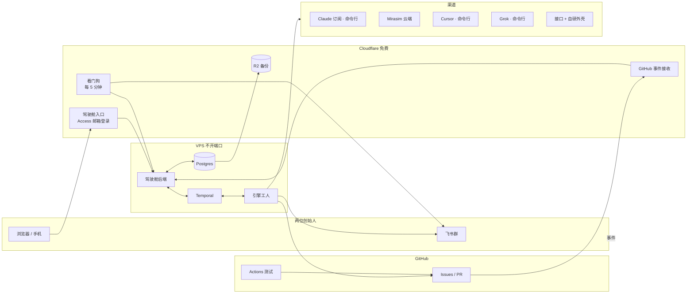
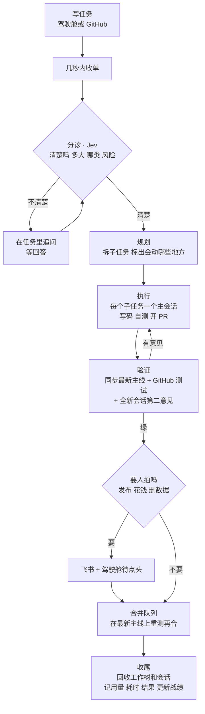

# fleet-dao 设计文档（讨论稿）

> 状态：**讨论中**。已拍板的写在「三、已定」，还没定的写在「十六、待讨论」。每轮讨论后更新本文件。
> 起草：2026-09-25。参与：两位创始人 + Claude（Opus 5.5）。

## 一、一句话

创业团队的 AI 全流程：你们写任务，AI 从拆解、写码、测试、审查到合并全包；手上的多家 AI 订阅自由组合、互不闲置；驾驶舱里看得见、管得住。

## 二、为什么从零写

前身是 windsurf-dao（派工与规矩）和 ai-gateway-stack（渠道接线）两个仓。2026-09-24 的盘点结论：

| 现象 | 根因 |
|---|---|
| 没人盯就停 | 新任务要人亲手贴标签才开工；卡住的任务进收件箱，没有自动处理 |
| 订阅额度用不掉 | 派工从不走 Claude 订阅那条线；排序只会「用完就停」，没有「快清零的先用」 |
| 总断链 | 30 本账，一个月断 10 次：闸挂在没人跑的地方、写方漏分支而读方当没事、拿假样本验收 |
| 会话开太多 | 一单拆 4 个角色，审查不过就整轮重来，审查意见互相打转（windsurf-dao#1289、windsurf-dao#1338） |
| 并行撞车、落后主线 | 任务切得太碎、各开各的分支，做到最后才发现主线早就变了 |
| 越修越重 | 代码 11.4 万行、测试 11.5 万行、99 项检查；近 30 天关掉的单约 90% 在修机制自己，开放单一半是机器给自己派的「这里该加检查」 |

所以不修补，从零写一个小而硬的核心。旧仓只当参考：好的做法搬过来，踩过的坑写成测试带过来。

## 三、已定（共识）

| # | 事项 | 结论 |
|---|---|---|
| 1 | 仓 | fleet-dao，公开；GitHub「互动限制」只限协作者。合并三样：windsurf-dao 的派工思路 + ai-gateway-stack 的渠道接线 + 驾驶舱。两个旧仓转只读存档，引用旧单写全称，如 `windsurf-dao#123` |
| 2 | 结构 | 一个仓两块：引擎 + 驾驶舱，共用一个数据库 |
| 3 | 任务 | 以 GitHub issue 为准；驾驶舱是它的驾驶舱 |
| 4 | 放行 | AI 直接开工；看不懂就在任务里追问；人随时叫停；只有对外发布、花钱、删数据停下等人。只认白名单作者（两位创始人、协作者、自家机器人） |
| 5 | 人 | 两位创始人一起用；邮箱验证码登录，不需要 GitHub 账号；写 GitHub 的动作由机器人代发并记下提出人；每个操作留记录 |
| 6 | 访问 | Cloudflare 免费方案：workers.dev 子域名 + Access 登录保护 + Workers VPC 隧道连 VPS；VPS 不开任何端口 |
| 7 | 通知 | 飞书机器人 + 驾驶舱提醒中心 |
| 8 | 模型 | 构建期全程 Opus 5.5（先用 Claude 订阅的额度）；不用 Fable；流程写完后默认值换成按数据分工，创始人再调；验收时 Kimi 和 Cursor 各跑一条小任务测插头 |
| 9 | 派工模型 | 渠道 / 族 / 模型 / 执行方式 / 阶段类型 **自由组合**；全局禁令只有两条：GPT 不碰 UI，不用 Fable |
| 10 | 推荐 | 人排先后 + 额度和战绩自动微调 + 约 10% 试探；每次派工写一句原因 |
| 11 | 闲置 | 渠道空了按序找活：积压任务里它能干的 → 重要任务加一份并行尝试 → 给别的 PR 当第二意见 → 考新模型。**不许 AI 自己编活** |
| 12 | 接法 | 优先官方命令行（能改文件、跑测试的完整写码助手）；命令行够不到的模型，再接成接口，套上我们自己的写码外壳 |
| 13 | 底座 | Temporal（工作流、定时、信号、每一步耗时）+ Postgres（配置、用量、战绩、镜像、通知、操作记录）+ Jev（判断题服务） |
| 14 | 高可用 | 单台 VPS + 外部看门狗 + 每晚备份 + 一条命令重建 |
| 15 | 测试 | 正式测试跑在 GitHub 的机器上（公开仓免费不限时）；AI 自己跑的测试受资源上限约束；每 6 小时一条巡检任务 |
| 16 | 规则 | 一页原则（偏好 + 人闸 + 底线），其余写成代码和测试；创始人的全局规则与钩子同步精简（条文出稿后逐条过目） |
| 17 | 机器 | 现在这台法国 VPS（6 核 12G，打算续费） |

## 四、架构

- **引擎工人**：执行 Temporal 派下来的每一步：起会话、跑测试、开 PR、合并、记账。不存状态，以后加机器就是加工人。
- **Temporal**：每个任务一条工作流。记下每一步的开始、排队、耗时、重试；接收驾驶舱的信号（暂停、叫停、换模型、批准）；替代旧系统约 30 个 systemd 定时器（额度探测、模型扫描、巡检、备份、续期互动限制）。
- **Postgres**：驾驶舱要的一切都在这：路由配置（带版本）、用量与额度、战绩、GitHub 镜像、通知、操作记录。有变化实时推到驾驶舱。
- **驾驶舱后端**：只读 Postgres，不直接查 GitHub——快，也不撞 GitHub 的调用限额。
- **Cloudflare**：登录保护、收 GitHub 事件（新任务几秒内开始）、看门狗、备份存储。

## 五、一个任务怎么走完全程

- 审查意见回主会话处理，最多 2 轮；还不行交 AI 帅位诊断，不无限打转。
- 每一步都能在驾驶舱看到用的哪条路由、花了多少、耗时多久。
- 卡住了按「下一步该干什么」处理（第十节），不再默认停下等人。

## 六、任务颗粒度与合并（讨论中）

旧系统的毛病：一张 issue 一个工人、各开各的分支；颗粒太碎就并行撞车，分支活得久，做完才发现主线早变了。

提议：

1. **两级任务**：GitHub issue 只写「需求」这一级（创始人写的话）。拆出来的子任务不再各开一张 issue，只存在引擎里，驾驶舱的思维导图里看得到；issue 里自动维护一份子任务清单和 PR 链接，GitHub 上也看得出脉络。
2. **拆的时候就标出会动哪些地方**：规划时每个子任务写明要改的文件或模块，以及依赖哪个子任务先做完。
3. **不撞车的调度**：会动同一块地方的子任务不同时跑——排队，或交给同一个会话连着做；互不相干的才并行。
4. **永远从最新主线起步**：开工时从最新主线建工作树；交审前先同步最新主线，有冲突当场解决；主线一变，在途分支自动同步。分支活不过一天。
5. **自己的合并队列**：同一个仓一次只合一个；合之前在最新主线上再跑一遍测试，红了退回原会话修。（GitHub 自带的合并队列要组织账号才能用，所以引擎自己排。）
6. **颗粒度有目标**：一个子任务大约是一个会话一小时内能做完、改动几百行以内；同一块地方的零碎小单合并成一个子任务一起做；太大的继续拆。

## 七、自由组合的派工模型

| 概念 | 是什么 | 例子 |
|---|---|---|
| 渠道 | 一个付费入口 | Claude 订阅、Mirasim 云端、Cursor、Grok |
| 账号池 | 渠道下的一份额度，有自己的时间窗 | 某个 Claude 账号的 5 小时窗和周窗 |
| 族 | 模型厂商家族 | Claude、GPT、Grok、Kimi、DeepSeek |
| 模型 | 具体型号 | Opus 5.5、GPT 5.6 luna、Grok 4.7、Kimi k3、Cursor Auto |
| 执行方式 | 用什么把模型跑起来 | Claude Code、codex、cursor-agent、Grok 命令行、接口 + 自研外壳 |
| 路由 | 渠道 + 账号池 + 模型 + 执行方式 = 一条能跑的线 | 「Claude 订阅 A 号 · Opus 5.5 · Claude Code」 |
| 阶段类型 | 流程里的一种活 | 分诊、规划、写码、UI、测试、审查、调研、判断 |
| 禁令 | 全局不许的组合 | GPT × UI；Fable × 一切 |

- 每个阶段类型挂一串有序的路由，驾驶舱里拖动排序、开关、增删；任意组合都行，禁令除外；单个任务可以指定路由。
- 选路：
  1. 过滤：路由在线、额度够收尾、并发有空位、执行方式能胜任（比如写码要能改文件）、不犯禁令。
  2. 按顺序取第一条。
  3. 微调：快清零还没用完的往前提；战绩明显差的往后放；样本少时不动。
  4. 约 10% 的任务试探派给非首选路由，攒战绩。
  5. 写一句「为什么派给它」，驾驶舱可见。
- 并发：每个账号池一条队列，同时跑几个由队列控制，驾驶舱里改。

## 八、额度与账单

两本账，都在 Postgres，一个写入口：

1. **还剩多少**：每个账号池、每个时间窗（5 小时 / 周 / 按月美元 / 点数）用了多少、几点清零。能读的定时读，读不到的按实际用量估，撞到限额就记下上限。调度直接看它；驾驶舱「额度表」看它。
2. **花了多少、值不值**：每个会话记模型、路由、token、耗时、所属任务。订阅月费（在驾驶舱设置里填，不进 git）按月摊到任务，算出每完成一个任务的成本、每个订阅浪费了多少额度。驾驶舱「账单」看它。

## 九、Jev 判断题服务

- 选择题 + 把握度；把握低 = 没判出来，走默认；连不上 = 没判，不当成「否」。
- **能拦不能放**：它可以让一件事停下或换路，不能批准合并、不能动账号。
- 用在：分诊（清不清楚、多大、哪类活、风险）、错误分类里规则认不出的残余、「说做完了是不是真做完了」、PR 是否回应了任务。
- 它本身也是一个阶段类型，用哪条路由在调度台里配。每次判断连同把握度留档，驾驶舱看得到它判得准不准。

## 十、卡住与自愈

- 采用 windsurf-dao 2026-09-24 的盲设计结论（windsurf-dao 仓 `docs/decisions/2026-09-24-agent-isolation-and-error-routing.md`）：
  - 错误按「下一步该做什么」分类，类别数 = 动作数；
  - 先认结构化信号（状态码、退出码），再认已知文本，最后交 Jev；
  - 兜底阶梯：有界重试 → 换路由 → 换模型 → 挂起并报警；
  - 某条路由对一个任务报繁忙，所有任务一起避开它，过一会儿试探恢复。
- **AI 帅位**：定时起一个 Opus 5.5 会话，每次只干一件事：诊断卡住的任务、写日报、每周给调度台提建议。停下等人只剩人闸一种情况。

## 十一、高可用与高响应

- **高响应**：GitHub 事件经 Cloudflare 几秒内到引擎（旧系统 10 分钟轮询一次）；驾驶舱实时推送，不用刷新；驾驶舱上的操作是发给工作流的信号，立即生效。
- **高可用**：服务挂了自动重启（干净退出也重启）；Temporal 保证任务断电重启后接着跑；外部看门狗每 5 分钟查一次，VPS 挂了推飞书；每晚备份到 R2；一条命令在新机器上重建，最坏半小时恢复。
- **资源**：每个 AI 会话一个资源上限（沿用 windsurf-dao 2026-09-24 决定的 cgroup 做法）；准入看内存和压力，不看整机 CPU。

## 十二、安全

- 公开仓 + 互动限制「只限协作者」（每次最长 6 个月，引擎自动续）；引擎只认白名单作者的任务和评论，防止陌生人往任务里藏指令。
- 密钥、账号、组织编号、代理地址放机器本地配置，不进 git，另外加密备份。
- 驾驶舱：Cloudflare Access 邮箱验证码；VPS 不开端口。
- AI 会话：独立工作树 + 资源上限；只能开 PR；强推主线、密钥进仓由硬闸拦下。

## 十三、驾驶舱（讨论中）

两块：**看板**（极客、易懂、强大）+ **后台管理**（常规）。两块都要做到尽善尽美。

### 13.1 看板

创始人的想法：画布可以拖动滚动；任务卡片像思维导图一样看出脉络；点卡片跳到各个后台页面；在看板上直接做快捷操作，比如换模型。

补充提议（待讨论）：

- **三级缩放**：远看各个仓 → 中看任务树（需求 → 子任务 → PR）→ 近看一个任务的每一步（分诊、规划、执行、审查、合并），每步显示用的路由、耗时、状态。
- **实时**：在跑的卡片有动效；颜色表示状态；卡片上一条迷你时间线；角落一个「此刻」面板：哪个渠道正在干哪个任务。
- **操作**：单击看侧边详情，双击进后台对应页；右键或悬停出快捷操作（换模型、暂停、重试、叫停、加一份尝试、批准）；⌘K 命令面板；全键盘可操作。
- **聚焦与过滤**：选中一个任务，其余变暗；只看卡住的 / 只看我提的。
- **回放**：时间滑块，回放一段时间内看板怎么变化（数据来自 Temporal 历史）。
- **易懂**：每张卡一句白话状态，比如「Opus 5.5 正在写登录页，已 12 分钟」。
- **技术倾向**：React Flow（MIT 协议）做画布，ELK 自动排版。

### 13.2 后台管理

页面初稿：总览、任务、调度台（路由矩阵）、渠道与账号、模型目录、额度、账单、战绩、定时任务、Jev 判断记录、通知中心、成员与权限、操作记录、设置。

### 13.3 提醒

驾驶舱提醒中心 + 飞书，分三级：要人拍 / 卡住报警 / 日报。点提醒直达对应页面。

## 十四、旧机制去留（初稿，审计后补全）

| 旧机制 | 新系统 |
|---|---|
| 进门标签（只有人能贴） | 删，改为 AI 分诊 |
| 盘面班自动开「该加检查」单 | 删 |
| 99 项检查 + 11.5 万行测试 | 删，换成三层：单元测试、少数硬闸、端到端真跑 + 巡检 |
| 30 本账 | 删，只留 GitHub + Postgres + Temporal |
| Temporal 工作流（7 步） | 留，压到 4 步：准备 → 执行 → 验证 → 合并 |
| 风险分档 | 留思路：决定要不要第二意见 |
| 审查闸（必须换厂商、最多 6 轮） | 改成第二意见，最多 2 轮 |
| 六层选型目录 | 留，做成自由组合模型 |
| Jev 选路 | 删；Jev 判断服务留 |
| 模型扫描、榜单巡查、新模型发现 | 留，改成 Temporal 定时任务，加「新模型考试」 |
| 额度读取（Claude 订阅、Mirasim、Cursor） | 留接线，统一进额度账 |
| 约 30 个 systemd 定时器 | 换成 Temporal 定时任务 |
| 各种清理脚本（树、会话、租约、看板） | 删，改成「谁创建谁回收」 |
| 收工脚本、master 哨兵 | 删，改由引擎的合并队列 + 分支保护 |
| 问人 / 收尾 / 命令行钩子 | 删，只留拦危险动作的硬闸 |
| 专注 / 值守 / 常态三态 | 删，系统不再依赖有人坐镇 |
| 收件箱（观察记录） | 删，改为驾驶舱通知 + 任务 |
| 226 条记忆 + 撞次数与闸字段 | 精简成偏好与项目事实；教训写成测试 |
| 飞书群分诊机器人 | 留：群里一句话变任务 |
| issue 网关（机器人身份、防重复） | 留思路 |
| 盲设计题（多家模型独立出方案） | 留，作为重大设计的可选流程，也是闲置渠道的好去处 |
| agent 资源隔离（cgroup） | 留 |

## 十五、迁移

- windsurf-dao 的 46 张开放单逐条判：新系统能覆盖的，关掉并写明去向；仍有价值的需求，搬成 fleet-dao 的任务。
- ai-gateway-stack 里还在用的接线搬进来，之后转只读存档。
- 旧系统在新系统接得住活之前原地待机；切换后停掉它的定时任务。

## 十六、待讨论

- 任务颗粒度与合并（第六节）是否照此定
- 看板的具体形态（13.1）
- 后台页面的优先级
- 阶段类型的初始清单
- AI 帅位的权限边界：能改调度台吗？能下架渠道吗？
- 巡检任务具体跑什么
- 备份保留多久
- 新模型考试的题怎么选

## 十七、下一步

讨论收完 → 两个旧仓逐模块审计（哪些坑要带走、哪些直接丢）→ 分阶段实施计划（每步怎么验）→ 创始人点头 → 开工。
