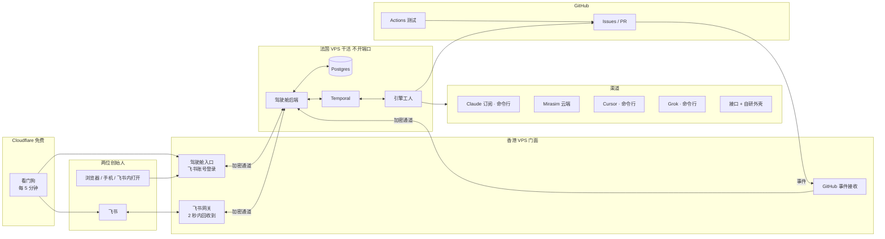
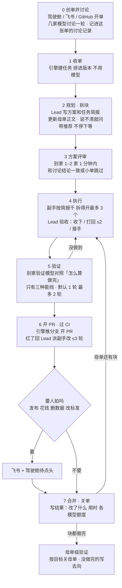

# fleet-dao 设计文档（讨论稿）

> 状态：**重做中**——本文档下面还照 Fusion 写着，新流程以 `specs/509-需求梳理/流程重做方案.md` 为准（定稿：`docs/decisions/0010-three-segment-flow.md`），守哪些规矩、要删什么怎么删看 `docs/goals.md`。本文档第五、六、七、九、十二、十五、十六、十九、二十节里这些机制还写着旧说法，读到与方案 / goals 冲突的地方，以那两份为准；删改按 goals 第六节的先后分 PR 做。计划以 GitHub 为准（里程碑＝版本，没挂＝未排期），`docs/plan.md` 是快照。
> 起草：2026-09-25。参与：创始人 + Claude（Opus 5.5）。

## 一、一句话

创业团队的 AI 全流程：你们写任务，AI 从拆解、写码、测试、审查到合并全包；手上的多家 AI 订阅自由组合、互不闲置；驾驶舱里看得见、管得住。

## 二、为什么从零写

前身是 windsurf-dao（派工与规矩）和 ai-gateway-stack（渠道接线）两个仓。2026-09-24 的盘点结论：

| 现象 | 根因 |
|---|---|
| 没人盯就停 | 新任务要人亲手贴标签才开工；卡住的任务进收件箱，没有自动处理 |
| 订阅额度用不掉 | 派工从不走 Claude 订阅那条线；排序只会「用完就停」，没有「快清零的先用」 |
| 总断链 | 30 本账，一个月断 10 次：闸挂在没人跑的地方、写方漏分支而读方当没事、拿假样本验收 |
| 会话开太多 | 一单拆 4 个角色，审查不过就整轮重来，审查意见互相打转（windsurf-dao#1289、windsurf-dao#1338） |
| 并行撞车、落后主线 | 任务切得太碎、各开各的分支，做到最后才发现主线早就变了 |
| issue、PR 没人读 | 模板为流程和检查而写，又长又全，人不读，AI 也用不着那些套话；没有需求文档，历史无处可查 |
| 看不见进度 | 有的命令行会列任务清单，有的不会；做到哪一步只能猜 |
| 越修越重 | 代码 11.4 万行、测试 11.5 万行、99 项检查；近 30 天关掉的单约 90% 在修机制自己，开放单一半是机器给自己派的「这里该加检查」 |

所以不修补，从零写一个小而硬的核心。旧仓只当参考：好的做法搬过来，踩过的坑写成测试带过来。

## 三、已定（共识）

| # | 事项 | 结论 |
|---|---|---|
| 1 | 仓 | fleet-dao，公开；GitHub「互动限制」只限协作者。合并三样：windsurf-dao 的派工思路 + ai-gateway-stack 的渠道接线 + 驾驶舱。两个旧仓转只读存档，引用旧单写全称，如 `windsurf-dao#123` |
| 2 | 结构 | 一个仓两块：引擎 + 驾驶舱，共用一个数据库 |
| 3 | 任务 | 以 GitHub issue 为准；驾驶舱是它的驾驶舱 |
| 4 | 放行 | AI 直接开工；看不懂就在任务里追问；人随时叫停；只有对外发布、花钱、删数据、改标准停下等人（改标准是 2026-09-26 加的第四类，见第五节「人闸第四类：改标准」）。只认白名单作者（两位创始人、协作者、自家机器人） |
| 5 | 人 | 两位创始人一起用；用飞书账号登录驾驶舱，不需要 GitHub 账号；写 GitHub 的动作由机器人代发并记下提出人；每个操作留记录 |
| 6 | 访问 | 香港 VPS 当门面：驾驶舱入口 + 飞书网关都在香港；域名用 DigitalPlat 的免费域名（DNS 也用 DigitalPlat 的，国内外解析均已验证）；它一个账号只给一个域名（数量以[官方 FAQ](https://github.com/DigitalPlatDev/FreeDomain/blob/main/documents/domains/faq.md)为准），以后的项目都挂在它下面的子域名上；公开仓里写 `<驾驶舱域名>`，真值只在机器配置里（第十四节「演示版」）；法国 VPS 不对外开端口，只和香港之间走加密通道。（原定的 workers.dev 在国内被 DNS 污染，作废） |
| 7 | 通知 | 飞书机器人 + 驾驶舱提醒中心 |
| 8 | 模型 | 构建期全程 Opus 5.5（先用 Claude 订阅的额度）；判断阶段例外：Claude 判断后端接上之前先用 TypeSafe 的 Jev（第十一节）；第二意见例外：换厂商（第五节）；不用 Fable；流程写完后默认值换成按数据分工，创始人再调；验收时 Kimi 和 Cursor 各跑一条小任务测插头 |
| 9 | 派工模型 | 渠道 / 族 / 模型 / 执行方式 / 阶段类型 **自由组合**；全局禁令只有两条：GPT 不碰 UI，不用 Fable |
| 10 | 推荐 | 人排先后 + 额度和战绩自动微调 + 约 10% 试探；每次派工写一句原因 |
| 11 | 闲置 | 渠道空了按序找活：积压任务里它能干的 → 重要任务加一份并行尝试 → 给别的 PR 当第二意见 → 考新模型。**不许 AI 自己编活** |
| 12 | 接法 | 优先官方命令行（能改文件、跑测试的完整写码助手）；命令行够不到的模型，再接成接口，套上我们自己的写码外壳 |
| 13 | 底座 | Temporal（工作流、定时、信号、每一步耗时）+ Postgres（配置、用量、战绩、镜像、通知、操作记录）+ Jev（判断题服务） |
| 14 | 高可用 | 法国干活、香港门面，各自一条命令重建；外部看门狗（Cloudflare 定时 Worker）+ 每晚备份（去向见 plan.md 第二节「备份」） |
| 15 | 测试 | 正式测试跑在 GitHub 的机器上（公开仓免费不限时）；AI 自己跑的测试受资源上限约束；每 6 小时一条巡检任务 |
| 16 | 规则 | 一页原则（偏好 + 人闸 + 底线），其余写成代码和测试；创始人的全局规则与钩子同步精简。2026-09-25 创始人过目定稿：`AGENTS.md` 上半段是所有仓通用的一段，由同步脚本写进每台机器上各家 AI 的全局说明（只改受管的那一块），下半段只管本仓；别的仓的 `AGENTS.md` 由建仓或第一次进仓的 AI 起草，只写那个仓特有的（栏目固定，缺了由标准的补齐 PR 起草，15.7 第 9 条）；各仓都用得上的规矩提回这里改通用段，不横着抄（直接开 PR 改标准，15.7 第 12 条）。人闸就是第 4 条那四类；改通用段属于「改标准」，要创始人同意才合（第五节），日报列出改了哪几行。skill 走同一个同步脚本分发：方法类（grill-me、grill-ai、chain-first、best-practice-first、judge-or-code、discuss、docs-lookup）改成通用版放本仓；旧仓的派工 skill、钩子、开会话自愈全部退役；GitHub 一律走 `gh`（创始人同日过目工具箱去留） |
| 17 | 机器 | 现在这台法国 VPS（6 核 12G，打算续费） |
| 18 | 颗粒度与合并 | 按第六节：版本 → 母单或单独的小单 → 子单（GitHub 子议题）→ 块（主导模型拆的，不开单，只在引擎和驾驶舱里；2026-09-27 按 0003 改）；会改同一块的不同时跑；交审前同步主线；引擎自己排合并队列 |
| 19 | 看板首屏 | 按项目切换（项目和仓一对一，第 36 条），每个项目的全局任务树是首屏；另有一页总览看全部项目 |
| 20 | AI 帅位权限 | 能自己改调度台（调路由先后、下架出问题的渠道），改完推通知、驾驶舱一键撤回；创始人手动钉住的顺序它不动 |
| 21 | 花钱的定义 | 已订阅套餐额度以内的使用都不算花钱（含 Jev、定时起的 AI 会话、并行加做的尝试）；会让账单多出一笔的才算——新订阅或升级、按量计费的接口、超出套餐的额外用量、买域名或机器。每条路由标「套餐内 / 按量」，按量的先由创始人定月度上限，上限内不再问 |
| 22 | 旧规则 | 旧仓的规则对 fleet-dao 不再算数，规则随项目一起从零重写（见第 16 条） |
| 23 | 需求文档 | 按第七节：issue 是入口与进度；仓内 `specs/` 每个需求一个文件夹（需求、方案、结果）；子任务各一个 PR；AI 开新需求先翻相关历史 |
| 24 | 进度 | 按第八节：统一的「汇报进度」工具（照 Codex 的步骤清单）；两级进度；沉默就催；驾驶舱实时、issue 原地更新 |
| 25 | 飞书 | 按 15.4：记任务、只推三类消息与关注、随时看盘面（置顶盘面卡 + 机器人菜单）、回复即追问；端到端自测 |
| 26 | AI 与流程的接口 | 按第八节：进度先被动读各家命令行的过程记录；AI 主动的部分做成 `fleet` 命令（不是 MCP），会话带只对本任务有效的通行证；MCP 等数据说明需要时再从同一份命令定义生成 |
| 27 | 仓库结构 | 全部放在 fleet-dao 一个仓，目录见第四节「仓库结构」 |
| 28 | 执行模式与容量 | 无头；每个子任务一个命令行写码助手进程；Temporal 指挥、AI 干活；起步 6 个并发会话，实测后往 8–10 调；见第四节「执行模式与容量」 |
| 29 | 两台机器分工 | 法国（6 核 12G）：引擎、AI 会话、Postgres、Temporal；香港（2 核 2G）：飞书网关、驾驶舱入口。实测调飞书接口香港 0.17 秒、法国 1.1 秒；Anthropic 对香港封区，AI 活只能在法国 |
| 30 | 额度必须全读 | 每个渠道、每个账号池的剩余额度都要读到，驾驶舱才能管、调度才能规划；读法按第十节的顺序选，估算的要标明 |
| 31 | 补充需求 | 旧单审计找出的 10 条，见第十七节 |
| 32 | Jev 接入 | 能接的地方按场景和性价比接（第十一节 9 个接入点）；每道题先只记不拦、攒够样本准了才拦；能拦不能放 |
| 33 | 密钥副本 | （2026-09-25）密钥与本机配置的加密副本放私有配套仓 `thoerwink8/fleet-dao-vault`：age 加密，一个文件一个 `.age`，仓里只有密文和公钥。解密钥匙在创始人电脑的 `~/.fleet-dao/vault-key.txt`，要抄一份进创始人的密码管理器（plan.md 第五节），只有拿着它的人解得开。在创始人电脑上跑那个仓里的 `bash refresh.sh` 刷新。数据库备份不在这里，见 plan.md 第二节「备份」 |
| 34 | GitHub 上的标签与里程碑 | （2026-09-25）标签七个，分类别、特性、要人看三组；里程碑 P0–P6，对应 plan.md 的七个阶段；issue 当天起照第七节建（起初只建标签和里程碑，同日改）；2026-09-26 晚里程碑改成版本、加「母单」标签，P0–P6 关闭留作历史（#169 第 5、7 件）；2026-09-27 去掉「界面」「本机」两个标签（0003 第 9 条）。方案与理由见第七节 |
| 35 | 欠账不漏 | （2026-09-25，#67；2026-09-26 起只报告不挡 PR）「以后要做」的事必须是一张带「怎么算做完」和里程碑的 issue，否则不算计划：可以只做一部分，剩下的由系统记着，不靠人记得。怎么查见第七节「欠账不漏」 |
| 36 | 项目与标准 | （创始人 2026-09-26 拍，选项 1）驾驶舱最顶层从「GitHub 仓」改成「项目」，项目与仓一对一；每人连自己的来源账号、勾选导入，导入的人是项目主人，可见范围两档、默认只有我；导入后「让 AI 接活」默认关。fleet-dao 放一份带版本号的「标准」推给机器和仓：体检 → 补齐（仓里开 PR）→ 每天复查；任何仓的 AI 发现通用做法直接给标准开 PR。人闸加第四类「改标准」（2026-09-27 收窄：只管规矩文字和钉住规矩的测试，技能脚本修 bug 不算，见第五节）。全文和分步单号见 15.7 |
| 37 | plan、design、ops 整套改法 | （创始人 2026-09-26 拍；plan 部分同日晚被 #169 第 5 件替代：计划以 GitHub 为准，plan.md 是每个版本生成的快照，下面 plan 那几句作废）plan 是「做什么」的唯一来源、GitHub 是镜子：每条一个随机短码编号，按阶段拆成 `docs/plan/P<N>.md` 对应里程碑，合进主线后自动同步成 issue，「关没关」以 GitHub 为准；决定表拆成 `docs/decisions/` 一决定一文件，design 按模块拆、不留计划性内容；ops 的表由部署配置生成、CI 核对。决定记录 `docs/decisions/0001-plan-design-ops.md`，全文见第七节「plan、design、ops 的整套改法」 |
| 38 | Fusion 架构 | （创始人 2026-09-26 拍）默认 Fusion 模式：一张单一个主导模型（Lead，高级模型）指挥各订阅渠道里的便宜模型（副手，Sidekick）干活，方案开工前和开 PR 前各让别家模型挑一道错；额度不够切单模型模式（一张单一个会话一个模型）。替代「一张单拆成多个独立会话、文档直写主线」和「合并后补审」。决定记录 `docs/decisions/0002-fusion.md`；具体形态 2026-09-27 定稿，见第 40 条 |
| 39 | 测试内存先改测试、不加机器 | （创始人 2026-09-26 拍）会话跑测试的内存峰值高（fleet-dao 每个测试进程在内存里建一份库，1/2/3 个进程峰值约 1.6/2.5/3.2G），先改测试：测试共用一个真 Postgres、每个进程从模板库克隆自己的测试库（和正式库分开装，AI 碰不到正式库），只跑改动影响到的测试，按内存上限定测试进程数；不买、不升级法国 VPS（现在按月付，以后打算包年）。做法记在 #164 |
| 40 | Fusion 流程定稿 | （创始人 2026-09-26 逐题拍，2026-09-27 凌晨定稿）层级：项目 → 版本 → 母单或单独的小单 → 子单 → 块；一张单走 0–7 步（创单并讨论、收单、规划拆块、方案评审、执行、验证、开 PR 过 CI、合并关单），母单按块循环、最后做一次母单级验证；流程配置是每个仓一份 JSON；照 k8s 分「想要的」和「实际的」、对账程序往回拉、规矩只放准入和调度两处；所有判断进 core 包；每张单一份简报加全文；插话单内找 Lead、跨单找帅位；发布按版本确认、合并≠上线（管对外的；fleet-dao 自己的法国引擎、驾驶舱随主线自动发布，第 42 条）。决定记录 `docs/decisions/0003-fusion-flow.md` |
| 41 | 指挥官（原帅位）不设座位、不在库里认领（09-27 晚改回只一个，#299；09-29 起改叫指挥官；座位那张删除计划 2026-10-01 完成第一块，#531） | （创始人 2026-09-27 晚拍只一个帅位；09-29 起「要删的东西都要删」、座位和认领按 `docs/goals.md`「六、要删的，和怎么删」整张删——本机不接班、不续约、不任期、不交接、不写帅位栏；2026-10-01 #531 把接班、租约、任期、受保护动作前现查、交接存库、驾驶舱帅位栏整张删了，库表（`seat_leases`、`seat_boards`）留到删库表那一步。`docs/goals.md` 第六节的删除计划是后续的判据，本文档下方相关段落照 Fusion 旧写法留着，读到以 `goals.md` 为准。）技能 `agents/skills/commander` |
| 42 | 法国自家的引擎跟着主线自动发布 | （创始人 2026-09-27 早：「法国引擎比主线落后提交，说明同步机制没实现得很完整……你按照网上的最佳实践查一下，反正都修复吧」；帅位据此定了范围）fleet-dao 自己的法国引擎、驾驶舱后端随主线自动发布：主线上 CI 全绿的最新提交（主线头的 CI 没跑完、红了就沿主线往回找，只往前走；2026-09-27 夜合并一密，只看主线头就一直发不出去），马上自动发（2026-09-28 凌晨改：等引擎空闲永远等不到。发之前先排空引擎——不起新会话，在跑的最多再做 10 分钟，到点停下、按编号续上，ops 第九节「发布前排空」；同日凌晨再拍「发布不碰会话」：会话脱开引擎进程跑，引擎重启后接回，排空只剩切的那几秒不起新会话，ops 第九节「发布不碰会话」），发完把规矩同步给法国的会话用户和 pilot；健康检查不过照旧自动退回，这个提交和比它旧的不再自动试、报警；人手动切过版本，自动发布这一轮就不发，主线出了新提交才接着发。`release.env` 配了的驾驶舱静态页、飞书网关跟后端同一版。对外的——演示版、给用户用的产品和开关——照 0003 第 18 条按版本由创始人确认，自动发布不碰。装机脚本（france.sh，碰防火墙、sudoers）不自动跑，落后主线一天以上 `/healthz` 标出来。做法、阈值和出处见 ops 第九节「自动发布」 |

## 四、架构


```mermaid
flowchart LR
  subgraph People[两位创始人]
    B[浏览器 / 手机 / 飞书内打开]
    F[飞书]
  end
  subgraph HK[香港 VPS 门面]
    W[驾驶舱入口<br/>飞书账号登录]
    FG[飞书网关<br/>2 秒内回收到]
    H[GitHub 事件接收]
  end
  subgraph FR[法国 VPS 干活 不开端口]
    API[驾驶舱后端]
    T[Temporal]
    PG[(Postgres)]
    E[引擎工人]
  end
  subgraph GH[GitHub]
    I[Issues / PR]
    A[Actions 测试]
  end
  subgraph CF[Cloudflare 免费]
    WD[看门狗<br/>每 5 分钟]
  end
  subgraph CH[渠道]
    C1[Claude 订阅 · 命令行]
    C2[Mirasim 云端]
    C3[Cursor · 命令行]
    C4[Grok · 命令行]
    C5[接口 + 自研外壳]
  end
  B --> W
  F <--> FG
  I -- 事件 --> H
  W <-- 加密通道 --> API
  FG <-- 加密通道 --> API
  H -- 加密通道 --> API
  API <--> PG
  API <--> T
  T <--> E
  E --> CH
  E --> I
  A --> I
  WD --> W
  WD --> F
```

- **引擎工人（法国）**：执行 Temporal 派下来的每一步：起会话、跑测试、开 PR、合并、记账。不存状态，以后加机器就是加工人。
- **Temporal（法国）**：每个任务一条工作流。记下每一步的开始、排队、耗时、重试；接收驾驶舱的信号（暂停、叫停、换模型、批准）；替代旧系统约 30 个 systemd 定时器（额度探测、模型扫描、巡检、备份、续期互动限制）。
- **Postgres（法国）**：驾驶舱要的一切都在这：路由配置（带版本）、用量与额度、战绩、进度、GitHub 镜像、通知、操作记录。有变化实时推到驾驶舱。
- **驾驶舱后端（法国）**：驾驶舱的所有读写都经过它——查数据、改调度台、叫停任务（给 Temporal 发信号）、开任务（经机器人写 GitHub）、实时推送、权限与操作记录。读数据只从 Postgres 读，不直接查 GitHub——快，也不撞 GitHub 的调用限额。
- **香港门面**：只当门卫和信使，不放业务逻辑——驾驶舱页面与飞书登录、飞书网关（收消息先回「收到」、卡片原地刷新、机器人菜单，盘面快照缓存在本地以便秒回）、收 GitHub 事件。和法国之间走加密通道。
- **为什么分两台**：实测调飞书接口香港 0.17 秒、法国 1.1 秒；Anthropic 对香港封区，Claude 等 AI 活只能在法国跑；`workers.dev` 在国内被 DNS 污染，不能当入口。
- **Cloudflare**：只剩外部看门狗（定时 Worker，两台机器都挂了也能报警）。备份去向见 plan.md 第二节「备份」。

### 仓库结构

```
fleet-dao/
  packages/engine     引擎：Temporal 工作流与每一步的实现
  packages/adapters   渠道插头：Claude Code、codex、cursor-agent、Grok 命令行、接口外壳
  packages/cli        fleet 命令（给 AI 会话用，人和测试也能用）
  packages/api        驾驶舱后端
  packages/web        驾驶舱前端：看板 + 后台管理
  packages/feishu     飞书机器人
  edge/               Cloudflare：驾驶舱入口、GitHub 事件接收、看门狗
  deploy/             一条命令装好整台机器
  specs/              需求文档（每个需求一个文件夹，见第七节）
  docs/               设计与决定
```

### 执行模式与容量

- **无头**：每个子任务在后台起一个命令行写码助手进程（Claude Code、codex、cursor-agent、Grok 命令行或自研外壳），不开窗口、没有界面会话；Mirasim 中转的路由也走它的程序接口。驾驶舱提供「直播」：实时滚动显示助手每一步在干什么。
- **Temporal 指挥，AI 干活**：派活、等待、重试都是确定性的工作流；AI 只在分诊、写方案、写码、审查和定时的 AI 帅位出场。每个助手在自己的工作副本里干活，需要时在会话内部再起子代理。
- **插手**：「换模型」「暂停」让当前进程停在干净的点（做完的已提交），再按新设置接着干；临时追加的要求排进下一轮——支持续会话的命令行按会话编号续上，不支持的带进度摘要开新会话。
- **会话断了接着干，不重来**：会话被额度、限流、进程被杀、引擎重启打断时，同一个账号池就按会话编号续上原会话，上下文都在；额度用满就挂起，到清零时间续同一个会话，不开新的（Claude 订阅池不干等到清零：引擎切号，切过去 fork 续上，见本条末尾）。非换池不可时，引擎从库里拼一份接力任务书开新会话：原任务、步骤清单做到哪、最近的进度、工作副本里已提交的改动、还没处理的审查意见；已提交的不重做。法国只有一个会话用户，平时挂拼车组织；拼车用满时整个用户切到独享组织，手上的会话逐个 fork 续上（见第九节）：同一台设备上切号，会让上面所有在跑的会话一起断（2026-09-25 构建期实咬：本机一次切号，总指挥和十几个子代理全断；把记录接回新会话后，各自从断点接着干完）。两种不再续这个号、改开新会话带接力任务书（#489）：这个号上一轮续起来没有第一帧（startup_timeout）；Grok 的号上一轮判了停滞、本来要同池 `-r` 的。
- **容量（6 核 12G）**：

| | 旧系统（实测） | 新系统（起步值，实测后调） |
|---|---|---|
| 同时在写码、验证 | 3 个任务（2026-09-22 负载 15 后封顶，windsurf-dao#1748） | 6 个会话（约 5 个子任务 + 1 个审查），压力低往 8–10 加 |
| 同时跑测试 | 全机 2 份 | 2–3 份（新测试秒级） |
| 一个任务占几个会话 | 2–4 个 × 返工轮 | 1 个主会话 + 需要时 1 个审查 |

- 旧系统那次负载 15，主要是机器在忙自己：5 个任务同时执行、一个工作副本里 13 个测试进程、一份 109 秒的全量检查、Mirasim 轮询 30 个工作副本、用量采集器每轮扫 1526 个文件。新系统这些都没有。
- **放行看三样**：内存与机器压力（不看整机 CPU 百分比）、账号池并发空位、额度够不够。真正的上限多半在订阅，不在机器。排队的任务在驾驶舱写明在等什么：等空位、等额度、等前一个子任务。
- 每个会话连同它跑的测试的内存上限，2026-09-26 按法国实测定（#164，原先按 1.2–1.6G 估，#160 在软 1.5G、硬 2G 里跑测试卡死），2026-09-28 按新一次断链改过推导（法国实测：单会话被自己那道窄墙——旧的三等分值——卡死，整机却还有 6.8G 空闲）：安全垫从「单会话」挪到父节点 fleet-agents.slice，总量上限 =（能分给会话的 11G − 平台常驻服务约 0.6G）≈ 10.4G，软上限低 512M；单会话硬上限放宽到「一次放得下 tsc -b 全仓 + 测试 2–3 个进程 + 代理本身」这种最坏组合，约 6G（约总量的一半），仍明显小于父节点总上限，多个会话同时冲高由父节点兜住；测试开几个进程按所在 cgroup 的上限算。算法在 `packages/engine/src/limits.ts`、`packages/conventions/src/test-run.ts`，单元文件在 `deploy/france/fleet-agents.slice`，运维见 ops 第五节。以后加机器就是加工人。

### 为什么用 Postgres

| | SQLite | MySQL | Postgres |
|---|---|---|---|
| 是什么 | 一个文件，嵌在程序里 | 数据库服务 | 数据库服务 |
| 多个程序同时写 | 容易「库被锁」（旧系统专门写了重试代码，windsurf-dao#1814） | 可以 | 可以 |
| 跨机器用 | 不行 | 可以 | 可以 |
| 数据一变就通知 | 没有 | 没有，要另加中间件 | 自带，驾驶舱实时刷新就靠它 |
| 存结构不固定的数据 | 弱 | 有 JSON 类型 | JSONB，能建索引，查得快 |
| Temporal 同库 | 只能单机开发模式 | 支持 | 官方支持 |
| 扩展 | 少 | 少 | 多：库内定时、向量搜索（以后按意思搜历史任务）等 |

引擎工人、驾驶舱后端、定时任务会同时写库，以后还要跨机器，所以 SQLite 不合适；MySQL 和 Postgres 都成熟免费，Postgres 多了实时通知、JSONB 和扩展这几样我们正好要用的。

## 五、一个任务怎么走完全程

> 本节随 #554 重做（融合成新流程的「动手」段），落地 PR 连带删改本节里 Fusion 0–7 步的旧说法，先别照本节做；新流程按 `specs/509-需求梳理/流程重做方案.md`。

> **2026-09-27 按 Fusion 定稿改**（`docs/decisions/0003-fusion-flow.md`，细节和出处在 `specs/169-Fusion形态/需求.md`）：一张单由一个主导模型（Lead）会话领着走 0–7 步，副手（Sidekick）干界定清楚的活，别家模型在开工前评方案、开 PR 前验证；引擎不直写主线，合并后不再补审。本节其余各条照旧，和 0003 冲突的以 0003 为准。


```mermaid
flowchart TD
  N[0 创单并讨论<br/>驾驶舱 / 飞书 / GitHub 开单<br/>几家模型讨论一轮 · 记进这张单的讨论记录] --> R[1 收单<br/>引擎建任务 排进版本 不用模型]
  R --> P[2 规划 · 拆块<br/>Lead 写方案和任务简报<br/>更新母单正文 · 说不清就问<br/>带推荐 不停下等]
  P --> RV[3 方案评审<br/>别家 1–2 家 1 分钟内<br/>和讨论结论一致或小单跳过]
  RV --> X[4 执行<br/>副手按简报干 拆得开最多 3 个<br/>Lead 验收：收下 / 打回 ≤2 / 接手]
  X --> V[5 验证<br/>别家验证模型对照「怎么算做完」<br/>只有三种能挡 · 默认 1 轮 最多 2 轮]
  V -- 没做到 --> X
  V --> PR[6 开 PR · 过 CI<br/>引擎推分支 开 PR<br/>红了回 Lead 派副手改 ≤3 轮]
  PR --> G{要人拍吗<br/>发布 花钱 删数据 改标准}
  G -- 要 --> HN[飞书 + 驾驶舱待点头] --> M
  G -- 不要 --> M[7 合并 · 关单<br/>写结果：改了什么 用时 各模型额度]
  M -- 母单还有块 --> X
  M -- 块都做完 --> MV[母单级验证<br/>按目标关母单 · 没做完的写去向]
```

- **每步结束 Lead 存一个存档点**（一个 git 提交加写明白的进度），会话断了、换模型都从存档点接着做；Lead 的座位长开，在存档点按上下文用量换新会话（0003 第 6 条）。
- **单模型模式**（额度不够时）：第 2、4 步同一个模型做完，第 3 步关，第 5 步只对高风险的开（0003 第 7 条）。
- **后端给每张单起 Fusion 工作流**（#214 起）：接活（webhook 和引擎的对账补漏用同一份拉起实现，api 的 `temporal.ts`）起的是 `fusionWorkflow`（派哪些单见第九节「在哪能做与接活开关」：开关开着、开关打开以后开的、挂在当前版本上的；别的由人 `fleet-api handover` 交），编号照旧 `req:<仓>#<号>`，驾驶舱、飞书、`fleet` 命令的信号照旧按它发。Fusion 模式还是单模型模式由工作流开工前按流程配置副本判（每套配置的 `mode`，默认 fusion），不是两种工作流。旧的需求工作流后端不再起、也不留切回去的开关（它直写主线，0002 第 7 条不许；出问题照规矩回退版本，或关「让 AI 接活」）。切换时：已经在跑的旧需求工作流照旧跑完（引擎留着它，#250 删），同一张单同一时刻只有一条（同一个编号，撞上回「已经在跑」，它跑完、单子重开才起 Fusion）；流程配置认不出、太久没同步成，接活一种都不起，这个项目停派、报红，不拿全组织默认顶（0003 第 9 条）。任务上记这一轮用的配置读自哪（`tasks.flow_source`：仓里的 `.fleet/flow.json` 还是全组织默认，每次写快照都带上），驾驶舱照它标出「用的全组织默认」（界面 #276）。
- **发给别家的都先过卫生检查**（#214）：派给 Claude 以外的族的会话（副手、开 PR 前验证……），起会话前整份提示词先过和推分支同一套规则的卫生检查，过不了不发、报警；副手因此派不出就由 Lead 自己写。任务简报是 Lead 写的，没进过公开的地方，不能不查就发出去。
- **第 4 步 Lead 验收怎么判**（core 的 `decideAcceptance`；2026-09-27 #246 验收暴露后改）：事实先过，Lead 说收也不收——空交付、测试没过或没跑成、碰到同一张单别的块简报里的文件（几块一起干时各改各的；#252 接上多块之前一张单只有一块，这一条空着）。简报外、别的块也没认领的文件由 Lead 看过定：收下就收下，状态里写一句，PR 正文「怎么验证的」加一行「简报外改了：…（主导收下）」，开了 PR 之后修的几轮收下的补进关单评论；打回的列进理由。原来简报外的一律不收：一张单一块时根本没有别人的文件，Lead 也没法改派，改动又是几轮累计着看、撤了也照样算，#246 因此注定白转两轮等 Lead 接手。旧的需求工作流（#250 删）同样是方案外的照收、记下来。
- **第 5 步开 PR 前验证怎么做**（#213，细节和 #214 怎么接见 `specs/213-开PR前验证/方案.md`）：引擎里是一块可复用的零件 `packages/engine/src/workflows/verify.ts`，由 Fusion 工作流在推完分支、开 PR 之前调。
  - 对照的「怎么算做完」读默认分支上、单子正文「文档：」那一行指的 `specs/<号>-<短名>/需求.md`（不读分支上的：写这张单的改不了验收条）；读不到、没有那一节、那一节空着都挂起等人补，不验、也不当成验过了。正文写全了需求、没有那一行的单（#295：巡检单这类引擎自己开的单，正文里有写了字的「## 怎么算做完」）第 1 步照收：目录按标题取短名（`specs/<号>-<短名>`），引擎照正文写好需求文档交给 Lead，Lead 在第 2 步原样和方案一起提交、随 PR 进主线；这种单的「怎么算做完」读库里这张单此刻的正文（会话改不了），开 PR 时「对应计划」照单子挂的版本写（没挂写「未排期」）。两样都没有的照旧停在收单等人补。
  - 只派别家：写这张单的会话用过的族（库里按这张单起过的会话现查，验证、审查的不算）整族避开，点名的、续会话的路由也一样；渠道自己挑模型的（Cursor Auto 这类上游串是 auto 的）认不出这次是哪一家在答，也不派——验证要用钉住型号的路由。一条都派不出就挂起「没有别家可验」，不拿同族顶。
  - 给验证留一家（2026-09-27，#293 断链后补）：规划完、开 PR 之前，选副手、Lead 换路由这类会给这张单加一个写手族的步骤，选路先按候选的族把「写手族 + 它」交给验证那一步现选一次（同一个选路、同一份事实：接上、在线、不犯禁令、不同族，等得来的也算），只派验证还派得出别家的。副手避开 Lead 那一族（Lead 那家的额度留给 Lead）这时只是「先避开」：别家的副手能派、却都会让验证没人可派，而流程配置的副手里排了和 Lead 同族的，改派同族的新会话（不多加一族）；别家只是没额度、连不上的照旧 Lead 自己干（0003 第 7 条）；能给验证留一家的都派不出也交给 Lead 自己干。全组织默认的副手只有 Grok（创始人 2026-09-28 凌晨拍，法国干活只用 Grok）：界面单 Lead 是 Claude 时 Grok 会让验证没人可派，副手就交回 Lead 自己写、留 Grok 验；Lead 兜底成 Grok 时副手和它同族先避开，也是 Lead 自己写、由 Opus 验。Lead 非派不可，只剩会让验证没人可派的就照常派。写这张单的族已经让验证没人可派（选谁都救不回来），或 Lead 照常派了这样的一条，当场报警「这张单做完没人能验」（`no-verifier:<任务>`，写明验证那一步每条为什么派不出、验证按哪几个模型派），不等干完几小时走到验证才挂起；之后再选时验证留得下了、验证派出去了选路自己撤，这张单不在跑了每小时对账撤。这张单不验的（单模型模式、不算高风险）、开了 PR 之后不管。#293 在法国就是这样断的：界面单写的是 Claude（Lead）+ Grok（副手），GPT 不验界面、Grok 和 Claude 同族、Kimi 没接，干完才挂起、干等 47 分钟。判法在 `packages/engine/src/routing/choose.ts` 的 `keepingVerifier`。
  - 判界面（碰页面代码的按界面类派，GPT 不验）、给验证方的「改了哪些文件」、PR 正文的「文档」一栏，都按推上去的头相对主线的净改动（推分支那一步并完最新主线后算的 `git diff 主线...头`，和 PR 在 GitHub 上看到的同一个口径），不按会话一轮轮交的累计。会话交活时「这一步改了什么」也扣掉它在树里并进来的主线（`packages/engine/src/real/user-git.ts` 的 `ownSpan`；只并了主线、自己没写东西的判没交付）：#293 那次按「起会话前的头..HEAD」算，把主线上别人改的健康页算成这张单改的，验证按界面类派，写它的两族之外只剩 GPT，干等了 47 分钟。
  - 验证会话检出送检的头、只读，结论写 `.fleet-out/verify.json`（core 的 `ReportSchema`）；发给别家的整份提示词先过和推分支同一套规则的卫生检查，过不了不发、挂起报警。
  - 结论只经 core 的 `decideVerdict` 判（本地活动 decide，进历史）：交回的认不出、审的不是送检的头、漏答、派成了同族，一律作废、记一笔、挂起等人，不当成过了；Lead 拿证据驳回也经它判，只认驳能挡的、带证据的。交回的「怎么算做完」和驳回的对象按 core 的 `criterionKey` 对：只抹反引号、加粗斜体、全角半角、中英文之间的空格这类不改意思的格式差别，对上了换回清单原文往下传；规范化后还对不上、两条撞成一条、漏答的照旧作废（#246 验收撞上的：模型抄的时候去掉了反引号，逐字比判成清单外、整轮重跑）。每一轮和驳回记进库 `verify_rounds`；结论写成 PR 正文「怎么验证的」「还欠什么」几行（core 的 `verificationLines`）。
  - 轮数照 core 的 `nextFlow`：默认 1 轮、挡了回第 4 步改完再验，最多 2 轮，还挡就停下等人。验证结论不写成合并闸认的 `second-opinion` 状态：两道闸管的不是一回事（理由见方案）。

- **需求拍板期**（创始人 2026-09-25 拍）：每张需求分诊后先进拍板期，默认 30 分钟（每个项目可调），这段时间 AI 不往下推。拍板期能在驾驶舱或飞书卡片上延长、暂停、跳过。有人在讨论（飞书讨论群里有新消息，或驾驶舱里有追问）就等讨论完；没人讨论，到点 AI 自己定方向往下做。到点时 AI 先找这张需求的飞书讨论群，有就把记录读一遍，和需求原话一起归纳成拍板方案（结论、还没定的问题、每条出自谁的原话），写进需求文档。归纳前先判「信息够不够下结论」（Jev 判断题：够不够、缺哪几条）：不够就在群里列出缺的问题，拍板期自动顺延；够了再分重大、小方案。判为重大，或群里的人意见有分歧，自动接进讨论环节（下面「讨论」，创始人 2026-09-26 拍）。
- **重大方案人拍，小方案 AI 拍**：重大 = 碰四条人闸（对外发布、花钱、删数据、改标准），或和本文档已拍的规则冲突，或要新加外部服务、改架构、改阶段划分；其余都算小方案，AI 拍了直接往下做，理由写进需求文档，日报里列出。重大不重大由分诊判，判不准的按重大算；VPS 上的引擎和本机总指挥用这同一条判据（创始人 2026-09-26 拍）。**反过来同样算错**（创始人 2026-10-01 拍）：已经判明不碰这四类、也不是和已拍规矩冲突、不新加外部服务、不改架构或阶段划分的，就是 AI 自己拍、接着做，只有事后报结果，不许写成选项来问——通用段「其余你自己定」里的「其余」是默认的那一边，不是兜底。判不准**是不是**碰四类时按碰算（问）；判明不碰、却为了「省得创始人怪我没问」而问，同样是错：他只看得到每轮最后一条，一堆其实不用他定的选择题会把真正要定的那几件盖住。同类事问过一次、他也答过的，往后照那次办、只报不问。聊天记录本身不算拍板，引擎只认需求文档。
- **流程只为快，不当绊脚石**（创始人 2026-09-26 拍，照数据：机制少的头 8 小时合了 17 个真功能 PR；第二天加满关卡的 5 小时，30 个 PR 里 22 个在改流程本身，产品只有约 1700 行）。先上线，出了问题再改。量两个数看流程有没有变好：每天合进去的产品 PR 数、从开到合的中位时长。
  - **合并前只拦一样**：CI 绿（测试、类型、格式）。检查一律取主线上那份代码来跑，PR 改不了自己的检查（#74 合并闸）。卫生检查（真密钥）也在 CI 里跑，但改成只报不挡，不进 `check` 的必过名单：真正挡的是推之前——`.githooks/pre-push`、引擎推分支和写公开内容前的扫描，查出真密钥就不推、不写（账号、组织编号、邮箱、IP 这类标识不算泄漏，不拦，创始人 2026-09-28 傍晚拍，specs/169-Fusion形态/需求.md）。
  - **CI 按改动跑**（`.github/workflows/ci.yml`，判法在 `packages/conventions/src/ci-plan.ts`）：`changes` 按 `git diff origin/main...HEAD` 算这次改了什么，只跑受影响的——格式和类型、被改的包加所有依赖它的包的测试（engine、db 各占一台，并行）、web 或它上游变了才打包演示版、装机相关变了才跑 `deploy/test/run.sh`（只改 `docs/ops.md` 时只跑读它的两块——端口表和放文件的命令，`run.sh --ops`；和要全套的改动一起改照旧全套）；卫生检查和文档指针每个 PR 都跑，不裁剪；卫生检查执行的是目标分支上那份卫生检查代码、PR 的代码只当数据扫，防的是 PR 自己改宽规则当场就用上（PR 改规则、白名单要合进去才用上）；它除了扫 PR 最终的文件树，还按提交扫 base..head（先加后删的、提交说明）。根配置、锁文件、CI 工作流、shared、测试夹具、`deploy/`、认不出的路径一律全跑，main 推送全跑兜底。PR 上新的一轮挤掉旧的；main 推送不挤掉在跑的那一轮，跑完再跑排着的最新一个——合并再密，每隔一轮全量也有一个全绿的提交给自动发布发（#362，ops 第九节「自动发布」）。必过检查 `check` 是汇总 job：该跑的必须绿、不该跑的必须确实跳过（卫生检查例外：它每次都跑，但红不算进这条判定），base 拿不到判红。测试读包外文件（`docs/ops.md`、`AGENTS.md`、别的包的源码）的清单也在 ci-plan.ts，`ci-plan.test.ts` 扫测试源码核对，漏记一条就红。
  - **先审后合只剩两种**（创始人 2026-09-26 下午拍，替掉早上那版的三种：部署和生产脚本不再单列一种）：迁移里有删改语句（DROP、DELETE、UPDATE、ALTER COLUMN、RENAME 这类；只建表、加列不算）；碰安全——密钥与登录鉴权、卫生检查和 CI 工作流本身，外加对公网开口子和提权的生产配置（法国防火墙规则和加载它的服务、sudoers、香港 nginx 两份）。`deploy/` 里其余的部署脚本和别的改动一样 CI 绿就合：改坏了，CI 的整套部署测试大多拦得住；上线后才发现的，发布脚本健康检查不过会自动退回上一版，也能手动 `release.sh --rollback`。第二意见一轮、和测试同时跑、只看改动，最多 2 轮；第 2 轮后剩下的不属于这两种的意见转合并后。按改动路径判档位，不靠 PR 自己报。清单放在项目仓里的哪个路径，由这个项目自己的流程配置声明（`.fleet/flow.json` 的 `riskPathsFile`，`packages/core/src/config.ts`）：没声明 = 这个项目没有先审后合的路径，引擎（`checkHighRisk`）不查、不请第二意见，不当「读不到就没碰到」；写了就照严格判法，文件不在、认不出都是明确失败，停下等人。fleet-dao 自己声明的清单是 `packages/conventions/high-risk-paths.json`（下面「合并闸」那条讲的是这一份，只管本仓自己的 CI，路径写死不经这个字段）。
  - **其余都 CI 绿就合，合并后不再补审**（0002 第 4 条，2026-09-27 定稿时落进本节）：别家把关挪到开 PR 前——引擎的单在第 5 步由别家验证模型核「怎么算做完」；本机帅位派的活：工人默认用 Sonnet 5，PR 开成草稿，帅位验收过了（断点、必经的一步、失败测试、没夹带）再转正挂自动合并，两次没过改派 Opus 接手——和引擎里「副手干、Lead 验收、修两次没好 Lead 接手」同一套（创始人 2026-09-28 凌晨拍，替掉「本机照旧 CI 绿就合，不另加验证」）；草稿本来就被合并闸挡着，不另加检查。
  - 主审连不上自动换下一家（gpt-6-luna → DeepSeek → 全新的 Claude 会话），换了人写进结论；全连不上时先审后合的那两种挡着并通知创始人，不自动放行。
- **第二意见换厂商**（同日拍）：同一家的模型审自家写的，会偏向自己（[Panickssery 等，NeurIPS 2024](https://arxiv.org/abs/2404.13076)）。写码是 Claude 时，第二意见默认用 Mirasim 云端额度的 gpt-6-luna；界面类用 Gemini（GPT 不碰界面）。这是调度台里第二意见阶段的默认顺序，不是硬闸。
- **讨论**（创始人 2026-09-25 定，2026-09-26 收窄，同日拍成一张单流程里的一个环节，Fusion 里是第 0 步；和审查是两回事：审查看代码，讨论定方案。原来的盲设计题就是讨论的第 0 轮，是同一种东西，不另算一样。做成什么样见 #69）：
  - **什么时候讨论**（创始人 2026-09-26 拍）：只在重大方案时触发，判据就是上面「重大方案人拍」那一条（碰人闸、和已拍规则冲突、新加外部服务、改架构或改阶段划分），VPS 引擎和本机总指挥用同一条；小方案 AI 直接定，不讨论。触发点有两处：拍板期到点归纳时判为重大或群里有分歧；规划阶段写方案时碰上重大方案。人随时可以主动叫一次：飞书群里 @机器人「讨论一下」，或驾驶舱需求卡上的「发起讨论」按钮；总指挥会话用 `fleet discuss` 发起（第八节）。
  - **讨论是一条记录**：库里一张表；驾驶舱的「讨论」页（15.5）只是这个环节的视图。一条讨论记下：题面；第 0 轮各家独立答；之后每一轮挑错；每家的答案和耗时；谁没答上、为什么（超时、起不来、没输出）；各家一致的、还剩的分歧、总指挥推荐哪个，对方每条意见收没收、为什么；拍板结论和当时方案的版本。每条讨论挂在一张需求上，或一个 PR 上，或「规矩」这类没有需求的决定上（改 AGENTS.md、design 的）。
  - **状态**：讨论中 → 等你拍（重大的）→ 已拍板；人主动叫的小方案到拍板期按推荐做，走 讨论中 → 已定，理由写进需求文档、日报里列出；单子里问创始人的一句不走这几个状态，照下面「没人拍板」不挡路。一家都没答上算「没讨论成」：停在讨论中、提醒总指挥，不拿总指挥自己的方案冒充讨论结论；有几家没答上照样往下走，结论里写明哪几家没答上，不当成「同意」。
  - **怎么问**：先把问题本身（不带自己的方案）并行发几家各自独立答，再把自己的方案连同它们的答案发一家挑错；挑错前先推演：从创始人的角度把全程走一遍，按阶段列边界和最坏情况、每条写怎么收尾，写上对照的成熟案例，写成题面里的【推演】段，缺了本机工具不发；每轮不读仓、限字数、每家有硬超时（起步 400 字、30 秒，第九节「讨论」阶段的配置）。材料里附上相关规则原文和证据（对方看不到仓）。交给人拍的：先结论和推荐，再各家一致的、还剩的分歧，推演出的边界表附在后面，最后写还拿不准、要人补的。
  - **能接着聊**（2026-09-27 定稿，0003 第 14 条；替掉原来「AI 自动挑错最多 2 轮、人回复后最多 3 轮、到数就停」）：同一场讨论各方保留自己的会话（codex `exec resume`、cursor-agent `--resume`），随时拉起接着聊；停在三种时候——收敛、分歧定型（主张没变、证据没新增）、到轮数和额度上限；重新拉起要写明能改变结论的新证据。本机会话的讨论规矩在 AGENTS 通用段，随改标准的 PR 改（0003 第 19 条）。
  - **和飞书群怎么接**（创始人 2026-09-26 拍）：结果做成一张卡片（一致的、分歧、推荐、每个选项一个按钮，推荐的放第一个），发进这张需求的讨论群；没有讨论群就发它所在项目的项目群，不为每张需求自动开群。同一条讨论只有一张卡，状态变了原地更新（15.4）。人可以点按钮拍板，也可以回复（群里回复要 @ 机器人，15.4）；只有带了新材料的回复才再跑一轮挑错（Jev 判断题判「是不是新材料」），不是新材料的回复只记下、不重跑。
  - **拍板怎么走**：创始人在飞书卡片或驾驶舱里点了哪个，引擎把结论写进这张需求的需求或方案文档，并写明拍的是方案的哪一版（方案文档当时的提交号：方案后来又改了，结论不自动算到新版上）；挂「规矩」的写进 AGENTS.md 或 design，由引擎开 PR。讨论变「已拍板」，需求卡上显示结论链接。聊天记录不算拍板，引擎只认仓里的文档。
  - **没人拍板**（创始人 2026-09-26 拍；2026-09-27 改、放进 v1，#259「问他不挡路」）：他多半不在场，问他不许卡住活。重大方案到拍板期还没人点，停在「等你拍」、不自动执行，引擎照常做别的需求；小方案到点按推荐做。单子里要问他的（会话里 `fleet ask`，引擎自己问的也一样）一律带选项和推荐，没带的退回去让主导补齐；按问题落在哪分三种，只有人闸那一步停下等：
    1. 这张单范围内的岔路：按推荐先走、不等。卡片（飞书一张、驾驶舱这张单上一条）写明「已按推荐先做：<选项>」，推荐的放第一个；PR 正文「按推荐先做了」一栏列出。
    2. 超出这张单范围的：另开一张单等他拍（未排期，链接原单），这张单绕开那一块接着做。（原来由每轮 GitHub 对账自动开，#530 删了这一步，见下面「他晚到的回答」那段末尾。）
    3. 碰人闸四类（对外发布、花钱、删数据、改标准）的：也先按推荐做，只挡那一步——给这张单加人闸，合并前等他批，卡片写明在等什么。
    只有他本人才有的东西（账号、权限、登录）不算提问，是「这一块等他」（`fleet blocked --needs access`），这张单其余部分照做。会话报「要人拍、缺信息」卡住的（`fleet blocked --needs human|info`），引擎退回去让它带推荐用 `fleet ask` 问、按推荐接着干，同一步最多退回 2 次（限额 `reaskRounds`）；到数了还这样，引擎按会话自己写的推荐（没写推荐的，按它写明的假设）接着干，不再停下等人，卡片照样写「已按推荐先做」、PR 正文「按推荐先做了」一栏列上（2026-09-28 下午创始人拍的删减清单第 1 条：除了人闸和安全边界，单子范围内的岔路都按推荐先走，#259 第 3 个 PR）；一个字的推荐或假设都拿不出（说不清）才走失败梯子（换路由、换模型），不无限重试。仍然停下等人的只有：`access`（只有他本人才有的东西）这一块；碰人闸四类的只挡合并那一步；安全边界（密钥、登录鉴权）照旧挡。引擎自己问的（旧需求工作流里分诊说不清）一样带选项和推荐、按推荐先做，分诊没带上的退回补齐，退回够了按写明的假设继续。
    他晚到的回答：选的就是推荐的，只记一笔。选了别的、单子还在做：Fusion 每一步交界（存档点）把「选了别的、还没照改」的交给 Lead——还没开 PR 的回第 4 步照改，PR 已经开了的算开 PR 之后的一轮修（占那 3 轮），改完推上去记 `applied_at`（卡片「已生效」）；旧的需求工作流不接（#250 删），没来得及照改就合了的归下一种。已经合进去了的，和上面第 2 种超出范围的：原来每轮 GitHub 对账由「引擎」机器人另开一张单（#259），按 `docs/goals.md` 第六节的删除计划删掉了（#530）——现在只记在库里这条提问上，没人自动开单；`follow_up_issue` 这一栏没人再写（列留到删库表那一步），卡片、驾驶舱、PR 正文和会话提示词里「会另开后续单」「另开一张单」「对账时开」的说法还在，随删除计划第四步（引擎流程换成三段一条龙）换掉提问流程时一起改。PR 正文「按推荐先做了」列开 PR 时按推荐先做了的；关单评论写按推荐先做了几条、事后被改了几条。这些次数都从库里的提问记录算（core 的 `tallyAsks`），给检验制度用（#257）。判法都在 core 的 `ask.ts`。
  - **飞书不可用时**：卡片发不出去（飞书接口报错、超时、额度用完），这条讨论照样进驾驶舱提醒中心的「要人拍」（15.3）等人，驾驶舱上写明「飞书没发出去」和原因；飞书恢复后补发那一张卡。平时等你拍的讨论也同时在「要人拍」里，两边点哪边都算。
  - **渠道**（创始人 2026-09-26）：讨论提速暂时搁置，现在以 Cursor（cursor-agent 无头、只读）和 Mirasim 云端为主；OpenRouter 这类直连接口排在 P3，做成什么样算完见 #118。参与哪几家、每家走哪条渠道、超时和并发都是调度台「讨论」阶段的配置（第九节）。引擎接活之前，本机的实现是 `agents/skills/discuss/scripts/ask.mjs`（随 `discuss` 技能由 agents-sync 装到每台机器，记录在 `~/.local/share/second-opinion/runs/`）：默认只问 GPT，要多家时经 cursor-agent 并行、30 秒上限，2026-09-26 实测 GLM 21 秒、Kimi 25 秒、GPT 27 秒，Grok 常超时；这台机器没装、没登录 cursor-agent 就直说，不当成讨论过了。
  - **依据**：2026-08-14 第一次三臂盲设计，两个守住盲的臂独立得出同一个答案，证明「各自独立答」能给出收敛信号，但每臂起完整会话、读仓外中性目录，一轮要几十分钟；2026-09-25 创始人把总指挥的分析手贴给网页 GPT，20 秒拿回把框架推进一步的反驳，于是改成一问一答（同日实测 medium、限 400 字 12–20 秒一轮，#69 的讨论稿就这样出的）；2026-09-26 创始人指出方案没推演就交、漏洞全靠他挑（「你好像把思考也当成做事情了……没有想着去验证一下这个思路」，例子是统领单「开单时自动挂上」会让母单永远关不掉），于是挑错前先推演、工具拦缺【推演】的题面；2026-09-26 本机五家齐跑、工人又把进程数顶满，宿主崩过，所以同时最多几家要限（起步 3，第九节）。
- **发现问题当场修**（创始人 2026-09-26 拍，替掉 #87 的「合并后的问题开单攒着」；2026-09-27 定稿第 19 条改成分急缓：急的当场修，其余开小单、按版本修，0003 第 19 条）：
  1. 急的谁发现谁在同一轮里修——坏了的（主线红、生产坏、数据、泄露、安全）、挡住当前版本的、正在做的那张母单范围里的、创始人说「现在修」的：改、推 PR、挂自动合并，不开单、不派工人、不先请示。PR 本身就是记录，修不完的也先开 PR 挂上。只有人闸四类（对外发布、花钱、删数据、改标准）先问。其余开小单（`pnpm issue:new`，写清怎么算做完），进未排期或当前版本，按版本修；引擎只有带证据的急修能自己开单（0003 第 8 条）。
  2. 流程、规矩上的漏洞（该拦的没拦住、该有的没做到）同样分急缓；修都修在动作必经的那一步（脚本、检查、钩子），配一条故意造出失败的测试证明堵上了；只在文档里加一句不算修。本机的脚本、钩子改完当场验证。
  3. 已上线的真问题先回退再修；主线坏了（必过检查红）立刻修，修不简单先回退，修复 PR 写清是哪次合并弄坏的。
  4. 修复正好在某个开着的 PR 的范围里才修进那个 PR，不相干的另开。
  5. 必过检查分两种说准（创始人 2026-09-27 晚拍，#299；原来笼统写「必过检查必须确定」）：CI 里跑的检查（`pnpm check`、汇总 job `check`）必须确定——只看检出来的文件，同一份代码什么时候跑结果都一样；依赖外部状态（单子开没开、时间、别的仓）的检查放进定时任务，只留言，不挡 PR。反例：#83 把「推后的话挂的单号要开着」接进了 `pnpm check`，#67 一关，所有 PR 跟着红。合并闸 `merge-gate` 是另一种：它本来就汇总 PR 此刻的状态，只看草稿、冲突、各项检查的结果（第二意见也是一项检查）。#299 起曾多认一样引擎机器人贴的「认领对得上」（判的是库里随时间变化的认领记录）、#325 起曾多判一样 PR 自己的内容（正文写了关单词、或「这个 PR 做完就关单」填了「是」的，要带那张单的 结果.md，见第七节「关单要有结果」）；2026-09-28 下午拍（#444）把这两样都挪出了合并闸：它们拦的都不是改不回来的事，#431 就被这两样连红 3 次、原因说不清停下等人；缺认领、缺结果都改成每天的关单对账事后发现、留言，不再挡 PR。往合并闸的判法里加别的（单子开关、时间……）会被 `packages/conventions/test/merge-gate-inputs.test.ts` 拦下，要加得先改这一条。
- **人闸第四类：改标准**（创始人 2026-09-26 拍；原来三类是对外发布、花钱、删数据）：改 fleet-dao 里推给各仓、各机器的那份标准里的规矩，合并前要创始人同意。范围按路径列在 `packages/conventions/standard-paths.json`（和先审后合的清单同一个做法，每条写为什么）：AGENTS.md 通用段、技能说明（`agents/**/*.md`）、钉住规矩的测试（`agents/test/rules/`）、同步工具的目标清单、这份清单本身。技能脚本、同步工具的其余代码修 bug 不算，CI 绿就合（创始人 2026-09-27 收窄：「以后技能里的脚本修 bug 我自己拍，只有规矩文字给你看」选项 1）。
  - 规矩不能藏进脚本绕过去（GPT 2026-09-27 挑错）：脚本里的判断一旦改了规矩（比如别的机器在做也去碰），`agents/test/rules/` 里钉住它的测试会红；要改那条测试，就是改标准。技能说明只写做法；描述脚本自己怎么动的事实写在脚本头注释里，不进说明。
  - 按改动路径自动判，不看 PR 自己怎么写；判中了自动贴 `人闸` 标签，只作显示（第七节「标签与里程碑」）。
  - 进驾驶舱「要人拍」（15.3）和飞书；1 天、3 天还没点，各再提醒一次。
  - 合并前只认驾驶舱应用写在 PR 当前头上的「创始人已同意」状态，由合并闸查：同意绑的是点同意那一刻的提交，之后再推新提交就作废、要重新点。不认 GitHub 账号的批准：本机 gh 登的是创始人的账号，只认账号批准会被 AI 冒名。
  - 点「不同意」，PR 自动关掉并写明原因。
  - 分步③（#133）落地之前：改标准的 PR 不挂自动合并，正文写明「人闸：改标准」，等创始人点头再挂；创始人在对话里已经选定的（回了编号、说了「就这么改」）就算点头，正文贴原话和时间直接挂，只有他没见过的内容或超出他选的范围才等（创始人 2026-09-28 拍）。
- **流程冻结**（同日拍）：不再为「可能出事」加关卡。只有真出了事（主线坏、数据、泄露、安全，或同一个坑踩第二次）才改流程；改的时候当场做、一个小 PR，PR 正文写明是哪次出的事。规矩只写在 AGENTS.md 和这一节，别处只放指针。
- **关卡的时间预算**（创始人 2026-09-25 定）：该砍的是人工串行，不是质量——检查尽量并行、自动、只管自己那一块。派活 1 分钟内，会话 2 分钟内起来，测试并行跑，普通改动的第二意见不挡合并，先审后合的两种审一次，合并和 issue 状态自动更新。要加关卡先答三问：挡什么风险、多出多少延迟、能不能自动化；答不上来就不加。
- **引擎接活之前，本机照这一节走**：开单、需求文档、方案、PR、验证、合并，步骤和叫法都一样，只是由本机会话来推；第二意见由本机垫片经 Mirasim 起会话，引擎的第二意见接上 Mirasim 就退役（#64）。切换点（创始人 2026-09-25 拍）：#53、#56、#58 三个旧 PR 清完、#74 的合并闸上线之后的下一个 PR 起，一律按新流程，不再有「这个 PR 按旧办法」的例外。
- **合并闸**（#74；#444 起只留四样）：「能不能合」只看 PR 当前头上的提交状态 `merge-gate`，全绿就由 GitHub 自动合并，AI 不轮询、不手动合。判红只有：草稿、和主线冲突（这两样 GitHub 本来就合不了）、改到先审后合的两种路径而当前头上没有通过的 `second-opinion`（推了新提交，旧头上的不算）；按路径判，不看 PR 自己写的档位，路径清单在 `packages/conventions/high-risk-paths.json`（每条写了为什么）。读不到、认不出判不通过（写明「没查成」），GitHub 还没算完冲突判等待。PR 必填栏（类别标签、里程碑、对应计划、specs、档位、这个 PR 做完就关单）只在检查页上提醒，不挡合并；写了关单词却没带那张单的 结果.md（第七节「关单要有结果」）、挂了单却没有引擎机器人贴的通过的「认领对得上」（#348，下一条）这两样，#444 起也不挡合并了（创始人 2026-09-28 下午拍，`specs/169-Fusion形态/需求.md`「删减清单全按帅位的做」第 4 条：这两样不是改不回来的事，#431 就被合并闸连红 3 次、原因说不清停下等人；缺结果的由每天的关单对账事后发现、留言，认领作废、改派怎么处理见下一条）。PR 事件、主线推送（逐个重算所有开着的 PR：冲突是主线一变才出现的）、second-opinion 状态写上来时（也逐个重算所有开着的 PR：status 事件排队只留最新一个，只算事件里那个头会漏掉前面的）各算一次；判法和清单都用主线上的那份（`packages/conventions/src/merge-gate.ts`、`.github/workflows/merge-gate.yml`）。有冲突的 PR 自动贴「有冲突」（只是显示）。
- **认领对得上**（#348，`specs/299-帅位只一个/方案.md`「认领对得上」）：挡旧工人——认领被作废、被改派了的工人开的 PR 合不进去。引擎机器人在每个开着的 PR 当前头上贴提交状态「认领对得上」（判法在 core 的 `judgeClaimMatch`，贴在 api 的 `claim-status.ts`）：没挂单的 success（不查）；挂的单没有认领记录的 success；认领结束了（作废、放下、做完）的 failure；归引擎的，PR 是「干活的」机器人开的才 success；归本机的，正文「认领」栏写的认领号（整串）对得上、或这个 PR 登记在这份认领下（`claim step --pr`）才 success。GitHub Actions 不连法国，只能靠这条提交状态把认领现状带到 PR 上（#444 起合并闸不再靠它判能不能合，贴照样贴：给人看，也给以后要用它的地方留着）。三处贴：PR 事件（开了、推了新提交、改了正文、重开、补收，都现读 PR 再判）；认领变了的命令（`claim take/step --pr/done/release/reassign`、`handover`，当场重贴这张单开着的 PR，没贴成照实说、对账补）；每轮 GitHub 对账（15 分钟）：先作废过了宽限期没心跳的本机认领，再把所有开着的 PR 判一遍，判的和头上现有的一样就不贴；作废的那份自己的 PR（正文认领号是它的、登记在它下面的）先撤 GitHub 自动合并、再贴红、留一句（只留一次）。撤、贴没成的记下、报提醒（`claim-status:sweep`），下一轮再做。强制改派（`fleet-api claim reassign … --founder`、`handover --founder`）作废原来那份，它开着的 PR 撤自动合并、留言「改派给谁（创始人原话）；分支留着」、关掉，分支不删；改派给本机时原来归引擎的，叫停它的工作流。贴状态要引擎机器人有 statuses:write（每小时对账核 App 权限）；贴的人不是引擎机器人的（有推送权限的人也贴得出同名状态）不认。
- 每一步都能在驾驶舱看到用的哪条路由、花了多少、耗时多久。
- 「我理解为」卡片不挡路：活照常开工，看到理解错了点「改一下」，任务停下重新规划。
- 卡住了按「下一步该干什么」处理（第十二节），不再默认停下等人。

## 六、任务颗粒度与合并（已定）

> **2026-09-27 按 Fusion 定稿改**（`docs/decisions/0003-fusion-flow.md` 第 1、3、5 条）：层级是版本 → 母单或单独的小单 → 子单 → 块；一张母单（或单独的小单）交给一个主导模型（Lead）会话，按块循环。

旧系统的毛病：一张 issue 一个工人、各开各的分支；颗粒太碎就并行撞车，分支活得久，做完才发现主线早变了。

做法：

1. **层级**：GitHub 上是版本（里程碑）→ 母单或单独的小单 → 子单（GitHub 子议题，别人开的具体问题）。Lead 规划时拆出的块不开成单，只存在引擎里、驾驶舱看得到，免得单子爆炸；母单页面自动显示子单进度，GitHub 上也看得出脉络。
2. **拆的时候就标出会动哪些地方**：Lead 规划时每块写明要改的文件或模块，以及依赖哪块先做完（写在方案和任务简报里，见第七节）。
3. **不撞车的调度**：会动同一块地方的不同时跑——两张母单要改同一批文件的不同时跑，排队，或交给同一个 Lead 连着做；一张单里拆得开才同时派副手（最多 3 个），先定接口和谁改哪些文件，各在自己的工作副本里改，Lead 逐个合进来、每合一个跑一遍测试。
4. **永远从最新主线起步**：开工时从最新主线建工作树；交审前先同步最新主线，有冲突当场解决；主线一变，在途分支自动同步。分支活不过一天。
5. **自己的合并队列**：同一个仓一次只合一个；合之前在最新主线上再跑一遍测试，红了退回原会话修。（GitHub 自带的合并队列要组织账号才能用，所以引擎自己排。）
6. **颗粒度有目标**：一个 PR 是一个能单独验证、单独回滚的变化——够小，很快验得完；够完整，能单独合进去（创始人 2026-09-25）。大约一个会话一小时内做完；同一块地方的零碎小单合并成一个子任务一起做；不为了小把一件事拆成一串没法单独验证的碎 PR；太大的继续拆。

### 断链怎么被发现

旧系统断了没人知道，是因为没有东西盯着整条链。创始人 2026-09-27 问「我希望断链了能及时发现，下午就没做到这一点，怎么办」，同日定下原则：「我认为你补上的机制应该是fleet引擎的核心链路，是要保存在仓库的，换台机器一样好，才行」。所以兜底的几层都做在引擎里、进仓、跑在法国，换哪台机器干活都一样（外部看门狗为了从外面看跑在 Cloudflare，代码同样进仓）；帅位会话里的临时检查只算垫片，不算哪一层，对应的那层上线就删。五层兜底：

1. **能断的地方少**：一件事只存一处，只认 GitHub、Postgres、Temporal 三处（外加仓里的需求文档）。
2. **按进展判死活**：每个任务都是一条工作流，一段时间没往前走就报「停滞」，不靠认错误长什么样（进度见第八节）。
3. **巡检任务**：每 6 小时真跑一条从开单到合并、关单、记账、驾驶舱显示的完整任务，任何一环断了它就完不成，立刻报警。在跑（2026-09-27 起，#223；法国上跑通、演练过，见 `specs/223-全流程巡检/结果.md`）：定时任务 `canary` 在巡检仓开一张固定的小单，看它走过收单、派活、规划、执行、验证、开 PR 过 CI、合并、关单、记账、驾驶舱显示，每一步有期限，超时或出事推一条卡住报警、写清断在哪一步，下一轮通过了自己撤；每一轮的结论（通过、断在哪、巡检自己没跑成）进库，健康页「全流程巡检」写最近一轮，巡检自己没跑成由看门狗（第 5 层）照登记表报。怎么配、怎么看见 ops 第五节「全流程巡检」。巡检单和引擎对账开的单一样，需求写全在正文里（#295），收单照正文写需求文档、随那张单的 PR 进主线。
4. **每小时对账**：三处互相核对，例如每个白名单开的开放 issue 都有工作流、每个合并的 PR 都记了账、每个账号池的额度读数不超过 30 分钟。对不上就报警，能安全自动修的自动修。引擎的定时任务 `hourly-reconcile`（每小时 41 分）一轮做四项：清工作树的残留（第十四节「AI 会话」的目录那条）；前两处核对（#293，`jobs/reconcile-checks.ts`，怎么判见下面）；提醒按条件撤、卡住报警没人处理的再推（15.3）；GitHub 两个机器人在每个受管的仓上实际拿到的权限够不够（缺的、多了不该有的、没查成的各报一条 `github-app:*` 提醒，后端 `/healthz` 的 `github_app` 项跟着红，好了下一轮自己撤；#299 贴「认领对得上」要引擎有 statuses:write，权限在 GitHub 上被改了、新权限在安装处没点接受，原来没有地方报）。被强行终止的工作流留下的会话还没收（#247）。线上版本和主线也在对：法国的自动发布每 5 分钟追一次主线，后端 `/healthz` 的 `deploy_lag` 现算落后多少、超时报警（ops 第九节「自动发布」）。两处核对怎么判：
   - **开着的单都有着落**：「让 AI 接活」开着的项目里没结束的单，需求工作流在跑就有着落。不在跑、这张单 10 分钟内也没更新过的：排队中的，最近一次接活处理过的 issues 投递上记着为什么不派（开关打开以前开的、未排期、不是当前版本、母单、子单、贴着「本机做」，或记成等着）也算有着落，那一版 issue 已经关了的（机器人关的单接活不叫停自己，库里还排着）不是开着的单、不要求有工作流；两样都没有的（没判成、开关关着时记的旧结论、拉起过却不在跑、出错没处理成），照对账补漏同一道接活的门重放这次投递、补拉一次，补拉也没成报卡住 `reconcile:workflow:<任务>`，写明哪张单、卡在哪。接活每加一种不派的原因，都要在 `INTAKE_HOLDS` 里定它算不算有着落，不定过不了类型检查。在做的单（分诊、写方案、在干、在合并……）工作流断了不补拉（接活不会再拉起在做的单）、也不自动重起（会和残留的会话、分支撞），直接报卡住。有着落了、单结束了、项目接活关了，这条自己撤。问不了 Temporal、读不了投递记没查成，旧提醒不撤。
   - **合了的 PR 都记了账**：镜像里合了的 PR 里对得上一张单的（头分支上有这张单的会话，就是引擎开的），合并 30 分钟以后查：这张单在这条分支上的会话都有结局、跑成了的会话用量没拿 0 冒充（读不到的留空，关单评论写「没读到」；没跑成的会话可能真没花 token，0 照实记不算缺）、合并关单那一步写完（单记成做完）。缺的按 PR 报 `reconcile:ledger:<仓>#<号>`，写明哪张单缺什么，不自动补（补账要从会话记录重算，不在这里猜）；补齐了自己撤。在它之前先审每个受管的仓最近 26 小时合了的 PR：镜像没记成已合并的自动补上（记账靠镜像认合了的 PR）。我们机器人开的 PR：合并人不是「引擎」、或账上没有合并队列的合并记录的照 PR 报 `reconcile:pr:<仓>#<号>`（#431 那种绕过合并队列手动合掉的——合并前那不落后主线、CI 全绿、人闸这几道可能没走）；手动合的顺手照回执补上幂等账（receipt.mergedBy 写实际合并人，下轮对账能认），提醒不自动撤，要人看。GitHub 读不到这个仓就记没查成。（2026-09-28 #445 以「仓里没开合并队列」为由删过，#440 又办回来：队列其实开着，#431 就是因此漏核过的。）
   - 额度读数那处等 #76（定时读额度）上线后随它做：额度现在没有定时读进库，查它新不新鲜只会天天报过期；做完之前，额度读数停了这一层看不见。
5. **没跑成 ≠ 没问题**：每个定时任务记下上次成功的时间，看门狗检查它们是否新鲜；「查了 0 个问题」和「这次没查」分开显示。在跑（#203）：引擎的定时任务 `watchdog` 每 5 分钟按 `scheduled_jobs` 登记表逐个看（引擎的和备份的都算，判法就是驾驶舱「定时任务」页读的那份），最近一次没跑成、过了期望间隔没跑成过（停了、登记了超过期望间隔还从没跑过、一直一个都没扫到）的推一条卡住报警（提醒中心加飞书，一件事一张卡），恢复了自己撤、正文开头写为什么；读不到登记表算没查成、推「看门狗没查成」，不当成都新鲜。看门狗自己也登记在表上，它停了由后端从外面看（`/healthz` 的 `watchdog`，后端每 5 分钟看一次、推「看门狗停了」）。代码在 `packages/engine/src/jobs/watchdog.ts`、`packages/api/src/watchdog-health.ts`，怎么看、怎么停见 ops 第五节「看门狗」。从外面查两台机器的 Cloudflare 那半拆到 #292（未排期，v1 之后第一个做；要创始人在 Cloudflare 上授权一次）。飞书网关这一段已经自己看着：心跳、调不通后端报警、`/healthz` 的 `feishu_gateway`，见 15.4「网关自己看着自己」。

## 七、需求文档与 issue、PR 的组织（已定）

> **2026-09-27 按 Fusion 定稿改**（`docs/decisions/0003-fusion-flow.md`）：引擎不直写主线，需求、方案、结果随 PR 进仓；每张单另有一份讨论记录（简报加全文），写进公开的单、法国库存一份（0003 第 13 条）。下面的需求文件夹照旧。

旧模板是为流程和检查写的：人不读，AI 也用不着那些套话。业界现在的做法（GitHub Spec Kit、AWS Kiro）是每个需求在仓里建一个文件夹，放需求、方案、任务几份短文档，AI 每次干活都读进去。

```
需求（一张 issue：原话 + 一段 AI 理解 + 自动进度 + 链接）
 ├─ specs/12-登录验证码/需求.md   要什么、怎么算做完（一页以内）
 ├─ specs/12-登录验证码/方案.md   怎么做、拆成哪几块、各改哪里、先后依赖
 ├─ 子任务 A ── PR #31
 ├─ 子任务 B ── PR #32
 └─ specs/12-登录验证码/结果.md   做了什么、怎么验证的、留下什么后续
```

- **分工**：issue 管「在做什么、做到哪了、谁说了什么」；仓里的文档管「要什么、怎么做、做成了什么样」。issue 不抄文档内容，只放链接。引擎自己开的单（巡检单）例外：引擎不往主线直接写，开单时没法先建需求文档，需求就写全在正文里（有写了字的「## 怎么算做完」）；接手时引擎照正文写需求文档，随那张单的 PR 进主线（第五节「第 5 步开 PR 前验证怎么做」，#295）。这种单不用人补需求文档，补了反倒多出一份。
- **创始人只说一句话**：需求文档由 AI 按原话写，同时推一张「我理解为……」卡片。
- **长度上限**：需求文档一页以内；PR 正文 16 行以内（#348 加「认领」栏时从 15 放宽一行）；issue 顶部 5 行是给人看的摘要。
- **方案里写明会改哪些地方**：这正是第六节「不撞车的调度」要用的输入。
- **查历史**：开新需求前，AI 先翻以前改过同一块地方的需求与结果（先按改动位置和关键词找，以后加按意思搜），再动手。
- **构建期也照这套走**（创始人 2026-09-25 拍；此前构建期的活是用对话里的任务书直接派的，仓里没留需求文档）：创始人提的需求和「以后再做」先开 issue、写 `需求.md` 进仓，任务书只给路径；AI 自己发现自己修的不开单，直接开 PR（第五节「发现问题当场修」）。方案、结果由干活的写进同一个目录，跟 PR 一起合。审查返工这类不另开。PR 正文写明对应 plan 哪一条、specs 在哪（杂活写「不适用」），缺了只提醒、不判红（创始人 2026-09-26）；CI 仍查 design、plan、ops、README、specs 里的文件和章节指针都指得到（章节后面引的话照抄原文，写大意的查不出真断）；需求.md、方案.md 写在动手之前，指到别的文件、文档里还没有的（要新建的文件、要加的节和标题）不报，写法本身的毛病（「第 X 节」没说哪份、对应计划的空引号）和读不到的（目录列不出来，报「没查成」、不当成没有）照报，结果.md 照严查（`packages/conventions/src/doc-pointers.ts`）。
- **关单要有结果**（#241，2026-09-27：做完的单一直开着，开着 79 张；#211 关单时没写 结果.md）：「做完」＝合进去了、单也关了；关单前主线上要有 `specs/<号>-<短名>/结果.md`，关单评论贴它的链接。「这张单有没有结果」「这个 PR 合进去会关哪几张」只判一份（`packages/conventions/src/close-rule.ts`），`pnpm issue:close`、每天的关单对账、PR 必填栏的提醒都调它；#444 起合并闸不再调它——缺结果不再挡合并，改成由每天的关单对账事后发现、留言（下面「每天对账补漏」）。放 conventions 不放 core，是因为只引 conventions 自己的文件，core 只许依赖 shared 和 zod。引擎第 6 步收结果用的 core 的 `specDocs` 和它认的是同一个路径（engine 包有测试钉住）。
  - 本机收尾用 `pnpm issue:close <号>`：主线上有结果文档才关成「完成」、评论贴链接；没有、下面还有开着的子单都拒关；读不到 GitHub、读不到主线都报错不关；关完回读是「关了、完成」才算关上。不直接 `gh issue close`。
  - 或者最后一个 PR 的「这个 PR 做完就关单」填「是」、正文另起一行写 `Closes #<号>`，由 GitHub 合并时关；这个 PR 应该自己带那份 结果.md（#325 起要求这样，#444 起合并闸不再挡没带的）：写了关单词、结果没带上的，关成「完成」却没结果由每天的关单对账事后发现、留言；填了「是」却一个关单词都没写的，检查页当场提醒该补哪个 `Closes`（号从「需求」栏取，取不到写通用的一句，#460）——GitHub 照样不会关，真漏了的话合并后单还开着，由每天的关单对账捞出来（下面「每天对账补漏」）。这一栏缺了、写的认不出只提醒。
  - 引擎做的单第 7 步自己关（第五节），它开的 PR 这一栏一律写「否」、正文里的关单词改成「关联」：GitHub 替它关了单，接活会当成叫停，关单评论和记账就做不完。
  - 每天对账补漏（引擎的 GitHub 对账补漏里、北京时间 9:00 起的那一轮，判法在 `packages/conventions/src/close-sweep.ts`）：做完没关的（主线上有结果、没有开着的 PR 还引用它、下面没有子单）、子单都关了的母单、合并了的 PR 填了「是」却挂的单还开着的（多半是正文忘了写关单词，GitHub 没关成，#460）、最近 30 天关成「完成」却没有结果的（直接 `gh issue close` 关的也兜得住，关成「不做了」「重复」的不算），每张单上留言一次，每个仓每种在驾驶舱一条日报级的提醒（#445：不是要创始人拍的事，不算「要你拍」），处理完了自己撤。看的是单子开关这类外部状态，只留言、只提醒，不挡 PR（第五节「发现问题当场修」第 5 条）；读不到算没查成，不当成都齐了、也不撤提醒。
- **欠账不漏**（创始人 2026-09-25，#67；第三节第 35 条；2026-09-26 起只报告、不挡任何 PR）：可以只做一部分，剩下的必须是一张开着的 issue。都在 `packages/conventions`：
  - 欠账检查查两样，都只看文件（从 `pnpm check` 挪进 `.github/workflows/debt.yml` 的报告，随 #74 的合并闸一起落地）：AGENTS.md、README、docs（旧系统审计的 `docs/reference/` 除外）和 specs 里写推后的话（「以后再做」「先不建」「再定」「留到下一轮」这类，词表在 `packages/conventions/src/debt.ts`，宁漏不误），同一句里要带单号，specs 目录下的文档本单号也算；`specs/*/需求.md` 的「怎么算做完」不许空。只看文件、不读 GitHub（第五节「发现问题当场修」第 5 条）。
  - 看 GitHub 现状的两样由 `.github/workflows/debt.yml` 在主线上每天查、每次合并后查，查出来留言到对应的单上，不挡任何 PR：推后的话挂的单号是不是开着的 issue（挂在关了的单上的，留言到那张单上）；开着的 issue 在主线上有没有 `specs/<号>-<短名>/需求.md`（开单一天内不算欠，欠的留言到那张单上）。GitHub 读不到判「没查成」，这个定时任务红。
  - `pnpm issue:new` 开单时，正文里必带四栏各写了字才开——场景、原话、已知的模块、怎么算做完（每栏一个小标题，哪一级都行；缺了或只有标题就拒开）。「涉及面」整节不许写——那是算出来的、不是知道的（创始人 2026-10-02 拍，specs/553-对题；拒开连带报错写清「那不是算出来的」）。「原话」栏写「无（AI 发现）」算写了：单子是 AI 发现的问题时没有创始人原话可抄。带 `--specs` 时完整正文进需求.md，issue 上只留原话、AI 理解和需求文档的路径。

issue 正文的样子：

```
## 场景
登录页现在只有密码，被撞库；先加一道验证码。

## 原话
「登录页加验证码。」（创始人 2026-09-26；AI 自己发现的问题写「无（AI 发现）」）

## 已知的模块
packages/web 的登录页（建单会话确实知道的；不知道写「暂无」）

## 要什么
- 登录页多一个验证码框。

## 怎么算做完
- 测试：过期的验证码被拒。

进度：■■■□□ 3/5 · 正在：写验证码过期的测试（自动更新）
子任务：A ✅ #31 · B 🔄 #32 · C ⏳
文档：需求 · 方案 · 结果
```

**涉及面一律不写**（创始人 2026-10-02，specs/553-对题）：那是算出来的、不是知道的——建单的 AI 动手前没读过代码，写它只会是猜。`pnpm issue:new` 见到正文里有「涉及面」这一栏就拒开，报错明说「那不是算出来的」。

issue 模板只有一个「需求」（`.github/ISSUE_TEMPLATE/requirement.yml`），默认贴 `需求`；空白 issue 也能开。上面的 AI 理解、进度、子任务、文档链接由引擎写进正文，模板里不放。

PR 正文的栏目以 `.github/pull_request_template.md` 为准，16 行以内：人开的 PR 由 GitHub 套这份模板；引擎开的 PR 由 `packages/github` 的 `renderPrBody` 按同样的栏目生成，两边对不上测试会红。「文档」一栏写改了 README、design、ops、plan 的哪份，或「不适用」；哪份什么时候该改，见 README「文档各管什么」。「这个 PR 做完就关单」写「是」或「否」（本节上面「关单要有结果」；引擎开的 PR 写「否」）。「对应计划」写 plan.md 的阶段加那一条的原话开头（如 `P1「工作流」`，跨两条用顿号隔开），里程碑的阶段要在里面；「specs」写需求目录（`specs/<号>-<短名>/`）或「不适用」；「档位」写 design 第五节的两档之一加理由（如 `CI 绿就合——只改测试`），只作说明，合并闸按路径判。引擎开的 PR：「档位」按方案里标的风险写（高风险写先审后合，其余写 CI 绿就合），「specs」是这条需求的需求目录，「对应计划」照需求文档里「对应计划：」那一行抄——写需求文档的会话交回来时就按 pr-fields 同一套判法核它对得上 plan.md，对不上退回去改；开 PR 时从主线现读，读不到不开、挂起等人。

### 标签与里程碑（2026-09-25 定）

GitHub 上只用标签和里程碑两样容器。issue 照第七节建（创始人 2026-09-25 改：当初「先不建」是怕法国自动派活，现在由第九节的「让 AI 接活」开关和「在哪能做」管住）。每个标签的颜色和一句说明以 GitHub 上为准，这里只写有哪些、谁贴、为什么。

| 组 | 标签 | 意思 | 谁贴 |
|---|---|---|---|
| 类别 | `需求` `缺陷` `杂项` | 要新东西 / 现有的不对 / 文档、整理这类不改行为的 | AI 分诊时贴，人可以改；只是分类，不影响派工和合并 |
| 结构 | `母单` | 一组能一起验收的子单；子单用 GitHub 自带的子议题挂在它下面，母单页面看得到做完几张 | 开母单时贴（`pnpm issue:new --mother`）；有子单的必须带，带了的必须写清怎么算做完（2026-09-26 晚加，#169）。子单用 `pnpm issue:new --parent <母单号>` 开：母单没贴这个标签它拒开，先挂到母单下面再挂版本（第九节「母单、子单不自动派」） |
| 派工 | `本机做` | 帅位留给本机做的单：接活不自动派，人明着交（`fleet-api handover`）照交（#299 起先的止血，挡开单那一刻；认领进库后本机开单脚本当场替帅位认领、标签成为认领的镜子，第九节「贴了「本机做」的不自动派」「认领」） | 开单时贴（`pnpm issue:new --local`，和类别标签同一次建单），不事后补：开单事件一到接活就判，事后补贴的已经被派走了。要交给引擎先去掉它再 handover |
| 特性 | `人闸` | 碰对外发布、花钱、删数据或改标准，合并前等创始人点头（第五节） | 引擎按分诊结果贴（第十一节），只是显示；改标准按改动路径自动贴（第五节「人闸第四类：改标准」） |
| 要人看 | `等你拍` `卡住了` | 有事等你们拍板 / 卡住了要人看 | 引擎自动贴、自动撕；只是显示，不是开工门槛 |
| 要人看 | `有冲突` | 和主线有冲突，合不进去，要同步主线解掉 | GitHub Action（`.github/workflows/conflicts.yml`）主线一变自动贴、解掉了自动撕；只是显示，能不能合看合并闸（第五节） |
| 闲置清理 | `过时` `冻结` | 未排期的单闲置太久没人动 / 不想被闲置清理自动关 | 引擎按闲置天数自动贴「过时」（#448，本节下面「闲置清理」）；`冻结` 人手动贴，引擎见了跳过，不算闲置天数 |

`人闸`、`等你拍`、`卡住了` 都只显示引擎的判定：禁令和人闸都在引擎里（GPT 禁令写死在代码里，人闸记在工作流状态里），引擎不读 GitHub 上的标签。在 GitHub 上手贴、手撕不改变派工和合并，比如手贴 `人闸` 并不会让合并等人。要改判（要不要加人闸），去驾驶舱或飞书。标签当闸是旧系统的老坑：贴了以为生效，其实没人读。

**`界面`、`本机` 两个标签去掉**（2026-09-27 定稿，0003 第 9 条）：派活按要改的文件过滤，碰到流程配置里算页面代码的路径就不给 GPT，不靠人挑对标签；在本机做还是在法国做，派单时选、记在单上（驾驶舱派单页或 `fleet` 命令改），不改文件、不贴标签。GitHub 上这两个标签撤掉，已贴的单改记到单上。「记在单上」做好之前（认领进库，#299），帅位留给本机的单暂用上表的 `本机做` 标签挡住自动派（帅位 2026-09-27 定的止血：#293、#299 开出来就被接活派走了），认领表已接进接活和交单（#299，第九节「认领」）；接过帅位的机器 `pnpm issue:new --local` 开完单当场替帅位在库里认领，标签只挡开单那一刻，成了库里认领的镜子。

不要的，参考 windsurf-dao（它有 81 个标签）：

- **进门标签**（`triage/accepted`、`已消歧` 这类只有人能贴的）：没人贴就停，正是第二节「没人盯就停」的根因；现在 AI 直接开工（第三节第 4 条）。
- **`model/`、`reviewer/`**：派给谁、谁来审在驾驶舱调度台定（第九节），再贴一份标签就成了两处各说各的。
- **`priority/`**：先后只存一处（第十七节第 4 条、15.6，创始人 2026-09-26）：当前版本里程碑说明里 `<!-- fleet:order -->` 标记之间那段列表，驾驶舱上线前由总指挥维护，上线后以驾驶舱拖动为准（2026-09-26 晚改，#169 第 5 件；plan.md 只是快照）。再贴一份标签就成了两处各说各的。
- **`area/`**：会动哪块地方写在方案里，精确到文件和模块（第六节第 2 条），不再另贴一层粗的。
- **`kind/` 和意思相同的中文标签并存**（`kind/bug` 和 `缺陷`）：一件事两个名字，只留中文一套。
- **GitHub 自带的英文默认标签**（`bug`、`enhancement` 等）：和三个类别重复；核对过没有 issue 或 PR 在用，删了。

**标签和里程碑不靠人记得贴**（创始人 2026-09-25：新开的 PR 漏贴过；2026-09-28 落地，#448，放在法国的 `github-reconcile` 每小时对账里，参考 windsurf-dao 的旧脚本、GitHub 官方自动分诊和 Kubernetes 的闲置清理）：没有类别标签的新开（或重新打开）issue，问 Jev 「issue 归类」题（第十一节）三选一判需求/缺陷/杂项，把握够才贴；把握不够不贴、记进日报（是正常状态，不算故障）；Jev 连不上、没问成算「查不成」，同样不贴，但报进这一轮的没查成清单，要有人看引擎日志（不能拿「没有」顶，第五节同一条底线）；只贴不摘——人手动摘掉某张单的类别标签之后，这张单以后都不再被自动贴回同一类。没走开单脚本、进门时类别和里程碑都没有的 issue：创始人开的挂当前版本（先后顺序③），引擎、提醒这类机器自己开的留未排期；有类别、没里程碑的是开单时有意放的未排期（「未排期」就是不挂里程碑，`pnpm issue:new --milestone 未排期`），不碰——09-28 上线第一轮没分这一条，把 52 张有意未排期的单挂进了 v1，引擎当场照版本接了活；当前版本＝还开着的 `v<N> …` 里程碑里 N 最小的，读不到、认不出就报没查成，不猜。里程碑关了、上面还留着没做完的单，自动挪到（新的）当前版本、单上留一句说明；没有下一个版本就不挪、报没查成（接 #284）。PR 有能用的对应 issue（挂了、不是自引用、不是指向别的 PR、找得到）就照抄它的类别和里程碑（替掉 #425 那版「只提醒、缺的等人补」的做法）；没有能用的对应 issue 按标题前缀猜类别（`fix` → 缺陷，`feat` → 需求，`docs`/`chore`/`test`/`refactor`/`style`/`perf`/`build`/`ci`/`std` → 杂项，猜不出就还是只提醒）、挂当前版本，都在 `.github/workflows/pr-labels.yml` 调的 `packages/conventions`。每小时补扫一遍漏的（issue 和 PR 都在，新开的一小时内有类别和版本），结果进日报，不是要人拍的事。issue 一律用开单脚本开、不直接 `gh issue create`（直接开的漏过类别标签和需求文档，#89、#91），缺类别或里程碑就拒绝，见到缺类别、里程碑或需求文档的单当场补（都在 `packages/conventions`：合并闸的提醒和 `pnpm issue:new`；正文写全了需求的引擎开的单不补需求文档，本节上面「分工」，#295）。

**闲置清理**（#448，照 Kubernetes 的 stale/rotten 两段式，天数是配置：`FLEET_ISSUE_GROOM_STALE_DAYS`/`FLEET_ISSUE_GROOM_CLOSE_DAYS`，不设默认 30/14 天）：未排期的 issue 闲置 30 天没人动，贴「过时」；再过 14 天还没人动，关成「不做了」并留言说明为什么关。贴了「冻结」的、母单、已经排进当前版本的不算闲置，跳过——挂当前版本和查闲置揉在同一轮里判，这一轮刚挂上当前版本的单，同一轮不再查闲置，不然自相矛盾。

**里程碑＝版本**（创始人 2026-09-26 晚拍，#169 第 5、7 件；替掉原来「一个阶段一个里程碑 P0–P6」，P0–P6 已关、留作历史）：版本标题写成 `v<N> 一句目标`，没挂里程碑＝未排期。一个版本放几张母单（能做完、能一起验收的目标）加单独的小单；子单用 GitHub 自带的子议题挂在母单下，母单贴「母单」标签。版本里的先后写在版本里程碑说明的 `<!-- fleet:order -->` 和 `<!-- /fleet:order -->` 两个标记之间（按序列单号：一行一张写成 `1. #169`，序号从 1 起挨着排；只排母单和单独的单，子单的先后在母单页面上排）。计划以 GitHub 为准，plan.md 是每个版本的快照：每个版本开始和结束时由总指挥跑 `pnpm plan:snapshot` 重新生成，别手改（#138；先后标记缺了、认不出，它不生成）。一件事只存一处（第六节「断链怎么被发现」第 1 条）。欠账表就是 issue 加版本或未排期，不在仓里另抄一份。

整体走向三样各存一处，驾驶舱首页「走向」栏（15.6）把三样拼在一起看：先后＝版本里程碑说明（驾驶舱上线后以拖动为准），进度＝版本和母单下子单的进度，验收标准＝各单的「怎么算做完」（2026-09-26 晚改，#169 第 5 件）。

**版本收口**（#67；`pnpm milestone:close-check` 没人调用，2026-09-28 起删掉，#445）：关一个版本之前在 GitHub 里程碑页看一眼还开着几张 issue 和 PR。每张要么做完关掉，要么挪到后面的版本或未排期并在单上写明原因；都处置完了再关里程碑。

### plan、design、ops 的整套改法（创始人 2026-09-26 拍）

> 2026-09-26 晚：下面「一、plan」被 #169 第 5 件替代——计划以 GitHub 加驾驶舱为准，plan.md 改成每个版本生成的快照；①#137 关单，②#138 缩成版本快照写回仓。design、ops 两部分照旧。

决定记录：`docs/decisions/0001-plan-design-ops.md`（第一条决定记录，第三节第 37 条）。分四步做，先后以 plan.md「现在的目标」为准：①plan 条目格式和状态 + 合并前检查（#137）→ ②同步程序（正反方向）+ 归档（#138）→ ③design 拆决定记录和模块（#139）→ ④ops 生成和拆分（#140）。

**一、plan**

1. **plan 是「做什么」的唯一来源，GitHub 是镜子**。每条一个终身编号，用随机短码（如 `[T-k7p2]`，谁加谁生成，免得几个 AI 并行时撞号）；一条一行：编号、标题、链到 `specs/<编号>-短名/`（验收和细节在 specs 里）。
2. **按阶段拆文件**：`docs/plan.md` 只留「现在的目标」和阶段目录；每个阶段一个文件 `docs/plan/P<N>.md`（如 P1），和 GitHub 里程碑一一对应——建文件就是建里程碑，里程碑的标题、说明跟着文件走。
3. **正方向同步**：改动合进主线且动到 `docs/plan/<阶段文件>`（含归档文件），GitHub Actions 就以驾驶舱 GitHub App 的身份跑同步程序：读全部条目（含归档的）和 GitHub 上现有的单、里程碑（单的正文里藏一个 `<!-- plan:T-xxxx -->` 标记认条目），缺的建、不一样的改。每次都是全量、幂等，漏跑一次下次补齐；处理翻页、限流、重试，两次同步同时跑也不出错。同步失败就是主线红叉，照第五节「发现问题当场修」立刻修；每天再全量核对一次，只作保险。
4. **哪样听谁的**（防止两边来回改成死循环）：标题、阶段、先后以 plan 为准；「关没关」以 GitHub 为准。
   - 单关了 → plan 里那一行标「已完成」。
   - 有人在 GitHub 上手动开单、改标题或里程碑 → 机器人维护一个固定的「同步回 plan」PR，把这些改动加进去，挂自动合并；合并之前这张单显示「待纳入」，这期间正方向同步不去把它改回来。
   - 机器人自己的改动不触发反方向同步。plan 不自动关单。归档的条目只读，绝不重开。
5. **阶段收口**（关里程碑前的检查，本节「阶段收口」）时，把这个阶段已完成的条目挪进归档文件，编号和链接不变。
6. **合并前检查只查 plan 文件本身**：编号唯一、格式对、链接指得到。只看文件、不连 GitHub（第五节「发现问题当场修」第 5 条：CI 里跑的检查必须确定）。

**二、design**

7. **决定表拆成决定记录**：`docs/decisions/<编号>-<短名>.md`，一个决定一个文件，只增不改；被推翻的标「已被 xx 替代」。design 里只留目录。
8. **计划性的内容**（待讨论、下一步、「讨论中」这类）全部搬进 plan 或 issue，design 里不留。
9. **按模块拆**：`docs/design/<模块>.md`，和 `packages/<包>` 对应，用一张明确的对照清单；`docs/design.md` 只留一句话、架构图、目录。PR 动了某个包的 `src/` 却没动对应的设计文件，在 PR 上留言提醒，不挡合并。

**三、ops**

10. **表格由部署配置生成**：端口、用户、目录这类表从 `deploy/` 下的配置和样例文件生成，放在「自动生成、别手改」的区块里；密钥只出名字、不出值。CI 核对生成的内容和配置一致（确定性，进合并前检查）；线上现状不在核对范围里。
11. **ops 只留「怎么做」**（发布、回滚、恢复、出事看哪），按主题拆文件，`docs/ops.md` 留目录；线上现状链到驾驶舱健康页。
12. **拆的时候文档指针检查跟着改**，不留断链。

**落地前后**：第①②步合进去之前，现在的做法照旧——一个 `docs/plan.md`、开单用 `pnpm issue:new`、里程碑说明只写一句。下面这些旧说法由对应那步的 PR 一起改掉（写在 #137、#138 的需求文档里），现在先不动：本节「构建期也照这套走」「欠账不漏」里的开单脚本、「标签和里程碑不靠人记得贴」里「issue 一律用开单脚本开」、里程碑「描述只有一句」「仓里有的也不往 GitHub 抄」、「整体走向三样各存一处」；AGENTS.md 本仓段「只有两种事开单」那条和开头「计划看 `docs/plan.md`」；15.6 首页「走向」栏里「现在的目标」同步回 plan.md 的说法。

## 八、进度看得见（已定）

进度一份两用：给人看（放心），给机器看（按进展判死活，第六节）。

- **先被动**：各家命令行在无头模式下都会输出结构化的过程记录。转接层直接从里面读步骤清单（Claude Code、Codex 自带的）和动作（改了哪些文件、跑了哪些测试）。不用 AI 配合，进度和「活还在不在干」就有了。（各家记录的具体格式开发时逐个实测。）
- **再主动，做成 `fleet` 命令**：只有 AI 自己知道的事才让它主动说。照 Codex 的做法维护一张步骤清单，每步「未开始 / 进行中 / 完成」，同一时间只有一步在进行，用白话写（「正在写验证码过期的测试」）。
  - 为什么是命令不是 MCP：所有写码助手都会跑命令，一条命令各家通用（包括我们自己的写码外壳），不用给每家配插件；人和测试能直接敲同一条命令；命令只在用时才进 AI 的视野，不像 MCP 的工具说明每轮都占上下文。
  - 命令初稿：`fleet task`（看自己的需求、方案、要改哪里、怎么算做完）、`fleet plan`（列步骤、改状态）、`fleet say`（一句话进度）、`fleet ask`（问创始人：带选项和推荐，当场按推荐接着干、不等回答，第五节「没人拍板」）、`fleet history`（翻历史需求）、`fleet discuss`（发起一条讨论、看它的结论，挂在自己的需求上；总指挥会话还能挂「规矩」，第五节「讨论」）、`fleet done` / `fleet blocked`（交活或报卡住；引擎会核实，不是说了就算）。
  - 安全：开工时引擎给会话一张只对本任务有效的通行证；命令只能动自己的任务，不能合并、不能改调度台。每条命令写进 Postgres 并通知工作流。
  - 如果数据显示某家模型老忘了用命令，再给它包一层 MCP，从同一份命令定义自动生成，不另写一套。
- **两级进度**：需求 → 子任务（来自方案）→ 步骤（来自会话）。按过去同类活的耗时估「预计还要多久」。
- **沉默就催**：一段时间没更新进度，先提醒这个会话；再没动静，标「停滞」交帅位诊断。
- **在哪看**：
  - 驾驶舱：实时，卡片上有进度条和当前这一步。
  - GitHub issue：进度那段原地更新，不刷评论。
  - 飞书：见 15.4。
  - 文档：完成时写进结果.md。

## 九、自由组合的派工模型

> 本节随 #556 重做（路由配置改成两层，「模式 A/B」「在哪能做」这套作废），落地 PR 连带删改，先别照本节做；新做法按 `specs/509-需求梳理/流程重做方案.md` §八。

> **2026-09-27 按 Fusion 定稿改**（`docs/decisions/0003-fusion-flow.md` 第 9、10 条）：每一步用哪些模型、按什么顺序，改存每个仓一份流程配置 JSON（可以几套；fleet-dao 放全组织默认，项目只写不同的；禁令写在全组织默认里、项目改不掉）；驾驶舱派单页是它的编辑器，改了开 PR 自动合，库里那份只是副本；读不到、认不出就这个项目停派、报红。选路照下面「先过滤、再打分」，过滤多一条文件冲突、碰页面代码不给 GPT。项目的放仓根 `.fleet/flow.json`，全组织默认在 fleet-dao 的 `packages/core/flow.default.json`（格式和判法在 `packages/core/src/config.ts`，#211）；#214 起后端给每张单起的 Fusion 工作流按它派活：每一步只派配置里那几个模型的路由、按配置的先后，同一个模型有几条路由的按调度台的先后；在途的旧需求工作流和它的子任务照下面的调度台走。读配置这条链已接好（#229）：引擎每轮对账（每 15 分钟）读各仓默认分支头上的 `.fleet/flow.json`，合并校验后写进库里的副本（`repos` 表的 `flow_*` 列，没有文件的标「用全组织默认」）；后端接活拉起工作流、引擎起会话之前看副本，认不出、超过 45 分钟没同步成就这个项目停派、报提醒（接活那边的单记成等着，副本好了由对账重放再拉起；判法在 `packages/core/src/replica.ts`）。**例外（版本错位，法国 2026-09-28 实测踩过）**：项目仓的配置和认得它的引擎代码同一个 PR 进主线，主线上的配置总是先于能读它的引擎生效——认不出只是因为多了几个这版引擎还没听说过的字段（`unrecognized_keys`），而且核实过这份配置确实比引擎自己在跑的提交新（GitHub compare 判祖先关系，判不出就当判不出），不算真错：不停派，继续用库里的旧副本，改记一条日报级提醒（不推人），下一轮对账解析成功自动撤掉；字段真错了（类型不对、值不对）或者判不出是不是新版本，照样按老规矩停派、报警（`packages/core/src/config.ts` 的 `unknownFormatKeys`、`packages/engine/src/jobs/flow-config.ts`）。测试命令已经走这条链：起写码会话时拿副本里的、记进会话那一行，交活核对认它，项目没写就明确失败；#214 在它上面接了整份配置（每步模型顺序、验证几轮、算页面代码的路径），每张单开工前判一次、用的是仓里的还是全组织默认记在任务上（`tasks.flow_source`）。

| 概念 | 是什么 | 例子 |
|---|---|---|
| 渠道 | 一个付费入口 | Claude 订阅、Mirasim 云端、Cursor、Grok |
| 账号池 | 渠道下的一份额度，有自己的时间窗 | 某个 Claude 账号的 5 小时窗和周窗 |
| 族 | 模型厂商家族 | Claude、GPT、Grok、Kimi、DeepSeek |
| 模型 | 具体型号 | Opus 5.5、GPT 5.6 luna、Grok 4.7、Kimi k3、Cursor Auto |
| 执行方式 | 用什么把模型跑起来 | Claude Code、codex、cursor-agent、Grok 命令行、接口 + 自研外壳 |
| 路由 | 渠道 + 账号池 + 模型 + 执行方式 = 一条能跑的线 | 「Claude 订阅 A 号 · Opus 5.5 · Claude Code」 |
| 阶段类型 | 流程里的一种活 | 分诊、规划、讨论、写码、UI、测试、审查、开 PR 前验证、调研、判断 |
| 禁令 | 全局不许的组合 | GPT × UI；Fable × 一切 |

- 每个阶段类型挂一串有序的路由，驾驶舱里拖动排序、开关、增删；任意组合都行，禁令除外；单个任务可以指定路由。
- 选路：
  1. 过滤：路由在线、额度够收尾、并发有空位、Claude 订阅池是会话用户此刻挂着的组织、执行方式能胜任（比如写码要能改文件；派单时选了本机的活，VPS 上的路由都不胜任）、不犯禁令（改到页面代码的活按界面类判）。开 PR 前验证另外整族避开写这张单的会话用过的族，渠道自己挑模型的（上游串 auto）也不派（#213）；一条都不剩就明说「没有别家可验」，不拿同族顶。Fusion 规划完、开 PR 之前选副手、Lead 换路由，另外只派加上它的族之后验证还派得出别家的（给验证留一家，第五节第 5 步）。
  2. 按顺序取第一条。
  3. 微调：快清零还没用完的往前提；战绩明显差的往后放；样本少时不动。额度没读成（或读数过期）的账号池不挡，但排在读到了的后面，派工原因里写明「额度未知」；读失败本身按第十节报警。
  4. 约 10% 的任务试探派给非首选路由，攒战绩。
  5. 写一句「为什么派给它」，驾驶舱可见。
- **路由探针**（#129）：选路第 1 步的「路由在线」就是它写的结论。`routes.alive` 只由探针写（以后的熔断也只往下线写），库里约束 alive 为真时结论必须是 ok，不许拿默认值、手改冒充在线。
  - 一轮：Temporal 定时任务 `route-probe`（每 15 分钟，每小时 7、22、37、52 分，和对账补漏错开 7 分钟；同一时刻只跑一轮，上一轮没完就跳过）读全部路由，逐条写结论：`probe_state`（ok / failed / not_wired / skipped）、`probed_at`、`probe_detail`。只有 ok 在线，其余一律不在线、写明原因；按成本放慢的执行方式（下面「频率」）还没到再探的时候，上一次探通的结论照旧、不重写。一轮的结局记进 `schedule_runs`（扫了几条、几条不在线，结论照旧的算扫过、算在线；读不到路由、一条都没写进去记失败），「定时任务」页和看门狗照常看得见。
  - 怎么探：真起一次最小会话，和干活的会话同一个驱动（`packages/engine/src/real/hosts.ts`）、同一套判法。以这条路由的会话用户，经 fleet-agent-scope 在自己的 scope 里起执行体，模型串和干活的会话同一个（路由上写的，cursor 也不限定 auto），问一句「只回 OK」；工作目录是 `<工作树的根>/_route-probe/<会话用户>`。Claude Code（reclaude）一个工具都不给（`dontAsk`）、不存会话记录（`--no-session-persistence`）；cursor-agent 不带 `--force`（什么命令都跑不了）、带 `--trust`（只信任工作目录；不带的话没信任过的目录里只打一段 Workspace Trust 提示就退出，按执行方式配置不对 CF1 认），它没有不存记录的开关，探针的会话会留在会话用户家里的 `~/.cursor/chats` 下（#212）；grok 不带 `--always-approve`（要权限的工具无头模式下一律被拒），也没有不存记录的开关，探针的会话留在 `~/.grok/sessions` 下（#266）。答上了、去掉首尾空白后整句就是 OK（不分大小写）才算通，「Not OK」「OK, but…」「ok.」都不算。额度用满被拒也算通（登录、组织、上游都通；额度由选路第 1 步的额度那一条挡、等清零。当成离线反而不对：离线在选路里是硬挡，任务会挂起等人点「继续」）。
  - 没通：隔 20 秒同一轮里再探一次，两次都没通才下线，两次的原因都写上，一次网络抖动不让路由下线。要人修的整池问题（登录失效、设备被撤销、封号、欠费）同一轮不再试，和会话同一个做法：写 `pool-hold:<池>` 那条「要人拍」、选路整池避开；下一轮探通了自动撤掉。reclaude 没有有效登录时不报错退出，而是开始设备授权、打出授权链接一直等，直到起不来被强杀（法国实测 2026-09-26）：失败分流按它 stderr 里那句「no valid login detected」认成登录失效，不当成「会话起不来」原路重起；授权链接带着一次性的 state，原因进库前去掉网址的查询串。探的时候顺带读到的额度也记进额度表（和会话一样只算读到了几个窗）。
  - 不探的（写 skipped 或 not_wired，一律不在线，原因照写）：按量计费的渠道（探一次就多一笔账，第三节第 21 条；所以按量的路由现在都派不到，判断阶段的 Jev 不经路由在不在线）、插头引擎还没接的执行方式（现在接了 Claude Code、cursor-agent、Grok 命令行，#212、#266）、渠道下架、模型下架、没有哪个阶段在用它（挂着但关着的不算）、会话用户此刻挂着别的组织（挂拼车时独享池那条：探了扣的是拼车的额度、探的也是拼车）。Claude 订阅池的每条结论连着那时挂的组织一起写（`routes.probe_org`，读不到为空；#335）：结论是 skipped、那时挂的是另一个组织，就是「那一轮没探它」，不是它坏了——它的组织挂上以后，选路等下一轮探针在这个组织下探过再派（不当成不在线把任务挂起），过了探针过期线还没探到才按不在线算。会话用户挂的组织认不出（下面「一个会话用户」那条）时，两个 Claude 池都不探、记没探成（failed，写明原因）：不是按规矩不探，是要人看的毛病；这会儿定不下来（读数刚变、引擎没切过号，同一条）时，两个 Claude 池这一轮都不探、不重写，结论照旧，这一轮记 partial、写明为什么。
  - 频率按渠道成本定：Claude 订阅法国实测一次 8–10 秒、约 7700 输入当量（按 API 价折合 $0.045，套餐内不花钱），每 15 分钟一次，一个 5 小时窗 20 次约 15 万当量，约占拼车号一个窗（约 3400 万，第十节）的 0.5%。cursor-agent 一次最小会话约 1.3 万输入 token 加 0.4 万缓存读（2026-09-27 本机实测，Auto），扣的是按月的包含用量、和创始人在编辑器里用的是同一份：每轮都探一个月约 2900 次、5000 万 token，所以放慢——探通了隔 2 小时再真探（一个月约 360 次），没通的照样每轮探（没登录、连不上的报错走不到模型，不扣用量）；还没到再探的那几轮不重写结论，它的过期线跟着放宽成间隔加两轮（2 小时 30 分，驾驶舱和派工理由同一条线，`shared` 的 `routeProbeStaleMinutes`）。grok 同一个道理、同一个间隔（#266）：扣的是 SuperGrok 订阅的额度、和创始人自己在 grok.com 上用的是同一份，一次最小会话光系统提示就上万输入 token（法国真跑：一次模型调用约 1.5 万输入，其中 1.2 万走缓存）。以后接上别的插头，照这个办法按它一次的成本定（`ROUTE_PROBE_HOST_EVERY_MINUTES`）：贵的放慢，便宜的照 15 分钟。
  - 驾驶舱：调度台顶上「路由在线状态」写在线几条、最近一次探测是什么时候、每条在线 / 离线（原因）/ 还没探过；结论超过 45 分钟没更新（连着三轮没跑成；放慢的执行方式按它的间隔加两轮，cursor-agent、grok 是 2 小时 30 分）写「探针可能停了」，不拿上一次的结论当现在。
  - 结论过期时选路怎么办：照上一次的结论派，不因此全队停工——探针是看门的，它自己坏了不该把活全挡住（和额度没读成不挡同一个道理；路由真坏了由会话的失败分流兜住，登录失效照样整池暂停）。派工理由末尾写明「在线是探针 N 前的结论，之后它没再给新结论（探针可能停了）」，不拿上一次的结论冒充现在；过期线和驾驶舱同一条（45 分钟，放慢的执行方式按它自己的线）。
- **在哪能做与接活开关**（创始人 2026-09-25 拍，不靠标签当闸；2026-09-26 开关随项目模型改名，15.7）：
  - 在本机做还是在法国做，派单时选、记在单上（2026-09-27 定稿，0003 第 9 条；「本机」标签去掉）：分诊给个默认（要动创始人的电脑、要他在浏览器里登录的，默认本机；判不准的按本机算），驾驶舱派单页或 `fleet` 命令随时改。选了本机的没有 VPS 路由接得了，驾驶舱显示「等本机」，由本机帅位认领。「记在单上」和认领进库（#299）做好之前，帅位要留给本机的单开单时贴 `本机做` 标签（下面「贴了「本机做」的不自动派」）。
  - 每个项目有「让 AI 接活」开关（原叫「自动派活」，库里现在是 `repos.auto_dispatch_since`），导入后默认关。驾驶舱的开关页面（#131）做好之前，在服务器上用 `fleet-api dispatch` 开关；之后它留作运维的后备，和页面写同一份数据（ops 第九节）。关着的项目，引擎只收单、分诊、显示，不派。标准里「缺了就不能开工」那档没补齐时开关点不动，引擎每次真正派活前再查一遍达标没有；来源授权失效时自动关（15.7）。fleet-dao 自己这个项目现在关着，由帅位打开。
  - **开着的项目，自动派只派当前版本的单**（0003 第 2、8 条：引擎只做当前版本的，未排期的不碰）：issue 要是开关打开以后开的，还要挂在当前版本上——当前版本 = 还开着的 `v<N> …` 里程碑里 N 最小的那个，这张单挂在哪、当前版本是哪个，拉起前由「引擎」机器人在 GitHub 上现读（计划以 GitHub 为准；重放时事件里带的可能早过时了）。没挂里程碑的一律按未排期算（开单时挂上版本才会派；第七节的自动挂版本只补漏开的单，有意未排期的不碰）；未排期、挂在别的版本或已经关了的里程碑上的，任务行照建（排队）、不派，投递上记原因（`unscheduled`、`not_current_version`）。挂的里程碑认不出版本号算没查成（记 `version_unreadable`、告警），读不到里程碑也算没查成（这条投递记成出错、对账重放时再判），都不当成当前版本。单子后来挪进当前版本（GitHub 的 `milestoned` 事件），照开关规矩再判一次。急修（0003 第 4 条，带证据的能自动开单）现在还没有自动开单的来源，不开特例。判法都在 `packages/core/src/dispatch.ts`（后端 webhook 和引擎对账重放同一份）。
  - **母单、子单不自动派**（帅位 2026-09-27 定；#252 做完就改）：引擎现在一张单只走一块，母单按块循环带子单（#252）还没做；开关一开，一张母单和它的子单（GitHub 子议题）会各被当成独立的单、各起一条 Fusion，抢同一批文件。所以挂在当前版本上也不派的还有两种：母单（贴「母单」标签的，或者下面挂着子单的——结构上就是母单，标签漏贴也算）记 `mother_ticket`，挂在别的单下面的子单记 `sub_issue`；任务行照建、投递上记原因，要做就用 `fleet-api handover` 一张一张明着交（交母单不带上它的子单）。先看版本、再看母单子单。是不是母单子单和挂在哪个版本一起，拉起前由「引擎」机器人一次 GraphQL 现读（`parent`、`subIssuesSummary`、标签）；读不到、回的形状认不出、标签或里程碑多到一页读不全，都算没查成（这条投递记成出错、对账重放时再判），不当成独立单。子单要先挂到母单下面、再挂版本：带着当前版本先建、事后再挂到母单下面的，中间那一下是挂在当前版本上的独立单，开关开着就被派走了；`pnpm issue:new --parent <母单号>` 就按这个顺序开，在 GitHub 上手动挂的也照这个顺序。#252 做完改成由母单的 Lead 按块带子单：母单派、子单跟着母单走，到时候改 `familyGate`。
  - **贴了「本机做」的不自动派**（#299 认领进库之前的止血，帅位 2026-09-27 定）：开关开着时，挂在当前版本上的独立单一开出来、或挪进当前版本（`milestoned` 事件），接活就派走，帅位要留给本机做的也一样（#293、#299 都这样被接走过）。所以贴了 `本机做` 标签的，挂在当前版本上也不派，记 `reserved_local`，原因写「帅位留给本机做；要交给引擎，先去掉标签再 handover」；先看版本、再看母单子单、最后看这一道（`localGate`，标签和里程碑一起现读）。标签要开单那一刻就贴上（`pnpm issue:new --local`，和类别标签同一次建单），不能事后补：开单事件一到就判，事后补贴的已经被派走了。去掉标签（`unlabeled` 事件）照开关规矩再判一次，挂在当前版本上的独立单当场就派；别的由人用 `fleet-api handover` 明着交，贴着标签也照交，打印和操作记录写明它贴着「本机做」。认领进库（#299）已接进接活：见下一条；这个标签留着挡开单那一刻（开单事件可能比本机认领先到）：接过帅位的机器 `pnpm issue:new --local` 开完单当场替帅位在库里认领（当年走 `claim.mjs take --owner seat`，经 ssh 调法国；这一步 2026-10-02 随认领账脚本那半删了，#446——现在只贴标签）；帅位派工人时把自己占着的换给工人；没接过帅位的机器只贴标签、明说没认领。
  - **认领（#299，specs/299-帅位只一个/方案.md 第四节）**：过了上面几道（开关、版本、母单子单、本机做、流程配置副本），接活在同一个事务里给引擎抢这张单的认领（库里 `issue_claims` 每张单一行，引擎和本机抢的是同一行、同一句，只有一边拿到）：本机（帅位、它派的工人）拿着就不派，记 `claimed_local`，日志写明谁拿着；引擎自己拿着（重投、重放、上一次起工作流没成）照旧往下起。抢到的先记「待起」，工作流起成了改「在做」；起没成留着待起，投递照旧记成出错、对账重放，重放到头了由每轮 GitHub 对账补起（待起超过 5 分钟、任务还在排队的，照认领行里的工作流编号经同一个拉起实现再起；上一轮已结束的、开关关了、单子关了的放下认领）。任务结束时（做完、叫停、没做成）引擎的认领在写快照的同一个事务里跟着结束；引擎在做、库里却没有还活着的认领（认领上线前起的任务）的，写快照时补一份。交给 fleet 也抢同一行（下一条）。本机这边经指挥官技能的脚本调法国：帅位座位整张删掉（#531）后 `seat.mjs` 已经不在，本机不再新认领；`claim.mjs`、`doing.mjs` 连同 `seat-lib.mjs`、`doing-lib.mjs` 2026-10-02 一并删掉（#446，创始人只批了脚本那半），`.githooks/pre-push` 不再查认领、只跑卫生检查，见 ops 第九节「认领账和提醒」。
  - **交给 fleet**：开关打开那一刻已经存在的、挂在别的版本上的、未排期的单，还有母单和子单、贴了「本机做」的（上两条），由人明说交给引擎。驾驶舱的「交给 fleet」按钮随 #282 做；在那之前在服务器上跑 `fleet-api handover <owner>/<仓名> <issue 号> --reason "<谁说的、为什么>"`（ops 第九节）。开关关着、这个项目停派一律拒；库里要有这张单的任务行（接活收进来过）；按 GitHub 上这张单此刻的样子判：关着的拒（任务还在跑也拒），还在排队的拉起 Fusion，在跑的不重复起，已经结束的只有 GitHub 上重开过才再起一轮（和接活「结束的只在重开时再拉起」同一条）。没被拒的都把谁交的、为什么、起没起成记进操作记录（`task.handover`），驾驶舱时间线显示「交给 fleet：…」。交单也和本机抢这张单的认领（上一条）：本机认领着的拒，带创始人原话（`--founder`）才改派给引擎，本机那份认领当场作废，它开着的 PR 撤自动合并、留言、关掉（分支留着，design 第五节「认领对得上」）；帅位上线后（库里有真帅位的座位）交单是受保护动作，帅位带着任期来（`--machine`、`--session`、`--term`，和认领同一个事务里核），运维手敲的带 `--founder`。
- 并发：每个账号池一条队列，同时跑几个由队列控制，驾驶舱里改。
- **一个会话用户，同一时刻只挂一个组织**（创始人 2026-09-26 拍）：reclaude 一个账户最多挂 4 台设备（一个家目录算一台），本机和另一台机器已占掉两台，法国 VPS 只能占 1 台。所以法国只留一个会话用户跑引擎的全部会话：沿用原先拼车那个用户 `fleet-agent-carpool` 的家目录和登录（名字是历史沿用，不改名免得重新登录；原先独享号那个 `fleet-agent-dedicated` 已删，2026-09-26）。它平时挂拼车组织，拼车用满切独享、恢复了切回，由引擎切（下一条）。两个 Claude 池（拼车、独享，`pools.org_kind`）不同时跑：会话用户挂着哪个组织，只有那个池能派、能探，另一个在选路第 1 步挡掉，写明「会话用户现在挂的是拼车（独享）组织」；引擎打算切过去的（和切号同一个判法、同一份事实，`packages/engine/src/real/org-plan.ts`：拼车用满、独享能用就切独享，挂着独享、拼车到点就切回）算等得来——等切号，任务不挂起；不打算切的（比如那个池整池暂停着）硬挡，写明引擎为什么不切；续会话的那条只差切号就不等它，照常选到挂着的那个池、换池 fork 续上（#335，09-27 21:54 那次就是这里硬挡了拼车、独享又不在线，任务挂起等人）。挂的是哪个引擎不假定：选路、路由探针、切号、每小时对账每次用之前现读（读成了的留 30 秒），用的是同一个读法、同一个起点——以会话用户的身份经 fleet-agent-scope 跑它家里的 `reclaude org list`，带 `*` 的那行是现在挂的，类型那一列 team 是拼车、personal 是独享（和额度读取器、切号帮手同一个判法：带 `*` 的要恰好一行、类型要认得出，adapters 的 `currentOrgOf`；编号、名字、邮箱不往外带，编号不进仓、不用配文件；`packages/engine/src/real/session-org.ts`，ops 第五节「会话用户挂的组织」）。读不到（没跑成、登录失效、封号）、没有带 `*` 的行、带 `*` 的不止一行、类型认不出：一律当「会话用户挂的组织认不出」，两个 Claude 池都不派、不探（写明原因），别的渠道照派，不拿拼车顶。reclaude 更新后首跑先「Syncing config…」上百秒：一次读最多等 150 秒，选路只等 15 秒，没读完就过 30 秒再选（不算认不出、不挂起），读在后台接着跑完。**读数变了、引擎没切过号**（#335：人手动切了、reclaude 自己换了挂的组织）不悄悄照新的来：读成的和上一次认下来的（起点）不一样、中间又没有引擎的切号，选路、探针、切号一律当「这会儿定不下来」——选路过 30 秒再选（不派、也不挂起）、探针这一轮不探 Claude 池、切号这一轮不判；推一条 `session-org:drift`「要人看」（带前后两次读数：几点、谁读的、读到哪个），记操作记录 `session-org.drift`。读数回到起点马上照常，连着 2 分钟都是新的才认它当起点（要不要切回由下一轮探针的切号照常判），两种都自己撤提醒、记 `session-org.settle`；引擎经帮手切过的号不算，切完读成的第一次就是新起点。会话派到挂着的那个池，额度也就记在那个池上（2026-09-27 修：原先写死挂拼车，09-26 下午人切到独享后，引擎还按拼车派、独享池挡着，会话吃的是独享的额度却记在拼车池上）。原先「独享号主池、拼车号备池只接短活、两池同时跑」那套随两个会话用户一起作废，平时挂着的拼车池接全部的活（选路里的备池规则——只接轻活、并发另压到 2、排在后面、额度未知只放一个试探——2026-09-27 随 #59 删掉）。某个池被拒 = 所有任务一起避开到清零（失败分流 QT1）；被拒的那个任务不原地睡到清零，回去选路等切号（下一条）。
- **拼车用完，切独享接着干**（创始人的办法，2026-09-25 VPS 实测两个方向都通；2026-09-26 定成一个用户整个切）：拼车额度用满（被拒）时，引擎让会话用户切到独享组织（`reclaude org use`，组织编号运行时从 `reclaude org list` 认）。这一刻这个家目录下的会话全断——都是无头会话，没人在上面干活——引擎把手上每个会话 fork 续上（`--resume <编号> --fork-session`，等于交互界面里的 `/branch`）：同一个家目录、同一棵工作树，上下文全在。切号后直接回原会话会被拒「此 session 已绑定另外的ai账号」，fork 出来的新编号绑到新组织的账号，所以能续。拼车窗口几点恢复，按账号级 API Key 读（第十节 `reclaude-carpool`），到点切回拼车；切回也是全断、也照样 fork 续上。引擎续会话时按账号池判：同一个池 `--resume`，换了池 `--fork-session`。接力任务书只在 fork 也续不上时才用。切号的最小版已做（#157，2026-09-27；母单 #194）：路由探针每一轮探之前判一次（判法 `packages/engine/src/jobs/org-switch.ts`，装配 `real/org-switch.ts`）。平时挂拼车；挂着拼车、拼车额度用满（和选路同一个判法：会话、探针被拒记下的读数，或读数到顶），独享没用满、也没整池暂停，就切独享；挂着独享、拼车那边说用满的窗口清零时刻都过了（按库里的额度读数：被拒原文里的清零时刻也记在读数上，配了 `reclaude-carpool` 读取器的也算），就切回拼车；人手动切到独享、拼车又没用满的，也切回拼车。切之前让选路停下（选路读组织回「这会儿定不下来」、过 30 秒再选，别的渠道也一起等这十几秒），等 15 秒（刚派出去还没登记的有时间登记），再把手上的活停下（#59，下面「切号那一刻手上的活」），才经 root 帮手 `fleet-agent-scope org-use <carpool|solo> --user <会话用户>` 切：帮手以会话用户读 `org list` 认出那一类的组织（编号只在帮手里过手）、切、回读核对，没切成、核对不了都切回原来的（只认正面证据；adapters 参考 CC-07：退出码 1 也可能已经切了），帮手整个流程有总时限、每一步只给剩下的时间，不会被引擎半道掐掉。切完这一轮探的就是切过去的那个池，它的路由探通了才算切成。切号、核对都进操作记录（`session-org.switch`、`session-org.verify`，引擎做的，写明为什么切、切前切后、没成的原因）；帮手没切成、切完探针读回不在线、拼车用满却读不到几点恢复（读数旧了也算：不当成到点了，否则切回去被拒、再切走，来回折腾），各写一条 `session-org:*` 的「要人看」提醒，驾驶舱后端健康检查的 `session_org` 项跟着红，条件没了引擎自己撤。**切号那一刻手上的活**（#59，2026-09-27；#157 最早是等手上空了才切，一直有会话在跑就一直等）：手上有会话在跑也照切。切之前把挂着的那个组织的池上在跑的 Claude 会话一个个停下，交回「切号」（失败分流 OS1：马上续同一个会话，不算失败、不进路由失败率、不记重试的账，停几次续几次），等它们都收场（最多 2 分钟；登记了、进程还没起来的等它起来再停），再切；停不齐这一轮不切（停下的照样续上），写一条 `session-org:switch` 提醒，下一轮再试。切完它们选路时原来那条路由挡着（会话用户挂的不是它的组织），照常选到切过去的那个池，换了池 fork 续上：同一个家目录、同一棵工作树，上下文和没提交的改动都在。被拒的那个（额度用满）也不原地睡到清零：Claude 订阅池（带组织类型的）额度用满，失败分流 QT1 马上回去选路，续同一个会话等这条路由（选路按清零时刻最多隔 10 分钟再看），切了号就照常选、换池 fork 续上；要等超过 6 小时（周限）才照普通的换池、挂起。切号那条操作记录写明停了哪几个会话（`stopped`），切号停下后续上的每个会话记一条 `session-org.resume`（续到哪个池、fork 还是 resume）。存档点（#215）做好之前不另外存档：停下的那一刻上下文在会话记录里、改动在工作树里，fork 续上都接得上；#215 做好后换成先存档再停。
- **cursor-agent 续会话**（#212）：会话号是 cursor 在 init 帧里自己起的，引擎开工先记一个一眼看得出不是 UUID 的临时号（`cursor-pending:<runId>`），真号到了再换；没有 fork，换了池一律开新会话带接力任务书。
- **grok 续会话**（#266）：会话号由我们定（`-s <UUID>`，续会话 `-r`），终帧回同一个号；但没登录、起不来、点的型号不认时它在开会话之前就退出，所以开新会话时这个号要见到它真开了会话（终帧，或报错以外的任何一帧）才交回工作流，没开成交空串、下次开新会话，不拿一个没建成的号去 `-r`（它报 not found）。没有我们用得上的 fork，换了池一律接力。两家通用的：续的号不是执行体自己的（临时号）、上一轮跑在别的执行方式或别的会话用户下、换了工作目录（会话记录按目录存），都不硬续、改走接力任务书（判法 `sessions.ts` 的 `decideContinuation`，理由见 `specs/212-接第一个别家渠道/方案.md`）。
- **本机（总指挥那台）固定独享号，不整台切号**（创始人 2026-09-25 拍）：本机一切号，总指挥和手上的子代理当场全断，而按利用率切的话一个 5 小时周期至少切两次。拼车额度放到法国的会话用户上用：引擎上线前，总指挥把审查这类短而独立的活手工派过去（同时不超过 2 个）；引擎上线后由引擎自动派，先用拼车、用满切独享（上面两条）。本机原先按利用率自动切号的计划任务（旧网关仓带来的）已停用。
- **「讨论」阶段的配置**（创始人 2026-09-26，第五节「讨论」；每个项目可覆盖，单条讨论可临时改）：
  - 参与哪几家、按什么顺序；每家走哪条渠道：Cursor 命令行（cursor-agent 无头、只读、空目录）、Mirasim 云端，以后加直连接口（#118）。禁令照样生效（界面类的题 GPT 不参加，Fable 不参加）。
  - 每家硬超时 30 秒；同时最多几家，起步 3（本机 2026-09-26 实测五家齐跑、工人又把进程数顶满，宿主崩过）。
  - 连不上（起不来、立刻报错、额度用完）自动换排在后面的下一家，换了谁写进这条讨论；超时的记「没答上」，不再补问（补问会让一轮时间翻倍）。
  - 第 0 轮几家独立答、谁来挑错、轮数和额度上限（讨论能接着聊，停在收敛、分歧定型或到上限，第五节「讨论」，2026-09-27 定稿）、每家的字数上限（起步 400）和思考强度（起步中等），这几项的由来见 `specs/69-定期巡审/需求.md`。
  - 驾驶舱里看得到每条渠道最近 50 次讨论的成功率和中位耗时（调度台「讨论」阶段和「讨论」页上都有），战绩差的照上面选路第 3 步往后放。
- **上下文越长越贵**：构建期实测，每次调用平均要重读 31–44 万 token 的上下文，额度的 63%–83% 花在重读上。所以路由默认用 20 万上下文的型号（不开 1M），不让会话越跑越长：副手一份任务简报一个会话、做完就收；Lead 的座位长开，但在存档点按上下文用量换新会话，新会话从存档点接着做（2026-09-27 定稿，0003 第 6 条）；整段记录接到别的池（fork 续）只在上下文小的时候用。

## 十、额度与账单

**每个渠道、每个账号池的剩余额度都要读到**——驾驶舱才能管，调度才能规划用什么模型。读法按顺序选：① 官方接口；② 读不到就找它自家网页显示用量的那个接口（MiraQuota 读 Mirasim 就是这样）；③ 再不行按我们自己的用量估，撞到限额就记下上限。驾驶舱上每个数都标明「实读」还是「估算」。订阅到期日也记进来。

两本账，都在 Postgres，一个写入口：

1. **还剩多少**：每个账号池、每个时间窗（5 小时 / 周 / 按月美元 / 点数）用了多少、几点清零、订阅哪天到期。定时读（Temporal 定时任务），读失败要报警，不许只写进某个文件就算了（旧系统的额度探针就这样静默失败过）。调度直接看它；驾驶舱「额度表」看它。
2. **花了多少、值不值**：每个会话记模型、路由、token、耗时、所属任务。订阅月费（在驾驶舱设置里填，不进 git）按月摊到任务，算出每完成一个任务的成本、每个订阅浪费了多少额度。驾驶舱「账单」看它。

账号池的实际划分（额度读取 PR #6 在真机上查实）：
- **Claude 订阅**：一个组织一个账号池（`pools.org_kind` 标拼车还是独享）。reclaude 的组织是按设备（家目录）定的，不能按会话选；一个账户最多挂 4 台设备，法国只占 1 台（创始人 2026-09-26），所以两个池共用法国唯一的会话用户，同一时刻只有它挂着的那个池能派。挂着哪个由引擎现读（以会话用户跑 `reclaude org list`，认带 `*` 的那行的类型，第九节「一个会话用户」那条），不假定；会话派到挂着的那个池，额度（会话流里的读数、被拒原文）就记在那个池上，认不出时两个池都不派，不会记错池。拼车用满时按第九节整个用户切到独享，按拼车窗口恢复的时刻切回（#157 已做，由引擎切）；切的那一刻手上的会话先停下、切完 fork 续上（#59 已做）。
- **Mirasim 中转**：一份账号额度就是一个池，另有「只扣某一族模型」的窗口。经它走的 Opus、GPT、Kimi、DeepSeek 都扣这个池；codex 也只走这条路，不单独建池，不用任何按量计费的第三方网关。
- **Cursor**：一个池，Auto 和 API 两个桶是只扣对应模型组的窗口。走订阅、没开按量计费、没额外充钱（创始人 2026-09-27 确认）：两个用量池（Composer、Grok 这类 Cursor 自家模型一个，其他模型一个）都在订阅里，用完请求被拒、不多扣钱，失败分流按额度用满（QT1）整池等清零；和创始人自己在编辑器里用的是同一份额度（`specs/212-接第一个别家渠道/方案.md`「花费」）。
- **拼车号的真实上限 /usage 看不见**（2026-09-25 实测）：reclaude 的系统拼车组织对每个成员另有 5 小时上限。/usage 显示本窗只用了 16%，同一时刻真实请求已被拒「拼车 5 小时额度已用完，约 20 分钟后重置」。所以 Claude 池的额度以真实流量为准：会话流里的 rate_limit_event 和被拒原文都记成一条读数（被拒 = 用满，清零时刻取原文），/usage 只作参考。
- **拼车成员上限改读 reclaude 开放接口**（2026-09-25 起）：reclaude 网页「设置 → API Key」生成一把账号级的 Key，`GET /api/v1/carpool/quota` 直接给出这个上限的已用美元、上限、清零时刻，`GET /api/v1/orgs` 给各组织的到期日。拼车池的读法就用它（`reclaude-carpool`）：不起 Claude Code、不看这台机器挂哪个组织，本机、法国都读得到。独享号的用量这套接口不给，仍跑 /usage；/usage 只读得到这个家目录此刻挂的组织，会话用户挂拼车时独享池照实记「没读成」（读取器不为读数切号）。Key 放法国 `/etc/fleet-dao/reclaude-api.key`（进保险箱）、创始人电脑 `~/.fleet-dao/reclaude-api.key`。
- **一个 5 小时窗能干多少活**（同日按会话记录实数，当量按输入 1、缓存写 1.25、缓存读 0.1、输出 5 折算）：拼车号约 3400 万输入当量（14 个会话约 20 分钟用满）；独享号至少 2.8 亿（约 12 个会话撑了 3 小时 20 分），差 8 倍。

## 十一、Jev 判断题服务

- 选择题 + 把握度；把握低 = 没判出来，走默认；连不上 = 没判，不当成「否」。
- **能拦不能放**：它可以让一件事停下、退回或换路，不能批准合并、不能动账号、不能删东西。
- 创始人要求「能接的地方都按场景和性价比接上」。接入点：

| 接在哪 | 它判什么 | 为什么值 |
|---|---|---|
| 分诊 | 哪类活、是不是 UI（GPT 禁令靠这个）、有没有说不清的地方、该问哪一句、会不会碰花钱或删数据 | 每条需求只判一次，结果直接喂调度 |
| 查重 | 新需求和在途的是不是同一件事、会不会改到同一块地方 | 避免重复干、并行撞车 |
| 需求文档质检 | 「怎么算做完」能不能验证、缺哪条 | 开工前拦住含糊需求，最省返工 |
| 交活核实 | 改动和测试结果是否真做到了需求文档的「做完标准」 | 专治假完成 |
| 审查意见分级 | 哪些必须改、哪些是小毛病（小毛病攒起来定期批量修） | 减少返工轮数 |
| 错误分流 | 规则认不出的报错：重试、换路由、换模型还是挂起 | 只触发能撤回的动作 |
| 停滞预判 | 会话没动静时读最近的过程记录：在等、在绕圈还是死了 | 决定先提醒还是重开 |
| 飞书消息理解 | 开新任务、问进度、回答追问还是下命令 | 机器人不再听不懂；拿不准就弹二选一卡片 |
| 日报挑重点 | 今天这些事里哪几件最该人看 | 日报短而准 |
| 浏览器操作 | 页面上这一步做哪个动作、点哪个元素（元素带编号喂进去，一次请求同时问动作和落点） | 网页操作从「一步一轮大模型」变成「一次调用跑完一段」；它只从页面上真实存在的元素里挑，不许自己造选择器 |
| issue 归类 | 新开（或重新打开）的 issue 该贴需求/缺陷/杂项哪一类 | 省得人手动分诊；不贴、只按标题猜的旧办法准头差（#425 实测凌晨 32 个里 9 个没类别）|

- **浏览器操作怎么接**（创始人 2026-09-25 拍板，issue #37）：
  - 调用方（AI 会话）定目标、给要填的值；Jev 只挑「下一步做哪个动作、点表里第几个」，一次请求同时问动作和落点。要打的字由调用方给，不另接写字的模型；缺值就停下交回。只读的看页面、核对结果不调模型。
  - 和「能拦不能放」的关系：它挑的是调用方已经定好的目标的下一步；按了收不回的（付款、删除、停用、发布、退订等）照样停下交回调用方，碰人闸的由调用方问创始人。
  - 本机先装现成的 jev-ultrafast-mcp 当垫片，照上游直接用；正式版做成浏览器端口、接 `packages/jev`（花费闸和记账表），驱动本机专用 Chrome（独立 profile），排在 P3。
  - 花费先不设上限，跑一周看账单和实际用量再定月度上限（#37）。
- **按用途分钥匙**（创始人 2026-09-25 提）：Jev 的调用按用途分类（上表每个接入点一类，另加浏览器操作、考题）。每类可以绑自己的 TypeSafe 密钥，一把密钥对应一个账号、各有各的额度和花费上限；一把的额度用完只停它那一类（这一类按「没判」走默认），别的照常。没绑的走默认密钥。绑定在调度台的 Jev 阶段里配；记账表按类、按密钥分开统计（只记密钥的编号，不记值）。
- **不接**：能用代码算清的（数字、阈值、代码差异、测试结果）；批准合并、动账号、删东西；选哪条路由（旧系统里这道题占了 64% 的调用、价值最低）。
- **怎么管住它**：每道题配真实样本和标准答案，先「只记不拦」，攒满 50 条且准确率过线才真拦；巡检任务里放固定考题，准确率掉下去自动退回只记不拦；模型版本钉死，不用「latest」；拿不准时当它不存在、走默认。
- **接到哪了**（2026-09-26；issue 归类 2026-09-28 随 #448 接上）：错误分流、停滞预判两处只在引擎的看守活动里问，工作流里不问：规则认不出的会话失败问一次，回答随会话结局交给工作流的失败分流带着判（结果进历史）；停滞拿不准时问，同一个会话 10 分钟最多一次；超过 2 秒没回、没判出来照规则走。题是 `packages/jev` 题库的 error-next、stall-state，引擎起来时登记，新登记的一律只记不拦，每一问记进判断记录（带判断阶段的路由）。配置在法国 `/etc/fleet-dao/jev.json`（`FLEET_JEV_CONFIG` 可改），后端按调度台判断阶段排第一、开着的路由起，每次问都现找，驾驶舱改了顺序下一道就换；默认位置上没有这个文件才算没接，文件在却读不到、认不出、判断阶段没路由、钥匙读不到都报错（引擎日志 + `/healthz` 的 judge 项红，最近一次真调用没成也红）。转真拦要逐题复核和巡检考试定时跑，还没接进定时任务（#144），所以这两道题都还停在只记不拦。issue 归类接在 `github-reconcile` 每小时对账里（第七节「标签与里程碑」），问的是同一份 `/etc/fleet-dao/jev.json`、同一个 `resolveJevBackend`，只是另开一道题（`issue-kind`）、走自己一份轻量装配（不挤 error-next/stall-state 那套 choice/effect 端口抽象，`packages/engine/src/real/issue-kind-jev.ts`），起来时跟着同一个 registerJobs 一起登记；同样先只记不拦，把握不够或连不上就不贴、记进日报，不当成错误。
- 它本身也是一个阶段类型：用哪个模型、每天最多调多少次，驾驶舱里能配、能看每道题的准确率。套餐内调用不算花钱。判断阶段在 Claude 判断后端接上之前先用 TypeSafe 的 Jev，其余阶段构建期全用 Opus 5.5（2026-09-25 定，#47；先跑一周看账单）。

## 十二、卡住与自愈

- 采用 windsurf-dao 2026-09-24 的盲设计结论（windsurf-dao 仓 `docs/decisions/2026-09-24-agent-isolation-and-error-routing.md`）：
  - 错误按「下一步该做什么」分类，类别数 = 动作数；
  - 先认结构化信号（状态码、退出码），再认已知文本，最后交 Jev；
  - 兜底阶梯：有界重试 → 换路由 → 换模型 → 挂起并报警；
  - 某条路由对一个任务报繁忙，所有任务一起避开它，过一会儿试探恢复。
- **AI 帅位**：定时起一个 Opus 5.5 会话，每次只干一件事：诊断卡住的任务、写日报、调整调度台。停下等人只剩人闸一种情况。它和创始人对话的「帅位」（总指挥会话，技能 `agents/skills/commander`，0003 第 16 条）是两回事：那个每台机器、每个项目都可以有，开工前在单上认领。
- **帅位的权限**：能自己调路由先后、下架连续出错的渠道；每次改动写明理由、推飞书、驾驶舱一键撤回；创始人手动钉住的顺序它不动。

## 十三、高可用与高响应

- **高响应**：GitHub 事件经 Cloudflare 几秒内到引擎（旧系统 10 分钟轮询一次）；驾驶舱实时推送，不用刷新；驾驶舱上的操作是发给工作流的信号，立即生效。驾驶舱的接口经香港转到法国，一趟往返约 0.2 秒，所以香港到法国的连接留着复用（ops 第八节），首屏的读取和确认登录一起发、一轮发完，不排成「登录 → 仓列表 → 看板」一个等一个（`packages/web/src/test/first-screen.test.tsx` 按轮数核对）；连上推送时的全量重拉不打断正在读的。
- **高可用**：服务挂了自动重启（干净退出也重启）；Temporal 保证任务断电重启后接着跑；外部看门狗（Cloudflare 定时 Worker）每 5 分钟查一次两台机器，任何一台挂了都推飞书（还没做：#292，未排期）；每晚备份（去向见 plan.md 第二节「备份」）；两台各自一条命令重建，最坏半小时恢复。
- **资源**：每个 AI 会话一个资源上限（沿用 windsurf-dao 2026-09-24 决定的 cgroup 做法）；准入看内存和压力，不看整机 CPU。

## 十四、安全

- 公开仓 + 互动限制「只限协作者」（每次最长 6 个月，引擎自动续）；引擎只认白名单作者的任务和评论，防止陌生人往任务里藏指令。
- 密钥、账号、组织编号、代理地址放机器本地配置，不进 git；加密副本在私有仓 fleet-dao-vault（第三节第 33 条）。仓根 `.gitignore` 另挡密钥文件名，多一层保险。
- 驾驶舱：飞书账号登录，或用户名 + 密码登录（#120，创始人 2026-09-26：飞书登录出问题时也进得去），只放行两位创始人（以后加人在驾驶舱里加）；入口在香港，法国 VPS 不开端口。账密：密码只存加盐的 scrypt 慢哈希，不进日志；同一用户名或同一来源连错 5 次锁 15 分钟，锁期内对的密码也不放，失败一律答「用户名或密码不对」；第一次设密码要在飞书登录后 10 分钟内、在设置页设，之后改要带当前密码；设、改密码和退出都让这个人所有设备上的旧会话作废（users.session_version 加 1，会话 Cookie 里的版本对不上就 401）；服务器上 root 能用 `fleet-api set-password` 给白名单里的人设初始密码（ops 第九节「账密登录」）。带完整提交号的版本标记只给法国经隧道读（拿提交号去 GitHub 一搜就找得到仓），整站不让搜索引擎收录。
- 演示版（创始人 2026-09-25 拍：这个产品是创始人的作品，演示版让人一看就懂；演示链接已发给很多人看）：没登录打开就是登录页，两个入口——飞书登录、进演示；演示版在同一个域名的 `/demo/`，不用登录。根地址：法国后端跑起来之前挂一个只写「驾驶舱」的占位页（旧演示版的标题带仓名，换域名时撤下）；后端跑起来就换成登录页和正式驾驶舱（创始人 2026-09-25 拍），换之前先把页面上看得见的仓名换成「驾驶舱」。
  - 和正式驾驶舱同一套代码、长得一模一样，只换数据：前端、后端都是同一份——演示版把真后端（接口、校验、视图）直接放在浏览器里跑，数据放在后端现成的内存库里（开发和测试一直在用，和真库过同一套契约测试），从一份演示种子数据起步：几个大众熟悉的假项目（如外卖小程序、网店后台、个人博客），外加一个会自己往前走的假引擎。页面上的操作都真能点、真改假数据，刷新或点「重来」回到最初；多出来的只有一个小小的「演示」标记和「重来」按钮。会离开页面或要真身份的操作（飞书登录、发到飞书、打开 GitHub）点了只提示一句「演示版里不会真的发生」。
  - 新功能不用单独维护演示版：加功能本来就要给内存库补上（契约测试逼着补），演示版自动跟上、能点能改；想让新页面在演示版里看着满一点，才往种子里加几行，不加也不会坏。另有一条测试在演示模式下把每个页面打开一遍，报错就红。不做「照类型自动生成假数据」：生成出来像乱码，前后也对不上。
  - 游客能看什么由正式版控制：创始人在驾驶舱里发演示链接，每条链接带一份可见范围（哪些模块能看、细节看到哪一级、有效期），随时作废；不带链接打开的按一份默认范围，默认从严。可见范围由后端发布成香港上的静态文件，演示版只读它，法国停了照样能看。怎么做的见 `specs/29-演示版/方案.md`，怎么发、怎么看见 ops 第九节「演示版」。
  - 不让人顺藤摸瓜找到 GitHub 上的项目（创始人同日拍：仓保持公开）：登录页是公开的，正式版的页面代码也就是公开的，所以两边一样对待——页面、标签页标题、打包产物、域名、飞书授权页上的应用名，都不出现仓名、GitHub 账号名和地址；左上角两边都写「驾驶舱」，说法两边一样；真仓名、执行方式的名字登录后从数据里来。打包不带源码对照文件、去掉包名和注释；打包时两份产物都扫，出现仓名、GitHub 账号名或地址、真域名就失败。域名换一个和仓名不沾边的；公开仓里不写驾驶舱域名（写占位，真值在服务器配置里），打包时禁用词表（`FLEET_DEMO_FORBID`，见 `packages/web/src/build/scan.ts`）里新旧域名都有。
- 飞书网关调后端：经隧道走驾驶舱同一套接口，带网关通行证并注明代表哪位创始人（飞书 open_id）；后端按 open_id 认人，不是创始人就拒绝；操作记录写明经飞书。通行证只管约定里那几条（`FeishuRoutes` 九条，加查任务、叫停、回答追问三条），表里没有的一律拒——通行证放在香港那台机器上，漏了也只够做这几件事。
- AI 会话：独立工作树 + 资源上限；只在本地提交，推分支、开 PR 由引擎在会话外用「干活的」机器人做——会话里拿不到任何 GitHub 凭据（Claude 会话的网络流量经 reclaude 的代理，凭据不能过它）；依赖在起会话前由引擎装好；强推主线、密钥进仓由硬闸拦下。会话跑在专用用户下（法国只有一个，第九节；不用旧系统的会话用户）：没有 sudo、不能提权、家目录干净，读不到引擎的配置与凭据；Temporal 和数据库只放行引擎用户，会话只能经 fleet 命令和引擎打交道；反过来，会话用户在本机回环上开的口（它的 reclaude 代理）只许它自己和 root 连，别的本机用户借不到它的订阅额度（按应答方的属主拦，ops 第五节「会话用户的口只许它自己连」，#35）。各执行体的凭据都在会话用户自己家里，引擎读不到、也不经帮手脚本传（帮手脚本只放 `FLEET_*`、语言这几样变量）：reclaude 登录一次；cursor-agent 用 API 密钥（创始人 2026-09-27 拍：没桌面的服务器上浏览器登录存不下），文件 `~/.cursor/fleet-api-key` 属会话用户、600，每次起 cursor-agent 前由会话用户自己核过、读进它的环境（`CURSOR_API_KEY`），值不上命令行、不进日志、进度、失败信息和库；没放好、被 Cursor 拒都整池暂停、要人修（ops 第五节「会话用户的 Cursor 密钥」，#212）；grok 由创始人以会话用户 `grok login --device-code` 登录一次，登录态 `~/.grok/auth.json` 属会话用户、600、grok 自己续期，没登录、续不上都整池暂停、要人重新登录（ops 第五节「会话用户的 grok」，#266）。这些凭据会话读得到，值却不能进对话：引擎起 Claude 会话经 `--settings` 带上调工具前的钩子（发布目录里归 root 的 `agents/hooks/pretool.mjs`，会话改不了、删不掉），命令和 Read、Grep 碰到密钥文件就拦（docs/reference/adapters.md 2.2）。
  - 引擎不以自己的身份在会话的工作树里跑 git：由会话用户把新提交打成包（git bundle），引擎导入自己的仓库，再核实交付、推送。
  - 目录（法国）：跑着的系统是 `/srv/fleet-dao-releases/<提交号>`，`current` 指在用的那版（归 root、只读）；引擎自己的裸仓在 `/var/lib/fleet-dao/github/mirrors/`（PR #11）；AI 会话的工作树在 `/var/lib/fleet-work/<仓>/<需求号>-<子任务>/`，归会话用户（700）；引擎建的、还不归它的由 fleet-agent-scope 改属主。只有一个会话用户，续会话（含切号后的 fork）都在同一个家目录里，会话记录不用拷。子任务收尾即删；没删成的、工作流被强行终止没收尾的，还有分诊、需求文档、方案、审查、开 PR 前验证的检出副本（`<需求号>.<阶段>[.<子任务>]`，收尾时没有谁删它们），由引擎的定时任务「每小时对账」（`hourly-reconcile`，每小时 41 分）清（旧系统攒到 162 棵，拖慢整机）：需求工作流和它的子任务工作流都不在跑了、树里也没有没结束的会话，才算残留；以会话用户的身份看里面还剩什么，什么都不剩就经 fleet-agent-scope 删，子任务报的「工作树没收掉」跟着撤；能重新生成的编译和工具缓存（`*.tsbuildinfo`、`node_modules/`、`dist/`、`.turbo/`、`.vite/`、`coverage/`）和会话交给引擎的结论文件（`.fleet-out/`，会话一结束引擎就读走了）不算剩着，是不是 git 仓都一样，只剩这些的树照空树删（名单只有一处：`packages/engine/src/real/user-git.ts` 的 `DISPOSABLE`，每条写着为什么删了不丢东西；09-27 法国一棵只剩两个 tsbuildinfo 的树被报成要人拍，是噪音）；还剩没推的提交、没提交的改动、stash、名单以外的文件的不删（删数据要人拍），报一条「要人拍」，写明哪棵树、剩什么（文件列前 10 个、写明一共几个）、怎么删、怎么留。检出副本里引擎检出过的提交也不算剩着：引擎每起一个新会话都把副本清干净重来。看不了（有目录读不了也算）、删不掉的记「没查成」，那一轮不算跑成。运维见 ops 第五节「每小时对账」。`_route-probe/<会话用户>` 是路由探针起会话的目录（第九节「路由探针」），常驻、不算残留。每个会话还有一个自己的临时目录 `_tmp/<会话编号>`（会话的 TMPDIR，归会话用户、700，不在工作树里），会话里跑的测试、工具往临时目录留的东西都落在这里，插头收场就整个删掉；工人重启接不上的会话在看守、叫停时删，工人起来时把上一轮剩下的清掉，留着等接回的会话的不动（`packages/engine/src/real/sessions.ts`）；每小时对账不碰 `_tmp/`。会话脱开引擎进程跑（发布、重启引擎不碰在跑的会话，ops 第九节「发布不碰会话」）：输入输出、退出码走收发目录 `/var/lib/fleet-sessions/<会话编号>/`（归 fleet、根 711，会话用户只能按路径进自己那一格），里面的 `meta.json` 是接回记录（不存环境和通行证）；会话收场、接不回时删，工人起来时清掉不再接回的。
  - 经 Mirasim 起的会话，工具是在 Mirasim 服务的进程里执行的。所以要给会话用户单独起一份 Mirasim 服务（登录一次），不借旧系统那份；配好之前，Mirasim 路由保持关闭。
  - Mirasim 来源隔离（决定 0012）：法国 Linux 自有直接 reclaude、无头 Mirasim 固定 cloud，Fleet/Temporal 负责渠道接续；平台成功入账先核计费模型请求全部走中继，缺证据明确没查成。桌面 Windows/macOS 用本仓 `packages/mirasim-reclaude` 在回合边界重新选路并恢复同一原生会话；旧安装随同步等空闲迁移，指南见 `docs/reclaude-in-mirasim.md`。
  - codex 不直接起：直接起用的是按量计费的 key，只经 Mirasim 中转走。
- **两个 GitHub 机器人**：「干活的」只能推分支、开 PR；「引擎」才能合并、改 issue、续互动限制、推 CI 配置改动。主线用 GitHub 规则集锁住，只有「引擎」能动（公开仓免费）。管理员角色（创始人账号，本机 AI 也用它）只能经 PR 绕过，不能直推、强推（2026-10-02 起：那天一个会话直推主线 3 次、强推 2 次）。旧系统两个机器人权限一模一样，写码的也能合并，这次分开。
- **收 GitHub 事件**：校验签名；漏收的靠对账与定时轮询补回；防重复写的记录放 Postgres，不放本机文件；机器人提交挂到机器人账号名下。

## 十五、驾驶舱（讨论中）

> 本节随 #556 重做（按三段一条龙和「在跑的＝卡在哪一环＋在等谁」重画），落地 PR 连带删改，先别照本节做；新做法按 `specs/509-需求梳理/流程重做方案.md` §十一。

两块：**看板**（极客、易懂、强大）+ **后台管理**（常规）。两块都要做到尽善尽美。

视觉由 Claude 放开设计：协调、优美、有设计感；支持多套主题色（参考 Mirasim 的内置主题，做得更好）。

### 15.1 看板

创始人的想法：画布可以拖动滚动；任务卡片像思维导图一样看出脉络；点卡片跳到各个后台页面；在看板上直接做快捷操作，比如换模型。

补充提议（待讨论）：

- **按项目切换（已定，创始人 2026-09-26 从「按仓」改成「按项目」，15.7）**：看板一次看一个项目，顶上切换，每个项目的全局任务树就是首屏；另有一页总览看全部项目（隐藏的项目不进，有等你拍板的除外）。首屏另有「走向」一栏（15.6）。
- **按层级分层**（2026-09-27 定稿，0003 第 1 条）：首页画布按「项目 → 版本 → 母单或单独的小单 → 子单」分层，驾驶舱其余模块都以这套层级为骨架。当前版本默认展开，未排期和历史版本折叠只显示个数；急修单列在项目顶上，插队的在当前版本最上面；子单为主、块为辅（母单在做时显示）；包含用树，「相关」用虚线，「等它先做」用箭头。每个节点一行：白话状态、进度、正在干活的模型；点开右侧详情，最上面是简报。手机不用画布，用列表树加面包屑。先做当前项目和等你拍的视图。
- **三级缩放**：远看这个项目的版本和母单分布 → 中看层级树（母单 → 子单、块 → PR）→ 近看一张单的每一步（0–7 步），每步显示用的路由、耗时、状态。
- **实时**：在跑的卡片有动效；颜色表示状态；卡片上有进度条、当前这一步和一条迷你时间线；角落一个「此刻」面板：哪个渠道正在干哪个任务。
- **操作**：单击看侧边详情，双击进后台对应页；右键或悬停出快捷操作（换模型、暂停、重试、叫停、加一份尝试、批准）；⌘K 命令面板；全键盘可操作。
- **聚焦与过滤**：选中一个任务，其余变暗；只看卡住的 / 只看我提的。
- **回放**：时间滑块，回放一段时间内看板怎么变化（数据来自 Temporal 历史）。
- **易懂**：每张卡一句白话状态，比如「Opus 5.5 正在写登录页，已 12 分钟」。
- **技术倾向**：React Flow（MIT 协议）做画布，ELK 自动排版。

### 15.2 后台管理

页面初稿：总览、项目（15.7）、任务、讨论（15.5）、调度台（路由矩阵）、渠道与账号、模型目录、额度、账单、战绩、定时任务、Jev 判断记录、通知中心、成员与权限、操作记录、设置。

### 15.3 提醒

驾驶舱提醒中心 + 飞书，分三级：要人拍 / 卡住报警 / 日报。点提醒直达对应页面。等你拍的讨论也在「要人拍」里，点开直达那条讨论（15.5）。改标准的 PR 也进「要人拍」，1 天、3 天没点再提醒（第五节「人闸第四类：改标准」）；隐藏的项目不进提醒，等本人拍板的除外（15.7）。

提醒不是推一次就完（09-26 查断链：法国上两条提醒条件早没了，挂了十几个小时没人撤），由每小时对账（`hourly-reconcile`，第六节「断链怎么被发现」第 4 条）补两处：

- **条件没了就撤**：能现判条件的——挂起（工作流不在跑了、不挂着了、那一次挂起早过去了）、事件数到线（工作流结束了）、需求没做完（需求不再是没做完）、合并队列判断出错（队列正常收工了）、要人批（批了、拒了、在等它的子任务或 Fusion 工作流不在等了）、工作树没收掉（子任务的、Fusion 的都算：树删了、不在了、改成要人拍了）、全熔断（`routing:all-open`：阶段里有路由不熔断了）、这张单做完没人能验（`no-verifier:<任务>`：这张单做完、叫停、没做完了；验证留得下了、验证派出去了由选路自己撤）——每小时现算一遍，条件没了就撤：正文开头写「已撤：为什么」，处理人记 `engine:hourly-reconcile`，操作记录里也有一条。条件还在的原样留着。「某阶段没有能用的路由」挂着时路由恢复了：任务还挂着等人点「继续」，这条留着，正文开头写一句「路由已经恢复…点继续就接着干」。本来就会自己撤的（整池暂停、会话用户切号那几种 `session-org:*`、流程配置、发布落后、自动发布、备份）不在这里判。各种提醒谁来撤，清单在 `packages/engine/src/jobs/alert-sweep.ts` 开头。
- **没人处理的再推**：卡住报警超过 24 小时没人处理，每天最多再推一次——另写一条「还没处理：<原标题>」，驾驶舱弹一条、飞书发一张新卡（原来那张只会原地改，早沉在群里了）；原来那条处理掉，它跟着撤；在它上面点「处理」也算处理了原来那条。要人拍的不在这里再推。日报还没做（AI 帅位写日报，第十二节），在它之前没人处理的卡住报警只靠这一下。
- 判不了条件的只靠再推：换池接着干这类通报（条件就是「发生过」，要人知道）。全熔断（`routing:all-open`）由每小时对账判，阶段里有路由不熔断了就撤。
- **谁在处理（只给驾驶舱看；「提醒派单」那一层已经删掉，#445）**：创始人 2026-09-27 夜拍过要标上谁在处理（`specs/169-Fusion形态/需求.md`「帅位改回只一个」第 5 条，原话「提醒标上谁在处理……更类似于一个派单状态的东西」），照 PagerDuty、Opsgenie、Alertmanager、k8s、Sentry/GitHub 的做法做过一版「提醒派单」：定时任务每 5 分钟一轮，没人认领 20 分钟推一条「没人认领」、没挂单的同一轮自动开一张跟进单，有人认领了停一步 60 分钟再推一条「停着没动」。跑起来发现这套本身比它要挡的噪音还吵（自动开的跟进单没人看，比如 #428；`reconcile:pr:<仓>#<号>` 这类没人处理的提醒堆着），2026-09-28 创始人拍「过度的部分全删掉，改到最干净」（`specs/169-Fusion形态/需求.md`「删减清单全按帅位的做」第 3 条），把这一层整个删掉：不再自动开跟进单、不再要求认领、没人认领和认领了停着都不再按分钟再推——提醒只进驾驶舱和日报；主线红、生产挂这类头一次报还是照样推一次飞书（那是提醒第一次建卡时的推送，跟这里删掉的按分钟再推是两回事，design 15.4）。
  - **跟进单**：要修的提醒历史上可能挂在一张单上——提醒挂着任务的就是那张单，或者是当初「提醒派单」自动开的、帅位当初 `alert claim --issue` 挂的（这两条路都删了，`alert_work` 表里只剩历史数据，不再有新的）。
  - **谁在处理 = 跟进单上的认领**（#299，design 第九节「认领」），不另记一套「谁在看」；这份判法本身没删——帅位的座位表、认领账都留着（#446 另处理它们要不要再简化）。引擎自己的认领不算：提醒是引擎自己搞不定才报的，单列「引擎拿着、它自己卡住了」；本机接手要创始人说改派。
  - **修到哪从真实记录现算**（`packages/core/src/alert-work.ts` 的 `alertHandling`，只喂给驾驶舱看板）：已静默 → 修复的 PR（正文「修提醒」栏写了提醒的键，或挂了跟进单：需求栏、关单词；外加认领登记过的）开着 → 合进主线 → 法国已发布（合并提交在法国在用那版的主线第一父链上，读自动发布的状态文件；判不了写明没查成）→ 本机认领了 → 等创始人拍（要人拍的）→ 引擎卡住 → 没人在修。每一步带进入的时刻，「多久了」从它算。PR 镜像在 PR 事件和对账补收时记下正文的链接、开的时刻、合并提交（`packages/github/src/events.ts`）。
  - **静默**（Alertmanager 式，`alert_silences`）留着：确认不用处理的（创始人拍的临时开关这类）`fleet-api alert silence`，必写为什么、必带到期（最长 7 天，到期自动恢复），不必带帅位任期（#445：`--note` 写明谁拍的、为什么就够，带了任期照样核验）；只挡每小时对账的 24 小时再推，显示「已静默」，提醒照常开着、条件没了照常自动撤。
  - **显示**：驾驶舱提醒中心每条一行「谁在处理 · 跟进单/PR 链接 · 多久了」，这一页算不出来照实写一句（没接上、读不到库），不给每条编一个「没人在修」（创始人 2026-09-28：删减只删拦人催人的，不许驾驶舱少看到东西——没查成和没人在修必须分得开，这也是这一轮改名的原因：「认领」是给要不要转人工的机制用的词，「没人在修」只是照实说这件事此刻的样子）。`fleet-api alert show` 不显示这份状态（也没有 `alert claim` 了），只显示跟进单、PR、静默、多久了这些客观事实；命令见 ops 第九节「认领账和提醒」。

### 15.4 飞书（已定，细节开发时实测）

创始人反馈：旧飞书机器人使用体验很差，整个流程重新设计，并且要端到端自己测。四个毛病与对策：

| 毛病 | 对策 |
|---|---|
| 太吵 | 只推三类（要人拍、卡住报警、每日日报）；进度不主动推，问了才给、关注才推；设免打扰时段 |
| 慢或没反应 | 收到消息 2 秒内先回「收到」，重活放后台；按钮一点卡片当场更新；端到端测试量响应时间，超时报警 |
| 群和卡片太乱 | 一个总控群 + 按需开的项目群（一个项目一个）和需求讨论群（一张需求一个，需求关了就归档）+ 各自私聊；群都靠点按钮开：总控群开项目群、项目群开讨论群（见下「三种群各管什么」）；每张卡片一个主按钮、版式统一、点开直达驾驶舱对应页 |
| 听不懂、反复追问 | 带上项目和最近任务作背景来理解；只出一张「我理解为……」确认卡，可当场改；最多追问一次，其余追问放进任务里 |

飞书的硬限制（审计实查，设计已按此调整）：机器人菜单只在私聊里出现；群里回复卡片不 @ 机器人就收不到；卡片发出 14 天后不能再更新（置顶盘面卡每 13 天自动重发并重新置顶）；新旧两个程序不能共用同一个飞书应用，否则消息会被随机分走，所以 fleet-dao 新建一个飞书应用。群里能点的入口只有三种（2026-09-25 查[群菜单](https://open.feishu.cn/document/server-docs/group/chat-menu_tree/overview)与会话标签页文档）：卡片按钮（点了回调机器人，开群、拍板都靠它）；群菜单（每群最多 3 个一级、各 5 个二级，只能跳链接，电脑端可在侧边栏打开）；会话标签页（群顶部最多 20 个，接口能加链接和文档）。

旧机器人的实际使用：148 张待拍板卡片对应 84 件事，同一件事最多发过 20 张，按钮一共只被点过 5 次——新设计里同一件事只有一张卡，状态变了原地更新，不再重发。

飞书只做五件事，其余都在驾驶舱（第 5 件是创始人 2026-09-25 加的：驾驶舱管看和拍板，飞书群管两个人加 AI 把需求想清楚）：

1. **随手记任务**：私聊机器人或在群里 @ 它说一句话 → 2 秒内回「收到」→ 10 秒内回一张确认卡：「我理解为：……；放在哪个项目；[确认] [改一下]」。点确认就开成任务；开 issue、拉起工作流那一步没做成（还没接上、GitHub 暂时不通）时记成「待开单」，后端定时补开，不丢。在哪个群说就记进哪个范围（见下「三种群各管什么」）：项目群里记的直接进这个项目，讨论群里说的是这张需求的补充。
2. **只推三类消息 + 关注**：要人拍的事、卡住报警、每日日报，每条一张卡片、带一键操作（批准 / 拒绝 / 叫停 / 打开驾驶舱对应页）。在任何需求卡片上点「关注」，这个需求到关键节点（方案好了、PR 开了、合并了、卡住了）才私聊推给关注的人；其余只进日报。
3. **随时看盘面**：
   - **置顶盘面卡**：总控群里置顶一张卡片，引擎原地刷新，不发新消息：在干几个、卡住几个、等你们点头几个、今天合并几个、哪些额度快清零；按钮：刷新 / 看卡住的 / 看等我点头的 / 开项目群 / 打开驾驶舱。项目群置顶的是这个项目的盘面卡。
   - **机器人菜单（仅私聊）**：私聊机器人时，输入框上方固定几个按钮：「盘面」「我的待办」「新任务」「查进度」，随时一点就出卡片。群里用置顶盘面卡上的按钮。
   - **查进度**：发「进度 12」回一张进度卡。
4. **回复即追问**：私聊里直接回复任何一张卡片就是追问（「12 为什么卡住？」「今天 Cursor 用了多少？」）；群里回复时要 @ 机器人。机器人带着这张卡的上下文、用引擎库里的数据回答。AI 在任务里追问你们时，也同步成一张问题卡，回复即回答。
5. **需求讨论群**：按需开，靠点按钮：在项目群的需求卡片上点「开讨论群」（驾驶舱的需求卡片上也有这个按钮），机器人建群、拉两位创始人进来，标题写成「【项目名 #编号】一句话标题」，群公告放需求原话和驾驶舱链接。群里 @ 机器人才回，回答只用这张需求的内容（需求原话、本群记录、相关代码），不串别的群；群里用哪个模型是调度台里单独一个阶段「飞书对话」，平时聊天用便宜的，归纳拍板方案用强的。说「@机器人 整理」随时出一份排好版的方案。拍板期到点时引擎自动读这个群（见第五节）；讨论环节的结果卡也发在这里，没开讨论群的需求发项目群，不为了讨论自动开群（第五节「讨论」，创始人 2026-09-26 拍）。需求关了就归档：发一条总结、群名加「已结」、机器人退群；不解散，聊天记录留着。群记录存进库里，演示版永远看不到。
   - **群是唯一的收集点**（创始人与伙伴 2026-09-25 提）：多数时候文字讨论就够，偶尔开会。不管是文字、飞书会议的妙记、以后接的豆包纪要，只要落进群里就算数；机器人只读群里随到随存的内容，不为每种会议工具单独接（妙记链接能取到文字记录就顺带取，取不到就用群里贴出的纪要）。归纳时只出一份方案（出处写明哪条消息、哪次会），群里只回一张「要点已并进方案」的短卡片，不贴第二份纪要。
   - **三种群各管什么**（创始人 2026-09-25 拍板，#45）：同一个机器人，在哪个群 @ 它就默认管哪个范围。

     | | 总控群 | 项目群（一个项目一个，创始人 2026-09-26 从「一个仓一个」改名，含义不变） | 需求讨论群（一张需求一个） |
     |---|---|---|---|
     | 默认管 | 所有项目 | 这个项目 | 这一张需求 |
     | 记事 | AI 判断放哪个项目，卡上能改 | 直接进这个项目 | 当成这张需求的补充，改进需求文档 |
     | 问 | 「现在最该我管的是什么」「谁卡住了」 | 「登录那块谁在改」「#12 为什么红」 | 「做到哪了」「卡在哪」 |
     | 下命令 | 暂停全部、调先后 | 暂停这个项目、发版（碰人闸照样问） | 延长或跳过拍板期、叫停 |
     | 说「整理」 | 今天的要点 | 这个项目本周的进展 | 拍板方案 |
     | 说「讨论一下」（创始人 2026-09-26 拍） | 回一张卡，选是哪张需求 | 对话题里那张需求发起讨论（不在话题里就卡上选） | 对这张需求发起讨论 |
     | 讨论的结果卡 | 不另发：盘面卡「等你们点头」的数里算它，点开列出 | 这个项目里没有讨论群的需求，结果卡发这里 | 这张需求的结果卡发这里 |
     | 它主动说 | 只三类（要人拍、卡住、日报） | 这个项目的节点：PR 开了、合了、上线、卡住 | 这张需求的节点，外加干活的 AI 的追问 |
     | 不 @ 它的消息 | 不读 | 不读 | 全存（见上「群是唯一的收集点」） |

     - **群都按需开，靠点按钮，不靠打字**：总控群的置顶盘面卡上点「开项目群」、选项目 → 建项目群、绑这个项目；项目群的需求卡片上点「开讨论群」→ 建讨论群、绑这张需求。有人打字说要开群，只回一张带按钮的卡，点了才开。
     - **只 @ 它不说事**（hi、帮助）：弹出这个群的菜单卡——这个群管什么、三句可以照着说的话、几个按钮（盘面、记任务、我的待办）。群里没有机器人菜单，这张卡就是入口。
     - **一件事一个话题**：它开的任务、答的追问都回在话题里；在同一个话题里再 @ 它，就是给这件事追加；进度在原卡上更新，做完在话题里给 PR 链接。群的主界面保持干净。
     - **群菜单和会话标签页只放链接**：驾驶舱里这个群对应的页面、需求文档。
     - 业界同类做法：[Cursor](https://cursor.com/docs/integrations/slack)、[Claude Code in Slack](https://code.claude.com/docs/en/slack)、[Linear](https://linear.app/docs/slack)——群决定范围、一个话题一件事、进度和结果回到原话题。
   - **飞书免费版的上限**（2024-12 起）：每个租户每月 1 万次开放接口调用、妙记转文字每人每月 300 分钟、聊天记录只能看 18 个月。所以群消息靠事件随到随存、不回头翻历史；盘面卡只在有变化时刷新；每场会的文字只取一次；驾驶舱额度页加「飞书接口用量」，到八成报警。升级商业版能去掉这些上限，那是花钱，要创始人拍。妙记的读取权限开发时实测。

**网关自己看着自己**（查断链补上：香港网关连不上法国后端时只写日志、不报警，两千多条「推送这一轮没走通」没人看见；走通了什么都不留，日志一安静就分不清是好是坏）：
- 网关连不上后端时写不了提醒进库，所以它另有一条不经后端的报警路：推送、盘面快照两条定时活有一条 5 分钟没走通，网关用自己的飞书连接往团队群发一张卡住报警，写明从几点起、最近一次为什么没通；同一次只报一次，免打扰时段里的等时段过了再报。报过的，全部连续走通 1 分钟后在那张卡下面回一句「通了」、卡改灰；时好时坏的不算通，不来回报。
- 每 10 分钟写一行「网关心跳」：推了几条、取了几次快照、平均和最慢多久、收到消息多久回上「收到」（超 2 秒计一次，确认卡超 10 秒也计）。走通了也写，安静（推送照样一轮轮走通）和挂了（一轮都没有、写 down）分得开。
- 网关整个没了、自己报不了的时候，看后端 `/healthz` 的 `feishu_gateway`（健康页写「飞书网关」）：推送轮询 5 分钟没来就红，后端刚重启、网关还没回来时写「没查成」。它会随网关、隧道、香港自己变红，发布只标待处理、不退回。
- 时限和出处写在 `packages/feishu/src/watch.ts`、`packages/api/src/gateway-seen.ts` 开头；出事看哪见 ops 第十二节。

端到端自测：
- 发消息、读回机器人的回应：用创始人授权的测试身份，走飞书接口真发真读，断言每一步（收到、确认卡、开单、推送、盘面卡刷新、回复追问）和响应时间。
- 点按钮、点菜单：飞书没有接口，一是在网关里直接喂真实的回调数据做测试，二是自动操作飞书网页版点几条关键路径。后者最脆，单独标记，失败时先人工复核再判。
- 这条测试并进巡检任务。

### 15.5 讨论（创始人 2026-09-26 定要有这一页，同日拍：只当讨论环节的视图）

讨论是一张单流程里的一个环节（Fusion 的第 0 步，第五节「讨论」），这一页只是它的视图：数据在库里那张表，什么时候讨论、怎么拍板都照第五节，这一页不另加规则。别处只放链接：

- **列表**：按状态分（讨论中 / 等你拍 / 已定 / 已拍板），每条一行：题面一句话、挂在哪（需求卡、PR 或「规矩」）、几家答上几家、跑了几轮、用了多久、谁发起的（引擎判重大自动发起、飞书里 @机器人「讨论一下」、按钮、`fleet discuss`）；等你拍的按等了多久排，飞书没发出去的标出来。
- **详情**：题面；第 0 轮每家的原答和耗时，没答上的写原因；之后每一轮挑错（写明是 AI 自动跑的，还是人回复带了新材料才跑的）；各家一致的、还剩的分歧、推荐哪个，每条意见收没收；等你拍的在这里也能点选项，和飞书卡片是同一个动作，点了哪边另一边原地更新；拍板后显示结论写进了哪份文档、绑的是方案哪一版。
- **和别的模块怎么接**：
  - 需求卡、任务详情「规划」那一步、PR 详情：有「发起讨论」按钮，也列出挂在它上面的讨论和状态；拍板后需求卡上显示结论链接（指向需求或方案文档里写进去的那段）。
  - 提醒中心和飞书：等你拍的进「要人拍」（15.3）；飞书一条讨论一张卡，发进这张需求的讨论群，没有就发项目群（15.4）；飞书发不出去时只在「要人拍」里等。
  - 调度台：「讨论」阶段的配置（第九节）；每条渠道最近的成功率和中位耗时在调度台和这一页上都看得到。
  - 额度与账单：每家每轮的用量记进它那条路由的账（第十节）；某家意见被收的比例进战绩，调度台排序参考它。
  - 首页「走向」栏：「现在的目标」里某一项挂着讨论的，链到这一页（15.6）。
- **演示版**：种子里放两三条假讨论（一条等你拍、一条已拍板），能点能拍，不真发给模型。

### 15.6 首页「走向」栏（创始人 2026-09-26 问：plan 当主文档、和 GitHub issue 结合、驾驶舱联动）

> 2026-09-27 按新做法重写（#169 第 5 件、0003 第 1、2 条）：里程碑是版本，先后存在版本里程碑说明里，plan.md 只是快照。

每个项目的首屏（15.1）有一栏「走向」，回答「这个项目整体往哪走、走到哪了」。一件事只存一处，这一栏只是拼在一起看：

| 看什么 | 存在哪 | 驾驶舱怎么显示 |
|---|---|---|
| 版本进度 | GitHub 里程碑＝版本（第七节「标签与里程碑」） | 当前版本一条进度：里面的母单和单独的小单做完几张，母单下子单的进度；未排期只显示个数 |
| 先后 | 当前版本里程碑说明里 `<!-- fleet:order -->` 标记之间那段；驾驶舱上线后以拖动为准 | 有序列表，上线后在这里拖动排序 |
| 验收标准 | 各单的「怎么算做完」 | 列表里点一项，打开它的需求卡 |

- 列表里每一项链到它的需求卡、PR 或讨论（15.5）。
- **同步回仓**：驾驶舱上线后先后以拖动为准，拖了就改版本里程碑说明里那段（计划以 GitHub 为准）；仓里的 `docs/plan.md` 是每个版本开始和结束时生成的快照（`pnpm plan:snapshot`，#138），不跟着每次拖动改。
- **每个项目都有**（平台机制，不是 fleet-dao 专属）：读那个项目的仓自己的里程碑和版本说明。总览里每个项目一行：当前版本、先后里的第一项。
- 读不到里程碑或先后标记，这一栏写「没读到」和原因，不显示成 0 或空。

### 15.7 项目与标准（创始人 2026-09-26 拍，选项 1）

驾驶舱最顶层从「GitHub 仓」改成「项目」；fleet-dao 放一份「标准」，每个项目、每台机器都照它对齐。分五步做，单号见本节末「分步」，先后以 plan.md「现在的目标」为准。

**一、项目**

1. **一个项目就是一个代码仓**：一对一，创始人明确不会拆仓。项目名默认用仓名，可以加备注。仓标明来自哪个平台（现在是 GitHub，以后有 GitLab）；认仓认平台内部的编号，不认名字——仓改了名、转了主人照样认得；同一个仓不许导入两次。
2. **导入**：每个人连接自己的来源账号（合伙人用他自己的 GitHub），一次列出这个账号能看到的全部仓，能搜索，手动勾选要导入的，默认一个都不勾。GitLab 先显示「待实现」占位。来源的授权失效（令牌过期、被撤销），这个账号导入的项目显示「连接失效」，并自动关掉「让 AI 接活」。
3. **谁能看、谁能动**：导入的人是项目主人。可见范围两档：只有我 / 团队都能看，新导入的默认「只有我」。能看就能操作，所有操作进操作记录；碰人闸的拍板只推给项目主人。
4. **一张项目列表**（不分成几块）：隐藏是一个开关，团队分享是一个标签，先后靠拖动排序，列表能筛选；增删改查都有。「移除」只是从驾驶舱里拿掉，仓本身不动；历史留 30 天，期间能恢复；到期真删之前先问创始人（删数据是人闸）。
5. **隐藏的项目**不进总览、看板、提醒；但有等本人拍板的事，照样出现在总览里（标「有待你拍板」），也照样推送。
6. **导入不等于开工**：导入后 AI 不动手，「让 AI 接活」开关默认关（第九节「在哪能做与接活开关」）。标准里「缺了就不能开工」那档没补齐时开关点不动（下面第 10 条）；引擎每次真正派活之前再查一遍达标没有，防止抢跑。
7. **总览和看板**：总览一页看全部项目，看板一次看一个项目、顶上切换（15.1）。飞书的「一个仓一个项目群」改成「一个项目一个项目群」（15.4，一对一，含义不变）。成员身上记的平台账号这次不改，接 GitLab 时再做（分步⑤）。

**二、标准**（自上而下推、自下而上提，是同一套机制）

8. **一份带版本号的标准，推两类对象**：
   - 机器：通用规矩（AGENTS.md 通用段）、skill、钩子、MCP、命令行工具——由现在的 agents-sync 扩出来。钩子（`agents/hooks/`）2026-09-26 查断链时补上：开发机开会话时，开会话钩子拿一份**只归同步工具的检出**（`~/.fleet-dao/origin-main`，永远停在 `origin/main` 上，本机自己的检出在哪个分支都不影响它）切到主线、跑一遍 agents-sync，规矩、技能、钩子自己跟上（2026-10-01 改成这样；原来是拿本机自己的检出快进 main，主检出停在功能分支上就同步不了）；`agents-sync --check` 报这台同步到哪个提交、落后主线几个，同步不成时会话里明说（怎么装、装给哪几家见 ops 第五节）。往后改成只认主线发布、签过名的标准版本：按版本装、报到驾驶舱、一键加电脑、卸载还原、坏版本自己退回（创始人 2026-09-27 拍，排在 v1 之后；方案见 `specs/195-项目与标准/方案.md`，单 #239）。
   - 仓：派单接入、流程约定、文档、这个仓要用的 skill 和 MCP 清单。
   - 两类走同一套：体检（只查不改）→ 补齐（机器上直接装；仓里开 PR，不直接改主线）→ 每天复查，报「落后标准几个版本」；引用断了也算不达标、照样补。个别项可以豁免，但要写理由。
   - 每个项目的体检有状态：发现 → 补齐 PR 待合 → 已合 → 复查通过 / 复查失败 / 已豁免；同一个事件重复来只处理一次。驾驶舱能看体检结果、一键补齐。
9. **仓里的标准项全部必须一致**，按能不能引用分两种做法：
   - 能引用的就引用，不往各仓抄：账号下的 `.github` 仓放 GitHub 自带的默认社区文件（PR 模板、开单表单等）——这个仓必须公开；仓自己有同类文件时以仓自己的为准；标签不跟着走（[GitHub 文档](https://docs.github.com/en/communities/setting-up-your-project-for-healthy-contributions/creating-a-default-community-health-file)）。CI 用可复用工作流，引用 fleet-dao 里的那份。新项目从模板仓建。
   - 引用不了的（标签、里程碑）由体检调 GitHub 接口对齐。
   - 仓根 AGENTS.md 只写这个仓特有的内容，但栏目固定。
10. **「缺了就不能开工」那档**没补齐，「让 AI 接活」开关点不动。
11. **本机和驾驶舱用同一份代码**：本机 AI 用一个 skill 加脚本自己建仓、改造老仓——`fleet project check` 只查，`fleet project init` 开补齐 PR；驾驶舱的按钮调的是同一份代码。
12. **自下而上**：任何仓里的 AI 发现通用做法，直接给 fleet-dao 的标准开 PR，写清至少两个仓或场景用得上。驾驶舱列出这些提案；超过 2 天没人处理，推给总指挥。合进去后第二天各仓复查，收到补齐 PR。本机 AI 的「记忆」当收件箱：通用的教训走这条线固化进标准，固化后删掉那条记忆。
13. **人闸第四类「改标准」**：怎么判、怎么点头见第五节「人闸第四类：改标准」。
14. **对账表**：每条规矩写明用代码查还是 Jev 查、自动补还是提醒人、在哪个环节查。驾驶舱后端收到 webhook 就查，每天全量扫一遍。结构化的（标签、里程碑、路径、状态）全用代码查；要读人写的文字的（档位理由、「怎么算做完」、提案是否通用）用 Jev，只拦不放，先只记不拦（第十一节「怎么管住它」）。

**三、分步**

| 步 | 做什么 | 单 | 版本 |
|---|---|---|---|
| ① | 项目模型、项目列表、导入、可见与隐藏、总览和看板切到项目 | #131 | 未排期（母单 #195） |
| ② | 标准体检（只查不改）+ 对账表里用代码查的部分 | #132 | 未排期（母单 #195） |
| ③ | 一键补齐（先仓后机器：`.github` 仓、模板仓、可复用工作流、本机 skill 和脚本）+ 人闸第四类 | #133 | 未排期（母单 #195） |
| ④ | Jev 接对账表里读文字的部分（先只记不拦） | #134 | 未排期（母单 #195） |
| ④′ | 标准装到机器：只认主线发布的签名版本、一键加电脑、卸载还原、防坏版本 | #239 | 未排期（母单 #195，排在 v1 之后） |
| ⑤ | 真接 GitLab 时做来源平台抽象、成员多平台账号（以后再做） | #135 | 未排期 |

（2026-09-26 晚阶段里程碑迁成版本，原来的 P2、P5、P6 都进了未排期；排进哪个版本见 GitHub 里程碑。）

## 十六、旧机制去留（初稿，审计后补全）

> 本节随 #556 重做（旧机制一大批删；删除清单以 `docs/goals.md` 第六节为准），落地 PR 连带删改，先别照本节做。

| 旧机制 | 新系统 |
|---|---|
| 进门标签（只有人能贴） | 删，改为 AI 分诊 |
| 盘面班自动开「该加检查」单 | 删 |
| issue / PR 长模板（起因、验收、同类扫描、断链证据……） | 删，改成短正文 + 仓内需求文档（第七节） |
| 各命令行自己决定列不列任务清单 | 改成统一的「汇报进度」工具（第八节） |
| 99 项检查 + 11.5 万行测试 | 删，换成三层：单元测试、少数硬闸、端到端真跑 + 巡检 |
| 30 本账 | 删，只留 GitHub + Postgres + Temporal |
| Temporal 工作流（7 步） | 留，改成 Fusion 的 0–7 步：创单并讨论 → 收单 → 规划拆块 → 方案评审 → 执行 → 验证 → 开 PR 过 CI → 合并关单（2026-09-27 定稿，0003 第 5 条） |
| 风险分档 | 留两档：CI 绿就合（合并后不再补审，0002 第 4 条）、先审后合（只两种，第五节） |
| 审查闸（必须换厂商、最多 6 轮） | 改成第二意见，最多 2 轮；换厂商是默认顺序，不是硬闸（第五节） |
| 六层选型目录 | 留，做成自由组合模型 |
| Jev 选路 | 删；Jev 判断服务留 |
| 模型扫描、榜单巡查、新模型发现 | 留，改成 Temporal 定时任务，加「新模型考试」 |
| 额度读取（Claude 订阅、Mirasim、Cursor） | 留接线，统一进额度账 |
| 约 30 个 systemd 定时器 | 换成 Temporal 定时任务 |
| 各种清理脚本（树、会话、租约、看板） | 删，改成「谁创建谁回收」 |
| 收工脚本、master 哨兵 | 删，改由引擎的合并队列 + 分支保护 |
| 问人 / 收尾 / 命令行钩子 | 删，只留拦危险动作的硬闸 |
| 专注 / 值守 / 常态三态 | 删，系统不再依赖有人坐镇 |
| 收件箱（观察记录） | 删，改为驾驶舱通知 + 任务 |
| 226 条记忆 + 撞次数与闸字段 | 精简成偏好与项目事实；教训写成测试 |
| 飞书群分诊机器人 | 重做（15.4）：群里一句话变任务 |
| issue 网关（机器人身份、防重复） | 留思路 |
| 盲设计题（多家模型独立出方案） | 改名「讨论」，是一张单流程里的一个环节（Fusion 的第 0 步），盲设计题就是它的第 0 轮；改成一问一答，只在重大方案时走（第五节）；驾驶舱「讨论」页看（15.5）；也是闲置渠道的好去处 |
| agent 资源隔离（cgroup） | 留 |

## 十七、补充需求（旧单审计找出的）

逐条过了 windsurf-dao 的开放单，下面 10 条是真实需求、前面各节还没写到：

| # | 需求 | 出处 | 落到哪 |
|---|---|---|---|
| 1 | 发布：定版、上线前给人看效果（含桌面程序的录屏）、一人点头、能回滚 | windsurf-dao#816 #819 | 人闸「对外发布」的具体流程 |
| 2 | 引擎代码更新后，在途任务不能变成僵尸 | windsurf-dao#1633 | 引擎（Temporal 的版本管理） |
| 3 | 线上版本与主线对得上、随时可查（2026-09-27 早定，第三节第 42 条：fleet-dao 自己的法国引擎、驾驶舱随主线自动发布，落后多少由 `/healthz` 的 `deploy_lag` 现算、超时报警；给用户用的产品和开关照 0003 第 18 条按版本由创始人确认。同日凌晨曾整条改成「合并≠上线」，早上收回到只管对外的） | windsurf-dao#1460 | 部署：自动发布（`deploy/france/auto-release`，ops 第九节「自动发布」） |
| 4 | 需求之间谁先做（优先级），驾驶舱可拖动调整 | windsurf-dao#1738 | 调度 + 首页「走向」栏（15.6；不加优先级标签，第七节「标签与里程碑」）：先后存在当前版本里程碑说明里，驾驶舱上线后以拖动为准；plan.md 只是每个版本生成的快照 |
| 5 | 不挡合并的审查小问题攒起来，定期批量修 | windsurf-dao#1491 | 验证环节：验证提的建议每张母单最多并成 1 张后续单（0003 第 8 条） |
| 6 | 一个仓接进来要满足的条件（测试能跑、有简短的 AGENTS.md 等） | windsurf-dao#1498 | 导入项目 + 标准体检与补齐（15.7，创始人 2026-09-26） |
| 7 | 模型下架后，对应路由自动离线 | windsurf-dao#1840 | 模型扫描 → 调度台 |
| 8 | 订阅到期日记进额度账 | windsurf-dao#1396 #1576 | 第十节（已补） |
| 9 | 运行数据留多久、磁盘快满时怎么办 | windsurf-dao#1780 | 运维 |
| 10 | 在驾驶舱里直接问 AI（问进度、问原因、问数据） | windsurf-dao#816 | 驾驶舱 |

## 十八、迁移

- windsurf-dao 的 46 张开放单逐条判：新系统能覆盖的，关掉并写明去向；仍有价值的需求，搬成 fleet-dao 的任务（按第七节写成需求文档）。
- ai-gateway-stack 里还在用的接线搬进来，之后转只读存档。
- 旧系统在新系统接得住活之前原地待机；切换后停掉它的定时任务。

## 十九、待讨论

- 看板的其余细节（15.1）
- 后台页面的优先级
- 阶段类型的初始清单
- 备份保留多久
- 新模型考试的题怎么选

## 二十、下一步

计划以 GitHub 为准：版本和先后看里程碑（当前是 v1「Fusion 接活」），`docs/plan.md` 是快照。2026-09-27 Fusion 定稿后按 v1 先后开工。
