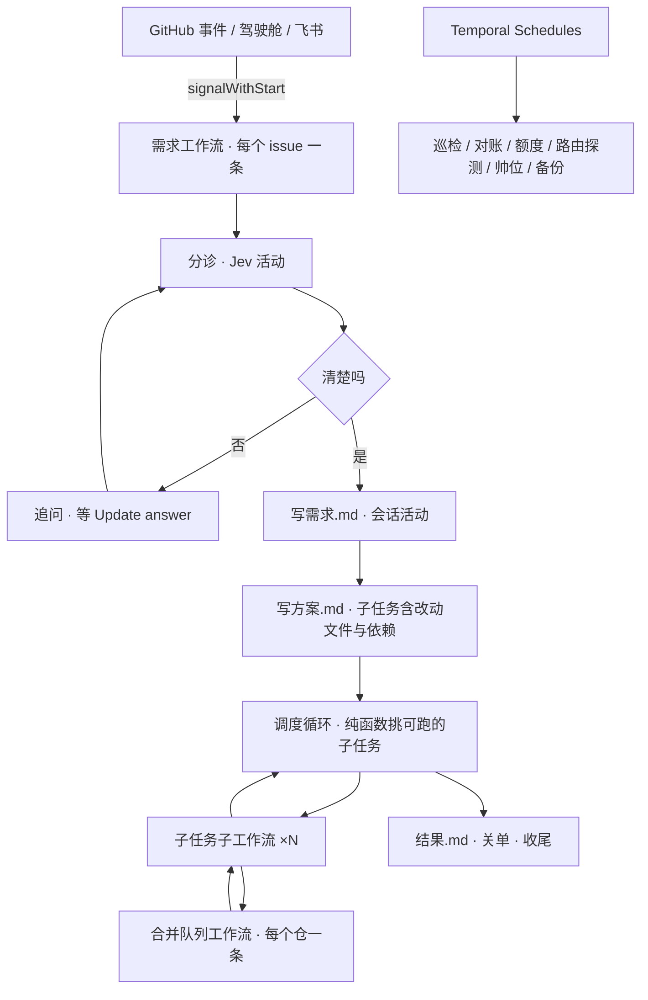

# 引擎手册（Temporal 与编排）

> **实现 `packages/engine`（需求 / 子任务 / 合并队列工作流、活动、定时任务、Temporal 部署）之前读。** 对应设计 §四「Temporal」、§五「一个任务怎么走完全程」、§六「颗粒度与合并」「断链怎么被发现」、§十三「高可用」、§十六「Temporal 工作流」「约 30 个 systemd 定时器」两行、§十七 第 2 条。
> 讲清旧引擎（windsurf-dao `packages/fleet`）长什么样、生产读数、哪些判断值得照搬、版本升级与重放踩过的坑、新引擎的实现建议；坑逐条写成测试用例。
> 来源：旧系统审计切片 s3（2026-09-25）。审计对象：windsurf-dao `packages/fleet`（HEAD `b1ebd88d`）及其周边编排脚本、法国 VPS 上在跑的 Temporal（只读）。ai-gateway-stack 与本切片无交集（`git grep -i temporal` 零命中）。全仓记法见 [README](README.md)。

**出处写法**：`路径:行` 指 windsurf-dao 仓内文件；`windsurf-dao#N` 指旧仓 issue/PR；`windsurf-dao@<提交号>` 指旧仓提交；「VPS 读回」是只读命令的输出摘录；「判例 X」是旧维护者的判例记忆（不公开，只为追溯）。
**占位**：主机名写 `<VPS>`，GitHub 属主写 `<owner>`，服务用户写 `<svc>`，回环地址写 `<回环>`。
**生产数据口径**：VPS 上的任务时间线档案（`~<svc>/.dao/fleet/timeline/2026-09.jsonl`）共 38 行，覆盖 2026-09-20 00:21 → 2026-09-24 05:36（UTC）。旧导出只记「排进队列 → 结束」一个时长（`scripts/lib/fleet-timeline.mjs:194`），所以下文每步耗时都包含排队时间。

---

## 0. 先说结论

1. **旧引擎主要死在基础设施失败和收尾，不在判断不够。** 38 条生产执行只有 10 条完成（26%）。27 条被取消，其中 21 条停在 `cancel-cleanup-unconfirmed`（取消后收树试满 5 次也没核实）。`execute` 活动 236 次尝试只成功 104 次（44%），失败里瞬时/基础设施类错误占 98 次（`SERVICE_UNAVAILABLE` 37——含推送、GitHub、git 失败；`MirasimUnavailableError` 33；`busy` 28）。反过来，#1744 那套「按假设止损」和它的判断题：合并以后生产上一次都没跑过（§2.4）。
   → 新引擎先做硬四件事：换路由的兜底梯、所有任务共用的路由健康表、谁创建谁回收、每个活动都要心跳。
2. **版本演进的两类坑都真出现过。** 一次在生产上咬到：改了 runner 的走向，重启工人后在途任务报 `TMPRL1100`、成了僵尸（windsurf-dao#1633，由 #1337 g1 触发）。另一次在合并前的审查里拦下：给输入补了个默认值，检查点指纹整体变了，部署后所有在途任务下一步都会抛错（windsurf-dao#1813）。
   → #1633 的原则照搬：判断是纯函数，结果记进历史。它的实现删掉：整段 runner 每次从头重入、靠「挂起异常」取活动结果、每次判断把整份引擎状态写进历史（一条历史 1.2–2.5 MB）。
3. **活动超时一刀切，也没有心跳。** 所有活动共用一个 74 分钟的 StartToClose，`maximumAttempts: 1`，不设 heartbeat（`packages/fleet/src/workflows.mjs:61-65`）。工人一重启，丢掉的活动要干等 74 分钟才判死。写一个文件的 `escalate` 也照样超时了 4 次。于是「有在途就不敢重启」，工人曾经连跑 17 小时旧代码（`scripts/server-sync.sh:71-73`，#1337）。
4. **Temporal 跑的是 `temporal server start-dev` + 一个 SQLite 文件。** VPS 日志里有持久化超时（`AppendHistoryTimeoutError`、`Failed to start transaction`）。CI 上的开发服务器也出过内部错误，把集成测试挂死过。设计里换 Postgres 是对的。官方给的生产做法有两种：`temporalio/server` 镜像 + admin-tools 管库表结构；或者服务端二进制 + systemd。Postgres 12+ 的持久化和可见性（含自定义检索字段）都受官方支持。
5. **所谓「约 30 个 systemd 定时器」，实际是 19 个项目定时器。** VPS 上一共 37 个，其余 18 个是系统自带的。19 个里有 10 个该直接删（派单、收工、master 哨兵、盘面班、打标签、5 分钟同步（里面挂着裁决收件箱和时间线导出）、账本清理、拉他仓代码、技能自愈 ×2），因为新设计已经取代了它们（§3.4）。额度读取、路由探测、对账、巡检、备份、AI 帅位改成 Temporal Schedule。root 权限的维护和看门狗留在 Temporal 外面。

**一句话**：旧 `packages/fleet` 有 5,083 行源码。真正要带走的，是约 1,000 行纯判断（判定函数、时间预算算术、止损指纹、计划对账、风险分档、等待表），外加本文 §5 的约 45 条坑（写成测试）。工作流骨架、会话编排、收尾按新形状重写。估计新引擎源码 2,800–3,900 行、测试 2,500–3,300 行（§7.11）。

---

## 1. 旧引擎长什么样

### 1.1 规模与寿命

| 项 | 数 | 出处 |
|---|---|---|
| 源码 | 5,083 行（24 个 `.mjs`） | `cat packages/fleet/src/*.mjs \| wc -l` |
| 测试 | 7,052 行（不含 10 份重放夹具，夹具共约 0.9 MB） | `test/*.mjs` + `test/helpers/*.mjs` |
| 包外编排件 | 约 3,283 行（派单器、裁决收件箱、时间线导出、交接、准入锁） | `scripts/dispatcher.mjs`、`scripts/lib/dispatcher/*`、`scripts/fleet-*.mjs`、`scripts/lib/fleet-*.mjs`、`scripts/lib/escalation-*.mjs` 等 |
| 提交 | 105 次，从 2026-09-18（windsurf-dao@9bee07e89，#1421）到 2026-09-24（windsurf-dao@981607d38，#1818），共 7 天 | `git log -- packages/fleet` |
| SDK | `@temporalio/*` 1.13.2 | `packages/fleet/package.json` |

### 1.2 两代工作流类型

| 类型 | 状态 | 结构 | 出处 |
|---|---|---|---|
| `fusionTaskWorkflow`（v1） | 冻结，只为在途老任务保留 | 判断直接跑在工作流函数里（runner 在工作流沙箱内执行） | `workflows.mjs:117-230` |
| `fleetTaskWorkflowV2`（v2，当前） | 现行 | 工作流只是解释器：问本地活动 `decide` 下一步做什么 → 起活动、睡或等信号 → 把结果喂回去 | `workflows.mjs:36-115`；`interpreter.mjs:16-52`；`decide.mjs:142-253` |

- 任务身份：`dao/<repo小写>/issue/<N>/g<G>`，同一张 issue 重派就把代号 G 加一（`contract.mjs:10-13`）。
- 步序（phased 模式，`runner.mjs`）：
  `[占全机执行槽] → prepare → 轮次循环{ lead → execute → changedFiles/计划对账/风险分档 → verify ∥ (selfReview → review) } → integrate → [deploy] → closeIssue → cleanup`
  卡住或失败时插入 `escalate`、`noteFailure`、`judgeLoop`。
- VPS 读回：Temporal 里现存 28 条执行，全是 v2，v1 为 0（`temporal workflow count --query WorkflowType=…`）。v1 早就排空了，代码却没删——`workflows.mjs:117` 注释写的「排空后……一起删」没有执行。

### 1.3 活动清单与生产读数

「成功/尝试」数自时间线 `steps[].outcome`。耗时单位为分钟，是「排进队列 → 结束」，含排队。

| 活动 | 旧实现要点 | p50 / p90 | 成功/尝试 | 出处 |
|---|---|---|---|---|
| `claimMachineSlot` / `releaseMachineSlot` | 全机执行槽：JSON 账本 + 准入锁；不在 Running 名单里的持有者会被剔除 | — | — | `activities.mjs:950-972`；`machine-slots.mjs:65-133` |
| `prepare` | 子仓约定预检 → `fetch --prune` → 从最新 origin/master 建树 → 设提交身份 → `npm ci` → fusion 登记交接账 → 贴阶段标签 | 0.5 / 0.9 | 38/38 | `activities.mjs:973-1000` |
| `lead` | phased：起新会话出计划 JSON；fusion：持久的主会话，用 handoff 交卷 | 4.6 / 15.3 | 109/129 | `activities.mjs:1001-1022` |
| `execute` | 快进远端分支头 → 起或续执行会话（带换腿链）→ 会话等人时若已有提交就接手 → 交付核验 → 对齐提交前缀（只改未发布的提交）→ push → 按分支复用或新开 draft PR | 13.8 / 38.0 | **104/236** | `activities.mjs:1023-1128` |
| `changedFiles` | `git diff --name-only origin/<目标>...HEAD` | 0 / 0 | 108/108 | `activities.mjs:1262-1268` |
| `verify` | 每 15 秒读一次 PR 检查；PR 冲突时自己并目标分支；分支头被别人推进时认领新头 | 2.9 / 18.1 | 118/119 | `activities.mjs:1129-1191` |
| `selfReview` | lead 自审，不参与判定，只作返工输入 | 6.4 / 13.4 | 91/102 | `activities.mjs:1271-1277` |
| `review` | 独立检出树 + 异厂审查会话；审查方厂商按执行目录解析，不信契约里的声明 | 9.6 / 25.7 | 39/50 | `activities.mjs:1278-1312` |
| `integrate` | 回读 PR（仍 OPEN、头没动、目标分支对、不冲突）→ 写标题和正文 → 转 ready → squash 合并并带 `--match-head-commit` → 回读结果 | 0.2 / 0.2 | 10/10 | `activities.mjs:1313-1346` |
| `deploy` | 可选；没配置就回「未检查」 | — | — | `activities.mjs:1347-1350` |
| `closeIssue` | 经网关关单（幂等键 `<taskId>-close`）→ 回读 CLOSED | 0.1 / 0.1 | 10/10 | `activities.mjs:1351-1359`；`cli.mjs:676-719` |
| `cleanup` | 收审查树 → 停会话 → 收任务树（已完成可强删；取消时先存档）→ 关掉这一代的 PR → 收 fusion 旁树和交接账 | 0.3 / 4.3（最长 31.6） | 133/133 次调用都有返回，但有 21 条任务核实失败 | `activities.mjs:1376-1415` |
| `escalate` | 把裁决载荷写成文件，并补上候补腿 | 0.3 / 1.4（**最长 74.1**） | 207/211（4 次 StartToClose 超时） | `activities.mjs:1213-1238` |
| `noteFailure` / `judgeLoop` | #1744 的影子题（失败归因、同假设、合同质疑） | — | 生产 0 条（§2.4） | `activities.mjs:1193-1260` |
| `decide`（本地活动） | 流程判断 | 每条执行调用次数 p50 32、最多 106 | — | `workflows.mjs:67`；时间线 `decides` 字段 |

`execute` 的 132 次失败按类型：`SERVICE_UNAVAILABLE` 37、`MirasimUnavailableError` 33、`busy` 28、`DEADLINE_EXCEEDED` 14、`Error` 9、`WAITING_USER` 3、StartToClose 超时 2、手工判失败「worker 部署重启：活动随旧进程丢失」2、`UNSUPPORTED_CAPABILITY` 1、`TRANSPORT_CLOSED` 1；另有 2 次到读数时仍未结束（open）（VPS 读回，时间线汇总）。

### 1.4 重试与超时

| 项 | 值 | 出处 |
|---|---|---|
| 普通活动 StartToClose | 2 ×（单步超时 + 360 秒）+ 120 秒。单步超时默认 1800 秒，合计 **4440 秒 = 74 分钟**，所有活动共用这一个值 | `limits.mjs:52-70`；`cli.mjs:208`；`workflows.mjs:61-65` |
| 活动级重试 | `maximumAttempts: 1`，所有重试都放在工作流层 | `workflows.mjs:63` |
| 心跳 | 没有 | `workflows.mjs:61-65`；`scripts/lib/fleet-worker-fresh.mjs:5` |
| `decide` | 本地活动，30 秒 × 3 次 | `workflows.mjs:67` |
| 工作流层等待表 | 容量满 12 × 300 秒；排队 30 × 60 秒；可重试 5 次（4/8/16/32/64 秒）；pending 10 × 60 秒；取消后收树 5 × 5 秒 | `decide.mjs:26-31, 104-127` |
| 会话卡死判据 | 进度指纹 360 秒不变、且没有工具在执行。依据：384 个健康会话 p95 为 140–229 秒、最大 320 秒 | `limits.mjs:21-27` |
| 卡死以后 | 同一会话续一句（只续一次）→ 仍卡就停会话、换腿 | `activities.mjs:774-800` |
| 会话「未知」态 | 先宽限 3 × 120 秒，还是未知就停会话、让出树 | `activities.mjs:806-829`；`limits.mjs:11-13` |
| 上游瞬时中断 | 同会话续跑，最多 2 次 | `activities.mjs:830-849` |
| 换腿链 | 一个活动里最多给两条完整腿的时间；剩余不足 5 分钟就不再起新腿 | `limits.mjs:14-20, 55-65` |
| 结论重读 | 解析不了时隔 4 秒重读，最多 3 次 | `activities.mjs:22-24, 908-921` |
| `verify` 轮询 | 每 15 秒一次；预算 min(单步超时 × 0.6 秒, 20 分钟)，默认 18 分钟 | `activities.mjs:1132, 1189` |
| 执行槽排队 | 每 30 秒申请一次（可配 1–600 秒） | `workflows.mjs:11-24` |

### 1.5 信号与查询

- 查询 `status`：返回 `{taskId, state, phase, round, head, reason, failureClass}`（`workflows.mjs:7, 68`；`README.md:85-95`）。`fleet status` 命令另外拼上服务端对这次执行的说法 `execution`（`cli.mjs:873-896`）。
- 信号 `resume`：**只在 `state=blocked` 时生效，其余时刻静默丢弃**（`workflows.mjs:69`）。
- 信号 `cancel`：掐掉可取消的作用域 → 收树 → 核实 5 次（`workflows.mjs:46-58, 70-72`；`decide.mjs:233-252`）。
- Temporal 自己的取消请求，与 `cancel` 信号同样处理（`workflows.mjs:71-72`）。
- 没有用 Update，所有操作都没有「对方接住了」的回执。

### 1.6 轮次限额

- `reviewRounds`：CLI 默认 3（`cli.mjs:208`）；派单器按策略传 6（`docs/release-policy.json` 的 `budget.per_issue.review_rounds_max`，windsurf-dao#1813 的 B 部分）。
- `reworkRoundsMax` = `reviewRounds` × 3（`limits.mjs:29-43`）。两类返工分开计数：只有「异厂审查真跑完并判返工」计入 `reviewRounds`；CI 修复、自审返工、交付与计划零交集、冲突返工计入 `otherRounds`（`runner.mjs:147-163, 349-350`）。
- 按假设止损：同一假设第 2 次失败即停；环境类失败第 2 次即停（windsurf-dao#1744；`runner.mjs:182-260, 558-612`）。
- 墙钟上限：策略里写了 `worker_wall_hours_max: 4`，**fleet 里没有执行**（在 packages/fleet 里 grep，只命中 `limits.mjs:35` 一处注释）。生产上总时长 p50 为 478 分钟，最长 2363 分钟（约 39 小时）。
- 派单器：同一张单派满 3 次就停派（`scripts/lib/dispatcher/queue.mjs:16, 116-117`）。

### 1.7 容量与并发

- worker 的 `maxConcurrentActivityTaskExecutions` = max(4, 核数 × 2) = 12（`cli.mjs:793-799`；VPS 读回：2026-09-24 22:18 的启动日志写着「并发=12」）。2026-09-24 的隔离决定里有一条「P0 垫片：12 → 6」，VPS 上**没有生效**（`docs/decisions/2026-09-24-agent-isolation-and-error-routing.md:85` 对比 VPS 读回）。
- 全机执行槽 = floor(核数 / 2) = 3（`machine-slots.mjs:22-27`；策略里 `executingMax: null`）。账本是 `~/.dao/fleet/machine-slots.json` + 准入锁。等人前放槽，resume 后重新排队（`workflows.mjs:73-79, 92-108`）。

### 1.8 包外编排件

| 件 | 做什么 | 出处 |
|---|---|---|
| 派单器 | 定时器每 10 分钟跑一次，给打了标签的单起 fleet 工作流。撞车判定要两边都有 PR 文件清单才比得了，候选单没有预计改动清单，所以撞车基本交给 Jev 判 | VPS 读回 `dao-dispatcher.timer` `OnCalendar=*:02/10`；`scripts/lib/dispatcher/queue.mjs:8-11`；`scripts/lib/dispatcher/round.mjs:95-122` |
| 裁决收件箱 | `escalate` 写文件 → `dao-sync` 每 5 分钟跑 `fleet-escalations-apply.mjs --apply`：发 resume/cancel、推飞书、记自动重开账 | `scripts/server-sync.sh:109-113`；`scripts/fleet-escalations-apply.mjs:1-15`；`scripts/lib/escalation-inbox.mjs:16-97` |
| 时间线导出 | Temporal 历史 → 每 5 分钟导成一行 JSONL。原因是保留期默认只有 24 小时 | `scripts/lib/fleet-timeline.mjs:131-200`；`scripts/server-sync.sh:127-131`；`scripts/install-fleet.sh:90-92`（windsurf-dao#1664） |
| 工人换新代码 | `dao-sync` 比对代码指纹；有在途活动就顺延重启 | `scripts/server-sync.sh:71-78`；`scripts/lib/fleet-worker-fresh.mjs:3-6` |
| 收树兜底 | `land.mjs` 与 `worktree-gc` 按任务死活收树 | 判例 worktree-pileup-starves-mirasim；windsurf-dao#1570 |

### 1.9 生产读数（时间线 38 条）

| 维度 | 读数 |
|---|---|
| 类型 | v2 29 条，v1 9 条 |
| 终态 | 完成 10、取消 6、`blocked` 21（原因全是 `cancel-cleanup-unconfirmed`）、空 1 |
| 模式 | fusion 6 条，其中 5 条完成；phased 32 条，其中 5 条完成（样本小、任务不同，不能据此说 fusion 更好） |
| 完成单的总轮数 | 1,1,2,3,1,1,2,1,3,5：返工不超过 2 次的有 9 条，1 条返工了 4 次（含 CI 修复轮） |
| 完成单耗时 | 17–115 分钟（p50 约 50），另有 1 条 2363 分钟的离群值；目标是小任务 15 分钟、大任务 60 分钟（`scripts/lib/fleet-cycle.mjs:7-13`） |
| 全部执行总时长 | p50 478 分钟，p90 1252 分钟（含等人时间） |
| 历史大小 | 事件数 p50 220、最多 725；4 条大任务 409–617 个事件，1.2–2.5 MB（VPS 读回 `temporal workflow describe`） |
| 信号 | 每条执行 0–6 次，多数 1–4 次（人工 resume/cancel） |
| `cancel-cleanup-unconfirmed` 的分布 | 2026-09-20 到 09-24 每天都有，每条都试满 5 次收树，不是某一次集中事故 |

---

## 2. 纯函数判断

### 2.1 解释器 + `decide` 模式（windsurf-dao#1633）

**做法**：runner 本来就能从断点重入（每步结果先存进状态，重进时跳过）。`decide` 给它一张假活动表：结果已经到了就原样返回；没到就登记「要起这个活动」，并抛出一个挂起标记。runner 在第一个拿不到结果的地方带着当时的状态退出，`decide` 把要起的活动当作命令交给工作流（`decide.mjs:8-17, 142-218`）。

**收益（有证据）**：改判断条件不会伤到在途任务。windsurf-dao#1813 改了预算判据，6 张在途单不需要 `patched()`，因为判断在本地活动里，结果记进了历史（windsurf-dao@adb05b205 提交说明 C 部分）。协议文件（`workflows.mjs` + `interpreter.mjs`）很小，很少改。判断可以不起 Temporal 直接单测。

**代价（有证据）**：
- runner 每次都从头跑一遍，所以每一处有副作用的记账都必须对重入幂等，为此长出了一批专用机关：
  - `loopScratch` 去重键（`runner.mjs:177-181, 187-188, 578-586`）
  - `retryEpoch` 重试纪元（`decide.mjs:34, 68-75`）
  - `askedHead` 判旧结果是否陈旧（`decide.mjs:61-66, 157-181`，windsurf-dao#1755 g2）
- 实咬过一次：一轮已经判为 `p1-vs-contract`，重入时被盖成了 `loop:same-hypothesis`（`runner.mjs:306-307`）。
- 同名活动同一时刻只能有一个在途，结果按活动名缓存（`decide.mjs:13-17`）。并行取证、认领新头都要再加规则。
- 每次判断都把整份引擎状态作为本地活动的入参和结果写进历史：大任务的历史有 1.2–2.5 MB（§1.9）。官方限额是单个载荷 256 KB 告警、2 MB 报错；单条历史 10 MB 告警、50 MB 终止（docs.temporal.io/self-hosted-guide/defaults）。
- runner 的每条测试要对 v1、v2 两个引擎各跑一遍（`test/parallel-review.test.mjs:12, 57`；`test/loop-stop.test.mjs:12, 65` 的 `ENGINES`）。

**结论**：照搬「判断是纯函数、结果进历史」。删掉「整段 runner 重入」。新引擎的判断改成**一次一问的小函数**：输入是事件和计数，输出是下一步动作枚举。工作流骨架是固定的四步循环，见 §7.3。

### 2.2 合同判定（`contract.mjs`）

- `judgeChecks`：证据绑定 HEAD；每个必需检查恰好一条；没跑完判 pending；失败判 blocked；其它非 SUCCESS 判「没查成」。PR 冲突单独判成可返工的 `pr-conflicting`，不算「没查成」（`contract.mjs:99-121`）。
- `judgeReview`：审查绑定 HEAD；审查方厂商按执行目录实际解析，不信契约里的声明；P2/P3 必须带 type 与 effort（`contract.mjs:71-97`）。
- `judgeDelivery`：要求 merged、合并的头就是被审的头、有合并提交、目标分支对（`contract.mjs:123-134`）。
- 贯穿始终的**三态纪律**：「没查成」≠「否」≠「是」（`contract.mjs:4` 的 `unknown()`）。

**新系统**：保留三态和「证据绑 HEAD」。「必须换厂商」「P2/P3 必带 type/effort」是给旧审查闸和债册子用的，删掉（设计十六：审查闸改成第二意见）。

### 2.3 失败分类（`contract.mjs:136-175`）

先按 code 判，再按正则判。类别有：cancelled / stall / blocked / capacity / queued / retryable / unscanned。正则一直在补，比如 2026-09-24 加了中文「繁忙」、「连不上平台」（`contract.mjs:149-162`）。全仓一共 5 个这样的分类器，认不出就判「没查成」，任务停下来等人（`docs/decisions/2026-09-24-agent-isolation-and-error-routing.md:6-7`）。

**新系统**：按那份决定来。分类数等于动作数；先认结构化信号，再认已知文本，最后交 Jev；认不出的默认走兜底梯，不再默认等人。旧正则连同它们的真实样本一起收下，做测试夹具。

### 2.4 合同与假设止损（windsurf-dao#1738 系列 → #1744）

**规则**（`loop-guard.mjs`）：
- 假设指纹：CI 红时取「失败的必需检查名」排序拼接；审查时取首条 P1 归一化（小写、剥掉 SHA 和数字、去空白）后 sha1 的前 12 位（`loop-guard.mjs:74-112`）。
- `same_count ≥ 2` 就停。环境类失败另计 `env_count ≥ 2` 就停；环境类包括容量、排队、登录、限流，以及「中继语境里的 422」（`loop-guard.mjs:118-125`）。
- Jev 两道题：「是不是同一假设」、「P1 是不是在质疑任务书」。同题连呼两次，两次答案一致且把握都 ≥ 0.85 才算数（`loop-guard.mjs:10, 127-142`；`loop-judge.mjs:40-124`）。
- 人工 resume 后记一个放行水位：计数保留，超过水位才再停（`loop-guard.mjs:192-206`）。

**动机是真的**：windsurf-dao#1675 g1 三轮的首条 P1 是同一句话（审查方引的是旧正文），三轮全白烧（#1744 正文；判例 decision-in-comment-invisible-to-fleet）。

**生产上零样本**：
- #1818 在 2026-09-24 17:01（北京时间）合并。此后 VPS 上没有再起过任何 fleet 执行：Temporal Running = 0，最近一条执行约在当天中午起、时间线最后一行在 05:36 UTC（13:36 北京时间）结束，都早于合并。
- `~<svc>/.dao/judge-shadow/` 下没有 `round-loop.jsonl`、`failure-kind.jsonl`（VPS 读回 `ls`）。
- `loopJudgeLive` 从来没被工作流打开过：`workflows.mjs:85` 只传了等待参数，`decide.mjs:200` 默认关。即使在跑，Jev 的答案也只进影子账。

**新系统**：
- 照搬确定性指纹止损：便宜，好测。
- Jev 题等有数据再上：先影子，按设计十一「能拦不能放」。
- 新设计本来就是「第二意见最多 2 轮，还不行交帅位」，这个上限已经覆盖了一半止损；指纹止损主要用在 CI 修复轮和环境失败上。

### 2.5 风险分档（`risk.mjs`）

- T0：纯文档（按扩展名认），CI 绿即过，不审。
- T1：孤立代码，CI + 一条异厂审查。
- T2：机制、协议、安全，要 lead 自审 + 异厂审查（`risk.mjs:1-49`）。
- 两条好规矩：文件清单取不到或为空时按 T2，不许当 T0（`risk.mjs:9, 33-42`）；`docs/` 下的 .json 是机器读的配置，不按目录放行（`risk.mjs:11-12`）。
- 机制路径的正则是写死的 windsurf-dao 路径（`risk.mjs:16-25`）。

**新系统**：留思路，用来决定「要不要第二意见」（设计十六）。路径规则放进每个仓的配置；没查成按最高档。

### 2.6 计划对账与发现分诊

- `reconcilePlan`：从计划里抽出点名的路径，与实际改动文件取交集；零交集就当返工输入，不花审查预算（`reconcile.mjs:1-7, 49-63`）。起因是 windsurf-dao#1572 的假完成。
  新设计的方案里本来就写明「每个子任务改哪些地方」（设计七），对账可以做得更直接。
- `splitFindings`：P1、或类型属 security/data/contract、或「小改动且能续跑同一会话」的，当场修；其余记债（`triage.mjs:17-33`）。新系统里可选。

### 2.7 fusion 模式

- **做法**：lead 会话持久，通过 MCP 的 handoff 工具指挥另一家 CLI 的 sidekick。sidekick 在旁边一棵树里实现，lead 树用 `--ff-only` 收进提交（`README.md:58-75`；`docs/tasks/2026-09-18-commander-fusion-v2.md` §2）。
- **代价**：多一棵旁树、一份交接账、要给各家 CLI 装 MCP、清理要处理四种状态（`activities.mjs:633-659`）。实咬过一次：lead 树收了，旁树和交接账没人收（`activities.mjs:1370-1373`，windsurf-dao#1302 g1）。
- **生产**：6 条里 5 条完成（§1.9）。

**新系统**：删掉跨 CLI 的 handoff 机制，设计已定「需要时在会话内部再起子代理」。留下两条真经验：
- 返工时续跑同一会话（T7；windsurf-dao#1493 / #1624）。
- 主会话自己审子代理的 diff。

---

## 3. Temporal 部署现状（VPS 只读读回）

### 3.1 单元与进程

| 项 | 现状 | 出处 |
|---|---|---|
| 服务端 | `temporal server start-dev --ip <回环> --port 7233 --db-filename ~<svc>/.dao/temporal/temporal.db --log-level warn`；systemd 单元 `dao-fleet-temporal.service`，`Restart=always` | `systemctl cat`；`host/machine/systemd/dao-fleet-temporal.service:26-28` |
| 版本 | CLI 1.8.3（Server 1.31.2，UI 2.50.1）；安装脚本钉死版本并校验 sha256 | `temporal --version`；`scripts/install-fleet.sh:14-20, 44-59` |
| 持久化 | SQLite 单文件 35 MB + WAL 4 MB | `ls -la ~<svc>/.dao/temporal` |
| 服务端进程 | RSS 约 160 MB，已连续运行 5 天 17 小时；`NRestarts=15`（那段日志已经滚掉，原因没查成） | `ps`；`systemctl show` |
| worker | `node packages/fleet/src/cli.mjs worker`；`Requires=` 服务端；`Restart=always`；并发 12；RSS 约 183 MB | `host/machine/systemd/dao-fleet-worker.service:34-41`；journal 启动行 |
| 命名空间 | default；保留期 2592000 秒（30 天）；归档关闭 | `temporal operator namespace describe` |
| 访问 | 只绑回环；网页 8233 端口走 SSH 隧道看 | 单元注释；`cli.mjs:38-41` |
| 任务队列 | 只有一个：`dao-fleet` | 单元环境变量 |
| 执行数 | 28 条，全部 `Completed`，`Running` 为 0 | `temporal workflow count` |
| 机器 | 6 核，12 GB 内存，已运行 22 天 | `nproc`；`free -m`；`uptime` |

**Temporal 的 `Completed` 不等于交付。** v2 把 cancelled/blocked 当作普通返回值（`decide.mjs:233-252`），所以 Temporal 这边 28 条全是 `Completed`。时间线里同期大多是 blocked/cancelled——导出时专门把这两个状态分开记（`scripts/lib/fleet-timeline.mjs:186`，windsurf-dao#1560 g3）。

**同一个 workflowId 出现过两次执行**：`…/1735/g1`、`…/1734/g1` 各两条（`temporal workflow list`）。时间线按 runId 去重（`scripts/lib/fleet-timeline.mjs:202-214`）；裁决文件按任务 id 命名，后一次会覆盖前一次。

### 3.2 SQLite 持久化超时（VPS 日志摘录，已去掉地址和编号）

```
2026-09-23T01:17 … component=transfer-queue-processor wf-id=dao/<owner>/windsurf-dao/issue/1735/g1 … error="context deadline exceeded" …
2026-09-23T08:00 … error-type=persistence.AppendHistoryTimeoutError …
2026-09-23T08:00 … error="UpdateWorkflowExecution failed. Failed to start transaction. Error: context deadline exceeded"
2026-09-24T02:16 … error="GetTaskQueue operation failed. Failed to check if task queue … existed. Error: context canceled"
2026-09-24T04:44–05:30 … 1735/g1、1755/g1、1748/g2、1338/g1 同类 context deadline exceeded
```

CI 上那次挂死，报的是同一类 `GetTaskQueue operation failed` 内部错误（`packages/fleet/test/run-integration.mjs:4-8`，2026-09-24 一天两次）。

### 3.3 CLI 用法（旧仓实际用过的）

| 命令 | 用途 | 出处 |
|---|---|---|
| `temporal workflow list --query 'ExecutionStatus="Running"'` / `count` / `describe -o json` | 数在途、判工人忙不忙（看有没有 pendingActivities） | `scripts/lib/fleet-worker-fresh.mjs:11-32`；`NEW-MACHINE.md:714` |
| `temporal workflow show -o json` | 导出历史做时间线；读被删掉的审查意见（要解 base64） | `scripts/lib/fleet-timeline.mjs:5, 128`；判例 fleet-blocked-verdicts-live-in-temporal |
| `temporal workflow query --type status` | 查状态 | `README.md:163` |
| `temporal workflow terminate` | 终止不兼容（TMPRL1100）的僵尸 | windsurf-dao#1633 正文；`scripts/lib/escalation-apply.mjs:39` |
| `temporal operator namespace update --retention 720h` / `describe` | 设保留期并读回 | `scripts/install-fleet.sh:97-115` |
| 手工把丢失的活动判失败 | 时间线里有两条失败原因是「worker 部署重启：活动随旧进程丢失（execute），立即判失败以免干等」 | VPS 时间线；仓内和 VPS 脚本里都没找到对应代码，**来源没查成**（推断为人手敲的 CLI） |
| 自家 CLI：`node src/cli.mjs worker\|start\|status\|signal\|list` | 起 worker、起任务、查状态、发信号 | `packages/fleet/src/cli.mjs:1-16, 777-871` |

### 3.4 定时器现状与去向

VPS 上 `systemctl list-timers --all` 一共 37 个：19 个属于项目，18 个是系统自带（apt、certbot、logrotate、sysstat…）。仓里 `host/machine/systemd/` 有 20 个 `.timer` 文件，其中 5 个已经退役停用。

| 项目定时器 | 频率 | 做什么 | 新系统 |
|---|---|---|---|
| `dao-dispatcher` | 每 10 分钟 | 派单 | **删**：GitHub 事件经 Cloudflare 秒级到达 → `signalWithStart` |
| `dao-land` | 每小时 | 收工推主线、清派生物 | **删**：合并队列 + 分支保护 |
| `dao-master-sentinel` | 每 15 分钟 | master 哨兵 | **删**（设计十六） |
| `dao-board-officer` | 每 6 小时 | 指挥官盘面班 | **删**，改成巡检与对账两个 Schedule |
| `dao-judge-triage` | 每小时 | Jev 给开着的单打标签 | **删**，分诊放进收单流程 |
| `dao-sync` | 每 5 分钟 | 拉代码、换新代码、执行裁决收件箱、导时间线… | **删**：部署流水线 + 工作流内兜底梯 + 步骤记录直接写 Postgres |
| `dao-store-retire` | 每天 | 旧账本退役清理 | **删**（30 本账没了），改成 Postgres 保留作业 |
| `dao-repo-hygiene` | 每天 | issue 闲置退场 | 并进「每小时对账」Schedule |
| `dao-execution-usage` | 每 5 分钟 | 扫会话文件采用量 | **改**：会话结束时由活动直接记用量；额度读取单独做 Schedule |
| `miraquota-contabo` | 每 10 分钟 | 读 Mirasim 额度 | **Schedule**：额度读取 |
| `reclaude-org-switch-<svc>` | 每 15 分钟 | 账号池切换与探测（ai-gateway-stack 脚本） | **Schedule**：账号池探测（接线本身归插头切片） |
| `dao-leg-expiry` | 每 6 小时 | 路由探针 | **Schedule**：路由探测 / 模型扫描（设计十六「新模型考试」） |
| `mirasim-ws-probe` | 每 10 分钟 | 探 Mirasim 起会话面 | 并进路由健康表；熔断器要吃真实流量，不只吃探针（判例 breaker-must-eat-real-traffic） |
| `release-train` | 每天 04:00 | 发布列车 | 待定；「对用户发布」属于人闸，不自动做 |
| `agent-cli-update` | 每小时 | 更新各家 CLI | Schedule + 「没有会话在跑才更新」的守卫；若要 root 权限就留在 systemd |
| `ags-sync` | 每 5 分钟 | `git pull` ai-gateway-stack | **删**：并成一个仓，走一条部署命令 |
| `dao-skills-heal` / `dao-skills-heal-root` | 每 5 分钟 | 技能装载面自愈 | **删**（钩子/技能体系精简）；需要的部分放进 `deploy/` 的幂等安装 |
| `mirasim-managed-update` | 每天 | Mirasim 受控升级（root） | **留在 systemd**：worker 是非特权用户，不该有升级系统二进制的权限 |

另外，**看门狗必须在 Temporal 外面**：Temporal 挂了，Schedule 也就不跑了。设计里已经放在 Cloudflare。

### 3.5 换机做法（旧）

不搬 `temporal.db`：先在旧机等在途清零、导出最后几单，再在新机全新起。实在要续跑在途任务才拷，而且必须先停服务端，两边 CLI 版本一致（`NEW-MACHINE.md:714`）。

---

## 4. 版本升级与重放踩过的坑

### 4.1 两次实例（一次生产咬到，一次审查拦下）

1. **改了走向，在途任务成僵尸**（生产咬到；windsurf-dao#1633，由 #1337 g1 触发）。
   - #1631 改了 runner 一处判据，工人按 #1337 的机制自动重启、吃到了新代码。当时 g1 正停在 blocked 等信号。
   - 重放时报：`[TMPRL1100] Nondeterminism error: Activity type of scheduled event 'escalate' does not match activity type of activity command 'review'`。
   - 从那一刻起：读不了状态、收不了信号，裁决执行每轮只记「没查成 1」，最后只能 `terminate`。
   - 「等没有在途再重启」没挡住它：停在等信号的执行没被数进在途（#1633 正文第 4 问）。
2. **补一个默认值，检查点指纹整体变了**（合并前审查拦下；windsurf-dao#1813，windsurf-dao@adb05b205）。
   - task 的规范化 JSON 就是检查点指纹（`runner.mjs:71-73`）。
   - 修复代理给老输入补了一个 `reworkRoundsMax` 默认值。部署那一刻，所有在途执行的下一次 `decide()` 都会抛 `checkpoint identity or contract mismatch`。
   - 333 条测试全绿，提交说明里还写着「Temporal 兼容」。审查时追问一句「旧状态进新代码会怎样」才发现（判例 wiring-tests-dont-prove-backend-contract，第 2 次）。
   - 修法：默认值改成读的时候现算（`limits.mjs:38-43`），加一条金样测试（`packages/fleet/test/contract.test.mjs:30-39`）。

### 4.2 旧系统的三道护栏和它们的漏洞

| 护栏 | 做法 | 漏洞 |
|---|---|---|
| 重放夹具 | 录下 5 类场景 × 2 个类型的真实历史，每次单测都用现在的代码重放；规矩是「红了只许 `patched()`，不许重录」（`test/replay.test.mjs:1-42`；`test/replay-record.mjs:8-12`） | 夹具是用**假活动**录的（`test/replay-record.mjs:46-66`），不是生产历史；只覆盖录过的路径 |
| `patched()` | 执行槽、并行取证都是这么包的（`workflows.mjs:76, 145-146`） | 靠改代码的人自己记得；v1 冻结后没人删 |
| 金样 | 旧代码对固定输入的产物原文写进断言（`contract.test.mjs:30-39`） | 只钉了 `normalizeTask`；引擎状态本身没有金样（只靠 `\|\| 0` 这类兜底，`runner.mjs:346-350`） |

### 4.3 工人重启与在途活动

- 活动无心跳、只试一次：工人带着在途活动重启，那一单要干等满 StartToClose（74 分钟）才知道自己死了（`scripts/lib/fleet-worker-fresh.mjs:3-6`）。
- 结果是「忙就顺延重启」，工人曾经跑 17 小时前的旧代码（`scripts/server-sync.sh:71-73`）。
- 时间线里也能看到人手把两个 `execute` 判失败，免得干等（§3.3）。
- 数「忙」时，要数有在途活动的工作流，不能数 Running 的工作流。停在等信号的执行没有活动在工人手里，重启不伤它（windsurf-dao@7e6f0de74，#1337；实咬：#1560 blocked 在等 resume，按 Running 数永远「忙」，新代码上不了线）。

### 4.4 服务端升级（官方做法）

- 必须**一个小版本一个小版本地升**：先升到当前小版本的最新补丁，再升下一个小版本。
- 先升库表结构，再升服务端。每升一个版本，给 History 服务约 10 分钟重载分片。
- 跳版本可能导致旧数据格式读不了（docs.temporal.io/self-hosted-guide/upgrade-server）。
- 旧系统钉的是 CLI 1.8.3，一直没升过，所以这个坑还没咬到。新系统一上 Postgres 就要按这个规矩做。

### 4.5 Worker Deployment 版本化

SDK 1.13.2 已经有 `workerDeploymentOptions`、`VersioningBehavior`（PINNED / AUTO_UPGRADE），但类型定义里标着 `@experimental`：「Deployment based versioning is experimental and may change」（VPS 上 `node_modules/@temporalio/common/lib/worker-deployments.d.ts:1-28`）。服务端 1.31.2 对它支持到什么程度，**没查成**。
→ 第一版不依赖它，只用「薄工作流 + 重放测试 + `patched()` + 必要时换新类型名」。

---

## 5. 坑 → 新系统测试用例

写法：**给定……，当……，应当……**。只收真实踩过的（有 issue、提交、判例或生产数据为证）。

### A. 版本与重放

- **A1** 给定一条停在「等人」的在途工作流（历史里下一步是上报），当部署了改过流程走向的新代码并重启工人，应当仍能查状态、收信号、按老步序走完；而且 CI 里的重放测试在合并前就已经红了。出处：windsurf-dao#1633 正文（`escalate` vs `review` 的 TMPRL1100）；`test/replay.test.mjs:1-7`。
- **A2** 给定旧版本代码对固定输入产出的任务身份或检查点原文（金样），当新代码读同一份输入，应当逐字节相同；新增字段只许读时现算，不许写回输入。出处：windsurf-dao#1813（windsurf-dao@adb05b205）；`test/contract.test.mjs:30-39`；`limits.mjs:38-43`。
- **A3** 给定上一版本持久化下来的工作流状态（缺新字段），当新代码的判断函数处理它，应当按「缺字段 = 从没消耗过」取默认值、不抛错。测试输入必须是旧代码真实产出的状态，不能是新代码自己造的。出处：`runner.mjs:346-350`；`decide.mjs:18`；判例 wiring-tests-dont-prove-backend-contract（第 2 次）。
- **A4** 给定一条已经结束（含已终止）的执行，当查询它的状态，应当回「已结束」加服务端状态，不抛错，也不当成「还卡着」；当对它发取消，应当视为「目的已达」。出处：windsurf-dao#1658（windsurf-dao@21c346d9c）；windsurf-dao#1617（windsurf-dao@b14b11af7）；`cli.mjs:873-896`；`test/status-execution.test.mjs:1-2`。
- **A5**（旧仓检查守则，配合 A1 用）给定重放夹具目录，当 CI 跑重放测试，应当先断言「必需场景都在」，把「扫完 0 条」和「一条样本都没扫到」分开；夹具红了不许靠重录变绿。出处：`test/replay.test.mjs:16-17, 26-31`；`test/replay-record.mjs:10-12`。
- **A6**（还没出事，清退类）给定某个旧工作流类型的在途执行数连续为 0，当对账作业跑，应当提示删掉这个类型的代码。出处：`workflows.mjs:117`（冻结注释没兑现）；VPS 读回 v1 执行数为 0。

### B. 活动超时、心跳、工人生命周期

- **B1** 给定一个正在跑写码会话的活动，当工人进程被重启，应当在心跳超时（分钟级）内判定丢失，再重排或按会话编号续跑，而不是等满 74 分钟。出处：`scripts/lib/fleet-worker-fresh.mjs:3-6`（windsurf-dao#1337）；VPS 时间线里 2 次人手判失败。
- **B2** 给定一个毫秒级活动（写上报、记账），它的超时应当是秒级；当工人丢了它，应当在 1 分钟内重试。出处：VPS 时间线 `escalate` StartToClose 超时 4 次，最长 74.1 分钟；`workflows.mjs:61-65` 只有一套超时。
- **B3** 给定有在途活动，当部署新代码，应当优雅停机（做完手上的，或者把会话编号写进心跳再退），并在限定时间内换上新代码；不许因为「忙」无限顺延。出处：`scripts/server-sync.sh:71-73`（工人跑了 17 小时旧代码）。
- **B4** 给定一个步骤先后要试主路由和退路路由，当主路由卡死，退路路由应当拿到完整的一步时间；预算算术只有一处出处，等待里不许再叠一层 sleep。出处：windsurf-dao#1608 g1（`limits.mjs:14-18`）；`limits.mjs:5-8`（复核 P1）；`test/limits.test.mjs:1-3`。新系统里每次尝试是独立活动，这条变成「每次尝试有自己的超时，工作流逐次记账」。
- **B5** 给定活动失败带着类型（容量、繁忙、等人）和明细，当它跨过 Temporal 边界，判定层应当读得到 type 和原因字段。出处：`activities.mjs:35-37`（g4 实咬：普通 Error 过界后类型丢失）；`activities.mjs:31-33`（details 是可变参数，传数组实咬过一次）。
- **B6** 给定 worker 入口文件有语法错误，当跑 CI，应当有一条测试真的加载 worker 入口（冒烟启动）并当场红。出处：`.github/workflows/check.yml:88-90`（2026-09-19：cli.mjs 语法坏了，fleet 测试 67/67 全绿，worker 一起来就炸）。
- **B7** 给定 worker 连接服务端，应当用 worker 包自己的原生连接类型；冒烟测试要真起一个 worker 连上测试服务端。出处：windsurf-dao@32ea2fe65（windsurf-dao#1429，真跑实咬）。
- **B8** 给定工作流新调用了一个活动名，当 worker 的活动表（包括测试用的假表）里没有它，应当在 CI 当场红，而不是到生产卡在「activity not found」的重试上。出处：`test/workflow.integration.mjs:33-39`（windsurf-dao#1422）；`check.yml:110`。

### C. 等待、信号、取消、收尾

- **C1** 给定任务停在「等人」，在等的这段时间应当释放执行名额，人回复后重新排队拿名额；取消后还在收尾的，也不占派工名额。出处：`workflows.mjs:73-75`；windsurf-dao#1822（windsurf-dao@69bbffc4c）。
- **C2** 给定等人时要放名额（放名额本身是一个活动），当恰好换了 worker，应当先挂上等待条件再放名额，不等放名额完成——resume/cancel 不能被卡住。出处：windsurf-dao@cf8031661（windsurf-dao#1748：CI 挂死；注入 3 秒延迟能稳定复现约 9.9 秒的卡死）。
- **C3** 给定任务被取消、工作树里有未提交改动，应当先存档（补丁 + 未跟踪文件 + 清单）再强删，并关掉这一代的 PR；只有存档失败才留下树并报警。出处：`activities.mjs:132-137`（windsurf-dao#1753/#1745：树脏，`worktree remove` 拒收，5 次后卡死）；`activities.mjs:189-196`（取消后 PR 一直挂着，下一代派不出去，一夜手工关了 4 张才解开）；生产上 21/38 条以 `cancel-cleanup-unconfirmed` 收场。
- **C4** 给定任务已完成（已合并），应当收掉它创建的一切（任务树、审查树、子代理树、登记、会话、租约），收不掉不改「完成」结论但要报警；给定要收的对象已经不在了，应当正常返回「已不在」，不许抛错。出处：windsurf-dao#1570（`workflows.mjs:216-219`；162 棵树拖得 Mirasim 主线程 CPU 50%，判例 worktree-pileup-starves-mirasim）；windsurf-dao#1350（判例 gone-object-must-return-not-throw：一轮 234 条 ENOENT）；`activities.mjs:1370-1373`（#1302 g1）。
- **C5** 给定 issue 已经关了而工作流还停在等人，当对账作业跑，应当自动取消并收走。出处：windsurf-dao#1616（windsurf-dao@700edd030）。
- **C6** 给定一条「继续」指令在任务不处于等待态时到达，应当返回明确的拒绝或回执，不许静默丢弃。出处：`workflows.mjs:69`；判例 worker-resume-vs-reengage（「送达」不等于「被处理」）。→ 用 Update 实现。
- **C7** 给定会话停在「等人回答」，应当单列一态，不重试，并把它问的那句话带进原因；给定它其实已经交了提交，应当按交卷接手，并核实会话已释放。出处：`activities.mjs:259-275`（windsurf-dao#1560 g1：连起 11 个会话全停在等人）；`activities.mjs:813-815`（#1442 的死循环）；`activities.mjs:1046-1059`。
- **C8** 给定会话状态读回「未知」，应当先宽限再判，不许当成失败去收掉一个其实还在干活的会话。出处：`activities.mjs:806-807`（g6 实咬：4 个会话都在干到一半被自己的收尾取消）。

### D. 会话执行与交付核验

- **D1** 给定执行会话零产出、但工作树被快进到了新的主线，应当判「没交付」。判据是：相对**此刻**的目标分支有领先提交，并且相对合并基有内容差异；不是「HEAD 变了」。出处：`activities.mjs:1064-1070`（windsurf-dao#1560 → PR #1571 的假完成）；判例 completed-is-not-delivered。
- **D2** 给定交付改的文件与方案点名的文件零交集，应当退回返工，不进审查。出处：`reconcile.mjs:1-7`（windsurf-dao#1572）。
- **D3** 给定系统要改写一个提交（比如统一标题前缀），当这个提交已经在远端分支上、或者判不出来，应当不改写。出处：`activities.mjs:1078-1083`（windsurf-dao#1765）；判例 system-amend-rewrites-published-commit。
- **D4** 给定会话刚报完成、结论文本还没落定导致解析失败，应当隔几秒重读几次再下结论。出处：`activities.mjs:908-921`（windsurf-dao#1295 g1：完整的审查结论被判「解析不了」，整单卡住等人）。
- **D5** 给定活动层把发现对象交给判定层，应当有一条接缝测试：拿活动的真实产物原样喂判定函数；字段被裁掉就要红。出处：`test/seams.test.mjs:1-12`；`activities.mjs:230-233`（windsurf-dao#1560 g3：type/effort 被裁掉，整份审查被判无效，任务卡死）。
- **D6** 给定返工要续跑同一会话，当后端续跑回的是同一个 key 或者新 key，都应当认「续上了」——判据是后端的回执，不是 key 相不相同；另要有一条真后端探针测试。出处：`activities.mjs:734-737`（windsurf-dao#1493/#1624：四条腿一条都没真用上）；判例 wiring-tests-dont-prove-backend-contract。
- **D7** 给定会话在跑、没有工具在执行、进度指纹 6 分钟没变，应当先同会话续一句，再卡就停掉换路由；跑测试这类长工具期间不计。出处：`limits.mjs:21-27`（windsurf-dao#1499；阈值出自 384 个健康会话的实测）；`activities.mjs:774-800`（windsurf-dao#1608 g1：卡死后干等了 30 分钟）。
- **D8** 给定上游返回容量满或繁忙（包括中文「平台服务当前繁忙」），应当归入容量类（长退避或换路由），不是「没查成、等人」。出处：`contract.mjs:149-153`（2026-09-19、2026-09-24 两次实咬）。
- **D9** 给定一条路由对某个任务报繁忙，其它任务应当一起避开它，过一会儿再试探恢复，不要各自重试。出处：`docs/decisions/2026-09-24-agent-isolation-and-error-routing.md:25`；生产上 `execute` 失败 132/236，其中 Mirasim 不可用 33 次、繁忙 28 次。

### E. 验证与合并队列

- **E1** 给定 PR 与主线冲突（GitHub 标 CONFLICTING，此时 GitHub 根本不起 CI），应当判「要同步主线」：引擎自己合并主线，干净就推送并按新头重跑 CI，有冲突就把文件清单交回原会话——不许报成「CI 缺失」然后等人。出处：`contract.mjs:101-110`；`activities.mjs:493-570`（windsurf-dao#1755）；判例 conflicting-pr-gets-no-ci-runs（撞 3 次）。
- **E2** 给定 GitHub 已判 CONFLICTING，合并步骤不应调用合并命令；合并失败后要不要判冲突，靠重读 mergeable，不靠错误文本。出处：`activities.mjs:1318-1333`（windsurf-dao#1595）。
- **E3** 给定 CI 需要吃到主线上的新修复，应当推新提交或重开 PR 来触发新运行，不用「重跑」——重跑复用的是当初那个合并提交。出处：判例 rerun-reuses-stale-merge-commit（windsurf-dao#1774/#1783）。
- **E4** 给定分支头在工人提交之上被别人推进了（工人提交仍是祖先），应当认领新头：旧头上的审查作废，按新头重跑验证；没定论的检查证据丢掉重取，已定论的不许被「再扫一次」稀释。出处：`runner.mjs:405-419`；`activities.mjs:1134-1139`（2026-09-22 一夜三张）；`decide.mjs:157-181`（windsurf-dao#1755 g2）。
- **E5** 给定合并主线后有要重新生成的文件，应当重生成并自检；只提交生成过程改到的路径，合并前就在树里的未跟踪草稿不许带进提交。出处：`activities.mjs:544-563`（windsurf-dao#1755 g1 遗留的 P1）。
- **E6** 给定改动里包含 `.github/workflows/*`、而机器人没有 workflows 权限，推送失败应当判「要人」（不可重试），不许按可重试白烧退避。出处：`activities.mjs:315-328`（windsurf-dao#1725、#1833）；判例 github-app-cannot-push-workflows。
- **E7** 给定 CI 被重跑，出现两条同名检查，应当取最新那条，不判「缺失或有歧义」。出处：`activities.mjs:339-353`（注释写明「把人点的重跑判成缺失」）。
- **E8** 给定要合并，应当带「只合审过的那个头」的约束，合并后回读 merged、合并提交、目标分支。出处：`activities.mjs:1325, 1335-1345`；`contract.mjs:123-134`；`README.md:160`。

### F. 计数、预算与止损

- **F1** 给定已经有几轮 CI 修复或自审返工，当第二意见给出阻塞意见，第二意见应当仍有预算——不同类的返工分开计数。出处：windsurf-dao#1813 / windsurf-dao@adb05b205（#1338、#1734、#1745、#1753、#1755 五张单卡在 `review-budget-exhausted`，而异厂审查每张只真跑过一次）。
- **F2** 给定容量满、自动长退避还有额度，止损不应抢先把任务转成等人。出处：`decide.mjs:89-93`（windsurf-dao#1818：集成测试挂死实咬）。
- **F3** 给定某一轮收场时已经记下一个止损原因，当同一轮被重入或重放，不应改写成另一个原因。出处：`runner.mjs:306-307`。
- **F4** 给定两轮的首条阻塞意见归一化后相同，第 2 次就应当停下交帅位，不开第 3 轮；CI 红按失败检查名的集合判「同一假设」。出处：`loop-guard.mjs:74-112`；windsurf-dao#1744；#1675 g1 三轮白烧。
- **F5** 给定一个子任务累计墙钟超过预算，应当停下交帅位。出处：`docs/release-policy.json` 写了 `per_issue.worker_wall_hours_max: 4`，而 packages/fleet 里没有执行；生产总时长 p50 478 分钟、最长 2363 分钟。
- **F6** 给定拍板写在 issue 评论里，任务输入应当读到最新口径（或者规定拍板要先改正文、需求文档），否则会话会按旧正文返工。出处：判例 decision-in-comment-invisible-to-fleet（windsurf-dao#1675 g1）；`activities.mjs:937-944` 只读标题和正文。

### G. 部署与装机

- **G1** 给定 systemd 单元里有 JSON 值的环境变量，应当用单引号包住整行；装机演练要读回进程拿到的环境。出处：`host/machine/systemd/dao-fleet-worker.service:18-19`（装真单元当场实咬）。
- **G2** 给定机器上残留同名的临时单元、或者旧单元占着 7233 端口，安装应当先撤掉它们再装，装完读回 `is-active`。出处：`scripts/install-fleet.sh:33-42, 76-88`。
- **G3** 给定以服务用户身份跑 temporal CLI，应当同时换成它的家目录，否则会去读调用者的配置、报 permission denied。出处：`scripts/install-fleet.sh:93-96`；windsurf-dao@bf7f19188（迁移演练实咬）。
- **G4** 给定在空机器上装机，服务端刚起来时设命名空间会失败，应当带重试，而且在 `set -e` + `pipefail` 下失败时要说出原因、不能静默退出。出处：`scripts/install-fleet.sh:99-115`（2026-09-21 迁移演练）。
- **G5** 给定常驻服务「干净退出」（退出码 0），应当照样被拉起（`Restart=always`）。出处：判例 clean-exit-is-still-down。
- **G6** 给定集成测试用的是开发服务器，每条用例都要有超时，挂住时要说出是哪一条。出处：`test/run-integration.mjs:4-8`（2026-09-24 一天两次）。
- **G7** 给定 Temporal 默认只保留 24 小时，保留期应当显式设置并读回；长期记录不靠 Temporal。出处：`scripts/install-fleet.sh:90-92`（windsurf-dao#1664）。
- **G8** 给定引擎包之外的测试 import 引擎入口，应当不把 Temporal SDK 拖进没装它的测试环境。出处：windsurf-dao@6d4bb646d、windsurf-dao@e065aa263（ERR_MODULE_NOT_FOUND）。
- **G9** 给定 VPS 从前一晚的备份恢复了 Temporal 库，被重放的有副作用活动（开 PR、写评论、关单、合并）应当幂等：按分支复用 PR，写 GitHub 带幂等键，合并带头约束。出处：`activities.mjs:1087-1092`（按分支复用开着的 PR）；`cli.mjs:708-709`（关单幂等键）；判例 retry-must-reuse-idempotency-key（windsurf-dao#1174 上刷出两条 62 KB 的重复评论）。

### H. 状态读取

- **H1** 给定 Temporal 执行状态是 Completed，驾驶舱应当读任务自己的终态（完成 / 卡住 / 取消），两者分开显示。出处：`scripts/lib/fleet-timeline.mjs:186`（windsurf-dao#1560 g3）；VPS 上 28 条全是 Completed，而同期多为 blocked/cancelled。
- **H2** 给定审查的阻塞意见，应当写进任务记录（Postgres）直接可读，不许只存在 Temporal 历史里、要解 base64 才看得到。出处：windsurf-dao#1420、#1714（windsurf-dao@522d40154）；判例 fleet-blocked-verdicts-live-in-temporal。
- **H3**（还没出事，是读数显示的风险）给定一次执行的历史越长越大，应当在接近告警线之前 continue-as-new，大块数据（审查意见原文、diff、日志）放 Postgres，工作流里只放编号和计数。出处：VPS 读回单条历史 1.2–2.5 MB（每次判断都带整份状态）；Temporal 官方限额。

---

## 6. 照搬 / 改造 / 删除

| 旧东西 | 去留 | 理由与出处 |
|---|---|---|
| 判断是纯函数、结果进历史 | **照搬原则** | windsurf-dao#1633；#1813 C 部分证明改判断不伤在途 |
| 整段 runner 重入 + 挂起异常 + `loopScratch` / `retryEpoch` / `askedHead` | **删** | §2.1 代价；换成一次一问的小动作函数 |
| v1 类型、双引擎影子比对测试 | **删** | §1.2；`test/parallel-review.test.mjs:12` |
| 三态纪律（没查成 ≠ 否 ≠ 是） | **照搬** | `contract.mjs` 全文件 |
| 证据绑 HEAD；合并带头约束；合并、关单都回读 | **照搬** | `contract.mjs:99-134`；`activities.mjs:1313-1359`；`README.md:146-172` |
| 交付核验「相对此刻目标分支」 | **照搬** | `activities.mjs:282-297`（#1560） |
| 计划与交付零交集对账 | **照搬并加强** | `reconcile.mjs`；新方案本来就写明改哪里 |
| 确定性退避（工作流里没有随机数、没有时钟） | **照搬** | `workflows.mjs:183-184`；`decide.mjs:19` |
| 取消先掐在途、收尾不可取消；等人前放名额、先挂条件 | **照搬** | `workflows.mjs:52-58, 92-108`；windsurf-dao@cf8031661 |
| 卡死按「有没有推进」判，不按总时长 | **照搬** | `limits.mjs:21-27` |
| 返工续跑同一会话 | **照搬** | T7；`activities.mjs:731-744` |
| 冲突自己并主线 | **照搬**（挪进合并队列和「主线一变就同步」） | windsurf-dao#1755 |
| 重放夹具进 CI + 跨版本金样 | **照搬并加强**（夹具改用脱敏的生产历史） | §4.2 |
| 版本钉死 + sha256；装完读回；保留期显式设置 | **照搬** | `scripts/install-fleet.sh` |
| 每轮记录（谁干的、结局、阻塞项） | **照搬**，写进 Postgres 和结果.md | `round-record.mjs` |
| 上报载荷带判据（最后一轮阻塞项、两条预算分开报） | **照搬**，由帅位读 | `escalation.mjs:31-69` |
| 风险分档 | **留思路**，路径改成每仓配置 | `risk.mjs` |
| 确定性假设指纹止损 | **照搬** | `loop-guard.mjs:74-125` |
| Jev 止损题、失败归因题、合同质疑题 | **先不搬** | 生产零样本（§2.4） |
| 所有活动一个 74 分钟超时、无心跳 | **改**：按活动类型定超时，长活动必须心跳 | §1.4、§4.3 |
| 换腿链藏在一个活动里 | **改**：每次尝试一个活动，工作流逐次记路由 | `activities.mjs:684-722`；驾驶舱要按每次尝试显示路由和耗时 |
| 执行槽：JSON 账本 + flock | **改**：Postgres 租约或任务队列并发 | `machine-slots.mjs`；多机时文件锁不成立 |
| 裁决收件箱（文件 + 5 分钟轮询执行 + 自动重开账） | **删**，改成工作流内兜底梯 + 帅位 Schedule + Update | `scripts/fleet-escalations-apply.mjs` |
| 时间线导出（历史 → JSONL） | **删**，活动拦截器实时写 Postgres | `scripts/lib/fleet-timeline.mjs` |
| 只有 `resume` / `cancel` 两个信号 | **改**：带校验和回执的 Update 为主 | §1.5 |
| 审查必须换厂商、最多 6 轮 | **改**：第二意见，最多 2 轮，分类计数 | 设计十六；F1 |
| lead 另起会话出计划、另起会话自审 | **删**：计划在需求级做；主会话自审 | 设计五；§1.3 耗时 |
| fusion 跨 CLI handoff（MCP 工具、旁树、交接账） | **删** | §2.7 |
| 阶段标签、提交前缀对齐 | **删**（前缀对齐正是 #1560 假完成、#1765 分叉的帮凶） | `activities.mjs:299-313, 923-935` |
| 子仓约定预检、合并后重渲本仓专用脚本 | **删**，改成「每仓配置的生成命令」通用钩子 | `activities.mjs:412-458, 355-381` |
| 派前补探 | **删**，由路由健康表取代 | `dispatch-fresh.mjs` |
| `start-dev` + SQLite | **改**：服务端 + Postgres | §3.2 |

---

## 7. 新系统实现建议

### 7.1 总形状



| 工作流 | ID | 生命周期 | 说明 |
|---|---|---|---|
| 需求工作流 | `req:<owner>/<repo>#<issue>` | 天级；历史长了就 continue-as-new | 收单、分诊、追问、需求与方案文档、调度子任务、人闸、收尾 |
| 子任务工作流（子工作流） | `sub:<owner>/<repo>#<issue>/<k>` | 小时级 | 四步：准备 → 执行 → 验证 → 合并 |
| 合并队列工作流 | `mq:<owner>/<repo>` | 常驻，每处理 N 个就 continue-as-new | 同一个仓一次只合一个 |
| 定时工作流 | 由 Schedule 起 | 分钟级 | 每次成功都写「上次成功时间」进 Postgres，供看门狗查新鲜度 |

- 子工作流：`ParentClosePolicy = REQUEST_CANCEL`，叫停需求就连带叫停子任务（SDK 1.13.2 有 `startChild` / `executeChild` / `ParentClosePolicy`，VPS 上 d.ts 为证）。
- ID 复用策略要显式定。旧系统同一 ID 出现过两次执行（§3.1）。建议：同一个子任务重来用新序号，不复用已关闭的 ID。

### 7.2 需求工作流

1. **收单**：Webhook → 驾驶舱后端 → `signalWithStart`。只认白名单作者（设计十四）。
2. **分诊**：Jev 活动，判「清不清楚、多大、哪类、风险」。没判出来就按默认走，不当成「否」（设计十一）。
3. **追问**：在 issue 里问，等 Update `answer`。等的时候不占名额（C1）。
4. **需求文档 / 方案**：会话活动产出 `specs/<n>/需求.md`、`方案.md`。方案必须给出子任务数组 `{id, files[], dependsOn[], risk}`，并用纯函数校验（没写 files 按「全仓」处理，相当于跟谁都冲突，串行跑）。
5. **调度循环**：纯函数 `pickRunnable(plan, running, done)`，见 §7.4。
6. **收尾**：写 `结果.md`（每轮记录从 Postgres 汇总）→ 关单（幂等键）→ 回读 CLOSED。
7. **人闸**：发布、花钱、删数据三类，在子任务进合并队列前等 Update `approve`；飞书与驾驶舱同时提醒。

### 7.3 子任务子工作流：四步

| 步 | 活动 | 超时 / 心跳 / 重试 | 产出与判定 | 失败 → 动作（纯函数动作表） |
|---|---|---|---|---|
| **准备** | `acquireCapacity`（查内存与压力、账号池空位、额度，拿一个带 TTL 的租约）→ `prepareWorktree`（fetch、从最新主线建树、装依赖、设身份） | acquire 在工作流里循环，每 30 秒试一次，排队原因写进步骤记录；prepareWorktree 限时 10 分钟、活动级重试 3 次（幂等） | 树路径、基线 HEAD | 拿不到租约 → 排队（不计失败）；建树失败 → 有界重试 → 交帅位 |
| **执行** | `runSession`（按路由起会话，或按会话编号续跑）→ `checkDelivery` → `pushAndOpenPr` | runSession：心跳每 15–30 秒（带进度：当前步骤、改了几个文件、token 数、最后一个事件的时间），心跳超时 2–3 分钟，限时 = 子任务预算（起步 60–90 分钟），**活动级不重试**；另外两个限时 2–5 分钟、重试 3 次 | 新 HEAD、PR 号；交付核验（D1）、方案对账（D2） | 繁忙或容量满 → 换路由（写进共享健康表）；卡死 → 续一句 → 换路由；等人回答 → 转成需求级追问；零产出 → 返工一次 → 交帅位 |
| **验证** | `syncMainline`（并最新主线：干净就推送，冲突把清单交回执行）→ `waitCi`（心跳轮询，证据绑 HEAD，同名检查取最新，冲突单列）∥ `secondOpinion`（新会话，按风险档决定要不要） | waitCi 限时 30 分钟、心跳；secondOpinion 同 runSession | 通过 / 返工 / 交帅位 | 第二意见返工最多 2 轮；CI 修复另计上限；同一假设第 2 次就停（F1、F4） |
| **合并** | 人闸（如需要）→ `enqueueMerge`（活动：用客户端对合并队列做 update-with-start，只拿「已入队」回执；工作流里只能对外发 signal/cancel，发不了 update-with-start）→ 等队列用 signal 回送结果 → `cleanup` | cleanup 限时 5 分钟、重试 3 次；对象已不在就正常返回 | 合并提交；结果回读 | 队列退回（主线变了导致红）→ 回到执行；收不掉 → 报警，不改结论 |

**活动超时起步值**（全部可配，驾驶舱可见）：会话类 = 子任务预算 + 心跳 2–3 分钟；CI 等待 30 分钟 + 心跳；Git/GitHub 读写 2–5 分钟、活动级重试 3 次（带 `nonRetryableErrorTypes`：`PERMISSION_DENIED`、`MERGE_CONFLICT`…）；记账类 30 秒。**不再有「一刀切 74 分钟」**（B1、B2）。

**判断的位置**：每步结束时，工作流用本地活动调一次 `decide({step, outcome, counters, routeHealth})`，返回 `{action: 'next' | 'retry' | 'swapRoute' | 'swapModel' | 'rework' | 'askHuman' | 'escalate', wait?, reason}`。只有这一次调用的输入和输出进历史，体积很小（H3）。

### 7.4 子任务用子工作流 + 不撞车调度

- 纯函数 `pickRunnable`：依赖都完成、且改动文件集合与在跑的子任务不相交的，才可以起；相交的排队，或交给同一个会话连着做（设计六「做法」第 3 条）。
- 旧系统的撞车判定几乎从来没真比过——候选单没有文件清单（`scripts/lib/dispatcher/queue.mjs:8-11`）。新系统的方案写明文件，这里第一次有了可靠输入。
- 并发上限在两层生效：需求内（同一个需求同时最多几个子任务）和全局（§7.9 的租约）。
- **主线一变，在途分支自动同步**：主线的 push 事件 → 驾驶舱后端按检索字段 `Repo` 列出在跑的子任务 → 给每个发 Update `mainMoved`。子任务在安全点（不在会话中途）跑 `syncMainline`。旧系统的证据：分支落后导致的冲突撞了 3 次（判例 conflicting-pr-gets-no-ci-runs）；#1763 让执行前先快进远端头。

### 7.5 合并队列

- 单例 `mq:<repo>`，由子任务的活动经客户端 `startUpdateWithStart` / `executeUpdateWithStart` 入队（SDK 1.13.2 客户端有这两个接口，要求显式给 `workflowIdConflictPolicy`；工作流内部只有 `getExternalWorkflowHandle` 能发 signal/cancel——均为 VPS 上 d.ts 为证）。合并结果由队列用 signal 回送给子任务。每条执行最多 10 个在途 Update、累计 2000 个（官方限额），所以 Update 只做入队回执，不挂着等合并完成；累计接近上限前 continue-as-new。
- 每个条目的状态机（纯函数，好测）：`queued → syncing(并最新主线) → ci(按新头) → merging → merged | returned(reason)`。
- 把 E1–E8 全部落在这里：
  - 冲突不合并，把清单交回（E1、E2）；
  - 用新提交触发新 CI，不用重跑（E3）；
  - `--match-head-commit`，合并后回读（E8）；
  - 生成文件按仓配置重生成，只提交生成改到的路径（E5）；
  - 推送被拒且原因是 workflows 权限 → 判要人（E6）。
- 一次只合一个；合之前必须在最新主线上跑绿（设计六「做法」第 5 条）。
- 退回时带上机器能读的原因和清单，交给原子任务的执行步（原会话续跑）。

### 7.6 定时任务取代 systemd

- 用 Temporal Schedule（SDK 1.13.2：`overlap` 默认 SKIP，另有 `catchupWindow`、`pauseOnFailure`、`jitter`、`timezone`）。注意：SDK 注释对 `catchupWindow` 的默认值自相矛盾（正文说 1 分钟，`@default` 写 1 年）→ **一律显式设置**。出处：VPS 上 `client/lib/schedule-types.d.ts:24-52`。
- Schedule 的声明写在代码里，worker 启动时幂等 upsert；对账作业核对「代码里声明的 = 服务端上有的」。
- 每个定时工作流成功时写 `job_runs(last_success_at, scanned_count, found_count)`，把「查了 0 个问题」和「这次没查」分开（设计六「断链怎么被发现」第 5 条）。
- 起步清单：巡检（6 小时一次，真跑一条从开单到合并、关单、记账、驾驶舱显示的完整任务）、对账（每小时）、额度读取、路由探测与新模型考试、AI 帅位、备份（每晚 pg_dump → R2）、续期互动限制（按月）。
- 留在 Temporal 外面的：看门狗（Cloudflare）、root 权限的维护（Mirasim 受控升级之类）、系统自带的定时器。

### 7.7 信号、更新、查询

| 名 | 类型 | 谁发 | 语义 |
|---|---|---|---|
| `approve(gate)` / `reject(gate)` | Update | 驾驶舱、飞书 | 人闸；带校验（这个任务确实在等这道闸），回执给按钮 |
| `answer(questionId, text)` | Update | 驾驶舱、飞书、issue 评论 | 回答追问 |
| `pause()` / `resume()` / `stop()` | Update | 驾驶舱 | 在干净的点停下；不在可停的状态就明确拒绝（C6） |
| `changeRoute(stepType, routeId)` | Update | 驾驶舱、AI 帅位 | 校验禁令（GPT 不碰 UI、不用 Fable）；下一次尝试生效 |
| `amend(text)` | Update | 驾驶舱 | 临时追加的要求排进下一轮 |
| `mainMoved(sha)` | Update | 后端（push 事件） | 在途分支同步主线 |
| `progress(event)` | Signal | `fleet` 命令经后端转发 | 只作唤醒；数据本身先写 Postgres |
| `status` | Query | 只给人调试用 | 驾驶舱**不读** Temporal 查询：查询要重放历史，结束的执行也可能抛错（A4） |

### 7.8 版本演进规矩（每条配一个会报警的检查）

1. **工作流代码只管编排**：判断全部是纯函数，经本地活动调用，结果进历史。检查：工作流文件里禁止 import 判断模块以外的业务模块（lint 规则）。
2. **重放测试进 CI**：夹具来自生产历史（每周自动导出每个类型最近几条，脱敏后以 PR 的形式入库）+ 人造场景；红了只许 `patched()` 或换类型，不许重录。检查：重放测试断言必需场景齐全（A5）。
3. **输入和状态显式带 `schemaVersion`**：任务身份用显式 ID，不拿规范化后的 JSON 做指纹；新字段可选，读时给默认值；每个发布版本留一份状态金样。检查：跨版本金样测试（A2、A3）。
4. **旧类型要清退**：对账作业统计每个类型的在途数，连续 7 天为 0 就提醒删（A6）。
5. **部署**：CI 绿 → 服务器拉代码 → worker 优雅停机（`shutdownGraceTime` ≥ 30 秒，会话活动把会话编号写进心跳）→ 新 worker 起来，续跑的会话按编号续上。检查：部署后读回 worker 的构建号 = 仓库 HEAD，驾驶舱显示两者是否一致（B3）。
6. **服务端升级**：一个小版本一个小版本地升，先升库表结构，每步留约 10 分钟（官方）；版本钉死 + sha256；先在演练机或 CI 上走一遍。

### 7.9 部署

| 件 | 建议 | 依据 |
|---|---|---|
| Postgres | 一个实例，库分开：`temporal`、`temporal_visibility`、`fleet`；角色分开 | 设计三/13；官方支持 PG12+ 同时做持久化和可见性（docs.temporal.io/self-hosted-guide/visibility） |
| 服务端 | 二选一：官方服务端二进制 + systemd（与「一条命令重建」最贴），或 `temporalio/server` 镜像 + admin-tools 管库表结构；只绑回环 | docs.temporal.io/self-hosted-guide/deployment |
| 库表结构 | `temporal-sql-tool` 初始化和升级；装机脚本里读回库表版本 | 同上；§4.4 |
| 命名空间 | `fleet`，保留期 30 天，显式设置并读回；长期记录在 Postgres | G7 |
| 网页 | UI 服务只绑回环；需要时经驾驶舱后端受 Access 保护的入口访问（VPS 不开端口） | 设计三/6；`cli.mjs:38-41` 旧做法是 SSH 隧道 |
| worker | systemd `Restart=always`；`TimeoutStopSec` 大于优雅停机时间；子进程（CLI 会话）进 cgroup scope（隔离决定） | G5；`docs/decisions/2026-09-24-agent-isolation-and-error-routing.md` |
| 名额 | 起步 6 个会话。不再用 JSON 账本 + flock：多机时文件锁不成立。用 Postgres 租约（带 TTL、续约、剔除死持有者） | 设计四；`machine-slots.mjs`；C1、C2 |
| 备份与恢复 | 每晚 pg_dump → R2。**恢复后 Temporal 状态回到昨晚**，重放出的副作用必须幂等（G9）；恢复演练并进巡检 | 设计三/14 |
| 看门狗 | 外部每 5 分钟：前端健康、worker 心跳新鲜度、各定时作业上次成功时间 | 设计十三 |

### 7.10 驾驶舱每一步耗时要记的字段

旧导出只有 `{name, at(排进队列), ms(排进队列→结束), outcome, attempt, error}`（`scripts/lib/fleet-timeline.mjs:194`），排队和执行混在一起。每一步换过哪条路由也看不出——换腿藏在一个活动里面，每轮记录只有 `executorSwappedFrom`（`round-record.mjs:28-36`）。

**建议**：活动入站拦截器（SDK 1.13.2 有 `ActivityInboundCallsInterceptor`）+ 工作流在每次等待前后记一笔，写进 Postgres 的 `step_runs`（每次尝试一行）与 `step_events`（进度流），用 LISTEN/NOTIFY 推给驾驶舱。回放功能读 `step_events`，不读 Temporal 历史（保留期、查询重放、要解 base64，见 G7、A4、H2）。

| 字段 | 含义 | 来源 |
|---|---|---|
| `requirement_id` / `subtask_id` / `workflow_id` / `run_id` | 归属 | 工作流信息、活动 Info |
| `step` / `substep` | 准备 / 执行 / 验证 / 合并；子步如 acquire、worktree、session、ci、second-opinion、queue、merge | 代码常量 |
| `try_no` / `activity_attempt` | 工作流层第几次尝试（换路由算新的一次）/ 活动级第几次 | `decide` 计数；`Info.attempt` |
| `route_id` + `route_reason` | 渠道、账号池、模型、执行方式；一句「为什么派给它」 | 调度器（设计九） |
| `wait_kind` + `wait_started_at` / `wait_ended_at` | 等名额、等额度、等依赖、等人、等合并队列 | 工作流等待前后各记一笔 |
| `scheduled_at` | 活动排进任务队列 | `Info.currentAttemptScheduledTimestampMs` |
| `started_at` | worker 开始执行 | 拦截器 |
| `first_progress_at` / `last_progress_at` | 第一条、最后一条进度（心跳或会话事件） | 心跳 / `fleet say` |
| `ended_at` | 结束 | 拦截器 |
| 派生：`wait_ms` / `queue_ms` / `run_ms` | 等待 = 等待起止差；排队 = 开始执行 − 排进队列；执行 = 结束 − 开始执行 | 计算列 |
| `outcome` | 成功 / 返工 / 失败 / 超时 / 取消 / 丢失（心跳超时） | 拦截器 |
| `action_class` + `error_code` + `error_text` | 下一步动作类；结构化错误码；截断的原文 | 分类器 |
| `session_id` / `head_before` / `head_after` / `pr` / `ci_run_id` | 追溯锚点 | 活动返回 |
| `tokens_in` / `tokens_out` / `cost_kind` / `cost` | 用量；套餐内还是按量 | 插头（设计十） |
| `plan_steps_done` / `plan_steps_total` / `current_step_text` | 两级进度 | `fleet plan`（设计八） |
| `peak_rss_mb` / `cpu_s` | 这次尝试吃了多少资源 | cgroup scope（隔离决定） |

需求级另记：创建、分诊、需求文档、方案、首个 PR、每次合并、关单的时间点；各类返工轮数（第二意见、CI 修复、冲突）；人等待的总时长。旧系统的目标线（小任务 15 分钟、大任务 60 分钟，`scripts/lib/fleet-cycle.mjs:7-13`）可以直接当驾驶舱的超线提示。

### 7.11 行数估计

| 块 | 内容 | 源码 | 测试 |
|---|---|---|---|
| 工作流骨架 | 需求 / 子任务 / 合并队列三类 + Update、Signal、Query 定义 | 450–650 | 400–600（含重放夹具测试、跨版本金样） |
| 纯函数判断 | 动作表（失败 → 动作）、预算与轮次、假设指纹、风险分档、计划对账、`pickRunnable`、合并队列状态机、等待表 | 700–900 | 900–1,200 |
| 活动 | 准备（租约、建树）；执行（起/续会话 + 心跳 + 交付核验 + 推送开 PR）；验证（同步主线、CI 轮询、第二意见）；合并（排队、重生成、合并回读、关单、收尾存档） | 1,100–1,500 | 800–1,100 |
| 定时任务 | Schedule 声明与幂等同步、`job_runs` 记账、各定时工作流外壳 | 150–250 | 100–150 |
| 步骤记账 | 活动拦截器、等待记账、进度事件、Postgres 表结构 | 200–300 | 150–250 |
| 部署 | Temporal 服务端 + Postgres 的单元或 compose、库表结构初始化与升级、worker 单元、读回 | 150–250 | 空机演练 CI 1 条 |
| **合计** | | **约 2,750–3,850** | **约 2,450–3,300** |

对照旧系统：源码 5,083 + 测试 7,052，另有包外编排 3,283 行（§1.1）。不含插头（会话运行时，旧 `scripts/lib/execution-runtime.mjs` 等 3,370 行），那归插头切片。

---

## 8. 没查成 / 待定

- Temporal 服务端 `NRestarts=15` 的原因：发生在 2026-09-19 之前，journal 已经滚掉，没查成。
- 2026-09-22 之前的执行为什么不在 Temporal 里了：推断是保留期改成 30 天之前、按默认 24 小时关掉的那批被清掉了（与 windsurf-dao#1664 同因）。保留期在 VPS 上什么时候生效的，没查成。
- 时间线里两条「worker 部署重启：活动随旧进程丢失」的手工判失败：仓内和 VPS 上都没找到对应脚本，来源没查成。
- Worker Deployment 版本化在服务端 1.31.2 上的成熟度：没查成（SDK 标 experimental）。本文 Temporal 官方事实取自 docs.temporal.io 的 `.md` 页面（deployment、visibility、defaults、upgrade-server），以及 VPS 上 SDK 1.13.2 的类型定义。
- 「约 30 个定时器」与实测 19 个的口径差：设计可能把已退役的、或他仓的也算进去了，待设计方确认。
- fusion（6 条中 5 条完成）与 phased（32 条中 5 条完成）差距的原因：两边任务不同，没做对照，不下结论。
- 每步的 CPU/内存画像：这次审计没采（归隔离决定的观测阶段）。
