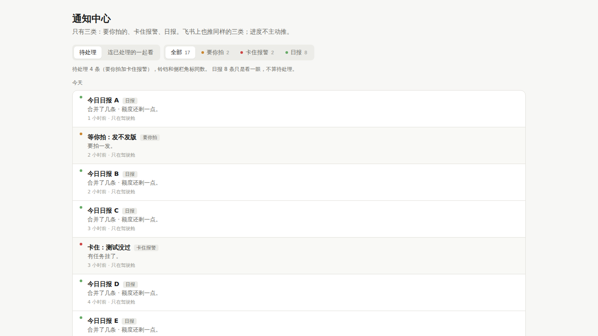
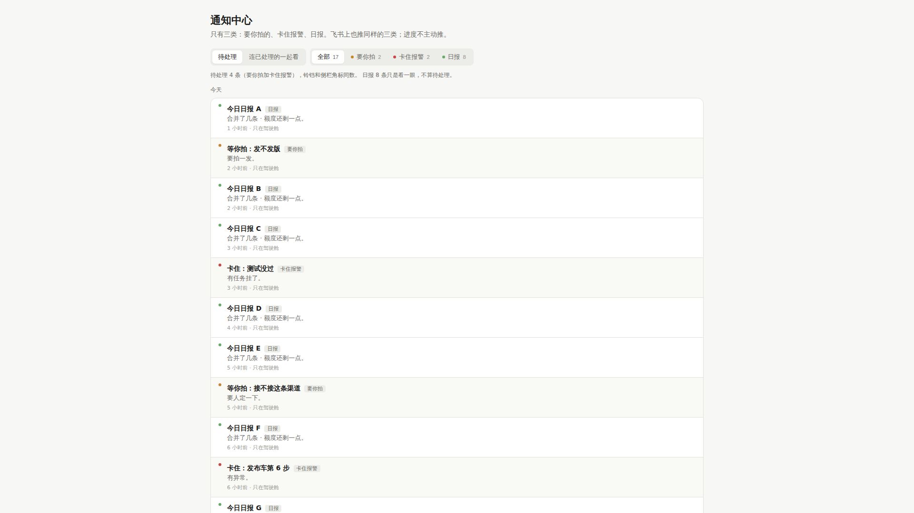
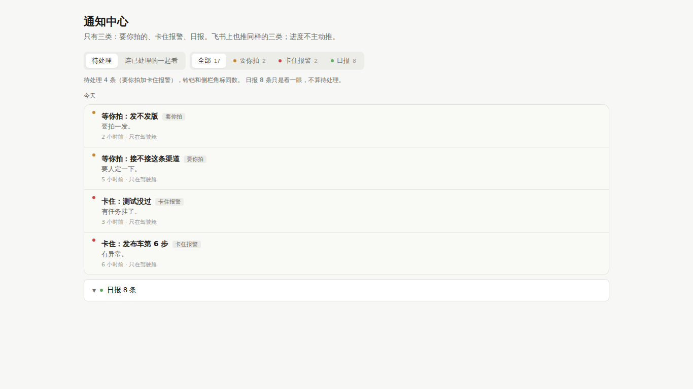
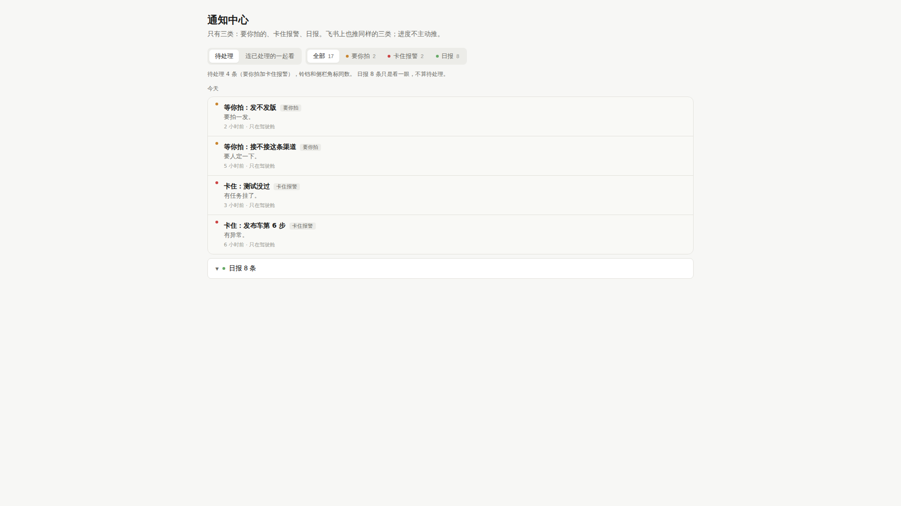

# #1749 通知中心改前改后（1366 / 1920）

「全部」「待处理」视图里日报默认收成一行「日报 N 条」，要你拍和卡住报警排在前面；点「日报」标签页仍全部展开。标签计数口径不变。

## 改前

### 1366×768

### 1920×1080

## 改后

### 1366×768

### 1920×1080

## 可贴进 PR 正文的图（分支推上后）

- 改前 1366：https://raw.githubusercontent.com/thoerwink8/fleet-dao/fleet/1749-t01a1252d/packages/web/e2e/shots/1749/before-1366.png
- 改前 1920：https://raw.githubusercontent.com/thoerwink8/fleet-dao/fleet/1749-t01a1252d/packages/web/e2e/shots/1749/before-1920.png
- 改后 1366：https://raw.githubusercontent.com/thoerwink8/fleet-dao/fleet/1749-t01a1252d/packages/web/e2e/shots/1749/after-1366.png
- 改后 1920：https://raw.githubusercontent.com/thoerwink8/fleet-dao/fleet/1749-t01a1252d/packages/web/e2e/shots/1749/after-1920.png
