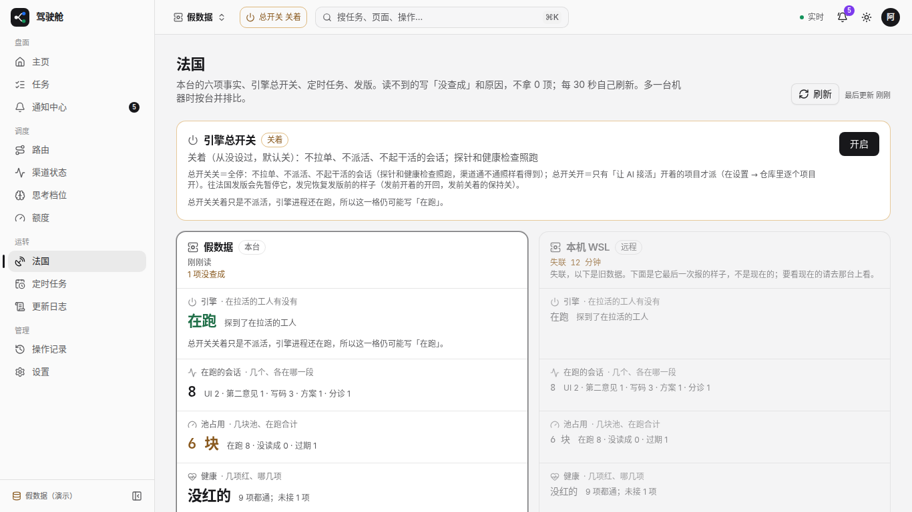

# #1750 法国页改前改后（1366 / 1920）

假数据模式 `/france?mockNode=stale`：右栏「本机 WSL」失联时整块置灰，状态值改灰色小字并标明「失联，以下是旧数据」；「在用版本」小标题由「落后主线没有」改为「落后主线几个提交」。

## 改前

### 1366×768

### 1920×1080

## 改后

### 1366×768

### 1920×1080

## 可贴进 PR 正文的图（分支推上后）

- 改前 1366：https://raw.githubusercontent.com/thoerwink8/fleet-dao/fleet/1750-t01a1252d/packages/web/e2e/shots/1750/before-1366.png
- 改前 1920：https://raw.githubusercontent.com/thoerwink8/fleet-dao/fleet/1750-t01a1252d/packages/web/e2e/shots/1750/before-1920.png
- 改后 1366：https://raw.githubusercontent.com/thoerwink8/fleet-dao/fleet/1750-t01a1252d/packages/web/e2e/shots/1750/after-1366.png
- 改后 1920：https://raw.githubusercontent.com/thoerwink8/fleet-dao/fleet/1750-t01a1252d/packages/web/e2e/shots/1750/after-1920.png
