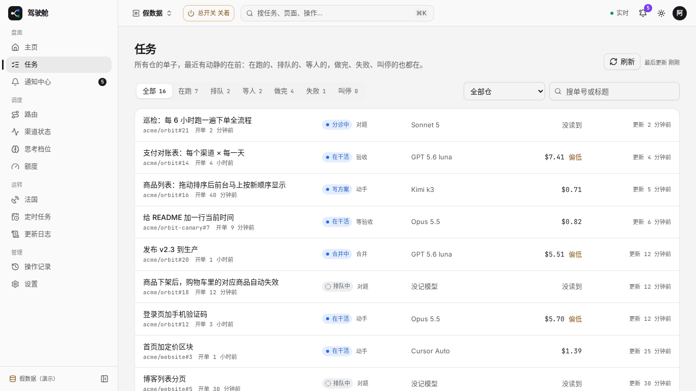
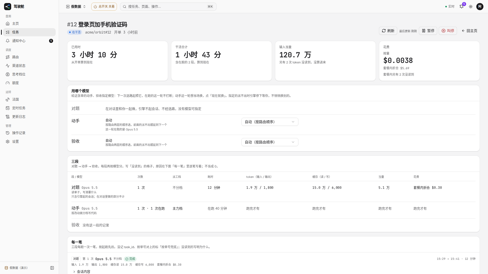
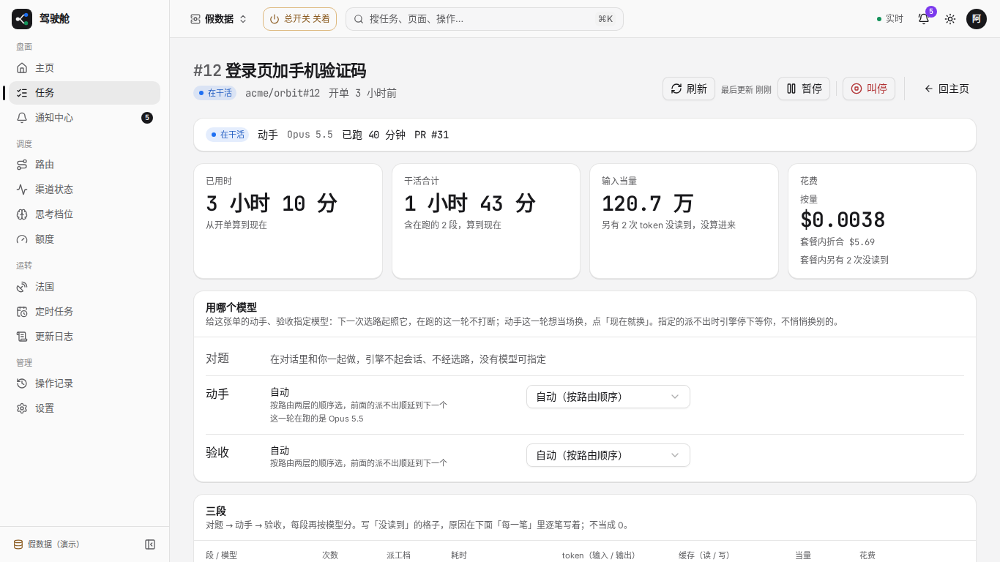

# #1751 任务列表与详情改前改后（1366 / 1920）

假数据模式：`/tasks` 与在跑详情 `/tasks/t-12`。

列表：加表头；花费读不到留空，不再写「没读到」。
详情：首屏先放当前状态 / 已跑多久 / PR；花费类大格往下；叫停与旁侧按钮加分隔。

## 任务列表

### 改前 1366

### 改前 1920

### 改后 1366

### 改后 1920

## 在跑任务详情

### 改前 1366

### 改前 1920

### 改后 1366

### 改后 1920

## 可贴进 PR 正文的图（分支推上后）

- 列表改前 1366：https://raw.githubusercontent.com/thoerwink8/fleet-dao/fleet/1751-t01a1252d/_tmp/1751-tasks-before-1366.png
- 列表改前 1920：https://raw.githubusercontent.com/thoerwink8/fleet-dao/fleet/1751-t01a1252d/_tmp/1751-tasks-before-1920.png
- 列表改后 1366：https://raw.githubusercontent.com/thoerwink8/fleet-dao/fleet/1751-t01a1252d/_tmp/1751-tasks-after-1366.png
- 列表改后 1920：https://raw.githubusercontent.com/thoerwink8/fleet-dao/fleet/1751-t01a1252d/_tmp/1751-tasks-after-1920.png
- 详情改前 1366：https://raw.githubusercontent.com/thoerwink8/fleet-dao/fleet/1751-t01a1252d/_tmp/1751-task-running-before-1366.png
- 详情改前 1920：https://raw.githubusercontent.com/thoerwink8/fleet-dao/fleet/1751-t01a1252d/_tmp/1751-task-running-before-1920.png
- 详情改后 1366：https://raw.githubusercontent.com/thoerwink8/fleet-dao/fleet/1751-t01a1252d/_tmp/1751-task-running-after-1366.png
- 详情改后 1920：https://raw.githubusercontent.com/thoerwink8/fleet-dao/fleet/1751-t01a1252d/_tmp/1751-task-running-after-1920.png
