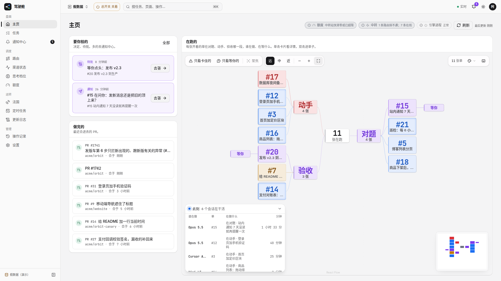
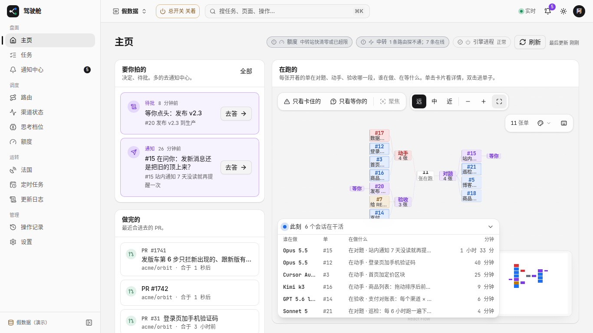
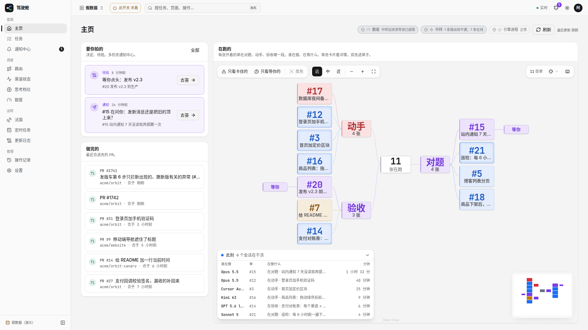

# #1752 主页「此刻」面板「在做什么」列（1366 / 1920）

假数据主页：右下角「此刻」表「在做什么」列加固定宽 `w-48`、单行省略、`title` 悬停全文；面板 `w-lg` + `max-w-full`，四列合计 30.5rem < 32rem，1366/1920 都不撑出画布。

实测（mock）：改前该列约 86px、折行；改后约 201px、`nowrap` + `ellipsis`，两宽度下 `fits=true`。

## 改前

### 1366×768

### 1920×1080

## 改后

### 1366×768

### 1920×1080

## 可贴进 PR 正文的图（分支推上后）

- 改前 1366：https://raw.githubusercontent.com/thoerwink8/fleet-dao/fleet/1752-t01a12551/packages/web/e2e/shots/1752/before-1366.png
- 改前 1920：https://raw.githubusercontent.com/thoerwink8/fleet-dao/fleet/1752-t01a12551/packages/web/e2e/shots/1752/before-1920.png
- 改后 1366：https://raw.githubusercontent.com/thoerwink8/fleet-dao/fleet/1752-t01a12551/packages/web/e2e/shots/1752/after-1366.png
- 改后 1920：https://raw.githubusercontent.com/thoerwink8/fleet-dao/fleet/1752-t01a12551/packages/web/e2e/shots/1752/after-1920.png
