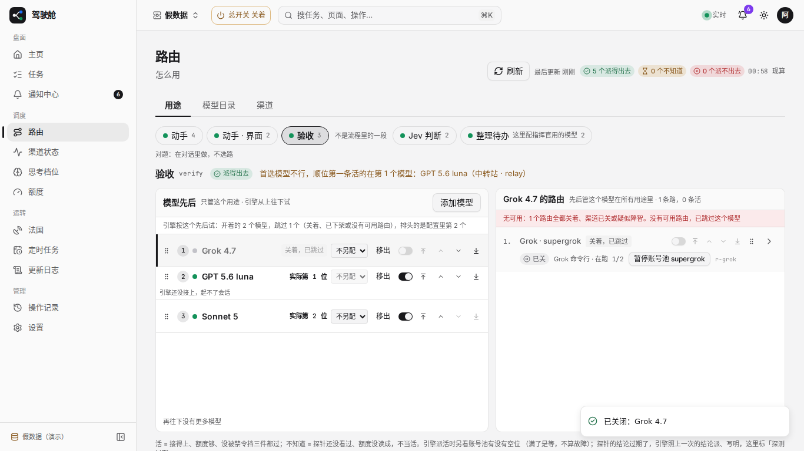
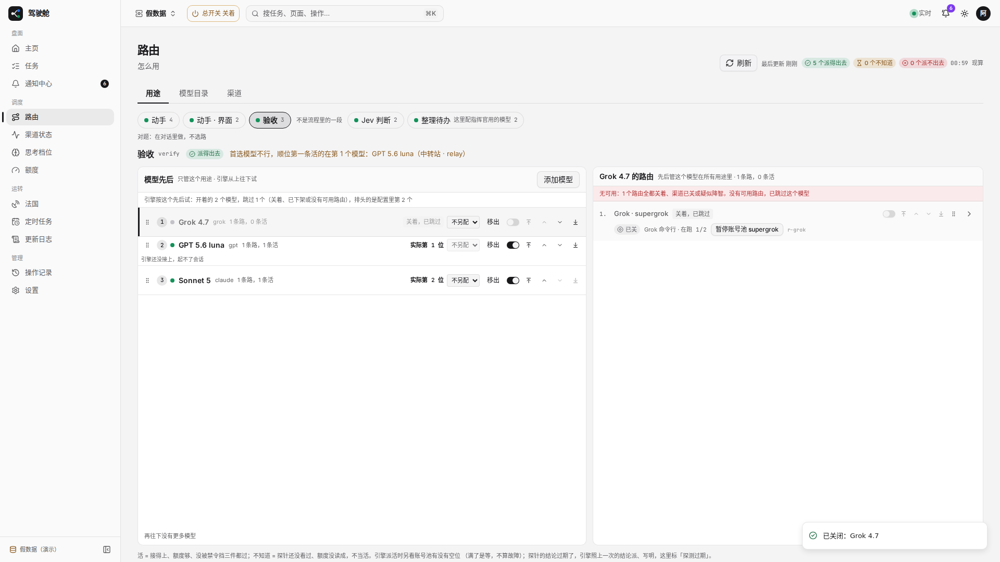
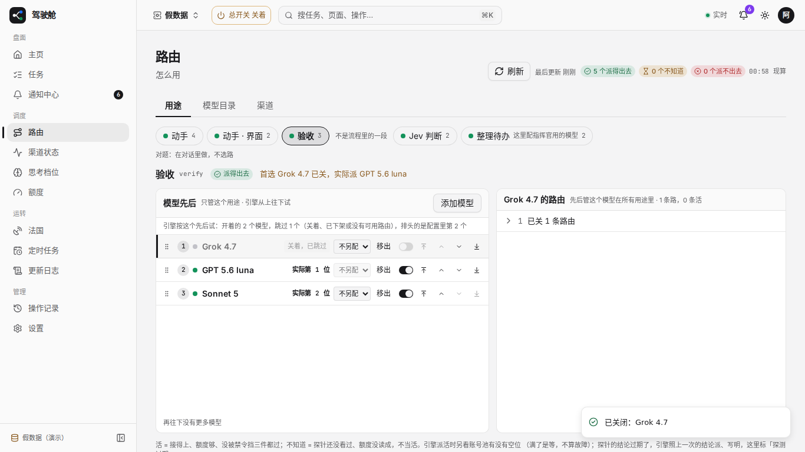
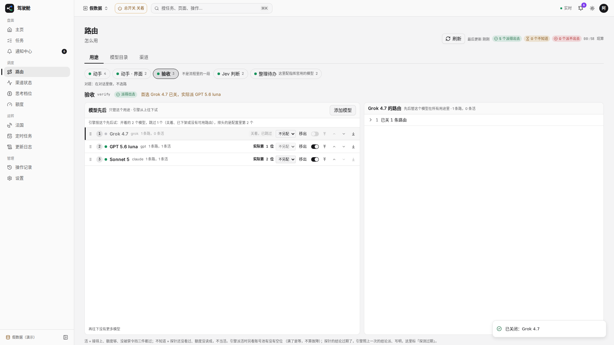
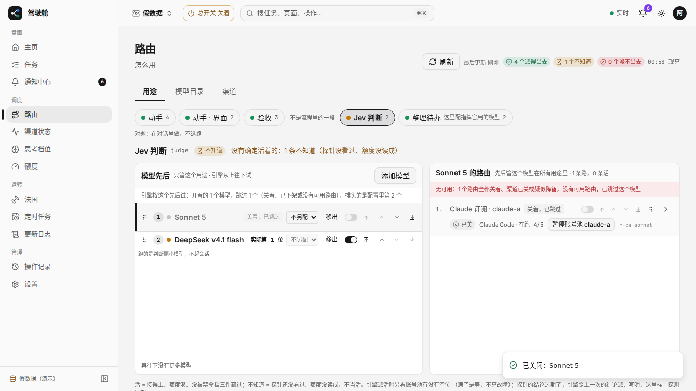
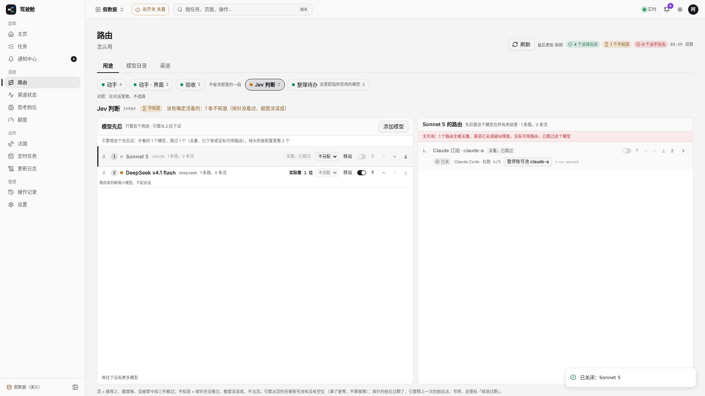
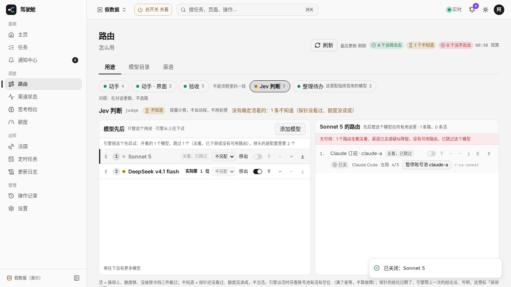
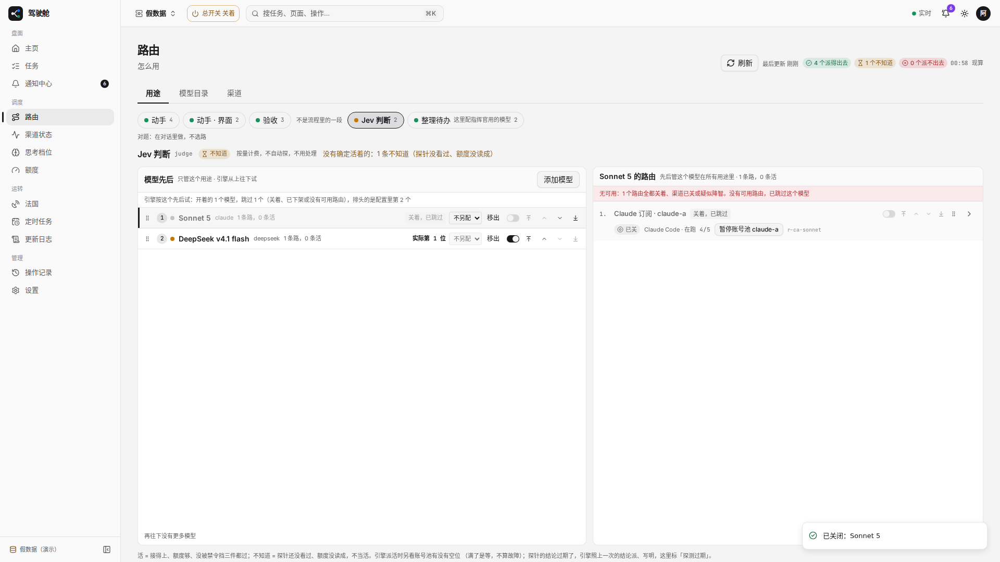

# #1754 路由页改前改后（1366 / 1920）

假数据模式 `/routing`：验收用途关掉首选 Grok；Jev 判断关掉 Sonnet，留下 DeepSeek「不知道」。

改后三处：

1. 「为什么派给它」写成「首选 Grok 4.7 已关，实际派 GPT 5.6 luna」（不再写「顺位第一条活的在第 N 个模型」）。
2. 已关模型右侧路由默认折叠，头上保留顺序号和「已关 N 条路由」。
3. Jev 判断用途为「不知道」时，旁注「按量计费，不自动探，不用处理」。

## 验收用途（人话 + 折叠）

### 改前 1366

### 改前 1920

### 改后 1366

### 改后 1920

## Jev 判断（不知道时的说明）

### 改前 1366

### 改前 1920

### 改后 1366

### 改后 1920

## 可贴进 PR 正文的图（分支推上后）

- 改前 1366：https://raw.githubusercontent.com/thoerwink8/fleet-dao/fleet/1754-t01a1257b/packages/web/e2e/shots/1754/before-1366.png
- 改前 1920：https://raw.githubusercontent.com/thoerwink8/fleet-dao/fleet/1754-t01a1257b/packages/web/e2e/shots/1754/before-1920.png
- 改后 1366：https://raw.githubusercontent.com/thoerwink8/fleet-dao/fleet/1754-t01a1257b/packages/web/e2e/shots/1754/after-1366.png
- 改后 1920：https://raw.githubusercontent.com/thoerwink8/fleet-dao/fleet/1754-t01a1257b/packages/web/e2e/shots/1754/after-1920.png
- Jev 改前 1366：https://raw.githubusercontent.com/thoerwink8/fleet-dao/fleet/1754-t01a1257b/packages/web/e2e/shots/1754/before-judge-1366.png
- Jev 改前 1920：https://raw.githubusercontent.com/thoerwink8/fleet-dao/fleet/1754-t01a1257b/packages/web/e2e/shots/1754/before-judge-1920.png
- Jev 改后 1366：https://raw.githubusercontent.com/thoerwink8/fleet-dao/fleet/1754-t01a1257b/packages/web/e2e/shots/1754/after-judge-1366.png
- Jev 改后 1920：https://raw.githubusercontent.com/thoerwink8/fleet-dao/fleet/1754-t01a1257b/packages/web/e2e/shots/1754/after-judge-1920.png
