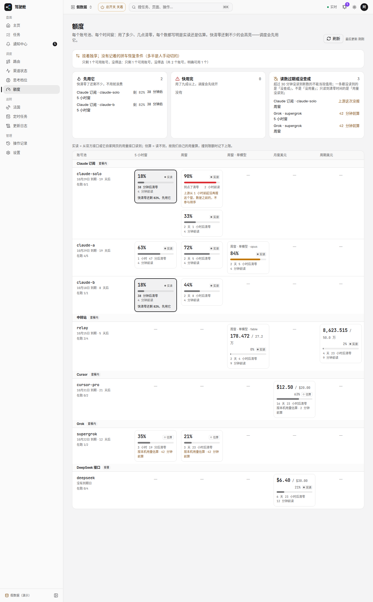
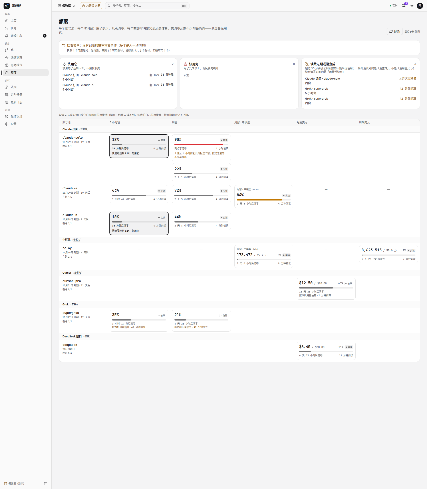
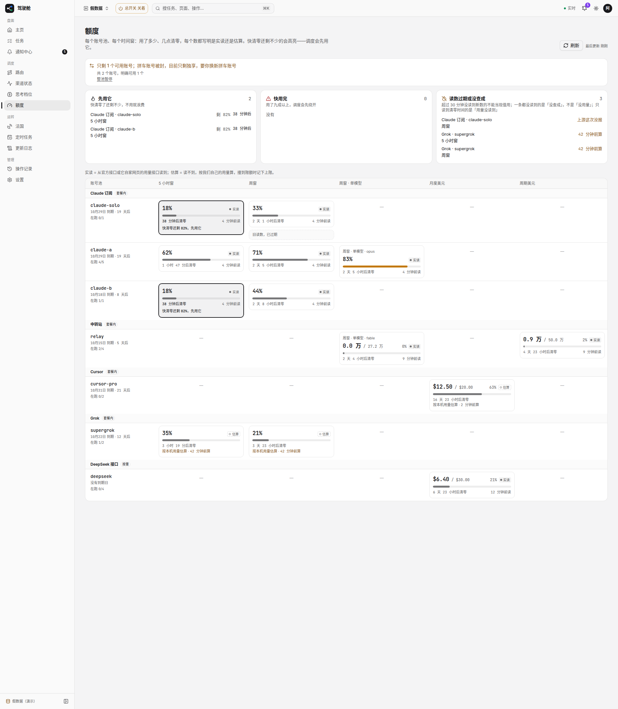

# #1755 额度页改前改后（1366 / 1920）

假数据模式 `/quota?mockQuota=1755`（截图时临时注入，未合入）：顶上黄条、Mirasim 点数混单位、claude-solo 新旧周窗并排。

改后：黄条一句人话并链「整池暂停」；已用/上限同单位同小数位；过期周窗收成灰行「旧读数，已过期」。

## 改前

### 1366

### 1920

## 改后

### 1366

### 1920

## 可贴进 PR 正文的图（分支推上后）

- 改前 1366：https://raw.githubusercontent.com/thoerwink8/fleet-dao/fleet/1755-t01a1257f/packages/web/e2e/shots/1755/before-1366.png
- 改前 1920：https://raw.githubusercontent.com/thoerwink8/fleet-dao/fleet/1755-t01a1257f/packages/web/e2e/shots/1755/before-1920.png
- 改后 1366：https://raw.githubusercontent.com/thoerwink8/fleet-dao/fleet/1755-t01a1257f/packages/web/e2e/shots/1755/after-1366.png
- 改后 1920：https://raw.githubusercontent.com/thoerwink8/fleet-dao/fleet/1755-t01a1257f/packages/web/e2e/shots/1755/after-1920.png
