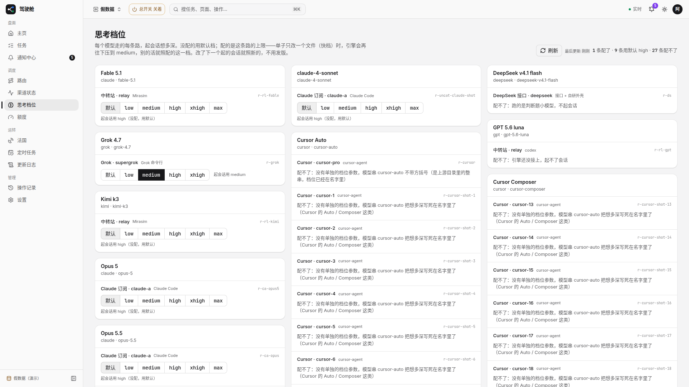
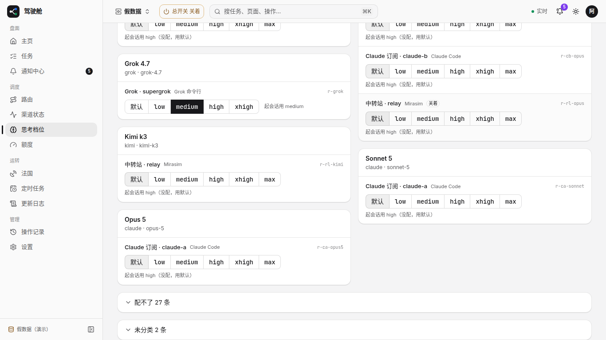
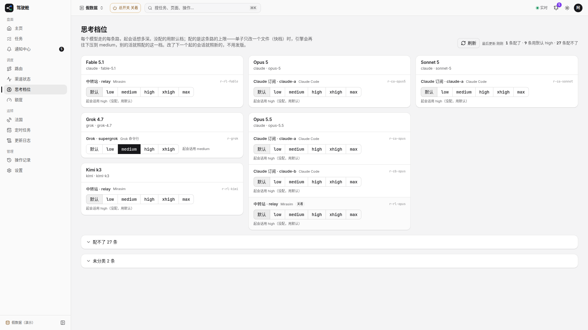

# #1756 思考档位页：配不了 / 未分类默认折叠（1366 / 1920）

假数据 `/efforts`（截图时临时加多条 Cursor「配不了」与两条未分类，未合入）：改前长列表把能配的淹没；改后顶部只展能配的，底部「配不了 N 条」「未分类 N 条」默认折叠。

## 改前

### 1366

### 1920

## 改后

### 1366

### 1920

## 可贴进 PR 正文的图（分支推上后）

- 改前 1366：https://raw.githubusercontent.com/thoerwink8/fleet-dao/fleet/1756-t01a12596/packages/web/e2e/shots/1756/before-1366.png
- 改前 1920：https://raw.githubusercontent.com/thoerwink8/fleet-dao/fleet/1756-t01a12596/packages/web/e2e/shots/1756/before-1920.png
- 改后 1366：https://raw.githubusercontent.com/thoerwink8/fleet-dao/fleet/1756-t01a12596/packages/web/e2e/shots/1756/after-1366.png
- 改后 1920：https://raw.githubusercontent.com/thoerwink8/fleet-dao/fleet/1756-t01a12596/packages/web/e2e/shots/1756/after-1920.png
