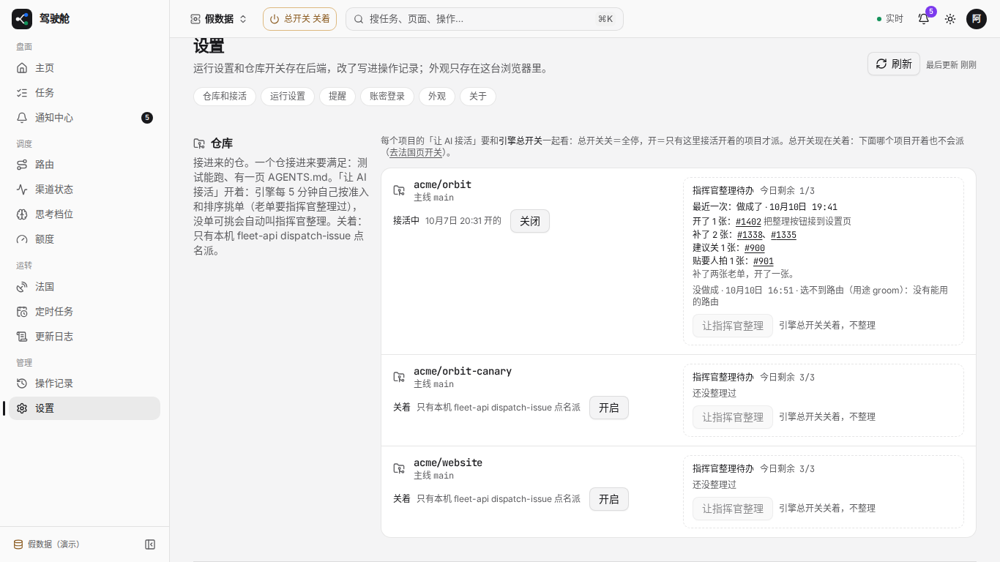
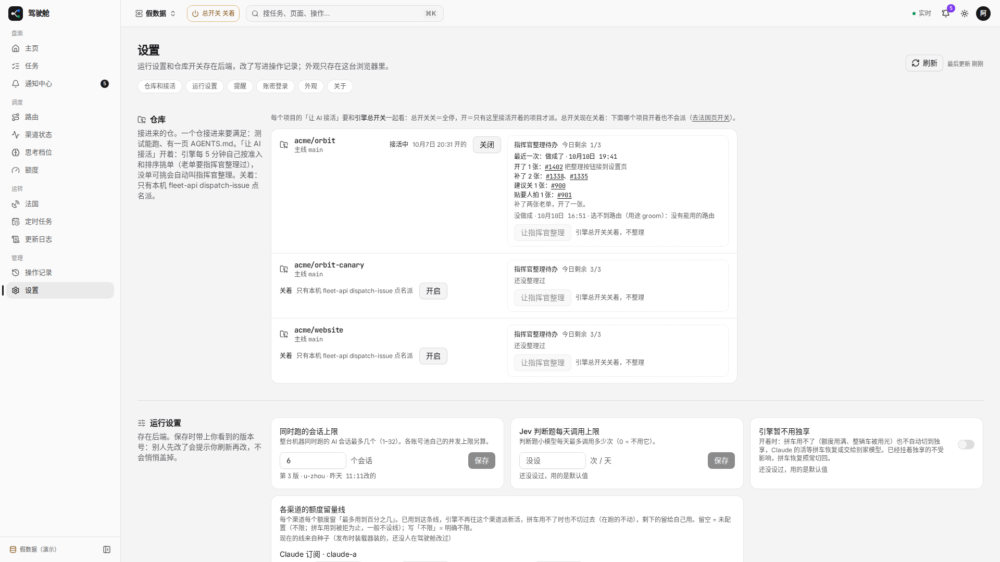
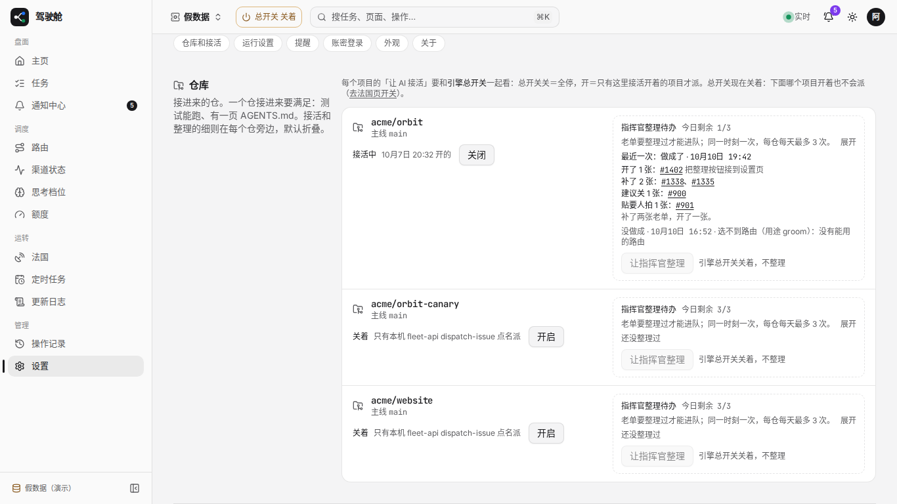
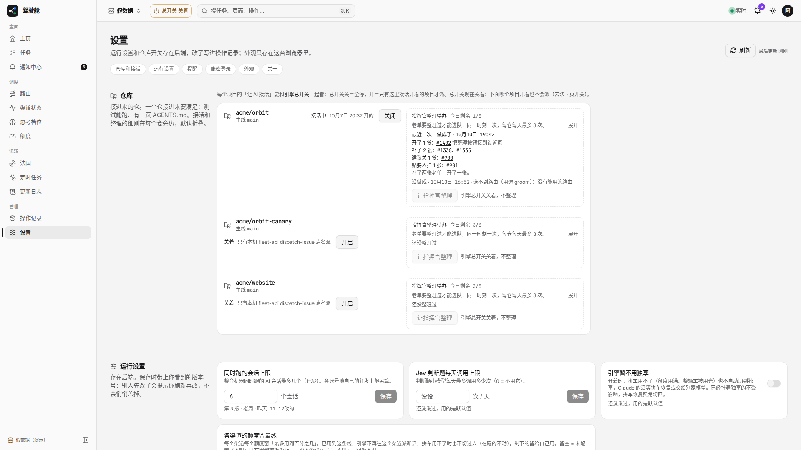

# #1758 设置页改前改后（1366 / 1920）

假数据 `/settings`：改前仓库一节常显接活/整理长说明、「谁改的」露 uuid；改后长说明挪进「指挥官整理待办」默认折叠（一行摘要 +「展开」），人名/「其他窗口」/仓名悬停全名见同页。

## 改前

### 1366

### 1920

## 改后

### 1366

### 1920

## 可贴进 PR 正文的图（分支推上后）

- 改前 1366：https://raw.githubusercontent.com/thoerwink8/fleet-dao/fleet/1758-t01a125b1/packages/web/e2e/shots/1758/before-1366.png
- 改前 1920：https://raw.githubusercontent.com/thoerwink8/fleet-dao/fleet/1758-t01a125b1/packages/web/e2e/shots/1758/before-1920.png
- 改后 1366：https://raw.githubusercontent.com/thoerwink8/fleet-dao/fleet/1758-t01a125b1/packages/web/e2e/shots/1758/after-1366.png
- 改后 1920：https://raw.githubusercontent.com/thoerwink8/fleet-dao/fleet/1758-t01a125b1/packages/web/e2e/shots/1758/after-1920.png
