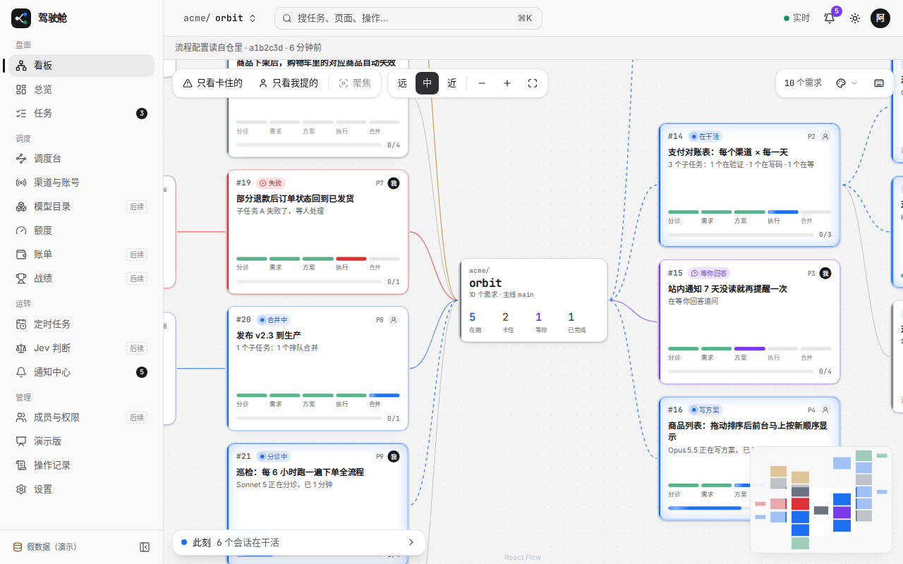
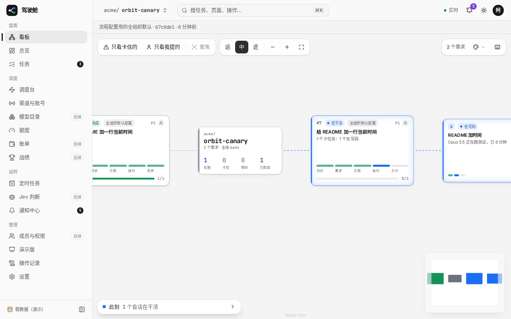
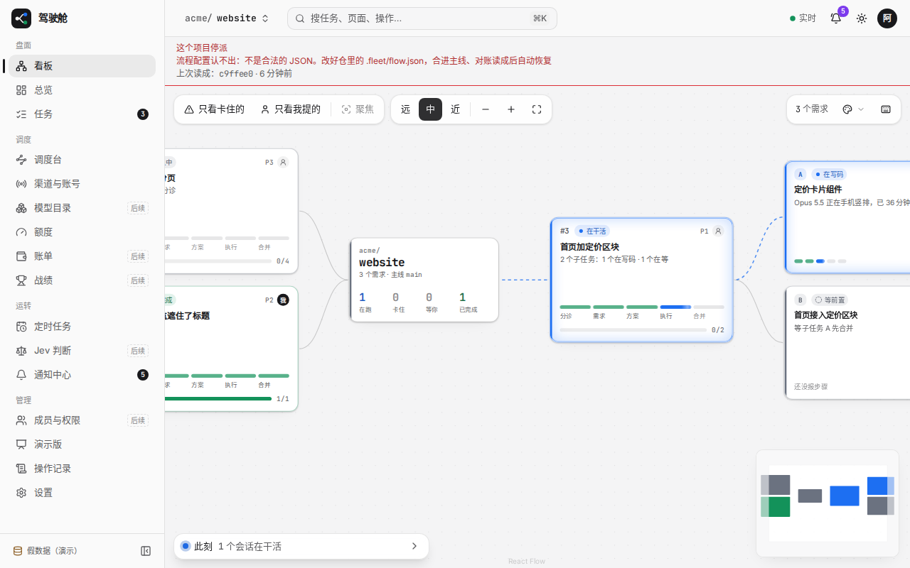
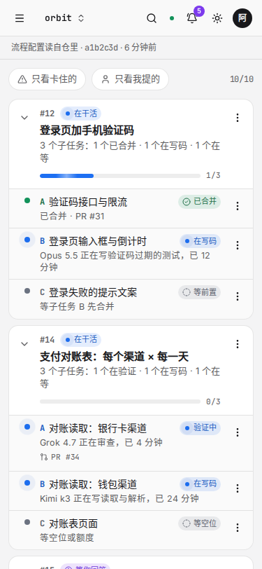
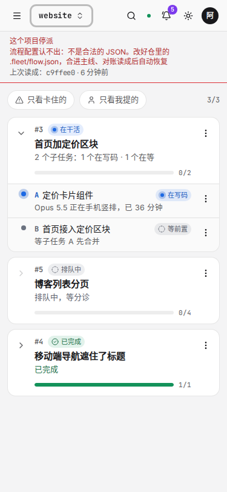

# 结果

驾驶舱把库里已经记下的流程配置来源接到了页面上。卡片和详情只在这一轮是 `org_default` 时挂「全组织默认配置」；看板顶栏另写这个项目此刻的副本，停派与否只显示 `replicaVerdict` 的结果。

界面按 0003 第 7 条由 Lead 单干（当时没有能派的界面路由）。界面和接口是这个 Grok 会话写的，不是 GPT。开 PR 后的核验是 Claude（Opus 5.5），也不是 GPT。

## 做了什么

- 任务详情和看板卡片加了可选的 `flowSource`。库里空着就不给这个键，不拿 `project` 顶。
- 看板多了一栏 `flow`：来源、提交前 7 位、同步时刻，停派与否只调 `replicaVerdict`，原因原样带上。
- 用全组织默认的单，在画布卡片（中景、近景）、手机列表、侧栏详情和任务详情上挂「全组织默认配置」，点开或悬停是需求里的那一句。`project` 和空的不挂。远景只有色块，不塞字。
- 顶栏三种样子：读自仓里、全组织默认、认不出则标红停派。桌面和手机同一块，放在画布外面。
- 假数据三个仓各一种。正式版文案在 `brand/cockpit.tsx`；演示版换成不含 `fleet` 的说法。
- 合并前重跑时，人闸测试在工作流结束后 `query` 整段重放，偶发 `TMPRL1100`。改成关单先挂着，三条回执在结束前查。文档指针不再把引擎会话落的 `.fleet-out/` 当成仓里的顶层目录。

## 截图

`pnpm --filter @fleet-dao/web dev:mock`，顶栏切三个仓。电脑 1280 宽，手机 375 宽。手机确认走的是树形列表。orbit 的卡片没有小标，canary 的卡片上有「全组织默认配置」。

### 电脑

读自仓里：

全组织默认：

认不出，停派：

### 手机

读自仓里：

全组织默认：

认不出，停派：

## 怎么验证的

- 接口：`org_default` 的单在任务详情和看板里带 `flowSource: 'org_default'`；库里空着的 JSON 没有这个键；副本 `error` 非空时 `flow.paused` 为 true，`why` 含这段错误。另有单测：超过 45 分钟没同步成也停派，从没同步过则停派且不带来源。
- 页面：`org_default` 渲染小标，`project` 和空的不渲染；顶栏三种文案各有一条组件测试。上面六张图是假数据切仓截的，手机是树形列表。
- `pnpm exec tsc -b` 通过。`node packages/web/scripts/demo.ts build` 通过，产物扫不出 `fleet`。
- 返工后本会话 `pnpm test:changed` 全量通过（5937 通过，2 条跳过），含 Postgres 版 Store 契约、`seed-and-domain` 和人闸那条。合进更新的主线之后，PR 的 CI 绿了。
- 合并队列又因主线超前退回。已把 main@7b78808（等 CI 时读到旧的 PR 头，隔一会儿再读，不当成被强推改写）并进来。新头上 `pnpm test:changed` 再跑一遍通过（6006 通过，2 条跳过）。驾驶舱代码没有因这次并主线再改。

## 还欠什么

没有。

核验里两条建议不改这张单：`boardFlow` 在判得过但来源、提交或同步时刻缺了时直接拒绝，是方案定的（不拿 `project` 顶，失败要看得见）。生产上 `repos` 表约束要求这几列同有同无，正常碰不到。假数据不重算 45 分钟，太久没同步的失败测试在 `boardFlow` 的单测里。
